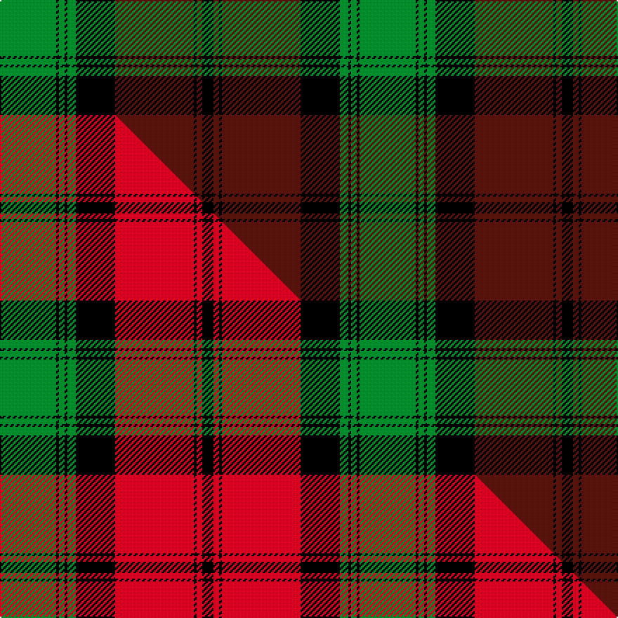

This page is one **sett** — a single exact thread-count. It belongs to the [tartan](/setts/g20k1g2k1g3k14dr28k1dr2k4/)
(the same proportion at any scale), whose colour order is pattern [GKGKGKBKBK](/stripes/gkgkgkbkbk/).

Part of the [Kerr](/tartans/kerr/) tartan — the named design grouping this sett with its other cloths.

Sourced from tartans-authority.  It is a [10 stripe tartan](/stripes/stripes10/).

Original link http://www.tartansauthority.com/tartan-ferret/display/791/

## Register references

External register numbers recorded for this tartan.

- Scottish Tartans Authority (ITI): 791

## Thread count
G/40 K2 G4 K2 G6 K28 DR56 K2 DR4 K/8

One full sett is **256 threads**.

## Palette
<table><thead><tr><th>Colour</th><th>Shade</th><th>OKLCh</th></tr></thead><tbody><tr><td>DR</td><td><code style="background-color:#55120C;">#55120C</code> <small style="color:#888">#55120C</small></td><td><small style="color:#888">oklch(30.0% 0.099 29.3)</small></td></tr><tr><td>G</td><td><code style="background-color:#008B2A;">#008B2A</code> <small style="color:#888">#008B2A</small></td><td><small style="color:#888">oklch(55.4% 0.170 145.9)</small></td></tr><tr><td>K</td><td><code style="background-color:#000000;">#000000</code> <small style="color:#888">#000000</small></td><td><small style="color:#888">oklch(0.0% 0.000 0.0)</small></td></tr></tbody></table>

# Sample pattern

## Compared to the master

This cloth is one sett of its design; the master sett (the exemplar the design is anchored on) is below for comparison.

Its **ΔTartan distance** from the master is **1.39** — the same measure the nearest-tartans table ranks by (0 is identical; a re-scale of the same cloth is near 0, a recolour or a different proportion further).

<figure class="master-compare" style="margin:0">

this sett
master sett ★

<figcaption style="color:#888;font-size:smaller">One weave of this sett against the <a href="/setts/g20k1g2k1g3k14r28k1r2k4/">master sett ★</a>, split on the diagonal: a shared proportion runs seamlessly across it with only the shades shifting; a different proportion breaks on it.</figcaption>
</figure>

## Nearest tartan variants

The nearest existing variants by ΔTartan distance, with this cloth at the top so the swatches line up against it.

ΔTartan

Threads

Variant

Sett

—

256

<a href="/variants/s10/g20k1g2k1g3k14dr28k1dr2k4~x2/">Kerr (Clan)</a>

<a href="/ttd/edit/#slug=g20k1g2k1g3k14r28k1r2k4~x2&amp;base=g20k1g2k1g3k14dr28k1dr2k4~x2" title="compare in the TTD">0.00</a>

256

<a href="/variants/s10/g20k1g2k1g3k14r28k1r2k4~x2/">Kerr</a>

<a href="/ttd/edit/#slug=g22k1g2k1g3k8r20k1r6~x2&amp;base=g20k1g2k1g3k14dr28k1dr2k4~x2" title="compare in the TTD">1.42</a>

200

<a href="/variants/s9/g22k1g2k1g3k8r20k1r6~x2/">Stewart of Atholl</a>

<a href="/ttd/edit/#slug=g22k1g2k1g3k8r20k1r3~x4&amp;base=g20k1g2k1g3k14dr28k1dr2k4~x2" title="compare in the TTD">1.47</a>

388

<a href="/variants/s9/g22k1g2k1g3k8r20k1r3~x4/">Stewart of Atholl (Clan)</a>

<a href="/ttd/edit/#slug=g20k1g2k1g3k14db28k1db2k4~x2&amp;base=g20k1g2k1g3k14dr28k1dr2k4~x2" title="compare in the TTD">2.40</a>

256

<a href="/variants/s10/g20k1g2k1g3k14db28k1db2k4~x2/">Kerr Hunting</a>

<a href="/ttd/edit/#slug=dr8dg8k1dg3k1dg1k10dr20w3~x2&amp;base=g20k1g2k1g3k14dr28k1dr2k4~x2" title="compare in the TTD">2.78</a>

198

<a href="/variants/s9/dr8dg8k1dg3k1dg1k10dr20w3~x2/">Hunter of Bute (Clan ?)</a>

<a href="/ttd/edit/#slug=b10k6g42k2g1k2r1k24r2~x2&amp;base=g20k1g2k1g3k14dr28k1dr2k4~x2" title="compare in the TTD">3.00</a>

336

<a href="/variants/s9/b10k6g42k2g1k2r1k24r2~x2/">Black Thistle</a>

## Neighbour map

Every grey dot is one of 13620 variants placed by the first two principal components of the ΔTartan feature space (42% of its variance). Red is this tartan; blue dots are its nearest — click one to open its page.

<svg viewBox="0 0 640 380" role="img" style="max-width:100%;height:auto;border:1px solid #e0e0e0;border-radius:4px;display:block" xmlns="http://www.w3.org/2000/svg"><image href="/nn/cloud.v1.png" width="640" height="380"/><a href="/variants/s10/g20k1g2k1g3k14r28k1r2k4~x2/"><circle cx="232.0" cy="114.0" r="4" fill="#3465a4"><title>Kerr</title></circle></a><a href="/variants/s9/g22k1g2k1g3k8r20k1r6~x2/"><circle cx="248.6" cy="137.6" r="4" fill="#3465a4"><title>Stewart of Atholl</title></circle></a><a href="/variants/s9/g22k1g2k1g3k8r20k1r3~x4/"><circle cx="255.8" cy="133.1" r="4" fill="#3465a4"><title>Stewart of Atholl (Clan)</title></circle></a><a href="/variants/s10/g20k1g2k1g3k14db28k1db2k4~x2/"><circle cx="244.9" cy="129.1" r="4" fill="#3465a4"><title>Kerr Hunting</title></circle></a><a href="/variants/s9/dr8dg8k1dg3k1dg1k10dr20w3~x2/"><circle cx="276.9" cy="145.4" r="4" fill="#3465a4"><title>Hunter of Bute (Clan ?)</title></circle></a><a href="/variants/s9/b10k6g42k2g1k2r1k24r2~x2/"><circle cx="267.0" cy="89.0" r="4" fill="#3465a4"><title>Black Thistle</title></circle></a><circle cx="252.7" cy="126.5" r="5" fill="#c00000"/><text x="320" y="376" text-anchor="middle" font-size="11" fill="#999">ground</text><text x="11" y="190" text-anchor="middle" font-size="11" fill="#999" transform="rotate(-90 11 190)">complexity</text></svg>

ID: /variants/s10/g20k1g2k1g3k14dr28k1dr2k4~x2/
