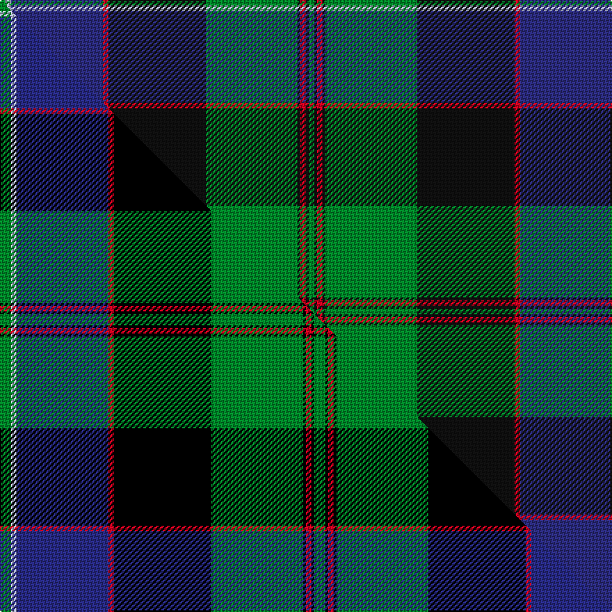

This is one **variant** — a specific cloth: this exact thread count and colourway, with its own
provenance below. It is one weaving of the [sett](/tartans/l/lo/lochaber-5/) (the scale-free proportion — the
same cloth at any scale or shade), whose colour order is pattern [GKRKGKRBWG](/stripes/gkrkgkrbwg/).

Part of the [Lochaber](/tartans/l/lo/lochaber-5/) tartan — the named design grouping this sett with its other cloths.

Sourced from tartans-authority.  It is a [10 stripe tartan](/stripes/stripes10/).

Original link <code>http://www.tartansauthority.com/tartan-ferret/display/685/</code> — retired · [Internet Archive copy](https://web.archive.org/web/*/http://www.tartansauthority.com/tartan-ferret/display/685/*)

Dataset <small>— provenance for this record, inherited from the source manifest</small>

<dl class="dataset-prov">
<dt>source</dt><dd><a href="/sources/tartans-authority/">Scottish Tartans Authority</a></dd>
<dt>data captured from</dt><dd><a href="https://github.com/thetartan/tartan-database/blob/master/data/tartans-authority/data.csv">https://github.com/thetartan/tartan-database/blob/master/data/tartans-authority/data.csv</a></dd>
<dt>data date</dt><dd>1797 <small>(this record)</small></dd>
<dt>licence</dt><dd><a href="https://creativecommons.org/licenses/by-nc-nd/4.0/">CC BY-NC-ND 4.0</a></dd>
</dl>

Capture chain <small>— the hands this data passed through, oldest first; each capture carries its own licence</small>

<ol class="capture-chain">
<li><a href="https://www.tartansauthority.com/">Scottish Tartans Authority</a> <small>the heritage body’s archive — its tartan-ferret record browser is retired; dead record links are shown unlinked, with an Internet Archive copy (ITI numbers are not SRT references)</small></li>
<li><a href="https://github.com/thetartan/tartan-database">thetartan/tartan-database</a> <small>2016-2017</small> · <a href="https://creativecommons.org/licenses/by-nc-nd/4.0/">CC BY-NC-ND 4.0</a> <small>Levko Kravets's frozen compilation — the capture we vendored, and where its CC licence text came from</small></li>
<li>this dictionary <small>captured 2026-06-10 · commit 5bf86c7566</small> <small>each re-capture is a git commit to data/sources</small></li>
</ol>

## Register references

External register numbers recorded for this tartan.

- Scottish Tartans Authority (ITI): 685

## Thread count
G/4 LB4 DB66 R4 K70 G66 K2 R4 K2 G/4

One full sett is **444 threads**.

## Palette
<table><thead><tr><th>Colour</th><th>Shade</th><th>OKLCh</th></tr></thead><tbody><tr><td>LB</td><td><code style="background-color:#B5BBDE;">#B5BBDE</code> <small style="color:#888">#B5BBDE</small></td><td><small style="color:#888">oklch(79.9% 0.050 277.6)</small></td></tr><tr><td>DB</td><td><code style="background-color:#2C2C80;">#2C2C80</code> <small style="color:#888">#2C2C80</small></td><td><small style="color:#888">oklch(35.0% 0.138 276.6)</small></td></tr><tr><td>G</td><td><code style="background-color:#008B2A;">#008B2A</code> <small style="color:#888">#008B2A</small></td><td><small style="color:#888">oklch(55.4% 0.170 145.9)</small></td></tr><tr><td>K</td><td><code style="background-color:#101010;">#101010</code> <small style="color:#888">#101010</small></td><td><small style="color:#888">oklch(17.3% 0.000 89.9)</small></td></tr><tr><td>R</td><td><code style="background-color:#D60020;">#D60020</code> <small style="color:#888">#D60020</small></td><td><small style="color:#888">oklch(55.2% 0.224 25.5)</small></td></tr></tbody></table>

# Sample pattern

## Compared to the master

This cloth is one sett of its design; the master sett (the exemplar the design is anchored on) is below for comparison.

Its **ΔTartan distance** from the master is **0.20** — the same measure the nearest-tartans table ranks by (0 is identical; a re-scale of the same cloth is near 0, a recolour or a different proportion further).

<figure class="master-compare" style="margin:0">

this sett
master sett ★

<figcaption style="color:#888;font-size:smaller">One weave of this sett against the <a href="/setts/g4lb2db33r2k35g33k1r2k1g4/">master sett ★</a>, split on the diagonal: a shared proportion runs seamlessly across it with only the shades shifting; a different proportion breaks on it.</figcaption>
</figure>

## Nearest tartan variants

The nearest existing variants by ΔTartan distance, with this cloth at the top so the swatches line up against it.

ΔTartan

Threads

Variant

Sett

—

444

<a href="/variants/s10/g2lb2db33r2k35g33k1r2k1g2~x2~db1406275-k0700000/">Lochaber - 1819 (District)</a>

<a href="/ttd/edit/#slug=g4lb2db33r2k35g33k1r2k1g4~x2~db1406275&amp;base=g2lb2db33r2k35g33k1r2k1g2~x2~db1406275-k0700000" title="compare in the TTD">0.20</a>

452

<a href="/variants/s10/g4lb2db33r2k35g33k1r2k1g4~x2~db1406275/">Lochaber</a>

<a href="/ttd/edit/#slug=g4lb2db33r2k35g33k1r2k1g4~x2&amp;base=g2lb2db33r2k35g33k1r2k1g2~x2~db1406275-k0700000" title="compare in the TTD">0.22</a>

452

<a href="/variants/s10/g4lb2db33r2k35g33k1r2k1g4~x2/">Lochaber District Tartan</a>

<a href="/ttd/edit/#slug=dy3k3dy3k18n28w1g22k2dy2~x2~n1702249-g2206152&amp;base=g2lb2db33r2k35g33k1r2k1g2~x2~db1406275-k0700000" title="compare in the TTD">2.08</a>

318

<a href="/variants/s9/dy3k3dy3k18n28w1g22k2dy2~x2~n1702249-g2206152/">Black Gold</a>

<a href="/ttd/edit/#slug=db4y2g24y2k12db3k2db2k2db14dr1db1dr3~x2&amp;base=g2lb2db33r2k35g33k1r2k1g2~x2~db1406275-k0700000" title="compare in the TTD">2.42</a>

274

<a href="/variants/s13/db4y2g24y2k12db3k2db2k2db14dr1db1dr3~x2/">Baron of Greencastle Htg (Personal)</a>

<a href="/ttd/edit/#slug=g3db1g1db12k2db2k2db3k12dg24w3~x2~g2408144-dg1804144&amp;base=g2lb2db33r2k35g33k1r2k1g2~x2~db1406275-k0700000" title="compare in the TTD">2.53</a>

248

<a href="/variants/s11/g3db1g1db12k2db2k2db3k12dg24w3~x2~g2408144-dg1804144/">Selby (Name)</a>

<a href="/ttd/edit/#slug=db64k11r2k4r2k4g32ly4~x2&amp;base=g2lb2db33r2k35g33k1r2k1g2~x2~db1406275-k0700000" title="compare in the TTD">2.66</a>

356

<a href="/variants/s8/db64k11r2k4r2k4g32ly4~x2/">Sinclair-Brown (Personal)</a>

<a href="/ttd/edit/#slug=db28y1db2k16g24k1g2r3~x2&amp;base=g2lb2db33r2k35g33k1r2k1g2~x2~db1406275-k0700000" title="compare in the TTD">2.67</a>

246

<a href="/variants/s8/db28y1db2k16g24k1g2r3~x2/">Ogilvy VS</a>

<a href="/ttd/edit/#slug=db24y2k8g16k1g3k1g3r4~x2&amp;base=g2lb2db33r2k35g33k1r2k1g2~x2~db1406275-k0700000" title="compare in the TTD">2.67</a>

192

<a href="/variants/s9/db24y2k8g16k1g3k1g3r4~x2/">Ogilvy Hunting</a>

<a href="/ttd/edit/#slug=g3r1g18k20r1db18lb1g2~x4&amp;base=g2lb2db33r2k35g33k1r2k1g2~x2~db1406275-k0700000" title="compare in the TTD">2.68</a>

492

<a href="/variants/s8/g3r1g18k20r1db18lb1g2~x4/">Lochaber #2</a>

<a href="/ttd/edit/#slug=t6k1r4k1t38k17n12dy5n5dy25k1ly4~x2&amp;base=g2lb2db33r2k35g33k1r2k1g2~x2~db1406275-k0700000" title="compare in the TTD">2.73</a>

456

<a href="/variants/s12/t6k1r4k1t38k17n12dy5n5dy25k1ly4~x2/">State Seal of New Jersey (Fashion)</a>

## Neighbour map

Every grey dot is one of 13657 variants placed by the first two principal components of the ΔTartan feature space (42% of its variance). Red is this tartan; blue dots are its nearest — click one to open its page. The map is a flat projection of a many-dimensional space — [how to read it](/posts/neighbourhood-maps/).

<svg viewBox="0 0 640 380" role="img" style="max-width:100%;height:auto;border:1px solid #e0e0e0;border-radius:4px;display:block" xmlns="http://www.w3.org/2000/svg"><image href="/nn/cloud.v1.png" width="640" height="380"/><a href="/variants/s10/g4lb2db33r2k35g33k1r2k1g4~x2~db1406275/"><circle cx="159.5" cy="67.1" r="4" fill="#3465a4"><title>Lochaber</title></circle></a><a href="/variants/s10/g4lb2db33r2k35g33k1r2k1g4~x2/"><circle cx="181.8" cy="87.6" r="4" fill="#3465a4"><title>Lochaber District Tartan</title></circle></a><a href="/variants/s9/dy3k3dy3k18n28w1g22k2dy2~x2~n1702249-g2206152/"><circle cx="177.5" cy="116.2" r="4" fill="#3465a4"><title>Black Gold</title></circle></a><a href="/variants/s13/db4y2g24y2k12db3k2db2k2db14dr1db1dr3~x2/"><circle cx="164.9" cy="101.1" r="4" fill="#3465a4"><title>Baron of Greencastle Htg (Personal)</title></circle></a><a href="/variants/s11/g3db1g1db12k2db2k2db3k12dg24w3~x2~g2408144-dg1804144/"><circle cx="175.6" cy="107.9" r="4" fill="#3465a4"><title>Selby (Name)</title></circle></a><a href="/variants/s8/db64k11r2k4r2k4g32ly4~x2/"><circle cx="184.9" cy="72.3" r="4" fill="#3465a4"><title>Sinclair-Brown (Personal)</title></circle></a><a href="/variants/s8/db28y1db2k16g24k1g2r3~x2/"><circle cx="201.9" cy="117.1" r="4" fill="#3465a4"><title>Ogilvy VS</title></circle></a><a href="/variants/s9/db24y2k8g16k1g3k1g3r4~x2/"><circle cx="192.7" cy="119.5" r="4" fill="#3465a4"><title>Ogilvy Hunting</title></circle></a><a href="/variants/s8/g3r1g18k20r1db18lb1g2~x4/"><circle cx="166.0" cy="130.4" r="4" fill="#3465a4"><title>Lochaber #2</title></circle></a><a href="/variants/s12/t6k1r4k1t38k17n12dy5n5dy25k1ly4~x2/"><circle cx="168.3" cy="77.9" r="4" fill="#3465a4"><title>State Seal of New Jersey (Fashion)</title></circle></a><circle cx="211.3" cy="95.4" r="5" fill="#c00000"/><text x="320" y="376" text-anchor="middle" font-size="11" fill="#999">ground</text><text x="11" y="190" text-anchor="middle" font-size="11" fill="#999" transform="rotate(-90 11 190)">complexity</text></svg>

ID: /variants/s10/g2lb2db33r2k35g33k1r2k1g2~x2~db1406275-k0700000/
