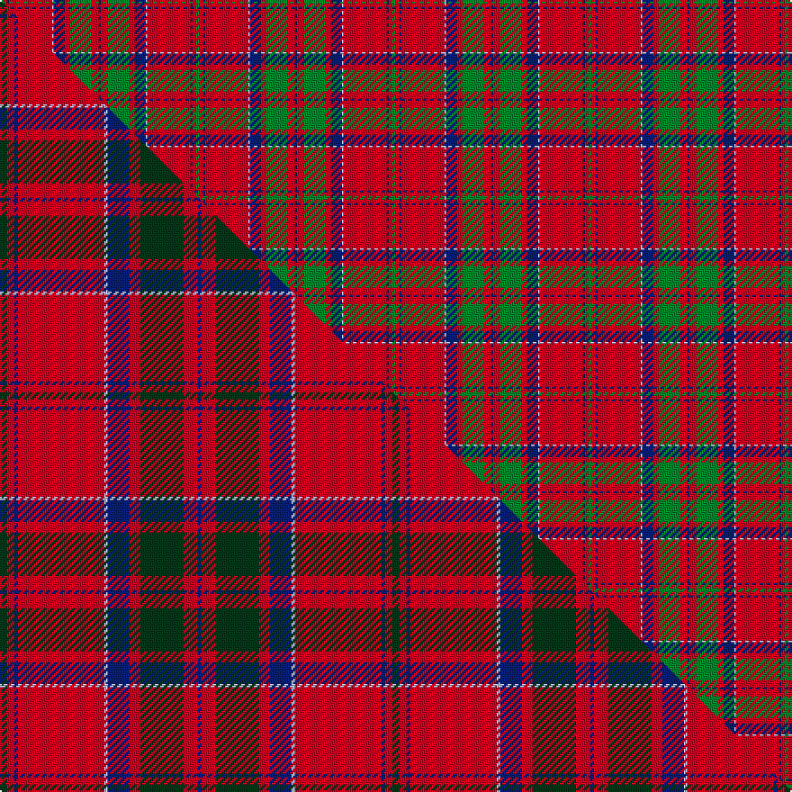

This page is one **sett** — a single exact thread-count. It belongs to the [tartan](/setts/g2r2db1r24lb1db6r3g12r4db1/)
(the same proportion at any scale), whose colour order is pattern [BRGRBWRBRG](/stripes/brgrbwrbrg/).

Part of the [MacDonell of Keppoch](/tartans/macdonell-of-keppoch-2/) tartan — the named design grouping this sett with its other cloths.

Sourced from weddslist.  It is a [10 stripe tartan](/stripes/stripes10/).

Original link http://www.weddslist.com/cgi-bin/tartans/pg.pl?source=x

## Thread count
G/2 R2 DB1 R24 LB1 DB6 R3 G12 R4 DB/1

One full sett is **109 threads**.

## Palette
<table><thead><tr><th>Colour</th><th>Shade</th><th>OKLCh</th></tr></thead><tbody><tr><td>O</td><td><code style="background-color:#A65C11;">#A65C11</code> <small style="color:#888">#A65C11</small></td><td><small style="color:#888">oklch(55.0% 0.125 58.3)</small></td></tr><tr><td>LB</td><td><code style="background-color:#B5BBDE;">#B5BBDE</code> <small style="color:#888">#B5BBDE</small></td><td><small style="color:#888">oklch(79.9% 0.050 277.6)</small></td></tr><tr><td>DB</td><td><code style="background-color:#082077;">#082077</code> <small style="color:#888">#082077</small></td><td><small style="color:#888">oklch(30.0% 0.149 265.1)</small></td></tr><tr><td>G</td><td><code style="background-color:#008B2A;">#008B2A</code> <small style="color:#888">#008B2A</small></td><td><small style="color:#888">oklch(55.4% 0.170 145.9)</small></td></tr><tr><td>R</td><td><code style="background-color:#D60020;">#D60020</code> <small style="color:#888">#D60020</small></td><td><small style="color:#888">oklch(55.2% 0.224 25.5)</small></td></tr></tbody></table>

# Sample pattern

## Compared to the master

This cloth is one sett of its design; the master sett (the exemplar the design is anchored on) is below for comparison.

Its **ΔTartan distance** from the master is **0.67** — the same measure the nearest-tartans table ranks by (0 is identical; a re-scale of the same cloth is near 0, a recolour or a different proportion further).

<figure class="master-compare" style="margin:0">

this sett
master sett ★

<figcaption style="color:#888;font-size:smaller">One weave of this sett against the <a href="/setts/dg2r2db1r24lb1db6r3dg12r4db1/">master sett ★</a>, split on the diagonal: a shared proportion runs seamlessly across it with only the shades shifting; a different proportion breaks on it.</figcaption>
</figure>

## Nearest tartan variants

The nearest existing variants by ΔTartan distance, with this cloth at the top so the swatches line up against it.

ΔTartan

Threads

Variant

Sett

—

109

<a href="/variants/s10/g2r2db1r24lb1db6r3g12r4db1/">MacDonell of Keppoch</a>

<a href="/ttd/edit/#slug=g2r2db1r24lb1db6r3g12r4db1~x2&amp;base=g2r2db1r24lb1db6r3g12r4db1" title="compare in the TTD">0.00</a>

218

<a href="/variants/s10/g2r2db1r24lb1db6r3g12r4db1~x2/">MacDonell of Keppoch</a>

<a href="/ttd/edit/#slug=dg2r2db1r24lb1db6r3dg12r4db1~x2&amp;base=g2r2db1r24lb1db6r3g12r4db1" title="compare in the TTD">0.00</a>

218

<a href="/variants/s10/dg2r2db1r24lb1db6r3dg12r4db1~x2/">MacDonell of Keppoch</a>

<a href="/ttd/edit/#slug=g2r2db1r24w1db6r3g12r4db1&amp;base=g2r2db1r24lb1db6r3g12r4db1" title="compare in the TTD">0.30</a>

109

<a href="/variants/s10/g2r2db1r24w1db6r3g12r4db1/">MacDonell of Keppoch</a>

<a href="/ttd/edit/#slug=g2r2db1r24db6r3g12r4db1~x2&amp;base=g2r2db1r24lb1db6r3g12r4db1" title="compare in the TTD">0.30</a>

214

<a href="/variants/s9/g2r2db1r24db6r3g12r4db1~x2/">MacDonald #7</a>

<a href="/ttd/edit/#slug=r12w2r37db6g3db3r4db3g21r4~x2&amp;base=g2r2db1r24lb1db6r3g12r4db1" title="compare in the TTD">2.09</a>

348

<a href="/variants/s10/r12w2r37db6g3db3r4db3g21r4~x2/">Chisholm, The</a>

<a href="/ttd/edit/#slug=r12w2r37t6g3t3r4t3g21r4~x2&amp;base=g2r2db1r24lb1db6r3g12r4db1" title="compare in the TTD">2.09</a>

348

<a href="/variants/s10/r12w2r37t6g3t3r4t3g21r4~x2/">Chisholm, The (MacGregor-Hastie)</a>

<a href="/ttd/edit/#slug=r3db1r1g21r3db18r35db1y1r4g1&amp;base=g2r2db1r24lb1db6r3g12r4db1" title="compare in the TTD">2.22</a>

174

<a href="/variants/s11/r3db1r1g21r3db18r35db1y1r4g1/">MacPherson Of Cluny</a>

<a href="/ttd/edit/#slug=db2r30g8r3g8r6db4r3db12w2~x2&amp;base=g2r2db1r24lb1db6r3g12r4db1" title="compare in the TTD">2.25</a>

304

<a href="/variants/s10/db2r30g8r3g8r6db4r3db12w2~x2/">Jenkins (Name)</a>

<a href="/ttd/edit/#slug=r60db2g24r8db2lb3db2&amp;base=g2r2db1r24lb1db6r3g12r4db1" title="compare in the TTD">2.31</a>

140

<a href="/variants/s7/r60db2g24r8db2lb3db2/">Unidentified Cant #12</a>

<a href="/ttd/edit/#slug=r5g20r5g3r4g5r36do2w4~x2~w4000000&amp;base=g2r2db1r24lb1db6r3g12r4db1" title="compare in the TTD">2.32</a>

318

<a href="/variants/s9/r5g20r5g3r4g5r36do2w4~x2~w4000000/">Baluch Regiment (Old Count)</a>

## Neighbour map

Every grey dot is one of 13620 variants placed by the first two principal components of the ΔTartan feature space (42% of its variance). Red is this tartan; blue dots are its nearest — click one to open its page.

<svg viewBox="0 0 640 380" role="img" style="max-width:100%;height:auto;border:1px solid #e0e0e0;border-radius:4px;display:block" xmlns="http://www.w3.org/2000/svg"><image href="/nn/cloud.v1.png" width="640" height="380"/><a href="/variants/s10/g2r2db1r24lb1db6r3g12r4db1~x2/"><circle cx="373.2" cy="126.7" r="4" fill="#3465a4"><title>MacDonell of Keppoch</title></circle></a><a href="/variants/s10/dg2r2db1r24lb1db6r3dg12r4db1~x2/"><circle cx="375.5" cy="124.7" r="4" fill="#3465a4"><title>MacDonell of Keppoch</title></circle></a><a href="/variants/s10/g2r2db1r24w1db6r3g12r4db1/"><circle cx="369.1" cy="125.4" r="4" fill="#3465a4"><title>MacDonell of Keppoch</title></circle></a><a href="/variants/s9/g2r2db1r24db6r3g12r4db1~x2/"><circle cx="399.0" cy="148.5" r="4" fill="#3465a4"><title>MacDonald #7</title></circle></a><a href="/variants/s10/r12w2r37db6g3db3r4db3g21r4~x2/"><circle cx="361.0" cy="139.4" r="4" fill="#3465a4"><title>Chisholm, The</title></circle></a><a href="/variants/s10/r12w2r37t6g3t3r4t3g21r4~x2/"><circle cx="382.6" cy="148.2" r="4" fill="#3465a4"><title>Chisholm, The (MacGregor-Hastie)</title></circle></a><a href="/variants/s11/r3db1r1g21r3db18r35db1y1r4g1/"><circle cx="340.9" cy="104.1" r="4" fill="#3465a4"><title>MacPherson Of Cluny</title></circle></a><a href="/variants/s10/db2r30g8r3g8r6db4r3db12w2~x2/"><circle cx="303.8" cy="154.5" r="4" fill="#3465a4"><title>Jenkins (Name)</title></circle></a><a href="/variants/s7/r60db2g24r8db2lb3db2/"><circle cx="369.5" cy="107.1" r="4" fill="#3465a4"><title>Unidentified Cant #12</title></circle></a><a href="/variants/s9/r5g20r5g3r4g5r36do2w4~x2~w4000000/"><circle cx="381.1" cy="148.9" r="4" fill="#3465a4"><title>Baluch Regiment (Old Count)</title></circle></a><circle cx="373.2" cy="126.7" r="5" fill="#c00000"/><text x="320" y="376" text-anchor="middle" font-size="11" fill="#999">ground</text><text x="11" y="190" text-anchor="middle" font-size="11" fill="#999" transform="rotate(-90 11 190)">complexity</text></svg>

ID: /variants/s10/g2r2db1r24lb1db6r3g12r4db1/
