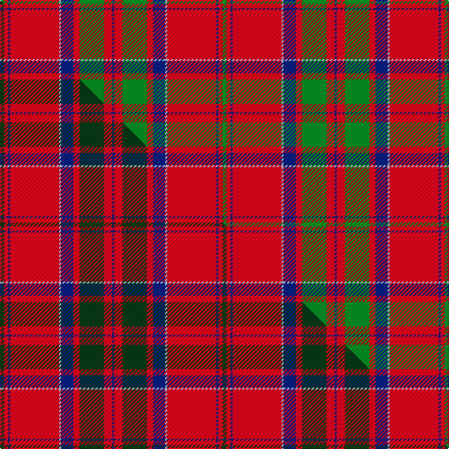

This page is one **sett** — a single exact thread-count. It belongs to the [tartan](/setts/g2r2db1r24lb1db6r3g12r4db1/)
(the same proportion at any scale), whose colour order is pattern [BRGRBWRBRG](/stripes/brgrbwrbrg/).

Part of the [MacDonell of Keppoch](/tartans/macdonell-of-keppoch-2/) tartan — the named design grouping this sett with its other cloths.

Sourced from weddslist.  It is a [10 stripe tartan](/stripes/stripes10/).

Original link [http://www.weddslist.com/cgi-bin/tartans/pg.pl?source=sts](http://www.weddslist.com/cgi-bin/tartans/pg.pl?source=sts)

## Provenance

Earliest known date: 1906 MacDonells of Keppoch are an independant branch of Clan Donald.

3 attestations — the source records this cloth was collapsed from (oldest owns this page)

<ul>
<li>undated — MacDonell of Keppoch (weddslist, <a href="http://www.weddslist.com/cgi-bin/tartans/pg.pl?source=sts">record</a>) </li>
<li>undated — MacDonell of Keppoch (weddslist, <a href="http://www.weddslist.com/cgi-bin/tartans/pg.pl?source=tinsel">record</a>) </li>
<li>undated — MacDonell of Keppoch Clan Tartan (house-of-tartan, <a href="http://www.house-of-tartan.scotland.net/house/TartanViewjs.asp?colr=Def&tnam=511">record</a>) </li>
</ul>

Dataset <small>— provenance for this record, inherited from the source manifest</small>

<dl class="dataset-prov">
<dt>source</dt><dd><a href="/sources/weddslist/">Weddslist</a></dd>
<dt>data captured from</dt><dd><a href="https://github.com/thetartan/tartan-database/blob/master/data/weddslist/data.csv">https://github.com/thetartan/tartan-database/blob/master/data/weddslist/data.csv</a></dd>
<dt>data date</dt><dd>2016-11-17 <small>(dataset default)</small></dd>
<dt>licence</dt><dd><a href="https://creativecommons.org/licenses/by-nc-nd/4.0/">CC BY-NC-ND 4.0</a></dd>
</dl>

Capture chain <small>— the hands this data passed through, oldest first; each capture carries its own licence</small>

<ol class="capture-chain">
<li><a href="https://www.weddslist.com/tartans/">Weddslist</a> <small>the living privately compiled reference</small></li>
<li><a href="https://github.com/thetartan/tartan-database">thetartan/tartan-database</a> <small>2016-2017</small> · <a href="https://creativecommons.org/licenses/by-nc-nd/4.0/">CC BY-NC-ND 4.0</a> <small>Levko Kravets's frozen compilation — the capture we vendored, and where its CC licence text came from</small></li>
<li>this dictionary <small>captured 2026-06-10 · commit 5bf86c7566</small> <small>each re-capture is a git commit to data/sources</small></li>
</ol>

## Thread count
G/4 R4 DB2 R48 LB2 DB12 R6 G24 R8 DB/2

One full sett is **218 threads**.

## Palette
<table><thead><tr><th>Colour</th><th>Shade</th><th>OKLCh</th></tr></thead><tbody><tr><td>DB</td><td><code style="background-color:#082077;">#082077</code> <small style="color:#888">#082077</small></td><td><small style="color:#888">oklch(30.0% 0.149 265.1)</small></td></tr><tr><td>LB</td><td><code style="background-color:#B5BBDE;">#B5BBDE</code> <small style="color:#888">#B5BBDE</small></td><td><small style="color:#888">oklch(79.9% 0.050 277.6)</small></td></tr><tr><td>G</td><td><code style="background-color:#008B2A;">#008B2A</code> <small style="color:#888">#008B2A</small></td><td><small style="color:#888">oklch(55.4% 0.170 145.9)</small></td></tr><tr><td>R</td><td><code style="background-color:#D60020;">#D60020</code> <small style="color:#888">#D60020</small></td><td><small style="color:#888">oklch(55.2% 0.224 25.5)</small></td></tr></tbody></table>

# Sample pattern

## Compared to the master

This cloth is one sett of its design; the master sett (the exemplar the design is anchored on) is below for comparison.

Its **ΔTartan distance** from the master is **0.12** — the same measure the nearest-tartans table ranks by (0 is identical; a re-scale of the same cloth is near 0, a recolour or a different proportion further).

<figure class="master-compare" style="margin:0">

this sett
master sett ★

<figcaption style="color:#888;font-size:smaller">One weave of this sett against the <a href="/setts/dg2r2db1r24lb1db6r3dg12r4db1/">master sett ★</a>, split on the diagonal: a shared proportion runs seamlessly across it with only the shades shifting; a different proportion breaks on it.</figcaption>
</figure>

## Nearest tartan variants

The nearest existing variants by ΔTartan distance, with this cloth at the top so the swatches line up against it.

ΔTartan

Threads

Variant

Sett

—

218

<a href="/variants/s10/g2r2db1r24lb1db6r3g12r4db1~x2/">MacDonell of Keppoch</a>

<a href="/ttd/edit/#slug=g2r2db1r24lb1db6r3g12r4db1&amp;base=g2r2db1r24lb1db6r3g12r4db1~x2" title="compare in the TTD">0.00</a>

109

<a href="/variants/s10/g2r2db1r24lb1db6r3g12r4db1/">MacDonell of Keppoch</a>

<a href="/ttd/edit/#slug=dg2r2db1r24lb1db6r3dg12r4db1~x2&amp;base=g2r2db1r24lb1db6r3g12r4db1~x2" title="compare in the TTD">0.12</a>

218

<a href="/variants/s10/dg2r2db1r24lb1db6r3dg12r4db1~x2/">MacDonell of Keppoch</a>

<a href="/ttd/edit/#slug=g2r2db1r24w1db6r3g12r4db1&amp;base=g2r2db1r24lb1db6r3g12r4db1~x2" title="compare in the TTD">0.30</a>

109

<a href="/variants/s10/g2r2db1r24w1db6r3g12r4db1/">MacDonell of Keppoch</a>

<a href="/ttd/edit/#slug=g2r2db1r24db6r3g12r4db1~x2&amp;base=g2r2db1r24lb1db6r3g12r4db1~x2" title="compare in the TTD">0.30</a>

214

<a href="/variants/s9/g2r2db1r24db6r3g12r4db1~x2/">MacDonald #7</a>

<a href="/ttd/edit/#slug=r7w2r36db6g3db3g3db3g12r4~x2&amp;base=g2r2db1r24lb1db6r3g12r4db1~x2" title="compare in the TTD">1.08</a>

294

<a href="/variants/s10/r7w2r36db6g3db3g3db3g12r4~x2/">Chisholm of Strathglass</a>

<a href="/ttd/edit/#slug=r7w2r36t6dg3t3dg3t3dg12r4~x2&amp;base=g2r2db1r24lb1db6r3g12r4db1~x2" title="compare in the TTD">1.12</a>

294

<a href="/variants/s10/r7w2r36t6dg3t3dg3t3dg12r4~x2/">Chisholm of Strathglass</a>

<a href="/ttd/edit/#slug=r6w1r24dr6g2dr1g2dr1g12r1~x2&amp;base=g2r2db1r24lb1db6r3g12r4db1~x2" title="compare in the TTD">1.69</a>

210

<a href="/variants/s10/r6w1r24dr6g2dr1g2dr1g12r1~x2/">Chisholm D</a>

<a href="/ttd/edit/#slug=r6w1r24dr6g2dr1g2dr1g12r1&amp;base=g2r2db1r24lb1db6r3g12r4db1~x2" title="compare in the TTD">1.69</a>

105

<a href="/variants/s10/r6w1r24dr6g2dr1g2dr1g12r1/">Chisholm D</a>

<a href="/ttd/edit/#slug=r4lb1db1r32lb2r2db12r2g16r4lb1r4db2~x2&amp;base=g2r2db1r24lb1db6r3g12r4db1~x2" title="compare in the TTD">1.80</a>

320

<a href="/variants/s13/r4lb1db1r32lb2r2db12r2g16r4lb1r4db2~x2/">MacGillivray</a>

<a href="/ttd/edit/#slug=r4lb1db1r32lb2r2db12r2g16r4lb1r4db2&amp;base=g2r2db1r24lb1db6r3g12r4db1~x2" title="compare in the TTD">1.80</a>

160

<a href="/variants/s13/r4lb1db1r32lb2r2db12r2g16r4lb1r4db2/">MacGillivray</a>

## Neighbour map

Every grey dot is one of 13621 variants placed by the first two principal components of the ΔTartan feature space (42% of its variance). Red is this tartan; blue dots are its nearest — click one to open its page.

<svg viewBox="0 0 640 380" role="img" style="max-width:100%;height:auto;border:1px solid #e0e0e0;border-radius:4px;display:block" xmlns="http://www.w3.org/2000/svg"><image href="/nn/cloud.v1.png" width="640" height="380"/><a href="/variants/s10/g2r2db1r24lb1db6r3g12r4db1/"><circle cx="373.2" cy="126.9" r="4" fill="#3465a4"><title>MacDonell of Keppoch</title></circle></a><a href="/variants/s10/dg2r2db1r24lb1db6r3dg12r4db1~x2/"><circle cx="375.5" cy="124.9" r="4" fill="#3465a4"><title>MacDonell of Keppoch</title></circle></a><a href="/variants/s10/g2r2db1r24w1db6r3g12r4db1/"><circle cx="369.1" cy="125.7" r="4" fill="#3465a4"><title>MacDonell of Keppoch</title></circle></a><a href="/variants/s9/g2r2db1r24db6r3g12r4db1~x2/"><circle cx="399.0" cy="148.9" r="4" fill="#3465a4"><title>MacDonald #7</title></circle></a><a href="/variants/s10/r7w2r36db6g3db3g3db3g12r4~x2/"><circle cx="356.9" cy="132.9" r="4" fill="#3465a4"><title>Chisholm of Strathglass</title></circle></a><a href="/variants/s10/r7w2r36t6dg3t3dg3t3dg12r4~x2/"><circle cx="366.3" cy="135.1" r="4" fill="#3465a4"><title>Chisholm of Strathglass</title></circle></a><a href="/variants/s10/r6w1r24dr6g2dr1g2dr1g12r1~x2/"><circle cx="365.3" cy="129.0" r="4" fill="#3465a4"><title>Chisholm D</title></circle></a><a href="/variants/s10/r6w1r24dr6g2dr1g2dr1g12r1/"><circle cx="365.3" cy="129.0" r="4" fill="#3465a4"><title>Chisholm D</title></circle></a><a href="/variants/s13/r4lb1db1r32lb2r2db12r2g16r4lb1r4db2~x2/"><circle cx="364.2" cy="98.1" r="4" fill="#3465a4"><title>MacGillivray</title></circle></a><a href="/variants/s13/r4lb1db1r32lb2r2db12r2g16r4lb1r4db2/"><circle cx="364.2" cy="98.1" r="4" fill="#3465a4"><title>MacGillivray</title></circle></a><circle cx="373.2" cy="126.9" r="5" fill="#c00000"/><text x="320" y="376" text-anchor="middle" font-size="11" fill="#999">ground</text><text x="11" y="190" text-anchor="middle" font-size="11" fill="#999" transform="rotate(-90 11 190)">complexity</text></svg>

ID: /variants/s10/g2r2db1r24lb1db6r3g12r4db1~x2/
