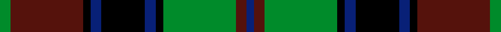

This is one **variant** — a specific cloth: this exact thread count and colourway, with its own
provenance below. It is one weaving of the [sett](/tartans/m/ma/matthew-gloag-son-ltd/) (the scale-free proportion — the
same cloth at any scale or shade), whose colour order is pattern [BBGKBKBKBG](/stripes/bbgkbkbkbg/).

Part of the [Matthew Gloag & Son Ltd](/tartans/m/ma/matthew-gloag-son-ltd/) tartan — the named design grouping this sett with its other cloths.

Sourced from tartans-authority.  It is a [10 stripe tartan](/stripes/stripes10/).

Original link <code>http://www.tartansauthority.com/tartan-ferret/display/2397/</code> — retired · [Internet Archive copy](https://web.archive.org/web/*/http://www.tartansauthority.com/tartan-ferret/display/2397/*)

Dataset <small>— provenance for this record, inherited from the source manifest</small>

<dl class="dataset-prov">
<dt>source</dt><dd><a href="/sources/tartans-authority/">Scottish Tartans Authority</a></dd>
<dt>data captured from</dt><dd><a href="https://github.com/thetartan/tartan-database/blob/master/data/tartans-authority/data.csv">https://github.com/thetartan/tartan-database/blob/master/data/tartans-authority/data.csv</a></dd>
<dt>data date</dt><dd>1996 <small>(this record)</small></dd>
<dt>licence</dt><dd><a href="https://creativecommons.org/licenses/by-nc-nd/4.0/">CC BY-NC-ND 4.0</a></dd>
</dl>

Capture chain <small>— the hands this data passed through, oldest first; each capture carries its own licence</small>

<ol class="capture-chain">
<li><a href="https://www.tartansauthority.com/">Scottish Tartans Authority</a> <small>the heritage body’s archive — its tartan-ferret record browser is retired; dead record links are shown unlinked, with an Internet Archive copy (ITI numbers are not SRT references)</small></li>
<li><a href="https://github.com/thetartan/tartan-database">thetartan/tartan-database</a> <small>2016-2017</small> · <a href="https://creativecommons.org/licenses/by-nc-nd/4.0/">CC BY-NC-ND 4.0</a> <small>Levko Kravets's frozen compilation — the capture we vendored, and where its CC licence text came from</small></li>
<li>this dictionary <small>captured 2026-06-10 · commit 5bf86c7566</small> <small>each re-capture is a git commit to data/sources</small></li>
</ol>

## Register references

External register numbers recorded for this tartan.

- Scottish Tartans Authority (ITI): 2397

## Thread count
G/6 DR40 K4 DB6 K24 DB6 K4 G40 DR6 DB/4

One full sett is **270 threads**.

## Palette
<table><thead><tr><th>Colour</th><th>Shade</th><th>OKLCh</th></tr></thead><tbody><tr><td>DB</td><td><code style="background-color:#082077;">#082077</code> <small style="color:#888">#082077</small></td><td><small style="color:#888">oklch(30.0% 0.149 265.1)</small></td></tr><tr><td>DR</td><td><code style="background-color:#55120C;">#55120C</code> <small style="color:#888">#55120C</small></td><td><small style="color:#888">oklch(30.0% 0.099 29.3)</small></td></tr><tr><td>G</td><td><code style="background-color:#008B2A;">#008B2A</code> <small style="color:#888">#008B2A</small></td><td><small style="color:#888">oklch(55.4% 0.170 145.9)</small></td></tr><tr><td>K</td><td><code style="background-color:#000000;">#000000</code> <small style="color:#888">#000000</small></td><td><small style="color:#888">oklch(0.0% 0.000 0.0)</small></td></tr></tbody></table>

# Sample pattern

## Nearest tartan variants

The nearest existing variants by ΔTartan distance, with this cloth at the top so the swatches line up against it.

ΔTartan

Threads

Variant

Sett

—

270

<a href="/variants/s10/g3dr20k2db3k12db3k2g20dr3db2~x2/">Matthew Gloag &amp; Son Ltd (Corporate)</a>

<a href="/ttd/edit/#slug=g3r20k2db3k13db3k2g20r3db2~x2&amp;base=g3dr20k2db3k12db3k2g20dr3db2~x2" title="compare in the TTD">0.17</a>

274

<a href="/variants/s10/g3r20k2db3k13db3k2g20r3db2~x2/">Matthew Gloag</a>

<a href="/ttd/edit/#slug=r7g3r2g33k31db31k3db3&amp;base=g3dr20k2db3k12db3k2g20dr3db2~x2" title="compare in the TTD">2.15</a>

216

<a href="/variants/s8/r7g3r2g33k31db31k3db3/">Baird (Old) Clan Tartan</a>

<a href="/ttd/edit/#slug=r3db6k1db1k1db1k6g9k2~x2&amp;base=g3dr20k2db3k12db3k2g20dr3db2~x2" title="compare in the TTD">2.27</a>

110

<a href="/variants/s9/r3db6k1db1k1db1k6g9k2~x2/">Urquhart</a>

<a href="/ttd/edit/#slug=db12r2db2r5db26r2k29g27r5g2r2g12~x2&amp;base=g3dr20k2db3k12db3k2g20dr3db2~x2" title="compare in the TTD">2.35</a>

456

<a href="/variants/s12/db12r2db2r5db26r2k29g27r5g2r2g12~x2/">MacDonald #5</a>

<a href="/ttd/edit/#slug=r4k4dt24k24g24k2r3~x2&amp;base=g3dr20k2db3k12db3k2g20dr3db2~x2" title="compare in the TTD">2.37</a>

326

<a href="/variants/s7/r4k4dt24k24g24k2r3~x2/">Black Watch (Coarse Kilt)</a>

<a href="/ttd/edit/#slug=dp20k2w2k2dp2k10g3k2g20k2g3k10dp8k2~x2&amp;base=g3dr20k2db3k12db3k2g20dr3db2~x2" title="compare in the TTD">2.40</a>

308

<a href="/variants/s14/dp20k2w2k2dp2k10g3k2g20k2g3k10dp8k2~x2/">Caithelyn (Personal)</a>

<a href="/ttd/edit/#slug=r2g10k12n1k2n14k1n1g2~x2&amp;base=g3dr20k2db3k12db3k2g20dr3db2~x2" title="compare in the TTD">2.42</a>

172

<a href="/variants/s9/r2g10k12n1k2n14k1n1g2~x2/">MacWilliams Wedding Personal Tartan</a>

<a href="/ttd/edit/#slug=k10dr1k3do7n1do1n1do1n1do1n7~x4&amp;base=g3dr20k2db3k12db3k2g20dr3db2~x2" title="compare in the TTD">2.49</a>

204

<a href="/variants/s11/k10dr1k3do7n1do1n1do1n1do1n7~x4/">Lunar</a>

<a href="/ttd/edit/#slug=db8r1db2r3db12r1k12g12r3g2r1g8~x2&amp;base=g3dr20k2db3k12db3k2g20dr3db2~x2" title="compare in the TTD">2.51</a>

228

<a href="/variants/s12/db8r1db2r3db12r1k12g12r3g2r1g8~x2/">MacDonald Clan Tartan</a>

<a href="/ttd/edit/#slug=db8r1db2r3db12r1k12g12r3g2r1g8&amp;base=g3dr20k2db3k12db3k2g20dr3db2~x2" title="compare in the TTD">2.51</a>

114

<a href="/variants/s12/db8r1db2r3db12r1k12g12r3g2r1g8/">MacDonald</a>

## Neighbour map

Every grey dot is one of 13662 variants placed by the first two principal components of the ΔTartan feature space (42% of its variance). Red is this tartan; blue dots are its nearest — click one to open its page. The map is a flat projection of a many-dimensional space — [how to read it](/posts/neighbourhood-maps/).

<svg viewBox="0 0 640 380" role="img" style="max-width:100%;height:auto;border:1px solid #e0e0e0;border-radius:4px;display:block" xmlns="http://www.w3.org/2000/svg"><image href="/nn/cloud.v1.png" width="640" height="380"/><a href="/variants/s10/g3r20k2db3k13db3k2g20r3db2~x2/"><circle cx="134.9" cy="155.6" r="4" fill="#3465a4"><title>Matthew Gloag</title></circle></a><a href="/variants/s8/r7g3r2g33k31db31k3db3/"><circle cx="158.7" cy="157.2" r="4" fill="#3465a4"><title>Baird (Old) Clan Tartan</title></circle></a><a href="/variants/s9/r3db6k1db1k1db1k6g9k2~x2/"><circle cx="127.0" cy="181.8" r="4" fill="#3465a4"><title>Urquhart</title></circle></a><a href="/variants/s12/db12r2db2r5db26r2k29g27r5g2r2g12~x2/"><circle cx="143.1" cy="143.3" r="4" fill="#3465a4"><title>MacDonald #5</title></circle></a><a href="/variants/s7/r4k4dt24k24g24k2r3~x2/"><circle cx="156.3" cy="181.9" r="4" fill="#3465a4"><title>Black Watch (Coarse Kilt)</title></circle></a><a href="/variants/s14/dp20k2w2k2dp2k10g3k2g20k2g3k10dp8k2~x2/"><circle cx="149.9" cy="147.2" r="4" fill="#3465a4"><title>Caithelyn (Personal)</title></circle></a><a href="/variants/s9/r2g10k12n1k2n14k1n1g2~x2/"><circle cx="149.8" cy="142.2" r="4" fill="#3465a4"><title>MacWilliams Wedding Personal Tartan</title></circle></a><a href="/variants/s11/k10dr1k3do7n1do1n1do1n1do1n7~x4/"><circle cx="208.8" cy="166.6" r="4" fill="#3465a4"><title>Lunar</title></circle></a><a href="/variants/s12/db8r1db2r3db12r1k12g12r3g2r1g8~x2/"><circle cx="135.5" cy="164.1" r="4" fill="#3465a4"><title>MacDonald Clan Tartan</title></circle></a><a href="/variants/s12/db8r1db2r3db12r1k12g12r3g2r1g8/"><circle cx="135.5" cy="164.1" r="4" fill="#3465a4"><title>MacDonald</title></circle></a><circle cx="158.7" cy="168.0" r="5" fill="#c00000"/><text x="320" y="376" text-anchor="middle" font-size="11" fill="#999">ground</text><text x="11" y="190" text-anchor="middle" font-size="11" fill="#999" transform="rotate(-90 11 190)">complexity</text></svg>

ID: /variants/s10/g3dr20k2db3k12db3k2g20dr3db2~x2/
