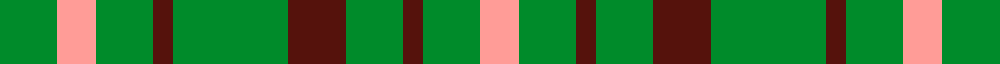

This page is one **sett** — a single exact thread-count. It belongs to the [tartan](/setts/g3lr2g3dr1g6dr3g3dr1g3lr2/)
(the same proportion at any scale), whose colour order is pattern [GYGBGBGBGY](/stripes/gygbgbgbgy/).

Part of the [Dundee](/tartans/dundee/) tartan — the named design grouping this sett with its other cloths.

Sourced from register-of-tartans.  It is a [10 stripe tartan](/stripes/stripes10/).

Original link https://www.tartanregister.gov.uk/tartanDetails.aspx?ref=1036

## Register references

External register numbers recorded for this tartan.

- Scottish Register of Tartans: [1036](https://www.tartanregister.gov.uk/tartanDetails.aspx?ref=1036)
- Scottish Tartans Authority (ITI): 2065
- Scottish Tartans World Register: 2065

## Thread count
G/12 LR8 G12 DR4 G24 DR12 G12 DR4 G12 LR/8

One full sett is **196 threads**.

## Palette
<table><thead><tr><th>Colour</th><th>Shade</th><th>OKLCh</th></tr></thead><tbody><tr><td>DR</td><td><code style="background-color:#55120C;">#55120C</code> <small style="color:#888">#55120C</small></td><td><small style="color:#888">oklch(30.0% 0.099 29.3)</small></td></tr><tr><td>G</td><td><code style="background-color:#008B2A;">#008B2A</code> <small style="color:#888">#008B2A</small></td><td><small style="color:#888">oklch(55.4% 0.170 145.9)</small></td></tr><tr><td>N</td><td><code style="background-color:#FF9C97;">#FF9C97</code> <small style="color:#888">#FF9C97</small></td><td><small style="color:#888">oklch(79.3% 0.119 23.2)</small></td></tr></tbody></table>

# Sample pattern

## Nearest variants

The nearest existing variants by ΔTartan distance, with this cloth at the top so the swatches line up against it.

ΔTartan

Threads

Variant

Sett

—

196

<a href="/variants/s10/g3lr2g3dr1g6dr3g3dr1g3lr2~x4/">Dundee Green</a>

<a href="/ttd/edit/#slug=g3lr2g3dr1g6dr3g3dr1g2lr3~x4&amp;base=g3lr2g3dr1g6dr3g3dr1g3lr2~x4" title="compare in the TTD">0.35</a>

192

<a href="/variants/s10/g3lr2g3dr1g6dr3g3dr1g2lr3~x4/">Dundee, Green (Fashion)</a>

<a href="/ttd/edit/#slug=g3w2g3r1g6r3g3r1g2w3~x2&amp;base=g3lr2g3dr1g6dr3g3dr1g3lr2~x4" title="compare in the TTD">2.10</a>

96

<a href="/variants/s10/g3w2g3r1g6r3g3r1g2w3~x2/">Dundee, Green</a>

<a href="/ttd/edit/#slug=g2r3g4y1g1w1g4r3g2~x2&amp;base=g3lr2g3dr1g6dr3g3dr1g3lr2~x4" title="compare in the TTD">2.36</a>

76

<a href="/variants/s9/g2r3g4y1g1w1g4r3g2~x2/">Unidentified #33</a>

<a href="/ttd/edit/#slug=g9r2g2r2g2r8g11w2~x4&amp;base=g3lr2g3dr1g6dr3g3dr1g3lr2~x4" title="compare in the TTD">2.45</a>

260

<a href="/variants/s8/g9r2g2r2g2r8g11w2~x4/">Leeds University Corporate Tartan</a>

<a href="/ttd/edit/#slug=g5r9g10y2g2w2g10r9g5~x2&amp;base=g3lr2g3dr1g6dr3g3dr1g3lr2~x4" title="compare in the TTD">2.46</a>

196

<a href="/variants/s9/g5r9g10y2g2w2g10r9g5~x2/">Wilson's, No 169</a>

## Neighbour map

Every grey dot is one of 13620 variants placed by the first two principal components of the ΔTartan feature space (42% of its variance). Red is this tartan; blue dots are its nearest — click one to open its page.

<svg viewBox="0 0 640 380" role="img" style="max-width:100%;height:auto;border:1px solid #e0e0e0;border-radius:4px;display:block" xmlns="http://www.w3.org/2000/svg"><image href="/nn/cloud.v1.png" width="640" height="380"/><a href="/variants/s10/g3lr2g3dr1g6dr3g3dr1g2lr3~x4/"><circle cx="336.7" cy="283.5" r="4" fill="#3465a4"><title>Dundee, Green (Fashion)</title></circle></a><a href="/variants/s10/g3w2g3r1g6r3g3r1g2w3~x2/"><circle cx="295.0" cy="262.5" r="4" fill="#3465a4"><title>Dundee, Green</title></circle></a><a href="/variants/s9/g2r3g4y1g1w1g4r3g2~x2/"><circle cx="299.8" cy="276.6" r="4" fill="#3465a4"><title>Unidentified #33</title></circle></a><a href="/variants/s8/g9r2g2r2g2r8g11w2~x4/"><circle cx="357.5" cy="248.8" r="4" fill="#3465a4"><title>Leeds University Corporate Tartan</title></circle></a><a href="/variants/s9/g5r9g10y2g2w2g10r9g5~x2/"><circle cx="303.8" cy="260.0" r="4" fill="#3465a4"><title>Wilson's, No 169</title></circle></a><circle cx="364.9" cy="285.1" r="5" fill="#c00000"/><text x="320" y="376" text-anchor="middle" font-size="11" fill="#999">ground</text><text x="11" y="190" text-anchor="middle" font-size="11" fill="#999" transform="rotate(-90 11 190)">complexity</text></svg>

ID: /variants/s10/g3lr2g3dr1g6dr3g3dr1g3lr2~x4/
