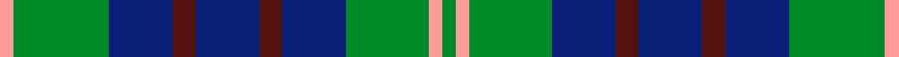

This page is one **sett** — a single exact thread-count. It belongs to the [tartan](/setts/g3lr3g18db14dr5db14dr5db14g21lr3/)
(the same proportion at any scale), whose colour order is pattern [GYGBBBBBGY](/stripes/gygbbbbbgy/).

Sourced from tartans-authority.  It is a [10 stripe tartan](/stripes/stripes10/).

Original link http://www.tartansauthority.com/tartan-ferret/display/5142/

## Register references

External register numbers recorded for this tartan.

- Scottish Tartans Authority (ITI): 5142

## Thread count
LR/6 G42 DB28 DR10 DB28 DR10 DB28 G36 LR6 G/6

One full sett is **388 threads**.

## Palette
<table><thead><tr><th>Colour</th><th>Shade</th><th>OKLCh</th></tr></thead><tbody><tr><td>DB</td><td><code style="background-color:#55120C;">#55120C</code> <small style="color:#888">#55120C</small></td><td><small style="color:#888">oklch(30.0% 0.099 29.3)</small></td></tr><tr><td>DBa</td><td><code style="background-color:#008B2A;">#008B2A</code> <small style="color:#888">#008B2A</small></td><td><small style="color:#888">oklch(55.4% 0.170 145.9)</small></td></tr><tr><td>DR</td><td><code style="background-color:#082077;">#082077</code> <small style="color:#888">#082077</small></td><td><small style="color:#888">oklch(30.0% 0.149 265.1)</small></td></tr><tr><td>G</td><td><code style="background-color:#FF9C97;">#FF9C97</code> <small style="color:#888">#FF9C97</small></td><td><small style="color:#888">oklch(79.3% 0.119 23.2)</small></td></tr></tbody></table>

# Sample pattern

## Nearest variants

The nearest existing variants by ΔTartan distance, with this cloth at the top so the swatches line up against it.

ΔTartan

Threads

Variant

Sett

—

388

<a href="/variants/s10/g3lr3g18db14dr5db14dr5db14g21lr3~x2/">Hamilton (Personal)</a>

<a href="/ttd/edit/#slug=g3w3g18db14r5db14r5db14g21w3~x2&amp;base=g3lr3g18db14dr5db14dr5db14g21lr3~x2" title="compare in the TTD">0.60</a>

388

<a href="/variants/s10/g3w3g18db14r5db14r5db14g21w3~x2/">Hamilton of Clayton (Personal)</a>

<a href="/ttd/edit/#slug=g28dr12g4db20lo2db3lo2db3g7~x2&amp;base=g3lr3g18db14dr5db14dr5db14g21lr3~x2" title="compare in the TTD">1.96</a>

254

<a href="/variants/s9/g28dr12g4db20lo2db3lo2db3g7~x2/">Cork Irish County Tartan</a>

<a href="/ttd/edit/#slug=dp4db18dr2db2dr2db9g20db3g4~x2&amp;base=g3lr3g18db14dr5db14dr5db14g21lr3~x2" title="compare in the TTD">2.54</a>

240

<a href="/variants/s9/dp4db18dr2db2dr2db9g20db3g4~x2/">St. Andrews New Golf Club (Corp)</a>

<a href="/ttd/edit/#slug=db10y4db36g28w3g3w3g8y6&amp;base=g3lr3g18db14dr5db14dr5db14g21lr3~x2" title="compare in the TTD">2.73</a>

186

<a href="/variants/s9/db10y4db36g28w3g3w3g8y6/">MacOrrell</a>

## Neighbour map

Every grey dot is one of 13620 variants placed by the first two principal components of the ΔTartan feature space (42% of its variance). Red is this tartan; blue dots are its nearest — click one to open its page.

<svg viewBox="0 0 640 380" role="img" style="max-width:100%;height:auto;border:1px solid #e0e0e0;border-radius:4px;display:block" xmlns="http://www.w3.org/2000/svg"><image href="/nn/cloud.v1.png" width="640" height="380"/><a href="/variants/s10/g3w3g18db14r5db14r5db14g21w3~x2/"><circle cx="197.5" cy="228.1" r="4" fill="#3465a4"><title>Hamilton of Clayton (Personal)</title></circle></a><a href="/variants/s9/g28dr12g4db20lo2db3lo2db3g7~x2/"><circle cx="296.5" cy="196.3" r="4" fill="#3465a4"><title>Cork Irish County Tartan</title></circle></a><a href="/variants/s9/dp4db18dr2db2dr2db9g20db3g4~x2/"><circle cx="321.9" cy="216.6" r="4" fill="#3465a4"><title>St. Andrews New Golf Club (Corp)</title></circle></a><a href="/variants/s9/db10y4db36g28w3g3w3g8y6/"><circle cx="277.7" cy="195.6" r="4" fill="#3465a4"><title>MacOrrell</title></circle></a><circle cx="235.1" cy="247.9" r="5" fill="#c00000"/><text x="320" y="376" text-anchor="middle" font-size="11" fill="#999">ground</text><text x="11" y="190" text-anchor="middle" font-size="11" fill="#999" transform="rotate(-90 11 190)">complexity</text></svg>

ID: /variants/s10/g3lr3g18db14dr5db14dr5db14g21lr3~x2/
