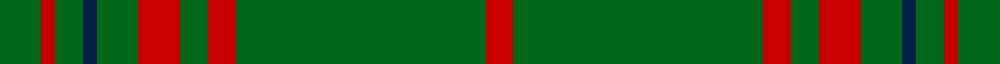

This page is one **sett** — a single exact thread-count. It belongs to the [tartan](/setts/g3r1g2db1g3r3g2r2g18r2/)
(the same proportion at any scale), whose colour order is pattern [GRGBGRGRGR](/stripes/grgbgrgrgr/).

Part of the [Owen](/tartans/owen/) tartan — the named design grouping this sett with its other cloths.

Sourced from tartans-authority.  It is a [10 stripe tartan](/stripes/stripes10/).

Original link http://www.tartansauthority.com/tartan-ferret/display/5750/

## Register references

External register numbers recorded for this tartan.

- Scottish Tartans Authority (ITI): 5750

## Thread count
G/6 Ra2 G4 DBa2 G6 R6 G4 R4 G36 Ra/4

One full sett is **138 threads**.

## Palette

Palette: <strong>Tartan Register</strong> <small style="color:#888">(3 of 4 colours)</small>
<table><thead><tr><th>Colour</th><th>Threads</th><th>Shade</th><th>Base</th><th>OKLCh</th></tr></thead><tbody><tr><td>G/</td><td style="text-align:right;font-variant-numeric:tabular-nums">6</td><td><code style="background-color:#006818;">#006818</code> <small style="color:#888">#006818</small></td><td>G <code style="background-color:#006100;">#006100</code></td><td><small style="color:#888">oklch(45.0% 0.142 145.0)</small></td></tr><tr><td>Ra</td><td style="text-align:right;font-variant-numeric:tabular-nums">2</td><td><code style="background-color:#C80000;">#C80000</code> <small style="color:#888">#C80000</small></td><td>R <code style="background-color:#CC0000;">#CC0000</code></td><td><small style="color:#888">oklch(52.3% 0.215 29.2)</small></td></tr><tr><td>G</td><td style="text-align:right;font-variant-numeric:tabular-nums">4</td><td><code style="background-color:#006818;">#006818</code> <small style="color:#888">#006818</small></td><td>G <code style="background-color:#006100;">#006100</code></td><td><small style="color:#888">oklch(45.0% 0.142 145.0)</small></td></tr><tr><td>DBa</td><td style="text-align:right;font-variant-numeric:tabular-nums">2</td><td><code style="background-color:#002048;">#002048</code> <small style="color:#888">#002048</small></td><td>B <code style="background-color:#2A418A;">#2A418A</code></td><td><small style="color:#888">oklch(24.9% 0.084 255.6)</small></td></tr><tr><td>G</td><td style="text-align:right;font-variant-numeric:tabular-nums">6</td><td><code style="background-color:#006818;">#006818</code> <small style="color:#888">#006818</small></td><td>G <code style="background-color:#006100;">#006100</code></td><td><small style="color:#888">oklch(45.0% 0.142 145.0)</small></td></tr><tr><td>R</td><td style="text-align:right;font-variant-numeric:tabular-nums">6</td><td><code style="background-color:#C80000;">#C80000</code> <small style="color:#888">#C80000</small></td><td>R <code style="background-color:#CC0000;">#CC0000</code></td><td><small style="color:#888">oklch(52.3% 0.215 29.2)</small></td></tr><tr><td>G</td><td style="text-align:right;font-variant-numeric:tabular-nums">4</td><td><code style="background-color:#006818;">#006818</code> <small style="color:#888">#006818</small></td><td>G <code style="background-color:#006100;">#006100</code></td><td><small style="color:#888">oklch(45.0% 0.142 145.0)</small></td></tr><tr><td>R</td><td style="text-align:right;font-variant-numeric:tabular-nums">4</td><td><code style="background-color:#C80000;">#C80000</code> <small style="color:#888">#C80000</small></td><td>R <code style="background-color:#CC0000;">#CC0000</code></td><td><small style="color:#888">oklch(52.3% 0.215 29.2)</small></td></tr><tr><td>G</td><td style="text-align:right;font-variant-numeric:tabular-nums">36</td><td><code style="background-color:#006818;">#006818</code> <small style="color:#888">#006818</small></td><td>G <code style="background-color:#006100;">#006100</code></td><td><small style="color:#888">oklch(45.0% 0.142 145.0)</small></td></tr><tr><td>Ra/</td><td style="text-align:right;font-variant-numeric:tabular-nums">4</td><td><code style="background-color:#C80000;">#C80000</code> <small style="color:#888">#C80000</small></td><td>R <code style="background-color:#CC0000;">#CC0000</code></td><td><small style="color:#888">oklch(52.3% 0.215 29.2)</small></td></tr></tbody></table>

## Compared to the master

This cloth is one sett of its design; the master sett (the exemplar the design is anchored on) is below for comparison.

<figure style="margin:0"><figcaption style="color:#888;font-size:smaller">this sett</figcaption></figure>
<figure style="margin:0"><figcaption style="color:#888;font-size:smaller"><a href="/setts/g3dt1g2r1g3db3g2db2g18dt2/">master sett →</a></figcaption></figure>

## Nearest tartans

The nearest existing variants by ΔTartan distance, with this tartan at the top so the swatches line up against it.

ΔTartan

Tartan

Sett

—

<a href="/ttd/edit/#slug=g3r1g2db1g3r3g2r2g18r2~x2">Owen (Welsh Name)</a> <a class="nn-out" href="/variants/s10/g3r1g2db1g3r3g2r2g18r2~x2/" title="open its dictionary page">↗</a>

1.33

<a href="/ttd/edit/#slug=r3g12r1g2r2g2r1g12r3k1~x4&amp;base=g3r1g2db1g3r3g2r2g18r2~x2">Connell (Dalgliesh) (Personal)</a> <a class="nn-out" href="/variants/s10/r3g12r1g2r2g2r1g12r3k1~x4/" title="open its dictionary page">↗</a>

1.39

<a href="/ttd/edit/#slug=lo5k1lo6g20w1g3w1g3w1g30k1lo2~x2&amp;base=g3r1g2db1g3r3g2r2g18r2~x2">Delta Lambda Phi (Corporate)</a> <a class="nn-out" href="/variants/s12/lo5k1lo6g20w1g3w1g3w1g30k1lo2~x2/" title="open its dictionary page">↗</a>

1.40

<a href="/ttd/edit/#slug=gi6g3gi3g4gi4k5gi3k5gi28r2gi4r2~x2&amp;base=g3r1g2db1g3r3g2r2g18r2~x2">Ross Hunting Clan Tartan</a> <a class="nn-out" href="/variants/s12/gi6g3gi3g4gi4k5gi3k5gi28r2gi4r2~x2/" title="open its dictionary page">↗</a>

1.45

<a href="/ttd/edit/#slug=g5o9g4w5g30r2g4r2~x2&amp;base=g3r1g2db1g3r3g2r2g18r2~x2">Welsh Assembly (Fashion)</a> <a class="nn-out" href="/variants/s8/g5o9g4w5g30r2g4r2~x2/" title="open its dictionary page">↗</a>

1.45

<a href="/ttd/edit/#slug=g51dp3g5lo3g5dp5g5dp5g5lo3~x2&amp;base=g3r1g2db1g3r3g2r2g18r2~x2">Highland Hospice (Fashion)</a> <a class="nn-out" href="/variants/s10/g51dp3g5lo3g5dp5g5dp5g5lo3~x2/" title="open its dictionary page">↗</a>

1.49

<a href="/ttd/edit/#slug=dg5r3dg3lo2dg1ly8dg24lo2~x2&amp;base=g3r1g2db1g3r3g2r2g18r2~x2">St. Christopher (Corporate)</a> <a class="nn-out" href="/variants/s8/dg5r3dg3lo2dg1ly8dg24lo2~x2/" title="open its dictionary page">↗</a>

1.52

<a href="/ttd/edit/#slug=r2dg24k2dg12lo6k1r2~x2&amp;base=g3r1g2db1g3r3g2r2g18r2~x2">Inman (2016)</a> <a class="nn-out" href="/variants/s7/r2dg24k2dg12lo6k1r2~x2/" title="open its dictionary page">↗</a>

1.53

<a href="/ttd/edit/#slug=g3dt1g2r1g3db3g2db2g18dt2~x2&amp;base=g3r1g2db1g3r3g2r2g18r2~x2">Owen Welsh Name Tartan</a> <a class="nn-out" href="/variants/s10/g3dt1g2r1g3db3g2db2g18dt2~x2/" title="open its dictionary page">↗</a>

1.56

<a href="/ttd/edit/#slug=dg6do2m1dg15m3do1dg15g6m1~x2&amp;base=g3r1g2db1g3r3g2r2g18r2~x2">McCall, F W (Personal)</a> <a class="nn-out" href="/variants/s9/dg6do2m1dg15m3do1dg15g6m1~x2/" title="open its dictionary page">↗</a>

1.58

<a href="/ttd/edit/#slug=o9g4w5g30r2g4r2g4r2g30w5g4o9g5~x2&amp;base=g3r1g2db1g3r3g2r2g18r2~x2">Welsh Assembly</a> <a class="nn-out" href="/variants/s14/o9g4w5g30r2g4r2g4r2g30w5g4o9g5~x2/" title="open its dictionary page">↗</a>

## Neighbour map

Every grey dot is one of 14360 variants placed by the first two principal components of the ΔTartan feature space (44% of its variance). Red is this tartan; blue dots are its nearest — click one to open its page.

<svg viewBox="0 0 640 380" role="img" style="max-width:100%;height:auto;border:1px solid #e0e0e0;border-radius:4px;display:block" xmlns="http://www.w3.org/2000/svg"><image href="/nn/cloud.v1.png" width="640" height="380"/><a href="/variants/s10/r3g12r1g2r2g2r1g12r3k1~x4/"><circle cx="474.2" cy="206.7" r="4" fill="#3465a4"><title>Connell (Dalgliesh) (Personal)</title></circle></a><a href="/variants/s12/lo5k1lo6g20w1g3w1g3w1g30k1lo2~x2/"><circle cx="513.6" cy="131.3" r="4" fill="#3465a4"><title>Delta Lambda Phi (Corporate)</title></circle></a><a href="/variants/s12/gi6g3gi3g4gi4k5gi3k5gi28r2gi4r2~x2/"><circle cx="435.3" cy="180.0" r="4" fill="#3465a4"><title>Ross Hunting Clan Tartan</title></circle></a><a href="/variants/s8/g5o9g4w5g30r2g4r2~x2/"><circle cx="433.2" cy="182.1" r="4" fill="#3465a4"><title>Welsh Assembly (Fashion)</title></circle></a><a href="/variants/s10/g51dp3g5lo3g5dp5g5dp5g5lo3~x2/"><circle cx="558.6" cy="179.0" r="4" fill="#3465a4"><title>Highland Hospice (Fashion)</title></circle></a><a href="/variants/s8/dg5r3dg3lo2dg1ly8dg24lo2~x2/"><circle cx="441.4" cy="158.5" r="4" fill="#3465a4"><title>St. Christopher (Corporate)</title></circle></a><a href="/variants/s7/r2dg24k2dg12lo6k1r2~x2/"><circle cx="471.7" cy="171.9" r="4" fill="#3465a4"><title>Inman (2016)</title></circle></a><a href="/variants/s10/g3dt1g2r1g3db3g2db2g18dt2~x2/"><circle cx="536.1" cy="193.3" r="4" fill="#3465a4"><title>Owen Welsh Name Tartan</title></circle></a><a href="/variants/s9/dg6do2m1dg15m3do1dg15g6m1~x2/"><circle cx="452.6" cy="206.2" r="4" fill="#3465a4"><title>McCall, F W (Personal)</title></circle></a><a href="/variants/s14/o9g4w5g30r2g4r2g4r2g30w5g4o9g5~x2/"><circle cx="419.7" cy="160.8" r="4" fill="#3465a4"><title>Welsh Assembly</title></circle></a><circle cx="513.4" cy="169.9" r="5" fill="#c00000"/></svg>

ID: /variants/s10/g3r1g2db1g3r3g2r2g18r2~x2/
