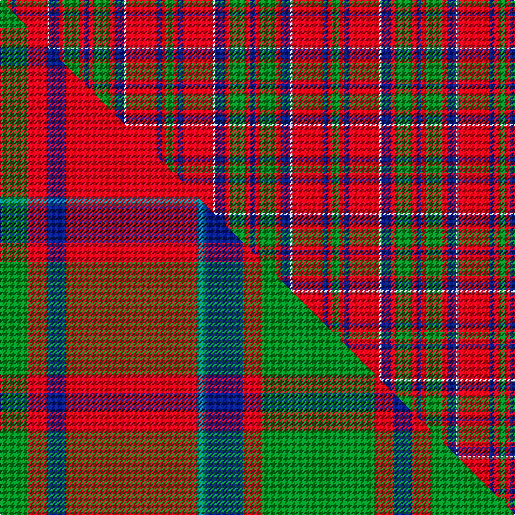

This is one **variant** — a specific cloth: this exact thread count and colourway, with its own
provenance below. It is one weaving of the [sett](/setts/g3r2db2r13lb1db4r2g7r2db2/) (the scale-free proportion — the
same cloth at any scale or shade), whose colour order is pattern [BRGRBWRBRG](/stripes/brgrbwrbrg/).

Part of the [MacKillop](/tartans/mackillop-2/) tartan — the named design grouping this sett with its other cloths.

Sourced from house-of-tartan.  It is a [10 stripe tartan](/stripes/stripes10/).

Original link [http://www.house-of-tartan.scotland.net/house/TartanViewjs.asp?colr=Def&tnam=512](http://www.house-of-tartan.scotland.net/house/TartanViewjs.asp?colr=Def&tnam=512)

## Provenance

Earliest known date: pre 2003 The MacKillops are a Sept of MacDonald of Keppoch, whose tartan this sett closely resembles.

2 attestations — the source records this cloth was collapsed from (oldest owns this page)

<ul>
<li>pre 2003 — MacKillop Clan Tartan (house-of-tartan, <a href="http://www.house-of-tartan.scotland.net/house/TartanViewjs.asp?colr=Def&tnam=512">record</a>) </li>
<li>undated — MacKillop (weddslist, <a href="http://www.weddslist.com/cgi-bin/tartans/pg.pl?source=sts">record</a>) </li>
</ul>

Dataset <small>— provenance for this record, inherited from the source manifest</small>

<dl class="dataset-prov">
<dt>source</dt><dd><a href="/sources/house-of-tartan/">House of Tartan</a></dd>
<dt>data captured from</dt><dd><a href="https://github.com/thetartan/tartan-database/blob/master/data/house-of-tartan/data.csv">https://github.com/thetartan/tartan-database/blob/master/data/house-of-tartan/data.csv</a></dd>
<dt>data date</dt><dd>pre 2003 <small>(this record)</small></dd>
<dt>licence</dt><dd><a href="https://creativecommons.org/licenses/by-nc-nd/4.0/">CC BY-NC-ND 4.0</a></dd>
</dl>

Capture chain <small>— the hands this data passed through, oldest first; each capture carries its own licence</small>

<ol class="capture-chain">
<li><a href="http://www.house-of-tartan.scotland.net/">House of Tartan</a> <small>the weaver/retailer's database — the site is now offline; the URL is kept as the ultimate source's identity</small></li>
<li><a href="https://github.com/thetartan/tartan-database">thetartan/tartan-database</a> <small>2016-2017</small> · <a href="https://creativecommons.org/licenses/by-nc-nd/4.0/">CC BY-NC-ND 4.0</a> <small>Levko Kravets's frozen compilation — the capture we vendored, and where its CC licence text came from</small></li>
<li>this dictionary <small>captured 2026-06-10 · commit 5bf86c7566</small> <small>each re-capture is a git commit to data/sources</small></li>
</ol>

## Thread count
G/6 R4 DB4 R26 LB2 DB8 R4 G14 R4 DB/4

One full sett is **142 threads**.

## Palette
<table><thead><tr><th>Colour</th><th>Shade</th><th>OKLCh</th></tr></thead><tbody><tr><td>LB</td><td><code style="background-color:#B5BBDE;">#B5BBDE</code> <small style="color:#888">#B5BBDE</small></td><td><small style="color:#888">oklch(79.9% 0.050 277.6)</small></td></tr><tr><td>DB</td><td><code style="background-color:#082077;">#082077</code> <small style="color:#888">#082077</small></td><td><small style="color:#888">oklch(30.0% 0.149 265.1)</small></td></tr><tr><td>G</td><td><code style="background-color:#008B2A;">#008B2A</code> <small style="color:#888">#008B2A</small></td><td><small style="color:#888">oklch(55.4% 0.170 145.9)</small></td></tr><tr><td>R</td><td><code style="background-color:#D60020;">#D60020</code> <small style="color:#888">#D60020</small></td><td><small style="color:#888">oklch(55.2% 0.224 25.5)</small></td></tr></tbody></table>

# Sample pattern

## Compared to the master

This cloth is one sett of its design; the master sett (the exemplar the design is anchored on) is below for comparison.

Its **ΔTartan distance** from the master is **0.37** — the same measure the nearest-tartans table ranks by (0 is identical; a re-scale of the same cloth is near 0, a recolour or a different proportion further).

<figure class="master-compare" style="margin:0">

this sett
master sett ★

<figcaption style="color:#888;font-size:smaller">One weave of this sett against the <a href="/setts/g3r2db2r14t1db4r2g12r2db2/">master sett ★</a>, split on the diagonal: a shared proportion runs seamlessly across it with only the shades shifting; a different proportion breaks on it.</figcaption>
</figure>

## Nearest tartan variants

The nearest existing variants by ΔTartan distance, with this cloth at the top so the swatches line up against it.

ΔTartan

Threads

Variant

Sett

—

142

<a href="/variants/s10/g3r2db2r13lb1db4r2g7r2db2~x2/">MacKillop Clan Tartan</a>

<a href="/ttd/edit/#slug=g3r2db2r14t1db4r2g12r2db2~x8&amp;base=g3r2db2r13lb1db4r2g7r2db2~x2" title="compare in the TTD">0.37</a>

664

<a href="/variants/s10/g3r2db2r14t1db4r2g12r2db2~x8/">MacKillop (Clan)</a>

<a href="/ttd/edit/#slug=db10r2w2r16g6r1g2r1g3r6~x2&amp;base=g3r2db2r13lb1db4r2g7r2db2~x2" title="compare in the TTD">1.13</a>

164

<a href="/variants/s10/db10r2w2r16g6r1g2r1g3r6~x2/">Harkness Family Tartan</a>

<a href="/ttd/edit/#slug=dp28r26w2dp5w2r26g28r5w2r5~x2&amp;base=g3r2db2r13lb1db4r2g7r2db2~x2" title="compare in the TTD">1.52</a>

450

<a href="/variants/s10/dp28r26w2dp5w2r26g28r5w2r5~x2/">Glenfinnan</a>

<a href="/ttd/edit/#slug=db28r26w2db5w2r26g28r5w2r5~x2&amp;base=g3r2db2r13lb1db4r2g7r2db2~x2" title="compare in the TTD">1.71</a>

450

<a href="/variants/s10/db28r26w2db5w2r26g28r5w2r5~x2/">Glenaladale</a>

<a href="/ttd/edit/#slug=db2r2db10r10db1r10g10r1db2~x4&amp;base=g3r2db2r13lb1db4r2g7r2db2~x2" title="compare in the TTD">1.95</a>

368

<a href="/variants/s9/db2r2db10r10db1r10g10r1db2~x4/">Fraser (Wilson 1820)</a>

<a href="/ttd/edit/#slug=r2db12r2g11r4db5g2r24w2~x2&amp;base=g3r2db2r13lb1db4r2g7r2db2~x2" title="compare in the TTD">1.98</a>

248

<a href="/variants/s9/r2db12r2g11r4db5g2r24w2~x2/">Fraser Gathering, Red (1997)</a>

<a href="/ttd/edit/#slug=o5lb13do4r4do27lb3do4o5&amp;base=g3r2db2r13lb1db4r2g7r2db2~x2" title="compare in the TTD">2.07</a>

120

<a href="/variants/s8/o5lb13do4r4do27lb3do4o5/">Daks, Blue Loden</a>

<a href="/ttd/edit/#slug=t10r2w2r16g6r1g2r1g3r6~x4&amp;base=g3r2db2r13lb1db4r2g7r2db2~x2" title="compare in the TTD">2.08</a>

328

<a href="/variants/s10/t10r2w2r16g6r1g2r1g3r6~x4/">Harkness Dress (Name)</a>

<a href="/ttd/edit/#slug=g5dr1r4db2r20g12db16r4dr1~x2&amp;base=g3r2db2r13lb1db4r2g7r2db2~x2" title="compare in the TTD">2.18</a>

248

<a href="/variants/s9/g5dr1r4db2r20g12db16r4dr1~x2/">Diana Princess of Wales</a>

<a href="/ttd/edit/#slug=r6g16r4db12r16w1r2~x2&amp;base=g3r2db2r13lb1db4r2g7r2db2~x2" title="compare in the TTD">2.21</a>

212

<a href="/variants/s7/r6g16r4db12r16w1r2~x2/">MacQuarrie LO</a>

## Neighbour map

Every grey dot is one of 13621 variants placed by the first two principal components of the ΔTartan feature space (42% of its variance). Red is this tartan; blue dots are its nearest — click one to open its page.

<svg viewBox="0 0 640 380" role="img" style="max-width:100%;height:auto;border:1px solid #e0e0e0;border-radius:4px;display:block" xmlns="http://www.w3.org/2000/svg"><image href="/nn/cloud.v1.png" width="640" height="380"/><a href="/variants/s10/g3r2db2r14t1db4r2g12r2db2~x8/"><circle cx="271.0" cy="168.1" r="4" fill="#3465a4"><title>MacKillop (Clan)</title></circle></a><a href="/variants/s10/db10r2w2r16g6r1g2r1g3r6~x2/"><circle cx="291.8" cy="159.0" r="4" fill="#3465a4"><title>Harkness Family Tartan</title></circle></a><a href="/variants/s10/dp28r26w2dp5w2r26g28r5w2r5~x2/"><circle cx="269.3" cy="168.8" r="4" fill="#3465a4"><title>Glenfinnan</title></circle></a><a href="/variants/s10/db28r26w2db5w2r26g28r5w2r5~x2/"><circle cx="255.2" cy="167.8" r="4" fill="#3465a4"><title>Glenaladale</title></circle></a><a href="/variants/s9/db2r2db10r10db1r10g10r1db2~x4/"><circle cx="273.9" cy="210.1" r="4" fill="#3465a4"><title>Fraser (Wilson 1820)</title></circle></a><a href="/variants/s9/r2db12r2g11r4db5g2r24w2~x2/"><circle cx="273.6" cy="170.5" r="4" fill="#3465a4"><title>Fraser Gathering, Red (1997)</title></circle></a><a href="/variants/s8/o5lb13do4r4do27lb3do4o5/"><circle cx="282.1" cy="190.3" r="4" fill="#3465a4"><title>Daks, Blue Loden</title></circle></a><a href="/variants/s10/t10r2w2r16g6r1g2r1g3r6~x4/"><circle cx="318.6" cy="170.3" r="4" fill="#3465a4"><title>Harkness Dress (Name)</title></circle></a><a href="/variants/s9/g5dr1r4db2r20g12db16r4dr1~x2/"><circle cx="260.8" cy="163.7" r="4" fill="#3465a4"><title>Diana Princess of Wales</title></circle></a><a href="/variants/s7/r6g16r4db12r16w1r2~x2/"><circle cx="271.0" cy="192.4" r="4" fill="#3465a4"><title>MacQuarrie LO</title></circle></a><circle cx="277.4" cy="172.9" r="5" fill="#c00000"/><text x="320" y="376" text-anchor="middle" font-size="11" fill="#999">ground</text><text x="11" y="190" text-anchor="middle" font-size="11" fill="#999" transform="rotate(-90 11 190)">complexity</text></svg>

ID: /variants/s10/g3r2db2r13lb1db4r2g7r2db2~x2/
