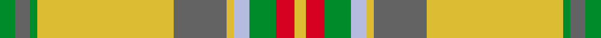

This page is one **sett** — a single exact thread-count. It belongs to the [tartan](/setts/g4n4g2ly36n14ly2lb4g7r5ly3/)
(the same proportion at any scale), whose colour order is pattern [GBGYBYWGRY](/stripes/gbgybywgry/).

Sourced from tartans-authority.  It is a [10 stripe tartan](/stripes/stripes10/).

Original link http://www.tartansauthority.com/tartan-ferret/display/10439/

## Register references

External register numbers recorded for this tartan.

- Scottish Register of Tartans: [10439](https://www.tartanregister.gov.uk/tartanDetails?ref=10439)
- Scottish Tartans Authority (ITI): 10439

## Thread count
G/8 N8 G4 LY72 N28 LY4 LB8 G14 R10 LY/6

One full sett is **310 threads**.

## Palette
<table><thead><tr><th>Colour</th><th>Shade</th><th>OKLCh</th></tr></thead><tbody><tr><td>LB</td><td><code style="background-color:#B5BBDE;">#B5BBDE</code> <small style="color:#888">#B5BBDE</small></td><td><small style="color:#888">oklch(79.9% 0.050 277.6)</small></td></tr><tr><td>G</td><td><code style="background-color:#008B2A;">#008B2A</code> <small style="color:#888">#008B2A</small></td><td><small style="color:#888">oklch(55.4% 0.170 145.9)</small></td></tr><tr><td>LY</td><td><code style="background-color:#DCBC32;">#DCBC32</code> <small style="color:#888">#DCBC32</small></td><td><small style="color:#888">oklch(80.0% 0.150 95.2)</small></td></tr><tr><td>N</td><td><code style="background-color:#636363;">#636363</code> <small style="color:#888">#636363</small></td><td><small style="color:#888">oklch(50.0% 0.000 89.9)</small></td></tr><tr><td>R</td><td><code style="background-color:#D60020;">#D60020</code> <small style="color:#888">#D60020</small></td><td><small style="color:#888">oklch(55.2% 0.224 25.5)</small></td></tr></tbody></table>

# Sample pattern

## Nearest tartan variants

The nearest existing variants by ΔTartan distance, with this cloth at the top so the swatches line up against it.

ΔTartan

Threads

Variant

Sett

—

310

<a href="/variants/s10/g4n4g2ly36n14ly2lb4g7r5ly3~x2/">Rikaco Eve (Fashion)</a>

<a href="/ttd/edit/#slug=y6r21g2dg6g41lb2g2lb6&amp;base=g4n4g2ly36n14ly2lb4g7r5ly3~x2" title="compare in the TTD">2.44</a>

160

<a href="/variants/s8/y6r21g2dg6g41lb2g2lb6/">Manitoba</a>

<a href="/ttd/edit/#slug=g21r2w1y3r2g5r21y1ly1y1r1g8~x2~y2405105-ly3307090&amp;base=g4n4g2ly36n14ly2lb4g7r5ly3~x2" title="compare in the TTD">2.77</a>

210

<a href="/variants/s12/g21r2w1y3r2g5r21y1ly1y1r1g8~x2~y2405105-ly3307090/">Glendronach</a>

<a href="/ttd/edit/#slug=y2r6g1ri2g12lb1g1lb2~x2~r1707016-ri2209032&amp;base=g4n4g2ly36n14ly2lb4g7r5ly3~x2" title="compare in the TTD">2.89</a>

100

<a href="/variants/s8/y2r6g1ri2g12lb1g1lb2~x2~r1707016-ri2209032/">Manitoba Red</a>

<a href="/ttd/edit/#slug=y2r6g1ri2g12lb1g1lb2~x2~r1807008-ri2109032&amp;base=g4n4g2ly36n14ly2lb4g7r5ly3~x2" title="compare in the TTD">3.01</a>

100

<a href="/variants/s8/y2r6g1ri2g12lb1g1lb2~x2~r1807008-ri2109032/">Manitoba District Tartan</a>

<a href="/ttd/edit/#slug=y2r6g1ri2g12lb1g1lb2~x2~r1707016-ri2008029&amp;base=g4n4g2ly36n14ly2lb4g7r5ly3~x2" title="compare in the TTD">3.02</a>

100

<a href="/variants/s8/y2r6g1ri2g12lb1g1lb2~x2~r1707016-ri2008029/">Manitoba</a>

<a href="/ttd/edit/#slug=g9r3g4dy3g3dy4g3o11ly30r3ly4g3~x2&amp;base=g4n4g2ly36n14ly2lb4g7r5ly3~x2" title="compare in the TTD">3.04</a>

296

<a href="/variants/s12/g9r3g4dy3g3dy4g3o11ly30r3ly4g3~x2/">Harmony 5</a>

<a href="/ttd/edit/#slug=g18lb3y1r2y1r3y1r10~x4&amp;base=g4n4g2ly36n14ly2lb4g7r5ly3~x2" title="compare in the TTD">3.19</a>

200

<a href="/variants/s8/g18lb3y1r2y1r3y1r10~x4/">Brisbane (Artefact)</a>

<a href="/ttd/edit/#slug=o6w1o24db6g2db1g2db1g12r1~x2&amp;base=g4n4g2ly36n14ly2lb4g7r5ly3~x2" title="compare in the TTD">3.24</a>

210

<a href="/variants/s10/o6w1o24db6g2db1g2db1g12r1~x2/">Chisholm hunting</a>

<a href="/ttd/edit/#slug=y40dt10o2dt2w2dt3g8y6dt2y4w2~x2&amp;base=g4n4g2ly36n14ly2lb4g7r5ly3~x2" title="compare in the TTD">3.26</a>

240

<a href="/variants/s11/y40dt10o2dt2w2dt3g8y6dt2y4w2~x2/">Cavalier, Blue</a>

<a href="/ttd/edit/#slug=g15y3g27r2g2r33t2w1t4~x2&amp;base=g4n4g2ly36n14ly2lb4g7r5ly3~x2" title="compare in the TTD">3.27</a>

318

<a href="/variants/s9/g15y3g27r2g2r33t2w1t4~x2/">Longmore (Name)</a>

## Neighbour map

Every grey dot is one of 13620 variants placed by the first two principal components of the ΔTartan feature space (42% of its variance). Red is this tartan; blue dots are its nearest — click one to open its page.

<svg viewBox="0 0 640 380" role="img" style="max-width:100%;height:auto;border:1px solid #e0e0e0;border-radius:4px;display:block" xmlns="http://www.w3.org/2000/svg"><image href="/nn/cloud.v1.png" width="640" height="380"/><a href="/variants/s8/y6r21g2dg6g41lb2g2lb6/"><circle cx="321.4" cy="150.5" r="4" fill="#3465a4"><title>Manitoba</title></circle></a><a href="/variants/s12/g21r2w1y3r2g5r21y1ly1y1r1g8~x2~y2405105-ly3307090/"><circle cx="339.7" cy="126.6" r="4" fill="#3465a4"><title>Glendronach</title></circle></a><a href="/variants/s8/y2r6g1ri2g12lb1g1lb2~x2~r1707016-ri2209032/"><circle cx="296.8" cy="178.3" r="4" fill="#3465a4"><title>Manitoba Red</title></circle></a><a href="/variants/s8/y2r6g1ri2g12lb1g1lb2~x2~r1807008-ri2109032/"><circle cx="296.2" cy="177.8" r="4" fill="#3465a4"><title>Manitoba District Tartan</title></circle></a><a href="/variants/s8/y2r6g1ri2g12lb1g1lb2~x2~r1707016-ri2008029/"><circle cx="296.6" cy="178.5" r="4" fill="#3465a4"><title>Manitoba</title></circle></a><a href="/variants/s12/g9r3g4dy3g3dy4g3o11ly30r3ly4g3~x2/"><circle cx="231.0" cy="166.4" r="4" fill="#3465a4"><title>Harmony 5</title></circle></a><a href="/variants/s8/g18lb3y1r2y1r3y1r10~x4/"><circle cx="327.9" cy="168.8" r="4" fill="#3465a4"><title>Brisbane (Artefact)</title></circle></a><a href="/variants/s10/o6w1o24db6g2db1g2db1g12r1~x2/"><circle cx="352.9" cy="132.5" r="4" fill="#3465a4"><title>Chisholm hunting</title></circle></a><a href="/variants/s11/y40dt10o2dt2w2dt3g8y6dt2y4w2~x2/"><circle cx="406.4" cy="132.0" r="4" fill="#3465a4"><title>Cavalier, Blue</title></circle></a><a href="/variants/s9/g15y3g27r2g2r33t2w1t4~x2/"><circle cx="348.0" cy="128.6" r="4" fill="#3465a4"><title>Longmore (Name)</title></circle></a><circle cx="315.5" cy="150.1" r="5" fill="#c00000"/><text x="320" y="376" text-anchor="middle" font-size="11" fill="#999">ground</text><text x="11" y="190" text-anchor="middle" font-size="11" fill="#999" transform="rotate(-90 11 190)">complexity</text></svg>

ID: /variants/s10/g4n4g2ly36n14ly2lb4g7r5ly3~x2/
