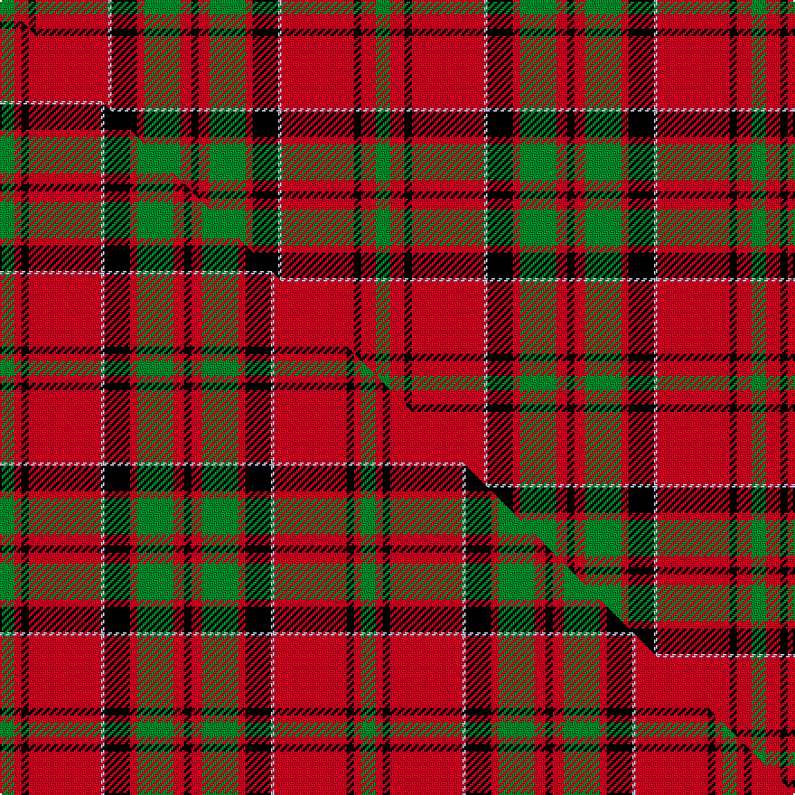

This page is one **sett** — a single exact thread-count. It belongs to the [tartan](/setts/g4r4k2r20lb1k7r2g10r3k2/)
(the same proportion at any scale), whose colour order is pattern [GRKRWKRGRK](/stripes/grkrwkrgrk/).

Part of the [MacKillop](/tartans/mackillop/) tartan — the named design grouping this sett with its other cloths.

Sourced from weddslist.  It is a [10 stripe tartan](/stripes/stripes10/).

Original link http://www.weddslist.com/cgi-bin/tartans/pg.pl?source=sts

## Provenance

Earliest known date: pre 2003 The MacKillops are a Sept of MacDonald of Keppoch, whose tartan this sett closely resembles.

2 attestations — the source records this cloth was collapsed from (oldest owns this page)

<ul>
<li>undated — MacKillop (weddslist, <a href="http://www.weddslist.com/cgi-bin/tartans/pg.pl?source=sts">record</a>) </li>
<li>undated — MacKillop Clan Tartan (house-of-tartan, <a href="http://www.house-of-tartan.scotland.net/house/TartanViewjs.asp?colr=Def&tnam=1001">record</a>) </li>
</ul>

## Thread count
G/8 R8 K4 R40 LB2 K14 R4 G20 R6 K/4

One full sett is **208 threads**.

## Palette
<table><thead><tr><th>Colour</th><th>Shade</th><th>OKLCh</th></tr></thead><tbody><tr><td>LB</td><td><code style="background-color:#B5BBDE;">#B5BBDE</code> <small style="color:#888">#B5BBDE</small></td><td><small style="color:#888">oklch(79.9% 0.050 277.6)</small></td></tr><tr><td>G</td><td><code style="background-color:#008B2A;">#008B2A</code> <small style="color:#888">#008B2A</small></td><td><small style="color:#888">oklch(55.4% 0.170 145.9)</small></td></tr><tr><td>K</td><td><code style="background-color:#000000;">#000000</code> <small style="color:#888">#000000</small></td><td><small style="color:#888">oklch(0.0% 0.000 0.0)</small></td></tr><tr><td>R</td><td><code style="background-color:#D60020;">#D60020</code> <small style="color:#888">#D60020</small></td><td><small style="color:#888">oklch(55.2% 0.224 25.5)</small></td></tr></tbody></table>

# Sample pattern

## Compared to the master

This cloth is one sett of its design; the master sett (the exemplar the design is anchored on) is below for comparison.

Its **ΔTartan distance** from the master is **0.09** — the same measure the nearest-tartans table ranks by (0 is identical; a re-scale of the same cloth is near 0, a recolour or a different proportion further).

<figure class="master-compare" style="margin:0">

this sett
master sett ★

<figcaption style="color:#888;font-size:smaller">One weave of this sett against the <a href="/setts/g4r2k2r20lb1k7r2g10r3k2/">master sett ★</a>, split on the diagonal: a shared proportion runs seamlessly across it with only the shades shifting; a different proportion breaks on it.</figcaption>
</figure>

## Nearest tartan variants

The nearest existing variants by ΔTartan distance, with this cloth at the top so the swatches line up against it.

ΔTartan

Threads

Variant

Sett

—

208

<a href="/variants/s10/g4r4k2r20lb1k7r2g10r3k2~x2/">MacKillop</a>

<a href="/ttd/edit/#slug=g4r2k2r20lb1k7r2g10r3k2~x2&amp;base=g4r4k2r20lb1k7r2g10r3k2~x2" title="compare in the TTD">0.09</a>

200

<a href="/variants/s10/g4r2k2r20lb1k7r2g10r3k2~x2/">MacKillop (Scottish Tartan Society)</a>

<a href="/ttd/edit/#slug=r5k1r2k2r16lb2r2k9r2g2r2g13r2k2r4~x2&amp;base=g4r4k2r20lb1k7r2g10r3k2~x2" title="compare in the TTD">1.92</a>

246

<a href="/variants/s15/r5k1r2k2r16lb2r2k9r2g2r2g13r2k2r4~x2/">Unidentified No 3 #2</a>

<a href="/ttd/edit/#slug=r5k2r2g42r5k36r70k2y2r7g2&amp;base=g4r4k2r20lb1k7r2g10r3k2~x2" title="compare in the TTD">2.19</a>

343

<a href="/variants/s11/r5k2r2g42r5k36r70k2y2r7g2/">MacPherson of Cluny</a>

<a href="/ttd/edit/#slug=k9r4k2r4k2r29k9r4lg14y2~x2&amp;base=g4r4k2r20lb1k7r2g10r3k2~x2" title="compare in the TTD">2.21</a>

294

<a href="/variants/s10/k9r4k2r4k2r29k9r4lg14y2~x2/">Hannay Dress (Dance)</a>

<a href="/ttd/edit/#slug=k5lb2r50k50r5w2r5g42r50k5w2&amp;base=g4r4k2r20lb1k7r2g10r3k2~x2" title="compare in the TTD">2.36</a>

429

<a href="/variants/s11/k5lb2r50k50r5w2r5g42r50k5w2/">MacDonald of Glenaladale - 1772 (Cla</a>

<a href="/ttd/edit/#slug=r25k7r3g13lb1k2~x4&amp;base=g4r4k2r20lb1k7r2g10r3k2~x2" title="compare in the TTD">2.40</a>

300

<a href="/variants/s6/r25k7r3g13lb1k2~x4/">MacPhail</a>

<a href="/ttd/edit/#slug=r25k7r3g13y1k2~x4&amp;base=g4r4k2r20lb1k7r2g10r3k2~x2" title="compare in the TTD">2.42</a>

300

<a href="/variants/s6/r25k7r3g13y1k2~x4/">MacPhail</a>

<a href="/ttd/edit/#slug=ly5k9ly2k7o10r4o35k4~x2~ly3607098-o2505058&amp;base=g4r4k2r20lb1k7r2g10r3k2~x2" title="compare in the TTD">2.44</a>

286

<a href="/variants/s8/ly5k9ly2k7o10r4o35k4~x2~ly3607098-o2505058/">Wilbers #2 (Personal)</a>

<a href="/ttd/edit/#slug=r47dg14k5y2k3dg7~x2&amp;base=g4r4k2r20lb1k7r2g10r3k2~x2" title="compare in the TTD">2.53</a>

204

<a href="/variants/s6/r47dg14k5y2k3dg7~x2/">Harbor Club (Corporate)</a>

<a href="/ttd/edit/#slug=r45k2r2k28w16r4k4lo2&amp;base=g4r4k2r20lb1k7r2g10r3k2~x2" title="compare in the TTD">2.54</a>

159

<a href="/variants/s8/r45k2r2k28w16r4k4lo2/">Barbecue Plaid</a>

## Neighbour map

Every grey dot is one of 13620 variants placed by the first two principal components of the ΔTartan feature space (42% of its variance). Red is this tartan; blue dots are its nearest — click one to open its page.

<svg viewBox="0 0 640 380" role="img" style="max-width:100%;height:auto;border:1px solid #e0e0e0;border-radius:4px;display:block" xmlns="http://www.w3.org/2000/svg"><image href="/nn/cloud.v1.png" width="640" height="380"/><a href="/variants/s10/g4r2k2r20lb1k7r2g10r3k2~x2/"><circle cx="250.7" cy="119.5" r="4" fill="#3465a4"><title>MacKillop (Scottish Tartan Society)</title></circle></a><a href="/variants/s15/r5k1r2k2r16lb2r2k9r2g2r2g13r2k2r4~x2/"><circle cx="239.1" cy="112.8" r="4" fill="#3465a4"><title>Unidentified No 3 #2</title></circle></a><a href="/variants/s11/r5k2r2g42r5k36r70k2y2r7g2/"><circle cx="280.0" cy="74.7" r="4" fill="#3465a4"><title>MacPherson of Cluny</title></circle></a><a href="/variants/s10/k9r4k2r4k2r29k9r4lg14y2~x2/"><circle cx="232.5" cy="128.0" r="4" fill="#3465a4"><title>Hannay Dress (Dance)</title></circle></a><a href="/variants/s11/k5lb2r50k50r5w2r5g42r50k5w2/"><circle cx="232.1" cy="89.1" r="4" fill="#3465a4"><title>MacDonald of Glenaladale - 1772 (Cla</title></circle></a><a href="/variants/s6/r25k7r3g13lb1k2~x4/"><circle cx="290.0" cy="134.3" r="4" fill="#3465a4"><title>MacPhail</title></circle></a><a href="/variants/s6/r25k7r3g13y1k2~x4/"><circle cx="291.8" cy="134.9" r="4" fill="#3465a4"><title>MacPhail</title></circle></a><a href="/variants/s8/ly5k9ly2k7o10r4o35k4~x2~ly3607098-o2505058/"><circle cx="284.1" cy="130.5" r="4" fill="#3465a4"><title>Wilbers #2 (Personal)</title></circle></a><a href="/variants/s6/r47dg14k5y2k3dg7~x2/"><circle cx="266.3" cy="107.1" r="4" fill="#3465a4"><title>Harbor Club (Corporate)</title></circle></a><a href="/variants/s8/r45k2r2k28w16r4k4lo2/"><circle cx="247.5" cy="107.7" r="4" fill="#3465a4"><title>Barbecue Plaid</title></circle></a><circle cx="257.9" cy="122.7" r="5" fill="#c00000"/><text x="320" y="376" text-anchor="middle" font-size="11" fill="#999">ground</text><text x="11" y="190" text-anchor="middle" font-size="11" fill="#999" transform="rotate(-90 11 190)">complexity</text></svg>

ID: /variants/s10/g4r4k2r20lb1k7r2g10r3k2~x2/
