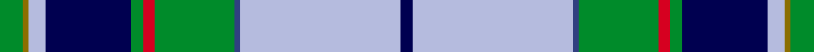

This is one **variant** — a specific cloth: this exact thread count and colourway, with its own
provenance below. It is one weaving of the [sett](/tartans/h/he/heriot-watt-university/) (the scale-free proportion — the
same cloth at any scale or shade), whose colour order is pattern [BWBGRGBWGG](/stripes/bwbgrgbwgg/).

Part of the [Heriot Watt University](/tartans/h/he/heriot-watt-university/) tartan — the named design grouping this sett with its other cloths.

Sourced from weddslist.  It is a [10 stripe tartan](/stripes/stripes10/).

Original link [http://www.weddslist.com/cgi-bin/tartans/pg.pl?source=sts](http://www.weddslist.com/cgi-bin/tartans/pg.pl?source=sts)

Dataset <small>— provenance for this record, inherited from the source manifest</small>

<dl class="dataset-prov">
<dt>source</dt><dd><a href="/sources/weddslist/">Weddslist</a></dd>
<dt>data captured from</dt><dd><a href="https://github.com/thetartan/tartan-database/blob/master/data/weddslist/data.csv">https://github.com/thetartan/tartan-database/blob/master/data/weddslist/data.csv</a></dd>
<dt>data date</dt><dd>2016-11-17 <small>(dataset default)</small></dd>
<dt>licence</dt><dd><a href="https://creativecommons.org/licenses/by-nc-nd/4.0/">CC BY-NC-ND 4.0</a></dd>
</dl>

Capture chain <small>— the hands this data passed through, oldest first; each capture carries its own licence</small>

<ol class="capture-chain">
<li><a href="https://www.weddslist.com/tartans/">Weddslist</a> <small>the living privately compiled reference</small></li>
<li><a href="https://github.com/thetartan/tartan-database">thetartan/tartan-database</a> <small>2016-2017</small> · <a href="https://creativecommons.org/licenses/by-nc-nd/4.0/">CC BY-NC-ND 4.0</a> <small>Levko Kravets's frozen compilation — the capture we vendored, and where its CC licence text came from</small></li>
<li>this dictionary <small>captured 2026-06-10 · commit 5bf86c7566</small> <small>each re-capture is a git commit to data/sources</small></li>
</ol>

## Thread count
G/8 Y2 LB6 DB30 G4 R4 G28 DBi2 LB56 DB/4

One full sett is **276 threads**.

## Palette
<table><thead><tr><th>Colour</th><th>Shade</th><th>OKLCh</th></tr></thead><tbody><tr><td>DB</td><td><code style="background-color:#304080;">#304080</code> <small style="color:#888">#304080</small></td><td><small style="color:#888">oklch(39.4% 0.109 270.2)</small></td></tr><tr><td>LB</td><td><code style="background-color:#B5BBDE;">#B5BBDE</code> <small style="color:#888">#B5BBDE</small></td><td><small style="color:#888">oklch(79.9% 0.050 277.6)</small></td></tr><tr><td>DB</td><td><code style="background-color:#000050;">#000050</code> <small style="color:#888">#000050</small></td><td><small style="color:#888">oklch(19.5% 0.135 264.1)</small></td></tr><tr><td>G</td><td><code style="background-color:#008B2A;">#008B2A</code> <small style="color:#888">#008B2A</small></td><td><small style="color:#888">oklch(55.4% 0.170 145.9)</small></td></tr><tr><td>R</td><td><code style="background-color:#D60020;">#D60020</code> <small style="color:#888">#D60020</small></td><td><small style="color:#888">oklch(55.2% 0.224 25.5)</small></td></tr><tr><td>Y</td><td><code style="background-color:#8B6E00;">#8B6E00</code> <small style="color:#888">#8B6E00</small></td><td><small style="color:#888">oklch(55.1% 0.113 90.4)</small></td></tr></tbody></table>

# Sample pattern

## Nearest tartan variants

The nearest existing variants by ΔTartan distance, with this cloth at the top so the swatches line up against it.

ΔTartan

Threads

Variant

Sett

—

276

<a href="/variants/s10/g4y1lb3db15g2r2g14dbi1lb28db2~x2~db1913264-dbi3911270/">Heriot Watt University</a>

<a href="/ttd/edit/#slug=g12db1dp4db30ly3w2ly3w2ly3w10r4~x2&amp;base=g4y1lb3db15g2r2g14dbi1lb28db2~x2~db1913264-dbi3911270" title="compare in the TTD">1.80</a>

264

<a href="/variants/s11/g12db1dp4db30ly3w2ly3w2ly3w10r4~x2/">Rosslyn Chapel</a>

<a href="/ttd/edit/#slug=db16w3db1y4g24r1g3r4g3r1lb8~x2&amp;base=g4y1lb3db15g2r2g14dbi1lb28db2~x2~db1913264-dbi3911270" title="compare in the TTD">2.38</a>

224

<a href="/variants/s11/db16w3db1y4g24r1g3r4g3r1lb8~x2/">Currie</a>

<a href="/ttd/edit/#slug=db2w20r1y2dg8g4dg2g2dg2db20w2~x2&amp;base=g4y1lb3db15g2r2g14dbi1lb28db2~x2~db1913264-dbi3911270" title="compare in the TTD">2.39</a>

252

<a href="/variants/s11/db2w20r1y2dg8g4dg2g2dg2db20w2~x2/">Nova Scotia Dress Canadian Tartan</a>

<a href="/ttd/edit/#slug=w50g5y2g5r2g20r2db5y2db40~x2&amp;base=g4y1lb3db15g2r2g14dbi1lb28db2~x2~db1913264-dbi3911270" title="compare in the TTD">2.44</a>

352

<a href="/variants/s10/w50g5y2g5r2g20r2db5y2db40~x2/">Cornell (Fashion)</a>

<a href="/ttd/edit/#slug=g12db1dp4db30b3w2b3w2b3w10r4~x2&amp;base=g4y1lb3db15g2r2g14dbi1lb28db2~x2~db1913264-dbi3911270" title="compare in the TTD">2.54</a>

264

<a href="/variants/s11/g12db1dp4db30b3w2b3w2b3w10r4~x2/">Rosslyn Chapel</a>

<a href="/ttd/edit/#slug=db2w20r1y2dg8b4dg2b2dg2db20w2~x2&amp;base=g4y1lb3db15g2r2g14dbi1lb28db2~x2~db1913264-dbi3911270" title="compare in the TTD">2.77</a>

252

<a href="/variants/s11/db2w20r1y2dg8b4dg2b2dg2db20w2~x2/">Nova Scotia, dress</a>

<a href="/ttd/edit/#slug=y2g20db8r3db2r2db16w1lb2~x2&amp;base=g4y1lb3db15g2r2g14dbi1lb28db2~x2~db1913264-dbi3911270" title="compare in the TTD">2.78</a>

216

<a href="/variants/s9/y2g20db8r3db2r2db16w1lb2~x2/">Scotland’s Golf Coast</a>

<a href="/ttd/edit/#slug=w10db2w1db35g10ly3g10r4~x2&amp;base=g4y1lb3db15g2r2g14dbi1lb28db2~x2~db1913264-dbi3911270" title="compare in the TTD">2.79</a>

272

<a href="/variants/s8/w10db2w1db35g10ly3g10r4~x2/">Sandelin (Personal)</a>

<a href="/ttd/edit/#slug=t2w20r1y2dg8g4dg2g2dg2t20w2~x2&amp;base=g4y1lb3db15g2r2g14dbi1lb28db2~x2~db1913264-dbi3911270" title="compare in the TTD">2.81</a>

252

<a href="/variants/s11/t2w20r1y2dg8g4dg2g2dg2t20w2~x2/">Nova Scotia Dress (District)</a>

<a href="/ttd/edit/#slug=db18w1db4w1lo4g1lo2g12r2g4~x2~w98-r4117030&amp;base=g4y1lb3db15g2r2g14dbi1lb28db2~x2~db1913264-dbi3911270" title="compare in the TTD">2.87</a>

152

<a href="/variants/s10/db18w1db4w1lo4g1lo2g12r2g4~x2~w98-r4117030/">Michigan State District Tartan</a>

## Neighbour map

Every grey dot is one of 13662 variants placed by the first two principal components of the ΔTartan feature space (42% of its variance). Red is this tartan; blue dots are its nearest — click one to open its page. The map is a flat projection of a many-dimensional space — [how to read it](/posts/neighbourhood-maps/).

<svg viewBox="0 0 640 380" role="img" style="max-width:100%;height:auto;border:1px solid #e0e0e0;border-radius:4px;display:block" xmlns="http://www.w3.org/2000/svg"><image href="/nn/cloud.v1.png" width="640" height="380"/><a href="/variants/s11/g12db1dp4db30ly3w2ly3w2ly3w10r4~x2/"><circle cx="180.4" cy="90.1" r="4" fill="#3465a4"><title>Rosslyn Chapel</title></circle></a><a href="/variants/s11/db16w3db1y4g24r1g3r4g3r1lb8~x2/"><circle cx="211.1" cy="113.6" r="4" fill="#3465a4"><title>Currie</title></circle></a><a href="/variants/s11/db2w20r1y2dg8g4dg2g2dg2db20w2~x2/"><circle cx="140.9" cy="108.4" r="4" fill="#3465a4"><title>Nova Scotia Dress Canadian Tartan</title></circle></a><a href="/variants/s10/w50g5y2g5r2g20r2db5y2db40~x2/"><circle cx="194.9" cy="111.5" r="4" fill="#3465a4"><title>Cornell (Fashion)</title></circle></a><a href="/variants/s11/g12db1dp4db30b3w2b3w2b3w10r4~x2/"><circle cx="187.6" cy="92.5" r="4" fill="#3465a4"><title>Rosslyn Chapel</title></circle></a><a href="/variants/s11/db2w20r1y2dg8b4dg2b2dg2db20w2~x2/"><circle cx="143.0" cy="107.9" r="4" fill="#3465a4"><title>Nova Scotia, dress</title></circle></a><a href="/variants/s9/y2g20db8r3db2r2db16w1lb2~x2/"><circle cx="245.5" cy="133.3" r="4" fill="#3465a4"><title>Scotland’s Golf Coast</title></circle></a><a href="/variants/s8/w10db2w1db35g10ly3g10r4~x2/"><circle cx="259.5" cy="118.1" r="4" fill="#3465a4"><title>Sandelin (Personal)</title></circle></a><a href="/variants/s11/t2w20r1y2dg8g4dg2g2dg2t20w2~x2/"><circle cx="158.0" cy="117.8" r="4" fill="#3465a4"><title>Nova Scotia Dress (District)</title></circle></a><a href="/variants/s10/db18w1db4w1lo4g1lo2g12r2g4~x2~w98-r4117030/"><circle cx="231.9" cy="139.4" r="4" fill="#3465a4"><title>Michigan State District Tartan</title></circle></a><circle cx="214.2" cy="102.9" r="5" fill="#c00000"/><text x="320" y="376" text-anchor="middle" font-size="11" fill="#999">ground</text><text x="11" y="190" text-anchor="middle" font-size="11" fill="#999" transform="rotate(-90 11 190)">complexity</text></svg>

ID: /variants/s10/g4y1lb3db15g2r2g14dbi1lb28db2~x2~db1913264-dbi3911270/
