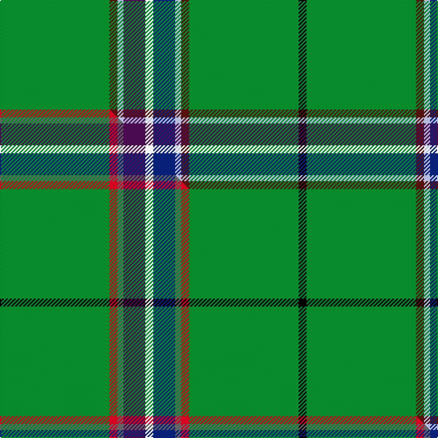

This page is one **sett** — a single exact thread-count. It belongs to the [tartan](/setts/g55dr4lb3dp11w4db11lb3dr4g55k4/)
(the same proportion at any scale), whose colour order is pattern [GBWBWBWBGK](/stripes/gbwbwbwbgk/).

Part of the [Rollings](/tartans/rollings/) tartan — the named design grouping this sett with its other cloths.

Sourced from house-of-tartan.  It is a [10 stripe tartan](/stripes/stripes10/).

Original link [http://www.house-of-tartan.scotland.net/house/TartanViewjs.asp?colr=Def&tnam=3244](http://www.house-of-tartan.scotland.net/house/TartanViewjs.asp?colr=Def&tnam=3244)

## Provenance

Earliest known date: August 2002 Colours reduced from seven to six. Originally the outside white stripes were gray.

Dataset <small>— provenance for this record, inherited from the source manifest</small>

<dl class="dataset-prov">
<dt>source</dt><dd><a href="/sources/house-of-tartan/">House of Tartan</a></dd>
<dt>data captured from</dt><dd><a href="https://github.com/thetartan/tartan-database/blob/master/data/house-of-tartan/data.csv">https://github.com/thetartan/tartan-database/blob/master/data/house-of-tartan/data.csv</a></dd>
<dt>data date</dt><dd>2017-01-10 <small>(dataset default)</small></dd>
<dt>licence</dt><dd><a href="https://creativecommons.org/licenses/by-nc-nd/4.0/">CC BY-NC-ND 4.0</a></dd>
</dl>

Capture chain <small>— the hands this data passed through, oldest first; each capture carries its own licence</small>

<ol class="capture-chain">
<li><a href="http://www.house-of-tartan.scotland.net/">House of Tartan</a> <small>the weaver/retailer's database — the site is now offline; the URL is kept as the ultimate source's identity</small></li>
<li><a href="https://github.com/thetartan/tartan-database">thetartan/tartan-database</a> <small>2016-2017</small> · <a href="https://creativecommons.org/licenses/by-nc-nd/4.0/">CC BY-NC-ND 4.0</a> <small>Levko Kravets's frozen compilation — the capture we vendored, and where its CC licence text came from</small></li>
<li>this dictionary <small>captured 2026-06-10 · commit 5bf86c7566</small> <small>each re-capture is a git commit to data/sources</small></li>
</ol>

## Thread count
G/110 DR8 LB6 DP22 W8 DB22 LB6 DR8 G110 K/8

One full sett is **498 threads**.

## Palette
<table><thead><tr><th>Colour</th><th>Shade</th><th>OKLCh</th></tr></thead><tbody><tr><td>DB</td><td><code style="background-color:#082077;">#082077</code> <small style="color:#888">#082077</small></td><td><small style="color:#888">oklch(30.0% 0.149 265.1)</small></td></tr><tr><td>DR</td><td><code style="background-color:#55120C;">#55120C</code> <small style="color:#888">#55120C</small></td><td><small style="color:#888">oklch(30.0% 0.099 29.3)</small></td></tr><tr><td>G</td><td><code style="background-color:#008B2A;">#008B2A</code> <small style="color:#888">#008B2A</small></td><td><small style="color:#888">oklch(55.4% 0.170 145.9)</small></td></tr><tr><td>K</td><td><code style="background-color:#000000;">#000000</code> <small style="color:#888">#000000</small></td><td><small style="color:#888">oklch(0.0% 0.000 0.0)</small></td></tr><tr><td>W</td><td><code style="background-color:#F7F7F7;">#F7F7F7</code> <small style="color:#888">#F7F7F7</small></td><td><small style="color:#888">oklch(97.6% 0.000 89.9)</small></td></tr><tr><td>LB</td><td><code style="background-color:#B5BBDE;">#B5BBDE</code> <small style="color:#888">#B5BBDE</small></td><td><small style="color:#888">oklch(79.9% 0.050 277.6)</small></td></tr><tr><td>DP</td><td><code style="background-color:#4B0B4F;">#4B0B4F</code> <small style="color:#888">#4B0B4F</small></td><td><small style="color:#888">oklch(30.1% 0.125 325.4)</small></td></tr></tbody></table>

# Sample pattern

## Compared to the master

This cloth is one sett of its design; the master sett (the exemplar the design is anchored on) is below for comparison.

Its **ΔTartan distance** from the master is **0.90** — the same measure the nearest-tartans table ranks by (0 is identical; a re-scale of the same cloth is near 0, a recolour or a different proportion further).

<figure class="master-compare" style="margin:0">

this sett
master sett ★

<figcaption style="color:#888;font-size:smaller">One weave of this sett against the <a href="/setts/g55r4n3dp11w4db11n3r4g55k4/">master sett ★</a>, split on the diagonal: a shared proportion runs seamlessly across it with only the shades shifting; a different proportion breaks on it.</figcaption>
</figure>

## Nearest tartan variants

The nearest existing variants by ΔTartan distance, with this cloth at the top so the swatches line up against it.

ΔTartan

Threads

Variant

Sett

—

498

<a href="/variants/s10/g55dr4lb3dp11w4db11lb3dr4g55k4~x2/">Rollings Personal Tartan</a>

<a href="/ttd/edit/#slug=g55r4n3dp11w4db11n3r4g55k4~x2&amp;base=g55dr4lb3dp11w4db11lb3dr4g55k4~x2" title="compare in the TTD">0.90</a>

498

<a href="/variants/s10/g55r4n3dp11w4db11n3r4g55k4~x2/">Rollings (Personal)</a>

<a href="/ttd/edit/#slug=db6w3r3g55k10r3~x4&amp;base=g55dr4lb3dp11w4db11lb3dr4g55k4~x2" title="compare in the TTD">2.14</a>

604

<a href="/variants/s6/db6w3r3g55k10r3~x4/">Military Medical Memorial (USA)</a>

<a href="/ttd/edit/#slug=k2w2db8k4g33r2g16w2~x2&amp;base=g55dr4lb3dp11w4db11lb3dr4g55k4~x2" title="compare in the TTD">2.19</a>

268

<a href="/variants/s8/k2w2db8k4g33r2g16w2~x2/">Sarros (Personal) XX</a>

<a href="/ttd/edit/#slug=dg40r5k2w2k2y3k2dg10r3k3~x2~dg1605139&amp;base=g55dr4lb3dp11w4db11lb3dr4g55k4~x2" title="compare in the TTD">2.30</a>

202

<a href="/variants/s10/dg40r5k2w2k2y3k2dg10r3k3~x2~dg1605139/">Arnold Palmer Corporate Tartan</a>

<a href="/ttd/edit/#slug=k2db4g27lo2g1dp4g1lb2g27db4k2~x2&amp;base=g55dr4lb3dp11w4db11lb3dr4g55k4~x2" title="compare in the TTD">2.57</a>

296

<a href="/variants/s11/k2db4g27lo2g1dp4g1lb2g27db4k2~x2/">Chapman-Smith, M &amp; L (Personal)</a>

<a href="/ttd/edit/#slug=g41r6g12db8k2y5w8~x2&amp;base=g55dr4lb3dp11w4db11lb3dr4g55k4~x2" title="compare in the TTD">2.72</a>

230

<a href="/variants/s7/g41r6g12db8k2y5w8~x2/">Decatur Presbyterian Church</a>

<a href="/ttd/edit/#slug=db6g48k4y4k4w4g20r10k4r6w5&amp;base=g55dr4lb3dp11w4db11lb3dr4g55k4~x2" title="compare in the TTD">3.08</a>

219

<a href="/variants/s11/db6g48k4y4k4w4g20r10k4r6w5/">Steel (Personal)</a>

<a href="/ttd/edit/#slug=y2k1r2dg6lg5k1db5k1dg42k1w2k1w2~x2~dg1605139-lg3005163&amp;base=g55dr4lb3dp11w4db11lb3dr4g55k4~x2" title="compare in the TTD">3.54</a>

276

<a href="/variants/s13/y2k1r2dg6lg5k1db5k1dg42k1w2k1w2~x2~dg1605139-lg3005163/">Hong Kong, University of</a>

<a href="/ttd/edit/#slug=g26t2k3ly1k1lr1k1g4dr2k1dr2lr1~x4&amp;base=g55dr4lb3dp11w4db11lb3dr4g55k4~x2" title="compare in the TTD">3.57</a>

252

<a href="/variants/s12/g26t2k3ly1k1lr1k1g4dr2k1dr2lr1~x4/">Princess Mary #2</a>

<a href="/ttd/edit/#slug=g49t6k12o4dr6g29ly4dy16g7o4~x2~o2503076-ly2705081&amp;base=g55dr4lb3dp11w4db11lb3dr4g55k4~x2" title="compare in the TTD">3.58</a>

442

<a href="/variants/s10/g49t6k12ly4dr6g29lyi4dy16g7ly4~x2~ly2503076-lyi2705081/">State Seal of New Hampshire (Fash.)</a>

## Neighbour map

Every grey dot is one of 13621 variants placed by the first two principal components of the ΔTartan feature space (42% of its variance). Red is this tartan; blue dots are its nearest — click one to open its page.

<svg viewBox="0 0 640 380" role="img" style="max-width:100%;height:auto;border:1px solid #e0e0e0;border-radius:4px;display:block" xmlns="http://www.w3.org/2000/svg"><image href="/nn/cloud.v1.png" width="640" height="380"/><a href="/variants/s10/g55r4n3dp11w4db11n3r4g55k4~x2/"><circle cx="358.3" cy="93.0" r="4" fill="#3465a4"><title>Rollings (Personal)</title></circle></a><a href="/variants/s6/db6w3r3g55k10r3~x4/"><circle cx="355.6" cy="121.8" r="4" fill="#3465a4"><title>Military Medical Memorial (USA)</title></circle></a><a href="/variants/s8/k2w2db8k4g33r2g16w2~x2/"><circle cx="358.1" cy="130.2" r="4" fill="#3465a4"><title>Sarros (Personal) XX</title></circle></a><a href="/variants/s10/dg40r5k2w2k2y3k2dg10r3k3~x2~dg1605139/"><circle cx="382.9" cy="93.4" r="4" fill="#3465a4"><title>Arnold Palmer Corporate Tartan</title></circle></a><a href="/variants/s11/k2db4g27lo2g1dp4g1lb2g27db4k2~x2/"><circle cx="391.5" cy="78.3" r="4" fill="#3465a4"><title>Chapman-Smith, M &amp; L (Personal)</title></circle></a><a href="/variants/s7/g41r6g12db8k2y5w8~x2/"><circle cx="312.5" cy="129.3" r="4" fill="#3465a4"><title>Decatur Presbyterian Church</title></circle></a><a href="/variants/s11/db6g48k4y4k4w4g20r10k4r6w5/"><circle cx="234.7" cy="109.8" r="4" fill="#3465a4"><title>Steel (Personal)</title></circle></a><a href="/variants/s13/y2k1r2dg6lg5k1db5k1dg42k1w2k1w2~x2~dg1605139-lg3005163/"><circle cx="350.2" cy="15.2" r="4" fill="#3465a4"><title>Hong Kong, University of</title></circle></a><a href="/variants/s12/g26t2k3ly1k1lr1k1g4dr2k1dr2lr1~x4/"><circle cx="341.2" cy="56.6" r="4" fill="#3465a4"><title>Princess Mary #2</title></circle></a><a href="/variants/s10/g49t6k12ly4dr6g29lyi4dy16g7ly4~x2~ly2503076-lyi2705081/"><circle cx="269.9" cy="131.1" r="4" fill="#3465a4"><title>State Seal of New Hampshire (Fash.)</title></circle></a><circle cx="352.5" cy="92.1" r="5" fill="#c00000"/><text x="320" y="376" text-anchor="middle" font-size="11" fill="#999">ground</text><text x="11" y="190" text-anchor="middle" font-size="11" fill="#999" transform="rotate(-90 11 190)">complexity</text></svg>

ID: /variants/s10/g55dr4lb3dp11w4db11lb3dr4g55k4~x2/
