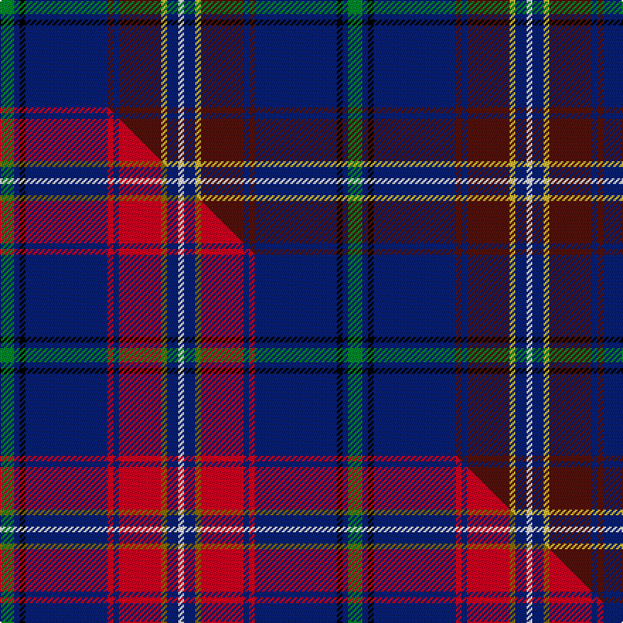

This page is one **sett** — a single exact thread-count. It belongs to the [tartan](/setts/g5db2k2db29dr2db2dr15ly2db4w2/)
(the same proportion at any scale), whose colour order is pattern [GBKBBBBYBW](/stripes/gbkbbbbybw/).

Part of the [Bro-Naoned](/tartans/bro-naoned/) tartan — the named design grouping this sett with its other cloths.

Sourced from tartans-authority.  It is a [10 stripe tartan](/stripes/stripes10/).

Original link http://www.tartansauthority.com/tartan-ferret/display/6648/

## Register references

External register numbers recorded for this tartan.

- Scottish Tartans Authority (ITI): 6648

## Thread count
G/10 DB4 K4 DB58 DR4 DB4 DR30 LY4 DB8 W/4

One full sett is **246 threads**.

## Palette
<table><thead><tr><th>Colour</th><th>Shade</th><th>OKLCh</th></tr></thead><tbody><tr><td>G</td><td><code style="background-color:#008B2A;">#008B2A</code> <small style="color:#888">#008B2A</small></td><td><small style="color:#888">oklch(55.4% 0.170 145.9)</small></td></tr><tr><td>K</td><td><code style="background-color:#000000;">#000000</code> <small style="color:#888">#000000</small></td><td><small style="color:#888">oklch(0.0% 0.000 0.0)</small></td></tr><tr><td>DB</td><td><code style="background-color:#082077;">#082077</code> <small style="color:#888">#082077</small></td><td><small style="color:#888">oklch(30.0% 0.149 265.1)</small></td></tr><tr><td>DR</td><td><code style="background-color:#55120C;">#55120C</code> <small style="color:#888">#55120C</small></td><td><small style="color:#888">oklch(30.0% 0.099 29.3)</small></td></tr><tr><td>W</td><td><code style="background-color:#F7F7F7;">#F7F7F7</code> <small style="color:#888">#F7F7F7</small></td><td><small style="color:#888">oklch(97.6% 0.000 89.9)</small></td></tr><tr><td>LY</td><td><code style="background-color:#DCBC32;">#DCBC32</code> <small style="color:#888">#DCBC32</small></td><td><small style="color:#888">oklch(80.0% 0.150 95.2)</small></td></tr></tbody></table>

# Sample pattern

## Compared to the master

This cloth is one sett of its design; the master sett (the exemplar the design is anchored on) is below for comparison.

Its **ΔTartan distance** from the master is **0.14** — the same measure the nearest-tartans table ranks by (0 is identical; a re-scale of the same cloth is near 0, a recolour or a different proportion further).

<figure class="master-compare" style="margin:0">

this sett
master sett ★

<figcaption style="color:#888;font-size:smaller">One weave of this sett against the <a href="/setts/g5db2k2db29r2db2r15y2db4w2/">master sett ★</a>, split on the diagonal: a shared proportion runs seamlessly across it with only the shades shifting; a different proportion breaks on it.</figcaption>
</figure>

## Nearest tartan variants

The nearest existing variants by ΔTartan distance, with this cloth at the top so the swatches line up against it.

ΔTartan

Threads

Variant

Sett

—

246

<a href="/variants/s10/g5db2k2db29dr2db2dr15ly2db4w2~x2/">Bro-Naoned (Corporate)</a>

<a href="/ttd/edit/#slug=g5db2k2db29r2db2r15y2db4w2~x2&amp;base=g5db2k2db29dr2db2dr15ly2db4w2~x2" title="compare in the TTD">0.14</a>

246

<a href="/variants/s10/g5db2k2db29r2db2r15y2db4w2~x2/">Bro-Naoned</a>

<a href="/ttd/edit/#slug=db92k14db18t5db5t5db5g32dp16k5dp7y8~db1406275-dp1607327&amp;base=g5db2k2db29dr2db2dr15ly2db4w2~x2" title="compare in the TTD">1.71</a>

324

<a href="/variants/s12/db92k14db18t5db5t5db5g32dp16k5dp7y8~db1406275-dp1607327/">Bavidge (Personal)</a>

<a href="/ttd/edit/#slug=db42dp4db16dg10k2r6k2dg10k3w4~x2&amp;base=g5db2k2db29dr2db2dr15ly2db4w2~x2" title="compare in the TTD">1.99</a>

304

<a href="/variants/s10/db42dp4db16dg10k2r6k2dg10k3w4~x2/">Mount Dora</a>

<a href="/ttd/edit/#slug=db92k14db18t5db5t5db5g32dp16k5dp7y8&amp;base=g5db2k2db29dr2db2dr15ly2db4w2~x2" title="compare in the TTD">2.02</a>

324

<a href="/variants/s12/db92k14db18t5db5t5db5g32dp16k5dp7y8/">Bavidge (Personal)</a>

<a href="/ttd/edit/#slug=db42n2db2n4y4ly2y6k9y2k2r2~x2~y2204115-ly3206085&amp;base=g5db2k2db29dr2db2dr15ly2db4w2~x2" title="compare in the TTD">2.13</a>

220

<a href="/variants/s11/db42n2db2n4y4ly2y6k9y2k2r2~x2~y2204115-ly3206085/">Dama Weekend</a>

<a href="/ttd/edit/#slug=db6dbi4k37g6dbi80n4k4ly4~db1106275-dbi1406275&amp;base=g5db2k2db29dr2db2dr15ly2db4w2~x2" title="compare in the TTD">2.20</a>

280

<a href="/variants/s8/db6dbi4k37g6dbi80n4k4ly4~db1106275-dbi1406275/">Law Enforcement Officers' Memorial</a>

<a href="/ttd/edit/#slug=dp8g8w3g8dp8w3db40r3k3db40w3~x2&amp;base=g5db2k2db29dr2db2dr15ly2db4w2~x2" title="compare in the TTD">2.35</a>

486

<a href="/variants/s11/dp8g8w3g8dp8w3db40r3k3db40w3~x2/">World Peace</a>

<a href="/ttd/edit/#slug=db42n2db2n4g4ly2g6k9g2k2r2~x2&amp;base=g5db2k2db29dr2db2dr15ly2db4w2~x2" title="compare in the TTD">2.49</a>

220

<a href="/variants/s11/db42n2db2n4g4ly2g6k9g2k2r2~x2/">Dama Weekend (Fashion)</a>

<a href="/ttd/edit/#slug=db32w3db3y3k3g3k3r10db6k3db3g3~x2&amp;base=g5db2k2db29dr2db2dr15ly2db4w2~x2" title="compare in the TTD">2.62</a>

230

<a href="/variants/s12/db32w3db3y3k3g3k3r10db6k3db3g3~x2/">Me to You</a>

<a href="/ttd/edit/#slug=k1ri1db14lo1db1r1db1r2db1dg6db1dg1db1~x4~ri2109032-r1807033&amp;base=g5db2k2db29dr2db2dr15ly2db4w2~x2" title="compare in the TTD">2.66</a>

248

<a href="/variants/s13/k1ri1db14lo1db1r1db1r2db1dg6db1dg1db1~x4~ri2109032-r1807033/">Merchant Company, The</a>

## Neighbour map

Every grey dot is one of 13620 variants placed by the first two principal components of the ΔTartan feature space (42% of its variance). Red is this tartan; blue dots are its nearest — click one to open its page.

<svg viewBox="0 0 640 380" role="img" style="max-width:100%;height:auto;border:1px solid #e0e0e0;border-radius:4px;display:block" xmlns="http://www.w3.org/2000/svg"><image href="/nn/cloud.v1.png" width="640" height="380"/><a href="/variants/s10/g5db2k2db29r2db2r15y2db4w2~x2/"><circle cx="269.7" cy="101.2" r="4" fill="#3465a4"><title>Bro-Naoned</title></circle></a><a href="/variants/s12/db92k14db18t5db5t5db5g32dp16k5dp7y8~db1406275-dp1607327/"><circle cx="295.1" cy="98.5" r="4" fill="#3465a4"><title>Bavidge (Personal)</title></circle></a><a href="/variants/s10/db42dp4db16dg10k2r6k2dg10k3w4~x2/"><circle cx="295.3" cy="103.1" r="4" fill="#3465a4"><title>Mount Dora</title></circle></a><a href="/variants/s12/db92k14db18t5db5t5db5g32dp16k5dp7y8/"><circle cx="292.0" cy="99.8" r="4" fill="#3465a4"><title>Bavidge (Personal)</title></circle></a><a href="/variants/s11/db42n2db2n4y4ly2y6k9y2k2r2~x2~y2204115-ly3206085/"><circle cx="289.8" cy="73.2" r="4" fill="#3465a4"><title>Dama Weekend</title></circle></a><a href="/variants/s8/db6dbi4k37g6dbi80n4k4ly4~db1106275-dbi1406275/"><circle cx="309.2" cy="96.5" r="4" fill="#3465a4"><title>Law Enforcement Officers' Memorial</title></circle></a><a href="/variants/s11/dp8g8w3g8dp8w3db40r3k3db40w3~x2/"><circle cx="286.8" cy="108.9" r="4" fill="#3465a4"><title>World Peace</title></circle></a><a href="/variants/s11/db42n2db2n4g4ly2g6k9g2k2r2~x2/"><circle cx="283.0" cy="73.1" r="4" fill="#3465a4"><title>Dama Weekend (Fashion)</title></circle></a><a href="/variants/s12/db32w3db3y3k3g3k3r10db6k3db3g3~x2/"><circle cx="241.0" cy="101.8" r="4" fill="#3465a4"><title>Me to You</title></circle></a><a href="/variants/s13/k1ri1db14lo1db1r1db1r2db1dg6db1dg1db1~x4~ri2109032-r1807033/"><circle cx="327.6" cy="101.4" r="4" fill="#3465a4"><title>Merchant Company, The</title></circle></a><circle cx="289.8" cy="111.7" r="5" fill="#c00000"/><text x="320" y="376" text-anchor="middle" font-size="11" fill="#999">ground</text><text x="11" y="190" text-anchor="middle" font-size="11" fill="#999" transform="rotate(-90 11 190)">complexity</text></svg>

ID: /variants/s10/g5db2k2db29dr2db2dr15ly2db4w2~x2/
