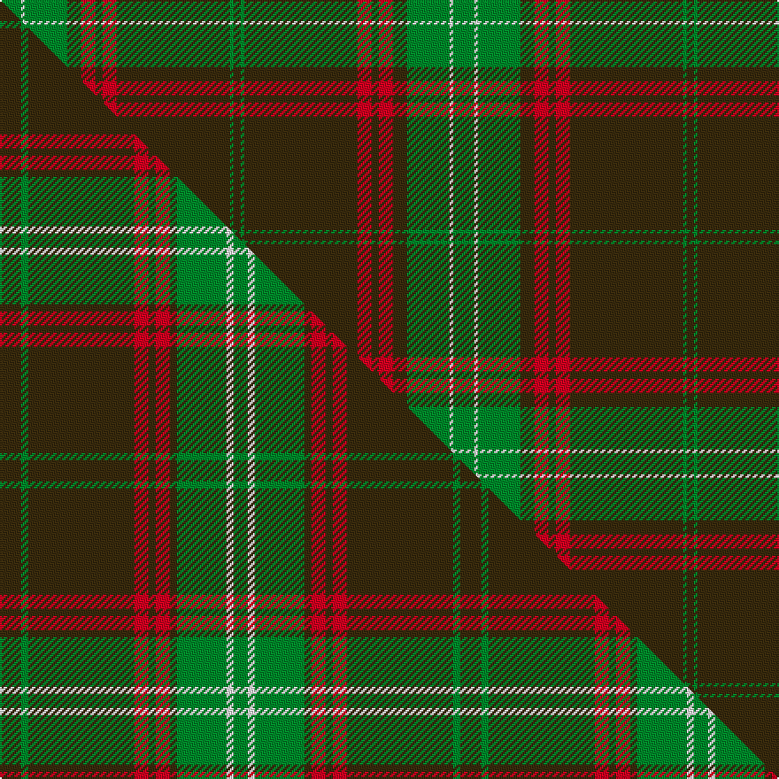

This is one **variant** — a specific cloth: this exact thread count and colourway, with its own
provenance below. It is one weaving of the [sett](/tartans/s/se/seton-hunting/) (the scale-free proportion — the
same cloth at any scale or shade), whose colour order is pattern [GGGRGRGGWG](/stripes/gggrgrggwg/).

Part of the [Seton Hunting](/tartans/s/se/seton-hunting/) tartan — the named design grouping this sett with its other cloths.

Sourced from house-of-tartan.  It is a [10 stripe tartan](/stripes/stripes10/).

Original link [http://www.house-of-tartan.scotland.net/house/TartanViewjs.asp?colr=Def&tnam=938](http://www.house-of-tartan.scotland.net/house/TartanViewjs.asp?colr=Def&tnam=938)

## Provenance

Earliest known date: pre 1930 Based on Vestiarium Scoticum - D.C.S. James Cant was a noted authority on tartans around 1930.

Dataset <small>— provenance for this record, inherited from the source manifest</small>

<dl class="dataset-prov">
<dt>source</dt><dd><a href="/sources/house-of-tartan/">House of Tartan</a></dd>
<dt>data captured from</dt><dd><a href="https://github.com/thetartan/tartan-database/blob/master/data/house-of-tartan/data.csv">https://github.com/thetartan/tartan-database/blob/master/data/house-of-tartan/data.csv</a></dd>
<dt>data date</dt><dd>pre 1930 <small>(this record)</small></dd>
<dt>licence</dt><dd><a href="https://creativecommons.org/licenses/by-nc-nd/4.0/">CC BY-NC-ND 4.0</a></dd>
</dl>

Capture chain <small>— the hands this data passed through, oldest first; each capture carries its own licence</small>

<ol class="capture-chain">
<li><a href="http://www.house-of-tartan.scotland.net/">House of Tartan</a> <small>the weaver/retailer's database — the site is now offline; the URL is kept as the ultimate source's identity</small></li>
<li><a href="https://github.com/thetartan/tartan-database">thetartan/tartan-database</a> <small>2016-2017</small> · <a href="https://creativecommons.org/licenses/by-nc-nd/4.0/">CC BY-NC-ND 4.0</a> <small>Levko Kravets's frozen compilation — the capture we vendored, and where its CC licence text came from</small></li>
<li>this dictionary <small>captured 2026-06-10 · commit 5bf86c7566</small> <small>each re-capture is a git commit to data/sources</small></li>
</ol>

## Thread count
G/12 W2 G24 DY8 R8 DY4 R8 DY64 G2 DY/4

One full sett is **256 threads**.

## Palette
<table><thead><tr><th>Colour</th><th>Shade</th><th>OKLCh</th></tr></thead><tbody><tr><td>G</td><td><code style="background-color:#008B2A;">#008B2A</code> <small style="color:#888">#008B2A</small></td><td><small style="color:#888">oklch(55.4% 0.170 145.9)</small></td></tr><tr><td>W</td><td><code style="background-color:#F7F7F7;">#F7F7F7</code> <small style="color:#888">#F7F7F7</small></td><td><small style="color:#888">oklch(97.6% 0.000 89.9)</small></td></tr><tr><td>R</td><td><code style="background-color:#D60020;">#D60020</code> <small style="color:#888">#D60020</small></td><td><small style="color:#888">oklch(55.2% 0.224 25.5)</small></td></tr><tr><td>DY</td><td><code style="background-color:#3A2B0D;">#3A2B0D</code> <small style="color:#888">#3A2B0D</small></td><td><small style="color:#888">oklch(30.0% 0.049 82.0)</small></td></tr></tbody></table>

# Sample pattern

## Compared to the master

This cloth is one sett of its design; the master sett (the exemplar the design is anchored on) is below for comparison.

Its **ΔTartan distance** from the master is **0.52** — the same measure the nearest-tartans table ranks by (0 is identical; a re-scale of the same cloth is near 0, a recolour or a different proportion further).

<figure class="master-compare" style="margin:0">

this sett
master sett ★

<figcaption style="color:#888;font-size:smaller">One weave of this sett against the <a href="/setts/dy3g1dy15r2dy1r2dy1g7w1g2/">master sett ★</a>, split on the diagonal: a shared proportion runs seamlessly across it with only the shades shifting; a different proportion breaks on it.</figcaption>
</figure>

## Nearest tartan variants

The nearest existing variants by ΔTartan distance, with this cloth at the top so the swatches line up against it.

ΔTartan

Threads

Variant

Sett

—

256

<a href="/variants/s10/g6w1g12dy4r4dy2r4dy32g1dy2~x2/">Seton Hunting Family Tartan</a>

<a href="/ttd/edit/#slug=dy3g1dy15r2dy1r2dy1g7w1g2~x4&amp;base=g6w1g12dy4r4dy2r4dy32g1dy2~x2" title="compare in the TTD">0.52</a>

260

<a href="/variants/s10/dy3g1dy15r2dy1r2dy1g7w1g2~x4/">Seton Htg (Clan)</a>

<a href="/ttd/edit/#slug=dy3g1dy15r2dy1r2dy1g7w1g2~x4~g2203152&amp;base=g6w1g12dy4r4dy2r4dy32g1dy2~x2" title="compare in the TTD">0.55</a>

260

<a href="/variants/s10/dy3g1dy15r2dy1r2dy1g7w1g2~x4~g2203152/">Seton Hunting</a>

<a href="/ttd/edit/#slug=y2r12g2r1g32r1g2r12w2&amp;base=g6w1g12dy4r4dy2r4dy32g1dy2~x2" title="compare in the TTD">2.92</a>

128

<a href="/variants/s9/y2r12g2r1g32r1g2r12w2/">MacFie</a>

<a href="/ttd/edit/#slug=g8dg1g1dg42w2o40g2dg2o3~x2&amp;base=g6w1g12dy4r4dy2r4dy32g1dy2~x2" title="compare in the TTD">3.01</a>

382

<a href="/variants/s9/g8dg1g1dg42w2o40g2dg2o3~x2/">MacDonald of Kingsburgh -1746 (Clan)</a>

<a href="/ttd/edit/#slug=dy6w1dy24db6g2db1g2db1g12r1~x2&amp;base=g6w1g12dy4r4dy2r4dy32g1dy2~x2" title="compare in the TTD">3.11</a>

210

<a href="/variants/s10/dy6w1dy24db6g2db1g2db1g12r1~x2/">Chisholm Hunting Clan Tartan</a>

<a href="/ttd/edit/#slug=dg40r8dg26g5dg10ly3db4ly2db1ly16~x2&amp;base=g6w1g12dy4r4dy2r4dy32g1dy2~x2" title="compare in the TTD">3.20</a>

348

<a href="/variants/s10/dg40r8dg26g5dg10ly3db4ly2db1ly16~x2/">Lodge Isandlwana</a>

<a href="/ttd/edit/#slug=y40dt10o2dt2w2dt3g8y6dt2y4w2~x2&amp;base=g6w1g12dy4r4dy2r4dy32g1dy2~x2" title="compare in the TTD">3.22</a>

240

<a href="/variants/s11/y40dt10o2dt2w2dt3g8y6dt2y4w2~x2/">Cavalier, Blue</a>

<a href="/ttd/edit/#slug=o6w1o24db6g2db1g2db1g12r1~x2&amp;base=g6w1g12dy4r4dy2r4dy32g1dy2~x2" title="compare in the TTD">3.24</a>

210

<a href="/variants/s10/o6w1o24db6g2db1g2db1g12r1~x2/">Chisholm hunting</a>

<a href="/ttd/edit/#slug=o40dt10y2dt2w2dt3g8o6dt2o4w2~x2&amp;base=g6w1g12dy4r4dy2r4dy32g1dy2~x2" title="compare in the TTD">3.36</a>

240

<a href="/variants/s11/o40dt10y2dt2w2dt3g8o6dt2o4w2~x2/">Cavalier, Brown</a>

<a href="/ttd/edit/#slug=r7ri2db2r2g32r6db12r41g2r5ri2g5~x2~r1707016-ri2208029&amp;base=g6w1g12dy4r4dy2r4dy32g1dy2~x2" title="compare in the TTD">3.46</a>

448

<a href="/variants/s12/r7ri2db2r2g32r6db12r41g2r5ri2g5~x2~r1707016-ri2208029/">MacDougall #5</a>

## Neighbour map

Every grey dot is one of 13656 variants placed by the first two principal components of the ΔTartan feature space (42% of its variance). Red is this tartan; blue dots are its nearest — click one to open its page. The map is a flat projection of a many-dimensional space — [how to read it](/posts/neighbourhood-maps/).

<svg viewBox="0 0 640 380" role="img" style="max-width:100%;height:auto;border:1px solid #e0e0e0;border-radius:4px;display:block" xmlns="http://www.w3.org/2000/svg"><image href="/nn/cloud.v1.png" width="640" height="380"/><a href="/variants/s10/dy3g1dy15r2dy1r2dy1g7w1g2~x4/"><circle cx="351.4" cy="157.5" r="4" fill="#3465a4"><title>Seton Htg (Clan)</title></circle></a><a href="/variants/s10/dy3g1dy15r2dy1r2dy1g7w1g2~x4~g2203152/"><circle cx="348.6" cy="135.9" r="4" fill="#3465a4"><title>Seton Hunting</title></circle></a><a href="/variants/s9/y2r12g2r1g32r1g2r12w2/"><circle cx="392.1" cy="128.8" r="4" fill="#3465a4"><title>MacFie</title></circle></a><a href="/variants/s9/g8dg1g1dg42w2o40g2dg2o3~x2/"><circle cx="372.0" cy="124.2" r="4" fill="#3465a4"><title>MacDonald of Kingsburgh -1746 (Clan)</title></circle></a><a href="/variants/s10/dy6w1dy24db6g2db1g2db1g12r1~x2/"><circle cx="343.1" cy="132.8" r="4" fill="#3465a4"><title>Chisholm Hunting Clan Tartan</title></circle></a><a href="/variants/s10/dg40r8dg26g5dg10ly3db4ly2db1ly16~x2/"><circle cx="375.7" cy="110.8" r="4" fill="#3465a4"><title>Lodge Isandlwana</title></circle></a><a href="/variants/s11/y40dt10o2dt2w2dt3g8y6dt2y4w2~x2/"><circle cx="406.6" cy="131.9" r="4" fill="#3465a4"><title>Cavalier, Blue</title></circle></a><a href="/variants/s10/o6w1o24db6g2db1g2db1g12r1~x2/"><circle cx="353.0" cy="132.4" r="4" fill="#3465a4"><title>Chisholm hunting</title></circle></a><a href="/variants/s11/o40dt10y2dt2w2dt3g8o6dt2o4w2~x2/"><circle cx="395.6" cy="122.0" r="4" fill="#3465a4"><title>Cavalier, Brown</title></circle></a><a href="/variants/s12/r7ri2db2r2g32r6db12r41g2r5ri2g5~x2~r1707016-ri2208029/"><circle cx="344.7" cy="133.8" r="4" fill="#3465a4"><title>MacDougall #5</title></circle></a><circle cx="400.6" cy="126.0" r="5" fill="#c00000"/><text x="320" y="376" text-anchor="middle" font-size="11" fill="#999">ground</text><text x="11" y="190" text-anchor="middle" font-size="11" fill="#999" transform="rotate(-90 11 190)">complexity</text></svg>

ID: /variants/s10/g6w1g12dy4r4dy2r4dy32g1dy2~x2/
