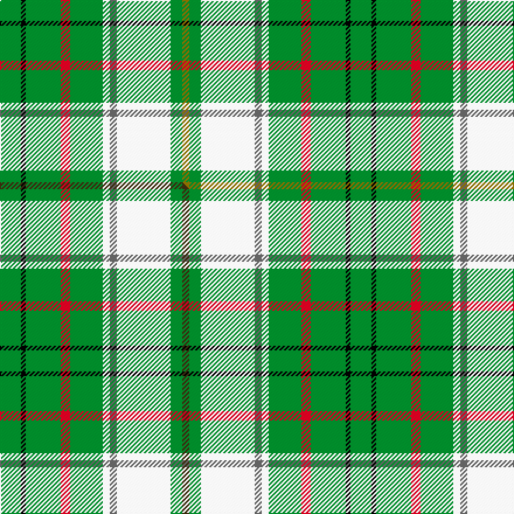

This is one **variant** — a specific cloth: this exact thread count and colourway, with its own
provenance below. It is one weaving of the [sett](/setts/g9k2g15r4g14w3n3w23g5y3/) (the scale-free proportion — the
same cloth at any scale or shade), whose colour order is pattern [GGWBWGRGKG](/stripes/ggwbwgrgkg/).

Part of the [Taylor Dress](/tartans/t/ta/taylor-dress/) tartan — the named design grouping this sett with its other cloths.

Sourced from weddslist.  It is a [10 stripe tartan](/stripes/stripes10/).

Original link [http://www.weddslist.com/cgi-bin/tartans/pg.pl?source=sts](http://www.weddslist.com/cgi-bin/tartans/pg.pl?source=sts)

Dataset <small>— provenance for this record, inherited from the source manifest</small>

<dl class="dataset-prov">
<dt>source</dt><dd><a href="/sources/weddslist/">Weddslist</a></dd>
<dt>data captured from</dt><dd><a href="https://github.com/thetartan/tartan-database/blob/master/data/weddslist/data.csv">https://github.com/thetartan/tartan-database/blob/master/data/weddslist/data.csv</a></dd>
<dt>data date</dt><dd>2016-11-17 <small>(dataset default)</small></dd>
<dt>licence</dt><dd><a href="https://creativecommons.org/licenses/by-nc-nd/4.0/">CC BY-NC-ND 4.0</a></dd>
</dl>

Capture chain <small>— the hands this data passed through, oldest first; each capture carries its own licence</small>

<ol class="capture-chain">
<li><a href="https://www.weddslist.com/tartans/">Weddslist</a> <small>the living privately compiled reference</small></li>
<li><a href="https://github.com/thetartan/tartan-database">thetartan/tartan-database</a> <small>2016-2017</small> · <a href="https://creativecommons.org/licenses/by-nc-nd/4.0/">CC BY-NC-ND 4.0</a> <small>Levko Kravets's frozen compilation — the capture we vendored, and where its CC licence text came from</small></li>
<li>this dictionary <small>captured 2026-06-10 · commit 5bf86c7566</small> <small>each re-capture is a git commit to data/sources</small></li>
</ol>

## Thread count
G/18 K4 G30 R8 G28 W6 N6 W46 G10 Y/6

One full sett is **300 threads**.

## Palette
<table><thead><tr><th>Colour</th><th>Shade</th><th>OKLCh</th></tr></thead><tbody><tr><td>G</td><td><code style="background-color:#008B2A;">#008B2A</code> <small style="color:#888">#008B2A</small></td><td><small style="color:#888">oklch(55.4% 0.170 145.9)</small></td></tr><tr><td>K</td><td><code style="background-color:#000000;">#000000</code> <small style="color:#888">#000000</small></td><td><small style="color:#888">oklch(0.0% 0.000 0.0)</small></td></tr><tr><td>W</td><td><code style="background-color:#F7F7F7;">#F7F7F7</code> <small style="color:#888">#F7F7F7</small></td><td><small style="color:#888">oklch(97.6% 0.000 89.9)</small></td></tr><tr><td>N</td><td><code style="background-color:#636363;">#636363</code> <small style="color:#888">#636363</small></td><td><small style="color:#888">oklch(50.0% 0.000 89.9)</small></td></tr><tr><td>R</td><td><code style="background-color:#D60020;">#D60020</code> <small style="color:#888">#D60020</small></td><td><small style="color:#888">oklch(55.2% 0.224 25.5)</small></td></tr><tr><td>Y</td><td><code style="background-color:#8B6E00;">#8B6E00</code> <small style="color:#888">#8B6E00</small></td><td><small style="color:#888">oklch(55.1% 0.113 90.4)</small></td></tr></tbody></table>

# Sample pattern

## Compared to the master

This cloth is one sett of its design; the master sett (the exemplar the design is anchored on) is below for comparison.

Its **ΔTartan distance** from the master is **0.02** — the same measure the nearest-tartans table ranks by (0 is identical; a re-scale of the same cloth is near 0, a recolour or a different proportion further).

<figure class="master-compare" style="margin:0">

this sett
master sett ★

<figcaption style="color:#888;font-size:smaller">One weave of this sett against the <a href="/setts/g9k2g15r4g14w3n3w23g5dy3/">master sett ★</a>, split on the diagonal: a shared proportion runs seamlessly across it with only the shades shifting; a different proportion breaks on it.</figcaption>
</figure>

## Nearest tartan variants

The nearest existing variants by ΔTartan distance, with this cloth at the top so the swatches line up against it.

ΔTartan

Threads

Variant

Sett

—

300

<a href="/variants/s10/g9k2g15r4g14w3n3w23g5y3~x2/">Taylor, dress</a>

<a href="/ttd/edit/#slug=g9k2g15r4g14w3n3w23g5dy3~x2&amp;base=g9k2g15r4g14w3n3w23g5y3~x2" title="compare in the TTD">0.02</a>

300

<a href="/variants/s10/g9k2g15r4g14w3n3w23g5dy3~x2/">Taylor Dress</a>

<a href="/ttd/edit/#slug=g9k2b4g14w3dg3w23g5y3~x2&amp;base=g9k2g15r4g14w3n3w23g5y3~x2" title="compare in the TTD">2.38</a>

240

<a href="/variants/s9/g9k2b4g14w3dg3w23g5y3~x2/">Taylor, dress</a>

<a href="/ttd/edit/#slug=g11lr2g12k3lb15dr3lb15g19lr2lb3k2lb3ly3~x2&amp;base=g9k2g15r4g14w3n3w23g5y3~x2" title="compare in the TTD">2.54</a>

344

<a href="/variants/s13/g11lr2g12k3lb15dr3lb15g19lr2lb3k2lb3ly3~x2/">Greylock (Corporate)</a>

<a href="/ttd/edit/#slug=g9k2r4g14w3lp3w23g5y3~x2&amp;base=g9k2g15r4g14w3n3w23g5y3~x2" title="compare in the TTD">2.55</a>

240

<a href="/variants/s9/g9k2r4g14w3lp3w23g5y3~x2/">Taylor Dress Family Tartan</a>

<a href="/ttd/edit/#slug=g11lr2g12k3lb15dr3lb15g19lr2lb3k2lb3dy3~x2&amp;base=g9k2g15r4g14w3n3w23g5y3~x2" title="compare in the TTD">2.65</a>

344

<a href="/variants/s13/g11lr2g12k3lb15dr3lb15g19lr2lb3k2lb3dy3~x2/">Greylock</a>

<a href="/ttd/edit/#slug=r1w4n2w4lg7k1lg1k1lg7y1lg9r1lg1~x4&amp;base=g9k2g15r4g14w3n3w23g5y3~x2" title="compare in the TTD">2.79</a>

312

<a href="/variants/s13/r1w4n2w4lg7k1lg1k1lg7y1lg9r1lg1~x4/">Titanic (Belfast)</a>

<a href="/ttd/edit/#slug=k3r1ly1lb11g13lb5r1ly1~x4~r2109032-ly3307090-g2408144&amp;base=g9k2g15r4g14w3n3w23g5y3~x2" title="compare in the TTD">3.31</a>

272

<a href="/variants/s8/k3r1ly1lb11g13lb5r1ly1~x4~r2109032-ly3307090-g2408144/">Snodgrass</a>

<a href="/ttd/edit/#slug=db3k1g13y1r1w1r6g3r1g3w1~x2&amp;base=g9k2g15r4g14w3n3w23g5y3~x2" title="compare in the TTD">3.34</a>

128

<a href="/variants/s11/db3k1g13y1r1w1r6g3r1g3w1~x2/">Canadian Caledonian Hunting Canadian Tartan</a>

<a href="/ttd/edit/#slug=g9lb9k1lb1w1lb1k1lb9g9r1~x6~w3600000&amp;base=g9k2g15r4g14w3n3w23g5y3~x2" title="compare in the TTD">3.38</a>

444

<a href="/variants/s10/g9lb9k1lb1w1lb1k1lb9g9r1~x6~w3600000/">Irving of Glentulchan (Personal)</a>

<a href="/ttd/edit/#slug=g8k2g13r4g12db22g5ly3~x2&amp;base=g9k2g15r4g14w3n3w23g5y3~x2" title="compare in the TTD">3.44</a>

254

<a href="/variants/s8/g8k2g13r4g12db22g5ly3~x2/">Taylor</a>

## Neighbour map

Every grey dot is one of 13621 variants placed by the first two principal components of the ΔTartan feature space (42% of its variance). Red is this tartan; blue dots are its nearest — click one to open its page.

<svg viewBox="0 0 640 380" role="img" style="max-width:100%;height:auto;border:1px solid #e0e0e0;border-radius:4px;display:block" xmlns="http://www.w3.org/2000/svg"><image href="/nn/cloud.v1.png" width="640" height="380"/><a href="/variants/s10/g9k2g15r4g14w3n3w23g5dy3~x2/"><circle cx="197.5" cy="148.7" r="4" fill="#3465a4"><title>Taylor Dress</title></circle></a><a href="/variants/s9/g9k2b4g14w3dg3w23g5y3~x2/"><circle cx="154.1" cy="148.5" r="4" fill="#3465a4"><title>Taylor, dress</title></circle></a><a href="/variants/s13/g11lr2g12k3lb15dr3lb15g19lr2lb3k2lb3ly3~x2/"><circle cx="171.5" cy="151.9" r="4" fill="#3465a4"><title>Greylock (Corporate)</title></circle></a><a href="/variants/s9/g9k2r4g14w3lp3w23g5y3~x2/"><circle cx="155.5" cy="145.7" r="4" fill="#3465a4"><title>Taylor Dress Family Tartan</title></circle></a><a href="/variants/s13/g11lr2g12k3lb15dr3lb15g19lr2lb3k2lb3dy3~x2/"><circle cx="168.8" cy="150.7" r="4" fill="#3465a4"><title>Greylock</title></circle></a><a href="/variants/s13/r1w4n2w4lg7k1lg1k1lg7y1lg9r1lg1~x4/"><circle cx="252.1" cy="148.9" r="4" fill="#3465a4"><title>Titanic (Belfast)</title></circle></a><a href="/variants/s8/k3r1ly1lb11g13lb5r1ly1~x4~r2109032-ly3307090-g2408144/"><circle cx="219.6" cy="139.0" r="4" fill="#3465a4"><title>Snodgrass</title></circle></a><a href="/variants/s11/db3k1g13y1r1w1r6g3r1g3w1~x2/"><circle cx="242.0" cy="118.8" r="4" fill="#3465a4"><title>Canadian Caledonian Hunting Canadian Tartan</title></circle></a><a href="/variants/s10/g9lb9k1lb1w1lb1k1lb9g9r1~x6~w3600000/"><circle cx="237.7" cy="176.5" r="4" fill="#3465a4"><title>Irving of Glentulchan (Personal)</title></circle></a><a href="/variants/s8/g8k2g13r4g12db22g5ly3~x2/"><circle cx="245.0" cy="185.9" r="4" fill="#3465a4"><title>Taylor</title></circle></a><circle cx="201.6" cy="150.2" r="5" fill="#c00000"/><text x="320" y="376" text-anchor="middle" font-size="11" fill="#999">ground</text><text x="11" y="190" text-anchor="middle" font-size="11" fill="#999" transform="rotate(-90 11 190)">complexity</text></svg>

ID: /variants/s10/g9k2g15r4g14w3n3w23g5y3~x2/
