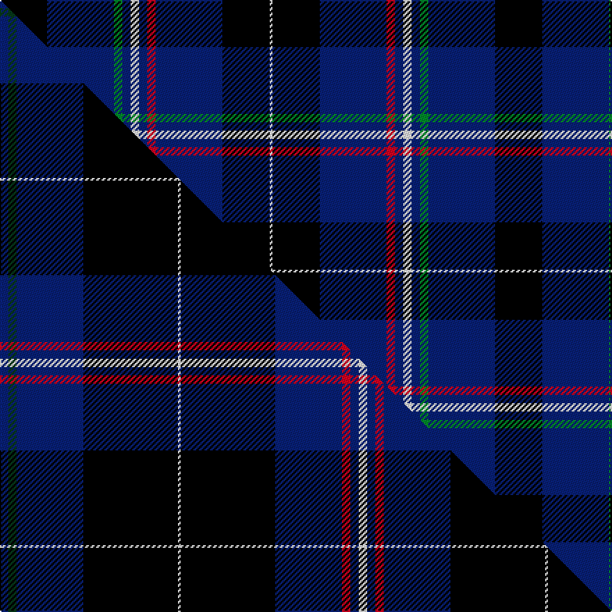

This page is one **sett** — a single exact thread-count. It belongs to the [tartan](/setts/k17db24g3db3w3db3r3db24k17w1/)
(the same proportion at any scale), whose colour order is pattern [KBGBWBRBKW](/stripes/kbgbwbrbkw/).

Part of the [Al-Fadhli](/tartans/al-fadhli/) tartan — the named design grouping this sett with its other cloths.

Sourced from tartans-authority.  It is a [10 stripe tartan](/stripes/stripes10/).

Original link http://www.tartansauthority.com/tartan-ferret/display/7130/

## Register references

External register numbers recorded for this tartan.

- Scottish Tartans Authority (ITI): 7130

## Thread count
K/34 DB48 G6 DB6 W6 DB6 R6 DB48 K34 W/2

One full sett is **356 threads**.

## Palette
<table><thead><tr><th>Colour</th><th>Shade</th><th>OKLCh</th></tr></thead><tbody><tr><td>DB</td><td><code style="background-color:#082077;">#082077</code> <small style="color:#888">#082077</small></td><td><small style="color:#888">oklch(30.0% 0.149 265.1)</small></td></tr><tr><td>G</td><td><code style="background-color:#008B2A;">#008B2A</code> <small style="color:#888">#008B2A</small></td><td><small style="color:#888">oklch(55.4% 0.170 145.9)</small></td></tr><tr><td>K</td><td><code style="background-color:#000000;">#000000</code> <small style="color:#888">#000000</small></td><td><small style="color:#888">oklch(0.0% 0.000 0.0)</small></td></tr><tr><td>W</td><td><code style="background-color:#F7F7F7;">#F7F7F7</code> <small style="color:#888">#F7F7F7</small></td><td><small style="color:#888">oklch(97.6% 0.000 89.9)</small></td></tr><tr><td>R</td><td><code style="background-color:#D60020;">#D60020</code> <small style="color:#888">#D60020</small></td><td><small style="color:#888">oklch(55.2% 0.224 25.5)</small></td></tr></tbody></table>

# Sample pattern

## Compared to the master

This cloth is one sett of its design; the master sett (the exemplar the design is anchored on) is below for comparison.

Its **ΔTartan distance** from the master is **0.67** — the same measure the nearest-tartans table ranks by (0 is identical; a re-scale of the same cloth is near 0, a recolour or a different proportion further).

<figure class="master-compare" style="margin:0">

this sett
master sett ★

<figcaption style="color:#888;font-size:smaller">One weave of this sett against the <a href="/setts/db3dg3db24k34w1k34db24r3db3w3/">master sett ★</a>, split on the diagonal: a shared proportion runs seamlessly across it with only the shades shifting; a different proportion breaks on it.</figcaption>
</figure>

## Nearest tartan variants

The nearest existing variants by ΔTartan distance, with this cloth at the top so the swatches line up against it.

ΔTartan

Threads

Variant

Sett

—

356

<a href="/variants/s10/k17db24g3db3w3db3r3db24k17w1~x2/">Al-Fadhli (Personal)</a>

<a href="/ttd/edit/#slug=db3dg3db24k34w1k34db24r3db3w3~x2&amp;base=k17db24g3db3w3db3r3db24k17w1~x2" title="compare in the TTD">0.67</a>

516

<a href="/variants/s10/db3dg3db24k34w1k34db24r3db3w3~x2/">Al-Fadhli (Personal)</a>

<a href="/ttd/edit/#slug=db12r4db64k64g7w7lo7k64db64r4db12&amp;base=k17db24g3db3w3db3r3db24k17w1~x2" title="compare in the TTD">1.63</a>

594

<a href="/variants/s11/db12r4db64k64g7w7lo7k64db64r4db12/">Sandhu (Name)</a>

<a href="/ttd/edit/#slug=db18w2db2r3db21k28dy1k1g2~x2&amp;base=k17db24g3db3w3db3r3db24k17w1~x2" title="compare in the TTD">1.88</a>

272

<a href="/variants/s9/db18w2db2r3db21k28dy1k1g2~x2/">St Andrew's College</a>

<a href="/ttd/edit/#slug=k21db8r4db2r2db23k4w2~x2&amp;base=k17db24g3db3w3db3r3db24k17w1~x2" title="compare in the TTD">2.25</a>

218

<a href="/variants/s8/k21db8r4db2r2db23k4w2~x2/">Murdoch Clebration (Personal)</a>

<a href="/ttd/edit/#slug=db30r2db2r4db9k26w2k4~x2&amp;base=k17db24g3db3w3db3r3db24k17w1~x2" title="compare in the TTD">2.27</a>

248

<a href="/variants/s8/db30r2db2r4db9k26w2k4~x2/">Murdoch Celebration (Personal)</a>

<a href="/ttd/edit/#slug=k8y1k1db28k12g2k1lb2~x2&amp;base=k17db24g3db3w3db3r3db24k17w1~x2" title="compare in the TTD">2.61</a>

200

<a href="/variants/s8/k8y1k1db28k12g2k1lb2~x2/">Hope-Weir/Weir</a>

<a href="/ttd/edit/#slug=db6dp3db56k24g6r6g6&amp;base=k17db24g3db3w3db3r3db24k17w1~x2" title="compare in the TTD">2.71</a>

202

<a href="/variants/s7/db6dp3db56k24g6r6g6/">Wcwm 9275-1395</a>

<a href="/ttd/edit/#slug=k2n4db27ly3db12n2k2r7k2n1db1k2db2~x2&amp;base=k17db24g3db3w3db3r3db24k17w1~x2" title="compare in the TTD">2.80</a>

260

<a href="/variants/s13/k2n4db27ly3db12n2k2r7k2n1db1k2db2~x2/">Brough from Orkney (Name)</a>

<a href="/ttd/edit/#slug=k5lb2b10lb2k5db15k2db15k5db10lb1y2~x2~b2105244-db1406275&amp;base=k17db24g3db3w3db3r3db24k17w1~x2" title="compare in the TTD">2.81</a>

282

<a href="/variants/s12/k5lb2t10lb2k5db15k2db15k5db10lb1y2~x2~t2105244-db1406275/">Goodwin, Robert Richard (Personal)</a>

<a href="/ttd/edit/#slug=w1db16k12lb2dp3lb2k12db2k2db2k2db7w1~x2&amp;base=k17db24g3db3w3db3r3db24k17w1~x2" title="compare in the TTD">2.86</a>

252

<a href="/variants/s13/w1db16k12lb2dp3lb2k12db2k2db2k2db7w1~x2/">Edgar (2014)</a>

## Neighbour map

Every grey dot is one of 13620 variants placed by the first two principal components of the ΔTartan feature space (42% of its variance). Red is this tartan; blue dots are its nearest — click one to open its page.

<svg viewBox="0 0 640 380" role="img" style="max-width:100%;height:auto;border:1px solid #e0e0e0;border-radius:4px;display:block" xmlns="http://www.w3.org/2000/svg"><image href="/nn/cloud.v1.png" width="640" height="380"/><a href="/variants/s10/db3dg3db24k34w1k34db24r3db3w3~x2/"><circle cx="294.9" cy="105.7" r="4" fill="#3465a4"><title>Al-Fadhli (Personal)</title></circle></a><a href="/variants/s11/db12r4db64k64g7w7lo7k64db64r4db12/"><circle cx="229.8" cy="117.0" r="4" fill="#3465a4"><title>Sandhu (Name)</title></circle></a><a href="/variants/s9/db18w2db2r3db21k28dy1k1g2~x2/"><circle cx="275.0" cy="91.1" r="4" fill="#3465a4"><title>St Andrew's College</title></circle></a><a href="/variants/s8/k21db8r4db2r2db23k4w2~x2/"><circle cx="259.0" cy="165.3" r="4" fill="#3465a4"><title>Murdoch Clebration (Personal)</title></circle></a><a href="/variants/s8/db30r2db2r4db9k26w2k4~x2/"><circle cx="288.8" cy="150.2" r="4" fill="#3465a4"><title>Murdoch Celebration (Personal)</title></circle></a><a href="/variants/s8/k8y1k1db28k12g2k1lb2~x2/"><circle cx="301.4" cy="103.9" r="4" fill="#3465a4"><title>Hope-Weir/Weir</title></circle></a><a href="/variants/s7/db6dp3db56k24g6r6g6/"><circle cx="306.7" cy="131.5" r="4" fill="#3465a4"><title>Wcwm 9275-1395</title></circle></a><a href="/variants/s13/k2n4db27ly3db12n2k2r7k2n1db1k2db2~x2/"><circle cx="331.1" cy="78.0" r="4" fill="#3465a4"><title>Brough from Orkney (Name)</title></circle></a><a href="/variants/s12/k5lb2t10lb2k5db15k2db15k5db10lb1y2~x2~t2105244-db1406275/"><circle cx="237.5" cy="146.8" r="4" fill="#3465a4"><title>Goodwin, Robert Richard (Personal)</title></circle></a><a href="/variants/s13/w1db16k12lb2dp3lb2k12db2k2db2k2db7w1~x2/"><circle cx="206.9" cy="121.2" r="4" fill="#3465a4"><title>Edgar (2014)</title></circle></a><circle cx="278.9" cy="122.4" r="5" fill="#c00000"/><text x="320" y="376" text-anchor="middle" font-size="11" fill="#999">ground</text><text x="11" y="190" text-anchor="middle" font-size="11" fill="#999" transform="rotate(-90 11 190)">complexity</text></svg>

ID: /variants/s10/k17db24g3db3w3db3r3db24k17w1~x2/
