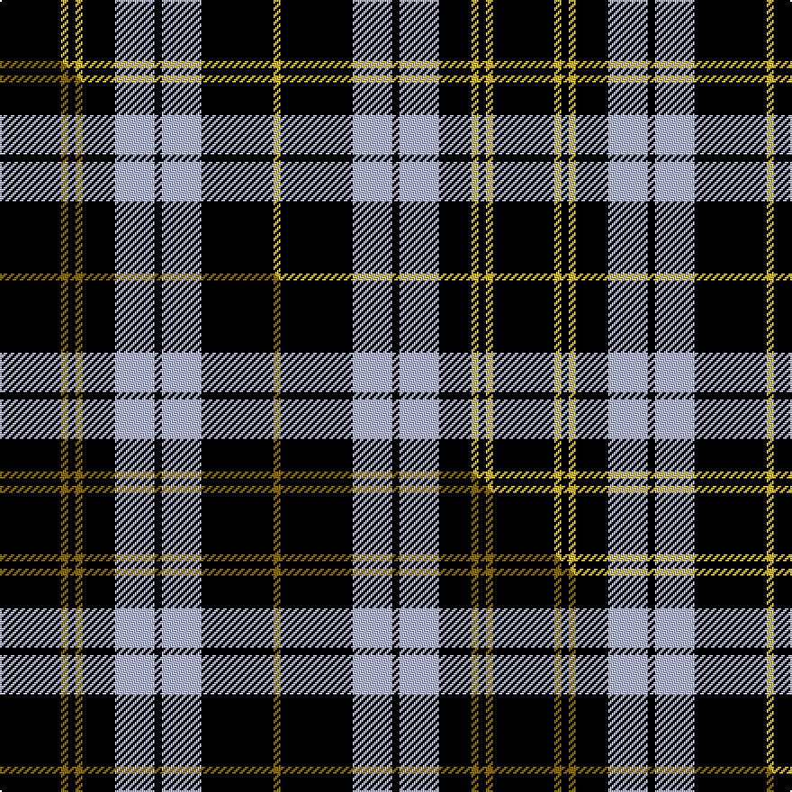

This page is one **sett** — a single exact thread-count. It belongs to the [tartan](/setts/k17ly2k2ly2k9lb11k2lb11k20ly2/)
(the same proportion at any scale), whose colour order is pattern [KYKYKWKWKY](/stripes/kykykwkwky/).

Part of the [Coppa Romana](/tartans/coppa-romana/) tartan — the named design grouping this sett with its other cloths.

Sourced from tartans-authority.  It is a [10 stripe tartan](/stripes/stripes10/).

Original link http://www.tartansauthority.com/tartan-ferret/display/10804/

## Register references

External register numbers recorded for this tartan.

- Scottish Register of Tartans: [10804](https://www.tartanregister.gov.uk/tartanDetails?ref=10804)
- Scottish Tartans Authority (ITI): 10804

## Thread count
K/34 LY4 K4 LY4 K18 LB22 K4 LB22 K40 LY/4

One full sett is **274 threads**.

## Palette
<table><thead><tr><th>Colour</th><th>Shade</th><th>OKLCh</th></tr></thead><tbody><tr><td>K</td><td><code style="background-color:#000000;">#000000</code> <small style="color:#888">#000000</small></td><td><small style="color:#888">oklch(0.0% 0.000 0.0)</small></td></tr><tr><td>LB</td><td><code style="background-color:#B5BBDE;">#B5BBDE</code> <small style="color:#888">#B5BBDE</small></td><td><small style="color:#888">oklch(79.9% 0.050 277.6)</small></td></tr><tr><td>LY</td><td><code style="background-color:#DCBC32;">#DCBC32</code> <small style="color:#888">#DCBC32</small></td><td><small style="color:#888">oklch(80.0% 0.150 95.2)</small></td></tr></tbody></table>

# Sample pattern

## Compared to the master

This cloth is one sett of its design; the master sett (the exemplar the design is anchored on) is below for comparison.

Its **ΔTartan distance** from the master is **0.44** — the same measure the nearest-tartans table ranks by (0 is identical; a re-scale of the same cloth is near 0, a recolour or a different proportion further).

<figure class="master-compare" style="margin:0">

this sett
master sett ★

<figcaption style="color:#888;font-size:smaller">One weave of this sett against the <a href="/setts/k17y2k2y2k9lb11k2lb11k20y2/">master sett ★</a>, split on the diagonal: a shared proportion runs seamlessly across it with only the shades shifting; a different proportion breaks on it.</figcaption>
</figure>

## Nearest variants

The nearest existing variants by ΔTartan distance, with this cloth at the top so the swatches line up against it.

ΔTartan

Threads

Variant

Sett

—

274

<a href="/variants/s10/k17ly2k2ly2k9lb11k2lb11k20ly2~x2/">Coppa Romana (Corporate)</a>

<a href="/ttd/edit/#slug=k17y2k2y2k9lb11k2lb11k20y2~x2&amp;base=k17ly2k2ly2k9lb11k2lb11k20ly2~x2" title="compare in the TTD">0.00</a>

274

<a href="/variants/s10/k17y2k2y2k9lb11k2lb11k20y2~x2/">Coppa Romana (Switzerland)</a>

<a href="/ttd/edit/#slug=k2lb5k1lb1k10r1k1~x4&amp;base=k17ly2k2ly2k9lb11k2lb11k20ly2~x2" title="compare in the TTD">2.37</a>

156

<a href="/variants/s7/k2lb5k1lb1k10r1k1~x4/">Lundy Reform</a>

<a href="/ttd/edit/#slug=k1lb1y7k8lb1k8lb1y2lb1k4lb1~x4&amp;base=k17ly2k2ly2k9lb11k2lb11k20ly2~x2" title="compare in the TTD">2.74</a>

272

<a href="/variants/s11/k1lb1y7k8lb1k8lb1y2lb1k4lb1~x4/">Priest</a>

<a href="/ttd/edit/#slug=k1lb1y7k8lb1k8lb1y2lb1k4lb1~x2&amp;base=k17ly2k2ly2k9lb11k2lb11k20ly2~x2" title="compare in the TTD">2.74</a>

136

<a href="/variants/s11/k1lb1y7k8lb1k8lb1y2lb1k4lb1~x2/">Priest</a>

## Neighbour map

Every grey dot is one of 13620 variants placed by the first two principal components of the ΔTartan feature space (42% of its variance). Red is this tartan; blue dots are its nearest — click one to open its page.

<svg viewBox="0 0 640 380" role="img" style="max-width:100%;height:auto;border:1px solid #e0e0e0;border-radius:4px;display:block" xmlns="http://www.w3.org/2000/svg"><image href="/nn/cloud.v1.png" width="640" height="380"/><a href="/variants/s10/k17y2k2y2k9lb11k2lb11k20y2~x2/"><circle cx="293.6" cy="172.6" r="4" fill="#3465a4"><title>Coppa Romana (Switzerland)</title></circle></a><a href="/variants/s7/k2lb5k1lb1k10r1k1~x4/"><circle cx="328.6" cy="163.7" r="4" fill="#3465a4"><title>Lundy Reform</title></circle></a><a href="/variants/s11/k1lb1y7k8lb1k8lb1y2lb1k4lb1~x4/"><circle cx="267.6" cy="175.0" r="4" fill="#3465a4"><title>Priest</title></circle></a><a href="/variants/s11/k1lb1y7k8lb1k8lb1y2lb1k4lb1~x2/"><circle cx="267.6" cy="175.0" r="4" fill="#3465a4"><title>Priest</title></circle></a><circle cx="298.2" cy="176.8" r="5" fill="#c00000"/><text x="320" y="376" text-anchor="middle" font-size="11" fill="#999">ground</text><text x="11" y="190" text-anchor="middle" font-size="11" fill="#999" transform="rotate(-90 11 190)">complexity</text></svg>

ID: /variants/s10/k17ly2k2ly2k9lb11k2lb11k20ly2~x2/
