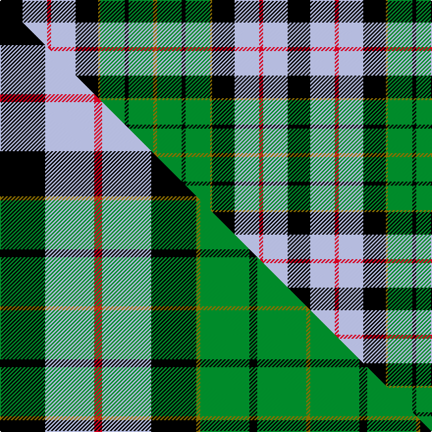

This is one **variant** — a specific cloth: this exact thread count and colourway, with its own
provenance below. It is one weaving of the [sett](/setts/k23lb25r4lb25k23y2g25k4g25y4/) (the scale-free proportion — the
same cloth at any scale or shade), whose colour order is pattern [GGKGGKWRWK](/stripes/ggkggkwrwk/).

Part of the [Forsyth](/tartans/f/fo/forsyth-2/) tartan — the named design grouping this sett with its other cloths.

Sourced from weddslist.  It is a [10 stripe tartan](/stripes/stripes10/).

Original link [http://www.weddslist.com/cgi-bin/tartans/pg.pl?source=sts](http://www.weddslist.com/cgi-bin/tartans/pg.pl?source=sts)

Dataset <small>— provenance for this record, inherited from the source manifest</small>

<dl class="dataset-prov">
<dt>source</dt><dd><a href="/sources/weddslist/">Weddslist</a></dd>
<dt>data captured from</dt><dd><a href="https://github.com/thetartan/tartan-database/blob/master/data/weddslist/data.csv">https://github.com/thetartan/tartan-database/blob/master/data/weddslist/data.csv</a></dd>
<dt>data date</dt><dd>2016-11-17 <small>(dataset default)</small></dd>
<dt>licence</dt><dd><a href="https://creativecommons.org/licenses/by-nc-nd/4.0/">CC BY-NC-ND 4.0</a></dd>
</dl>

Capture chain <small>— the hands this data passed through, oldest first; each capture carries its own licence</small>

<ol class="capture-chain">
<li><a href="https://www.weddslist.com/tartans/">Weddslist</a> <small>the living privately compiled reference</small></li>
<li><a href="https://github.com/thetartan/tartan-database">thetartan/tartan-database</a> <small>2016-2017</small> · <a href="https://creativecommons.org/licenses/by-nc-nd/4.0/">CC BY-NC-ND 4.0</a> <small>Levko Kravets's frozen compilation — the capture we vendored, and where its CC licence text came from</small></li>
<li>this dictionary <small>captured 2026-06-10 · commit 5bf86c7566</small> <small>each re-capture is a git commit to data/sources</small></li>
</ol>

## Thread count
K/23 LB25 R4 LB25 K23 Y2 G25 K4 G25 Y/4

One full sett is **293 threads**.

## Palette
<table><thead><tr><th>Colour</th><th>Shade</th><th>OKLCh</th></tr></thead><tbody><tr><td>LB</td><td><code style="background-color:#B5BBDE;">#B5BBDE</code> <small style="color:#888">#B5BBDE</small></td><td><small style="color:#888">oklch(79.9% 0.050 277.6)</small></td></tr><tr><td>G</td><td><code style="background-color:#008B2A;">#008B2A</code> <small style="color:#888">#008B2A</small></td><td><small style="color:#888">oklch(55.4% 0.170 145.9)</small></td></tr><tr><td>K</td><td><code style="background-color:#000000;">#000000</code> <small style="color:#888">#000000</small></td><td><small style="color:#888">oklch(0.0% 0.000 0.0)</small></td></tr><tr><td>R</td><td><code style="background-color:#D60020;">#D60020</code> <small style="color:#888">#D60020</small></td><td><small style="color:#888">oklch(55.2% 0.224 25.5)</small></td></tr><tr><td>Y</td><td><code style="background-color:#8B6E00;">#8B6E00</code> <small style="color:#888">#8B6E00</small></td><td><small style="color:#888">oklch(55.1% 0.113 90.4)</small></td></tr></tbody></table>

# Sample pattern

## Compared to the master

This cloth is one sett of its design; the master sett (the exemplar the design is anchored on) is below for comparison.

Its **ΔTartan distance** from the master is **0.02** — the same measure the nearest-tartans table ranks by (0 is identical; a re-scale of the same cloth is near 0, a recolour or a different proportion further).

<figure class="master-compare" style="margin:0">

this sett
master sett ★

<figcaption style="color:#888;font-size:smaller">One weave of this sett against the <a href="/setts/k23lb25r4lb25k23y2g25k4g25y2/">master sett ★</a>, split on the diagonal: a shared proportion runs seamlessly across it with only the shades shifting; a different proportion breaks on it.</figcaption>
</figure>

## Nearest tartan variants

The nearest existing variants by ΔTartan distance, with this cloth at the top so the swatches line up against it.

ΔTartan

Threads

Variant

Sett

—

293

<a href="/variants/s10/k23lb25r4lb25k23y2g25k4g25y4/">Forsyth</a>

<a href="/ttd/edit/#slug=k23lb25r4lb25k23y2g25k4g25y2~x2&amp;base=k23lb25r4lb25k23y2g25k4g25y4" title="compare in the TTD">0.02</a>

582

<a href="/variants/s10/k23lb25r4lb25k23y2g25k4g25y2~x2/">Forsyth</a>

<a href="/ttd/edit/#slug=r2db10k10g10w1k4w1g10k10db10r1~x4&amp;base=k23lb25r4lb25k23y2g25k4g25y4" title="compare in the TTD">1.84</a>

540

<a href="/variants/s11/r2db10k10g10w1k4w1g10k10db10r1~x4/">Rose</a>

<a href="/ttd/edit/#slug=k6g5k6do6w1do10k6w3dr1w12dr1w3~x4&amp;base=k23lb25r4lb25k23y2g25k4g25y4" title="compare in the TTD">1.90</a>

444

<a href="/variants/s12/k6g5k6do6w1do10k6w3dr1w12dr1w3~x4/">Forbes - 1970 (WCWM #1)</a>

<a href="/ttd/edit/#slug=dg17lb3dg17k15w33db8w33k15dg17lb3dg17lb3~x2&amp;base=k23lb25r4lb25k23y2g25k4g25y4" title="compare in the TTD">1.98</a>

684

<a href="/variants/s12/dg17lb3dg17k15w33db8w33k15dg17lb3dg17lb3~x2/">MacRobart Family Tartan</a>

<a href="/ttd/edit/#slug=t12ly2t12k6o10k1w2k1o10k6~x2&amp;base=k23lb25r4lb25k23y2g25k4g25y4" title="compare in the TTD">2.08</a>

212

<a href="/variants/s10/t12ly2t12k6o10k1w2k1o10k6~x2/">Soroptimist International</a>

<a href="/ttd/edit/#slug=dr4k1dr4g8k6lb3db2lb11db1dr2~x4&amp;base=k23lb25r4lb25k23y2g25k4g25y4" title="compare in the TTD">2.26</a>

312

<a href="/variants/s10/dr4k1dr4g8k6lb3db2lb11db1dr2~x4/">MacDuff Dress #2</a>

<a href="/ttd/edit/#slug=w5db1w16db4w4k6g10dr2g10k6db10dr2~x2&amp;base=k23lb25r4lb25k23y2g25k4g25y4" title="compare in the TTD">2.27</a>

290

<a href="/variants/s12/w5db1w16db4w4k6g10dr2g10k6db10dr2~x2/">Murray of Atholl Dress</a>

<a href="/ttd/edit/#slug=g8r1g2r3g12k12dy1lb12r3lb2r1lb8~x2&amp;base=k23lb25r4lb25k23y2g25k4g25y4" title="compare in the TTD">2.28</a>

228

<a href="/variants/s12/g8r1g2r3g12k12dy1lb12r3lb2r1lb8~x2/">Macallan Distillery</a>

<a href="/ttd/edit/#slug=w3k2w7k2w2k7g8k1w2k1g8k7db7r2~x2&amp;base=k23lb25r4lb25k23y2g25k4g25y4" title="compare in the TTD">2.31</a>

226

<a href="/variants/s14/w3k2w7k2w2k7g8k1w2k1g8k7db7r2~x2/">MacKenzie Dress - 1950 (Clan)</a>

<a href="/ttd/edit/#slug=g9k9t10k1t2k2t10k9g9w1g2r1~x4&amp;base=k23lb25r4lb25k23y2g25k4g25y4" title="compare in the TTD">2.41</a>

480

<a href="/variants/s12/g9k9t10k1t2k2t10k9g9w1g2r1~x4/">Spar (UK) Ltd</a>

## Neighbour map

Every grey dot is one of 13621 variants placed by the first two principal components of the ΔTartan feature space (42% of its variance). Red is this tartan; blue dots are its nearest — click one to open its page.

<svg viewBox="0 0 640 380" role="img" style="max-width:100%;height:auto;border:1px solid #e0e0e0;border-radius:4px;display:block" xmlns="http://www.w3.org/2000/svg"><image href="/nn/cloud.v1.png" width="640" height="380"/><a href="/variants/s10/k23lb25r4lb25k23y2g25k4g25y2~x2/"><circle cx="91.9" cy="168.8" r="4" fill="#3465a4"><title>Forsyth</title></circle></a><a href="/variants/s11/r2db10k10g10w1k4w1g10k10db10r1~x4/"><circle cx="103.7" cy="176.3" r="4" fill="#3465a4"><title>Rose</title></circle></a><a href="/variants/s12/k6g5k6do6w1do10k6w3dr1w12dr1w3~x4/"><circle cx="70.8" cy="156.6" r="4" fill="#3465a4"><title>Forbes - 1970 (WCWM #1)</title></circle></a><a href="/variants/s12/dg17lb3dg17k15w33db8w33k15dg17lb3dg17lb3~x2/"><circle cx="98.3" cy="165.8" r="4" fill="#3465a4"><title>MacRobart Family Tartan</title></circle></a><a href="/variants/s10/t12ly2t12k6o10k1w2k1o10k6~x2/"><circle cx="130.1" cy="165.5" r="4" fill="#3465a4"><title>Soroptimist International</title></circle></a><a href="/variants/s10/dr4k1dr4g8k6lb3db2lb11db1dr2~x4/"><circle cx="87.4" cy="165.8" r="4" fill="#3465a4"><title>MacDuff Dress #2</title></circle></a><a href="/variants/s12/w5db1w16db4w4k6g10dr2g10k6db10dr2~x2/"><circle cx="75.7" cy="152.2" r="4" fill="#3465a4"><title>Murray of Atholl Dress</title></circle></a><a href="/variants/s12/g8r1g2r3g12k12dy1lb12r3lb2r1lb8~x2/"><circle cx="105.2" cy="149.0" r="4" fill="#3465a4"><title>Macallan Distillery</title></circle></a><a href="/variants/s14/w3k2w7k2w2k7g8k1w2k1g8k7db7r2~x2/"><circle cx="54.6" cy="169.3" r="4" fill="#3465a4"><title>MacKenzie Dress - 1950 (Clan)</title></circle></a><a href="/variants/s12/g9k9t10k1t2k2t10k9g9w1g2r1~x4/"><circle cx="106.6" cy="169.0" r="4" fill="#3465a4"><title>Spar (UK) Ltd</title></circle></a><circle cx="86.8" cy="171.6" r="5" fill="#c00000"/><text x="320" y="376" text-anchor="middle" font-size="11" fill="#999">ground</text><text x="11" y="190" text-anchor="middle" font-size="11" fill="#999" transform="rotate(-90 11 190)">complexity</text></svg>

ID: /variants/s10/k23lb25r4lb25k23y2g25k4g25y4/
