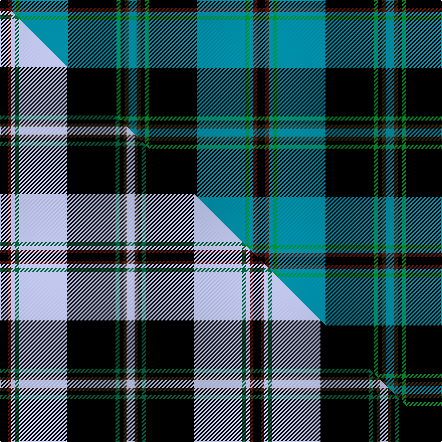

This is one **variant** — a specific cloth: this exact thread count and colourway, with its own
provenance below. It is one weaving of the [sett](/setts/k2dr1t1g1t12k12g1k1dy1t2/) (the scale-free proportion — the
same cloth at any scale or shade), whose colour order is pattern [BGKGKBGBBK](/stripes/bgkgkbgbbk/).

Part of the [Kingsbarns Golf Links](/tartans/kingsbarns-golf-links/) tartan — the named design grouping this sett with its other cloths.

Sourced from tartans-authority.  It is a [10 stripe tartan](/stripes/stripes10/).

Original link [https://www.tartanregister.gov.uk/tartanDetails.aspx?ref=2532](https://www.tartanregister.gov.uk/tartanDetails.aspx?ref=2532)

Dataset <small>— provenance for this record, inherited from the source manifest</small>

<dl class="dataset-prov">
<dt>source</dt><dd><a href="/sources/tartans-authority/">Scottish Tartans Authority</a></dd>
<dt>data captured from</dt><dd><a href="https://github.com/thetartan/tartan-database/blob/master/data/tartans-authority/data.csv">https://github.com/thetartan/tartan-database/blob/master/data/tartans-authority/data.csv</a></dd>
<dt>data date</dt><dd>April 1999 <small>(this record)</small></dd>
<dt>licence</dt><dd><a href="https://creativecommons.org/licenses/by-nc-nd/4.0/">CC BY-NC-ND 4.0</a></dd>
</dl>

Capture chain <small>— the hands this data passed through, oldest first; each capture carries its own licence</small>

<ol class="capture-chain">
<li><a href="https://www.tartansauthority.com/">Scottish Tartans Authority</a> <small>the heritage body's archive — its tartan-ferret record browser is retired (links repaired to the SRT, above)</small></li>
<li><a href="https://github.com/thetartan/tartan-database">thetartan/tartan-database</a> <small>2016-2017</small> · <a href="https://creativecommons.org/licenses/by-nc-nd/4.0/">CC BY-NC-ND 4.0</a> <small>Levko Kravets's frozen compilation — the capture we vendored, and where its CC licence text came from</small></li>
<li>this dictionary <small>captured 2026-06-10 · commit 5bf86c7566</small> <small>each re-capture is a git commit to data/sources</small></li>
</ol>

## Register references

External register numbers recorded for this tartan.

- Scottish Tartans Authority (ITI): 2532

## Thread count
K/8 DR4 T4 G4 T48 K48 G4 K4 DY4 T/8

One full sett is **256 threads**.

## Palette
<table><thead><tr><th>Colour</th><th>Shade</th><th>OKLCh</th></tr></thead><tbody><tr><td>DR</td><td><code style="background-color:#55120C;">#55120C</code> <small style="color:#888">#55120C</small></td><td><small style="color:#888">oklch(30.0% 0.099 29.3)</small></td></tr><tr><td>G</td><td><code style="background-color:#008B2A;">#008B2A</code> <small style="color:#888">#008B2A</small></td><td><small style="color:#888">oklch(55.4% 0.170 145.9)</small></td></tr><tr><td>K</td><td><code style="background-color:#000000;">#000000</code> <small style="color:#888">#000000</small></td><td><small style="color:#888">oklch(0.0% 0.000 0.0)</small></td></tr><tr><td>T</td><td><code style="background-color:#00879F;">#00879F</code> <small style="color:#888">#00879F</small></td><td><small style="color:#888">oklch(57.4% 0.102 216.1)</small></td></tr><tr><td>DY</td><td><code style="background-color:#3A2B0D;">#3A2B0D</code> <small style="color:#888">#3A2B0D</small></td><td><small style="color:#888">oklch(30.0% 0.049 82.0)</small></td></tr></tbody></table>

# Sample pattern

## Compared to the master

This cloth is one sett of its design; the master sett (the exemplar the design is anchored on) is below for comparison.

Its **ΔTartan distance** from the master is **0.42** — the same measure the nearest-tartans table ranks by (0 is identical; a re-scale of the same cloth is near 0, a recolour or a different proportion further).

<figure class="master-compare" style="margin:0">

this sett
master sett ★

<figcaption style="color:#888;font-size:smaller">One weave of this sett against the <a href="/setts/k8dr3lb4dg4lb48k48dg4k4dy3lb8/">master sett ★</a>, split on the diagonal: a shared proportion runs seamlessly across it with only the shades shifting; a different proportion breaks on it.</figcaption>
</figure>

## Nearest tartan variants

The nearest existing variants by ΔTartan distance, with this cloth at the top so the swatches line up against it.

ΔTartan

Threads

Variant

Sett

—

256

<a href="/variants/s10/k2dr1t1g1t12k12g1k1dy1t2~x4/">Kingsbarns Golf Links (Corporate)</a>

<a href="/ttd/edit/#slug=k8r3b4g4b48k48g4k4y3b8&amp;base=k2dr1t1g1t12k12g1k1dy1t2~x4" title="compare in the TTD">0.38</a>

252

<a href="/variants/s10/k8r3b4g4b48k48g4k4y3b8/">Kingsbarns Golf Links</a>

<a href="/ttd/edit/#slug=k8dr3lb4dg4lb48k48dg4k4dy3lb8~dg1804158&amp;base=k2dr1t1g1t12k12g1k1dy1t2~x4" title="compare in the TTD">0.42</a>

252

<a href="/variants/s10/k8dr3lb4dg4lb48k48dg4k4dy3lb8~dg1804158/">Kingsbarns Golf Links</a>

<a href="/ttd/edit/#slug=ki3k2ki22k9g2b2g2b2g8k2w3~x2~ki0604259&amp;base=k2dr1t1g1t12k12g1k1dy1t2~x4" title="compare in the TTD">2.49</a>

216

<a href="/variants/s11/ki3k2ki22k9g2b2g2b2g8k2w3~x2~ki0604259/">Scottish Rugby Union</a>

<a href="/ttd/edit/#slug=db4k3db23k9g2lb2g2lb2g8k2y3~x2&amp;base=k2dr1t1g1t12k12g1k1dy1t2~x4" title="compare in the TTD">2.53</a>

226

<a href="/variants/s11/db4k3db23k9g2lb2g2lb2g8k2y3~x2/">Forth</a>

<a href="/ttd/edit/#slug=db24k2db2r2db2k20g16y2g2y3~x2&amp;base=k2dr1t1g1t12k12g1k1dy1t2~x4" title="compare in the TTD">2.62</a>

246

<a href="/variants/s10/db24k2db2r2db2k20g16y2g2y3~x2/">Watson (Name)</a>

<a href="/ttd/edit/#slug=db4k3db23k9g2lb2g2lb2g8k2dy3~x2&amp;base=k2dr1t1g1t12k12g1k1dy1t2~x4" title="compare in the TTD">2.64</a>

226

<a href="/variants/s11/db4k3db23k9g2lb2g2lb2g8k2dy3~x2/">Forth</a>

<a href="/ttd/edit/#slug=w4k2db9k3b3k3b3k25g10k2b6w2~x2&amp;base=k2dr1t1g1t12k12g1k1dy1t2~x4" title="compare in the TTD">2.65</a>

276

<a href="/variants/s12/w4k2db9k3b3k3b3k25g10k2b6w2~x2/">Auld Lang Syne Blue Fashion Tartan</a>

<a href="/ttd/edit/#slug=k36r3k3r3k9t36g3t2~x2&amp;base=k2dr1t1g1t12k12g1k1dy1t2~x4" title="compare in the TTD">2.66</a>

304

<a href="/variants/s8/k36r3k3r3k9t36g3t2~x2/">Home (Clan)</a>

<a href="/ttd/edit/#slug=g16k1lb2k1g3k5db12k1y1k3~x4&amp;base=k2dr1t1g1t12k12g1k1dy1t2~x4" title="compare in the TTD">2.66</a>

284

<a href="/variants/s10/g16k1lb2k1g3k5db12k1y1k3~x4/">Hope-Vere (Lochcarron)</a>

<a href="/ttd/edit/#slug=n14k2db3k1y2k1db3k14db3k1w1~x2&amp;base=k2dr1t1g1t12k12g1k1dy1t2~x4" title="compare in the TTD">2.68</a>

150

<a href="/variants/s11/n14k2db3k1y2k1db3k14db3k1w1~x2/">McGuffey (School)</a>

## Neighbour map

Every grey dot is one of 13621 variants placed by the first two principal components of the ΔTartan feature space (42% of its variance). Red is this tartan; blue dots are its nearest — click one to open its page.

<svg viewBox="0 0 640 380" role="img" style="max-width:100%;height:auto;border:1px solid #e0e0e0;border-radius:4px;display:block" xmlns="http://www.w3.org/2000/svg"><image href="/nn/cloud.v1.png" width="640" height="380"/><a href="/variants/s10/k8r3b4g4b48k48g4k4y3b8/"><circle cx="222.8" cy="106.2" r="4" fill="#3465a4"><title>Kingsbarns Golf Links</title></circle></a><a href="/variants/s10/k8dr3lb4dg4lb48k48dg4k4dy3lb8~dg1804158/"><circle cx="209.7" cy="102.6" r="4" fill="#3465a4"><title>Kingsbarns Golf Links</title></circle></a><a href="/variants/s11/ki3k2ki22k9g2b2g2b2g8k2w3~x2~ki0604259/"><circle cx="156.8" cy="126.1" r="4" fill="#3465a4"><title>Scottish Rugby Union</title></circle></a><a href="/variants/s11/db4k3db23k9g2lb2g2lb2g8k2y3~x2/"><circle cx="180.7" cy="134.5" r="4" fill="#3465a4"><title>Forth</title></circle></a><a href="/variants/s10/db24k2db2r2db2k20g16y2g2y3~x2/"><circle cx="158.9" cy="138.0" r="4" fill="#3465a4"><title>Watson (Name)</title></circle></a><a href="/variants/s11/db4k3db23k9g2lb2g2lb2g8k2dy3~x2/"><circle cx="184.0" cy="135.5" r="4" fill="#3465a4"><title>Forth</title></circle></a><a href="/variants/s12/w4k2db9k3b3k3b3k25g10k2b6w2~x2/"><circle cx="167.3" cy="121.8" r="4" fill="#3465a4"><title>Auld Lang Syne Blue Fashion Tartan</title></circle></a><a href="/variants/s8/k36r3k3r3k9t36g3t2~x2/"><circle cx="259.8" cy="128.1" r="4" fill="#3465a4"><title>Home (Clan)</title></circle></a><a href="/variants/s10/g16k1lb2k1g3k5db12k1y1k3~x4/"><circle cx="178.1" cy="126.7" r="4" fill="#3465a4"><title>Hope-Vere (Lochcarron)</title></circle></a><a href="/variants/s11/n14k2db3k1y2k1db3k14db3k1w1~x2/"><circle cx="187.8" cy="120.4" r="4" fill="#3465a4"><title>McGuffey (School)</title></circle></a><circle cx="207.7" cy="122.9" r="5" fill="#c00000"/><text x="320" y="376" text-anchor="middle" font-size="11" fill="#999">ground</text><text x="11" y="190" text-anchor="middle" font-size="11" fill="#999" transform="rotate(-90 11 190)">complexity</text></svg>

ID: /variants/s10/k2dr1t1g1t12k12g1k1dy1t2~x4/
