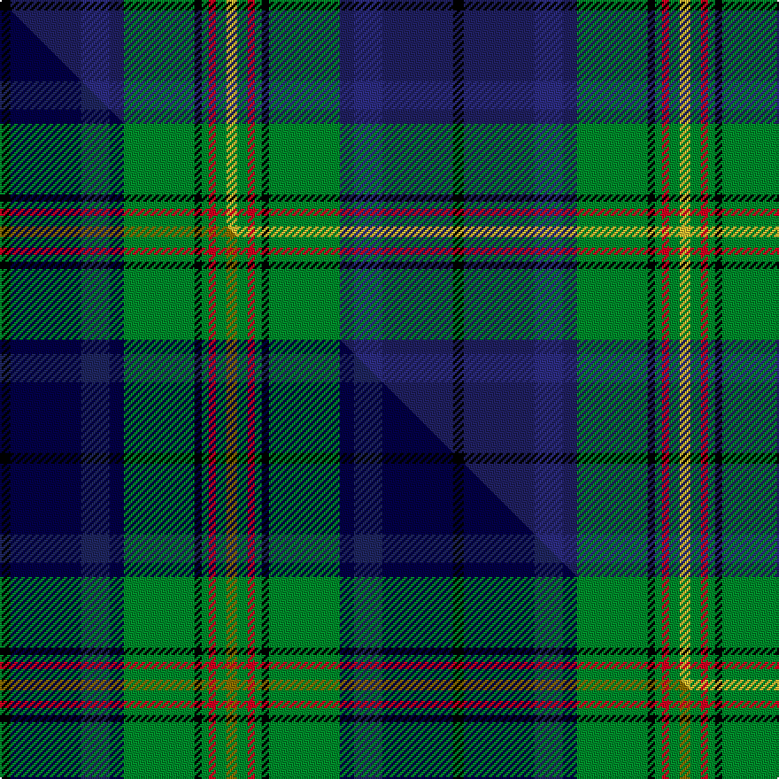

This page is one **sett** — a single exact thread-count. It belongs to the [tartan](/setts/k3db20dbi8db4g20k2g2r2g3ly3/)
(the same proportion at any scale), whose colour order is pattern [KBBBGKGRGY](/stripes/kbbbgkgrgy/).

Part of the [Schmidt](/tartans/schmidt/) tartan — the named design grouping this sett with its other cloths.

Sourced from tartans-authority.  It is a [10 stripe tartan](/stripes/stripes10/).

Original link http://www.tartansauthority.com/tartan-ferret/display/11046/

## Register references

External register numbers recorded for this tartan.

- Scottish Register of Tartans: [11046](https://www.tartanregister.gov.uk/tartanDetails?ref=11046)
- Scottish Tartans Authority (ITI): 11046

## Thread count
K/6 DB40 DBi16 DB8 G40 K4 G4 R4 G6 LY/6

One full sett is **256 threads**.

## Palette
<table><thead><tr><th>Colour</th><th>Shade</th><th>OKLCh</th></tr></thead><tbody><tr><td>DB</td><td><code style="background-color:#2C2C80;">#2C2C80</code> <small style="color:#888">#2C2C80</small></td><td><small style="color:#888">oklch(35.0% 0.138 276.6)</small></td></tr><tr><td>DB</td><td><code style="background-color:#202060;">#202060</code> <small style="color:#888">#202060</small></td><td><small style="color:#888">oklch(28.9% 0.111 276.9)</small></td></tr><tr><td>G</td><td><code style="background-color:#008B2A;">#008B2A</code> <small style="color:#888">#008B2A</small></td><td><small style="color:#888">oklch(55.4% 0.170 145.9)</small></td></tr><tr><td>K</td><td><code style="background-color:#000000;">#000000</code> <small style="color:#888">#000000</small></td><td><small style="color:#888">oklch(0.0% 0.000 0.0)</small></td></tr><tr><td>R</td><td><code style="background-color:#D60020;">#D60020</code> <small style="color:#888">#D60020</small></td><td><small style="color:#888">oklch(55.2% 0.224 25.5)</small></td></tr><tr><td>LY</td><td><code style="background-color:#DCBC32;">#DCBC32</code> <small style="color:#888">#DCBC32</small></td><td><small style="color:#888">oklch(80.0% 0.150 95.2)</small></td></tr></tbody></table>

# Sample pattern

## Compared to the master

This cloth is one sett of its design; the master sett (the exemplar the design is anchored on) is below for comparison.

Its **ΔTartan distance** from the master is **0.59** — the same measure the nearest-tartans table ranks by (0 is identical; a re-scale of the same cloth is near 0, a recolour or a different proportion further).

<figure class="master-compare" style="margin:0">

this sett
master sett ★

<figcaption style="color:#888;font-size:smaller">One weave of this sett against the <a href="/setts/k3db20dbi8db4g20k2g2r2g3y3/">master sett ★</a>, split on the diagonal: a shared proportion runs seamlessly across it with only the shades shifting; a different proportion breaks on it.</figcaption>
</figure>

## Nearest tartan variants

The nearest existing variants by ΔTartan distance, with this cloth at the top so the swatches line up against it.

ΔTartan

Threads

Variant

Sett

—

256

<a href="/variants/s10/k3db20dbi8db4g20k2g2r2g3ly3~x2~db1204274-dbi1406275/">Schmidt (2014)</a>

0.00

—

<a href="/variants/s10/k3db20dbi8db4g20k2g2r2g3y3~x2~db0705267-dbi1204274/">Schmidt (2014)</a>

<a href="/ttd/edit/#slug=db6r4db24w3k6g18y4g2y2g4~x2&amp;base=k3db20dbi8db4g20k2g2r2g3ly3~x2~db1204274-dbi1406275" title="compare in the TTD">2.16</a>

272

<a href="/variants/s10/db6r4db24w3k6g18y4g2y2g4~x2/">Greene</a>

<a href="/ttd/edit/#slug=g7r2g3r5g17y2k15y2t22g3w2t7~x2&amp;base=k3db20dbi8db4g20k2g2r2g3ly3~x2~db1204274-dbi1406275" title="compare in the TTD">2.40</a>

320

<a href="/variants/s12/g7r2g3r5g17y2k15y2t22g3w2t7~x2/">Paisley</a>

<a href="/ttd/edit/#slug=db7w2g3db18y2k15y2g17r5g3r2g7~x2&amp;base=k3db20dbi8db4g20k2g2r2g3ly3~x2~db1204274-dbi1406275" title="compare in the TTD">2.46</a>

304

<a href="/variants/s12/db7w2g3db18y2k15y2g17r5g3r2g7~x2/">Paisley</a>

<a href="/ttd/edit/#slug=db10w5db48k35g5k5g35r5g5dp5&amp;base=k3db20dbi8db4g20k2g2r2g3ly3~x2~db1204274-dbi1406275" title="compare in the TTD">2.64</a>

301

<a href="/variants/s10/db10w5db48k35g5k5g35r5g5dp5/">Big Rory (Corporate)</a>

<a href="/ttd/edit/#slug=k2db2k2db17dg10k2dg2g13lo2~x2&amp;base=k3db20dbi8db4g20k2g2r2g3ly3~x2~db1204274-dbi1406275" title="compare in the TTD">2.73</a>

200

<a href="/variants/s9/k2db2k2db17dg10k2dg2g13lo2~x2/">Pro Simon</a>

<a href="/ttd/edit/#slug=r7g20y2g4k5db4k2db20k3w1~x2&amp;base=k3db20dbi8db4g20k2g2r2g3ly3~x2~db1204274-dbi1406275" title="compare in the TTD">2.76</a>

256

<a href="/variants/s10/r7g20y2g4k5db4k2db20k3w1~x2/">McMeeken</a>

<a href="/ttd/edit/#slug=r7g20ly2g4k5db4k2db20k3w1~x2&amp;base=k3db20dbi8db4g20k2g2r2g3ly3~x2~db1204274-dbi1406275" title="compare in the TTD">2.76</a>

256

<a href="/variants/s10/r7g20ly2g4k5db4k2db20k3w1~x2/">McMeeken (Name)</a>

<a href="/ttd/edit/#slug=g11k2g1dr4db1dr4db13lb2db1~x4&amp;base=k3db20dbi8db4g20k2g2r2g3ly3~x2~db1204274-dbi1406275" title="compare in the TTD">2.77</a>

264

<a href="/variants/s9/g11k2g1dr4db1dr4db13lb2db1~x4/">Dunbartonshire</a>

<a href="/ttd/edit/#slug=g11k2g1dr4db1dr4db13b2db1~x4&amp;base=k3db20dbi8db4g20k2g2r2g3ly3~x2~db1204274-dbi1406275" title="compare in the TTD">2.77</a>

264

<a href="/variants/s9/g11k2g1dr4db1dr4db13b2db1~x4/">Dunbartonshire</a>

## Neighbour map

Every grey dot is one of 13620 variants placed by the first two principal components of the ΔTartan feature space (42% of its variance). Red is this tartan; blue dots are its nearest — click one to open its page.

<svg viewBox="0 0 640 380" role="img" style="max-width:100%;height:auto;border:1px solid #e0e0e0;border-radius:4px;display:block" xmlns="http://www.w3.org/2000/svg"><image href="/nn/cloud.v1.png" width="640" height="380"/><a href="/variants/s10/k3db20dbi8db4g20k2g2r2g3y3~x2~db0705267-dbi1204274/"><circle cx="140.0" cy="142.5" r="4" fill="#3465a4"><title>Schmidt (2014)</title></circle></a><a href="/variants/s10/db6r4db24w3k6g18y4g2y2g4~x2/"><circle cx="148.9" cy="136.1" r="4" fill="#3465a4"><title>Greene</title></circle></a><a href="/variants/s12/g7r2g3r5g17y2k15y2t22g3w2t7~x2/"><circle cx="108.2" cy="141.2" r="4" fill="#3465a4"><title>Paisley</title></circle></a><a href="/variants/s12/db7w2g3db18y2k15y2g17r5g3r2g7~x2/"><circle cx="95.1" cy="146.5" r="4" fill="#3465a4"><title>Paisley</title></circle></a><a href="/variants/s10/db10w5db48k35g5k5g35r5g5dp5/"><circle cx="117.0" cy="138.0" r="4" fill="#3465a4"><title>Big Rory (Corporate)</title></circle></a><a href="/variants/s9/k2db2k2db17dg10k2dg2g13lo2~x2/"><circle cx="151.7" cy="174.9" r="4" fill="#3465a4"><title>Pro Simon</title></circle></a><a href="/variants/s10/r7g20y2g4k5db4k2db20k3w1~x2/"><circle cx="141.7" cy="114.6" r="4" fill="#3465a4"><title>McMeeken</title></circle></a><a href="/variants/s10/r7g20ly2g4k5db4k2db20k3w1~x2/"><circle cx="139.1" cy="114.2" r="4" fill="#3465a4"><title>McMeeken (Name)</title></circle></a><a href="/variants/s9/g11k2g1dr4db1dr4db13lb2db1~x4/"><circle cx="180.7" cy="155.5" r="4" fill="#3465a4"><title>Dunbartonshire</title></circle></a><a href="/variants/s9/g11k2g1dr4db1dr4db13b2db1~x4/"><circle cx="192.6" cy="159.5" r="4" fill="#3465a4"><title>Dunbartonshire</title></circle></a><circle cx="146.3" cy="144.1" r="5" fill="#c00000"/><text x="320" y="376" text-anchor="middle" font-size="11" fill="#999">ground</text><text x="11" y="190" text-anchor="middle" font-size="11" fill="#999" transform="rotate(-90 11 190)">complexity</text></svg>

ID: /variants/s10/k3db20dbi8db4g20k2g2r2g3ly3~x2~db1204274-dbi1406275/
