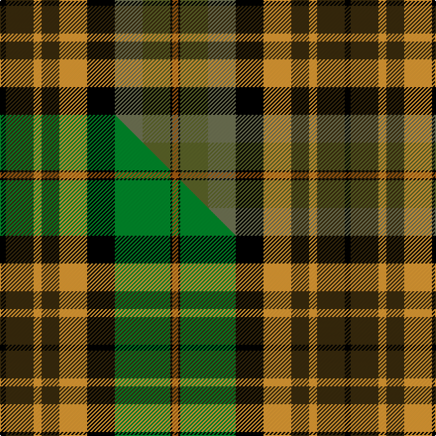

This is one **variant** — a specific cloth: this exact thread count and colourway, with its own
provenance below. It is one weaving of the [sett](/tartans/d/du/dutch-friendship/) (the scale-free proportion — the
same cloth at any scale or shade), whose colour order is pattern [KGYGYKGGKR](/stripes/kgygykggkr/).

Part of the [Dutch Friendship](/tartans/d/du/dutch-friendship/) tartan — the named design grouping this sett with its other cloths.

Sourced from tartans-authority.  It is a [10 stripe tartan](/stripes/stripes10/).

Original link <code>http://www.tartansauthority.com/tartan-ferret/display/6960/</code> — retired · [Internet Archive copy](https://web.archive.org/web/*/http://www.tartansauthority.com/tartan-ferret/display/6960/*)

Dataset <small>— provenance for this record, inherited from the source manifest</small>

<dl class="dataset-prov">
<dt>source</dt><dd><a href="/sources/tartans-authority/">Scottish Tartans Authority</a></dd>
<dt>data captured from</dt><dd><a href="https://github.com/thetartan/tartan-database/blob/master/data/tartans-authority/data.csv">https://github.com/thetartan/tartan-database/blob/master/data/tartans-authority/data.csv</a></dd>
<dt>data date</dt><dd>July 2006 <small>(this record)</small></dd>
<dt>licence</dt><dd><a href="https://creativecommons.org/licenses/by-nc-nd/4.0/">CC BY-NC-ND 4.0</a></dd>
</dl>

Capture chain <small>— the hands this data passed through, oldest first; each capture carries its own licence</small>

<ol class="capture-chain">
<li><a href="https://www.tartansauthority.com/">Scottish Tartans Authority</a> <small>the heritage body’s archive — its tartan-ferret record browser is retired; dead record links are shown unlinked, with an Internet Archive copy (ITI numbers are not SRT references)</small></li>
<li><a href="https://github.com/thetartan/tartan-database">thetartan/tartan-database</a> <small>2016-2017</small> · <a href="https://creativecommons.org/licenses/by-nc-nd/4.0/">CC BY-NC-ND 4.0</a> <small>Levko Kravets's frozen compilation — the capture we vendored, and where its CC licence text came from</small></li>
<li>this dictionary <small>captured 2026-06-10 · commit 5bf86c7566</small> <small>each re-capture is a git commit to data/sources</small></li>
</ol>

## Register references

External register numbers recorded for this tartan.

- Scottish Tartans Authority (ITI): 6960

## Thread count
K/6 DY28 LO8 DY18 LO28 K28 Y28 G28 K2 O/6

One full sett is **348 threads**.

## Palette
<table><thead><tr><th>Colour</th><th>Shade</th><th>OKLCh</th></tr></thead><tbody><tr><td>K</td><td><code style="background-color:#000000;">#000000</code> <small style="color:#888">#000000</small></td><td><small style="color:#888">oklch(0.0% 0.000 0.0)</small></td></tr><tr><td>LO</td><td><code style="background-color:#FF9C34;">#FF9C34</code> <small style="color:#888">#FF9C34</small></td><td><small style="color:#888">oklch(77.9% 0.161 61.8)</small></td></tr><tr><td>Y</td><td><code style="background-color:#707454;">#707454</code> <small style="color:#888">#707454</small></td><td><small style="color:#888">oklch(54.7% 0.047 113.8)</small></td></tr><tr><td>G</td><td><code style="background-color:#5C6428;">#5C6428</code> <small style="color:#888">#5C6428</small></td><td><small style="color:#888">oklch(48.3% 0.084 116.0)</small></td></tr><tr><td>O</td><td><code style="background-color:#A65C11;">#A65C11</code> <small style="color:#888">#A65C11</small></td><td><small style="color:#888">oklch(55.0% 0.125 58.3)</small></td></tr><tr><td>DY</td><td><code style="background-color:#3A2B0D;">#3A2B0D</code> <small style="color:#888">#3A2B0D</small></td><td><small style="color:#888">oklch(30.0% 0.049 82.0)</small></td></tr></tbody></table>

# Sample pattern

[Sample sheet (PDF)](swatch.pdf) — the woven sample, thread count and palette on one printable A4, rendered on demand (the same sheet the TTD print page downloads).

## Compared to the master

This cloth is one sett of its design; the master sett (the exemplar the design is anchored on) is below for comparison.

Its **ΔTartan distance** from the master is **1.38** — the same measure the nearest-tartans table ranks by (0 is identical; a re-scale of the same cloth is near 0, a recolour or a different proportion further).

<figure class="master-compare" style="margin:0">

this sett
master sett ★

<figcaption style="color:#888;font-size:smaller">One weave of this sett against the <a href="/setts/k3dy14lo4dy9lo14k14g28k1o3/">master sett ★</a>, split on the diagonal: a shared proportion runs seamlessly across it with only the shades shifting; a different proportion breaks on it.</figcaption>
</figure>

## Nearest tartan variants

The nearest existing variants by ΔTartan distance, with this cloth at the top so the swatches line up against it.

ΔTartan

Threads

Variant

Sett

—

348

<a href="/variants/s10/k3dy14lo4dy9lo14k14y14g14k1o3~x2~y5405114-g4808117/">Dutch Friendship (Fashion)</a>

<a href="/ttd/edit/#slug=n26k6ly32g14dy11k19w2dy16g11n19k2&amp;base=k3dy14lo4dy9lo14k14y14g14k1o3~x2~y5405114-g4808117" title="compare in the TTD">2.00</a>

288

<a href="/variants/s11/n26k6ly32g14dy11k19w2dy16g11n19k2/">Teddy Bear 111th Anniversary</a>

<a href="/ttd/edit/#slug=n26k6dy32dg14dy11k19w2ly16dg11n19k2&amp;base=k3dy14lo4dy9lo14k14y14g14k1o3~x2~y5405114-g4808117" title="compare in the TTD">2.28</a>

288

<a href="/variants/s11/n26k6dy32dg14dy11k19w2ly16dg11n19k2/">Teddy Bear 111th Anniversary</a>

<a href="/ttd/edit/#slug=r4w1r4g10y1k10lb4k2lb4~x2~r4619030-y4710072&amp;base=k3dy14lo4dy9lo14k14y14g14k1o3~x2~y5405114-g4808117" title="compare in the TTD">2.75</a>

144

<a href="/variants/s9/r4w1r4g10y1k10lb4k2lb4~x2~r4619030-y4710072/">Cumming LO</a>

<a href="/ttd/edit/#slug=k14y3g18r15w2r3w2dp14~x2&amp;base=k3dy14lo4dy9lo14k14y14g14k1o3~x2~y5405114-g4808117" title="compare in the TTD">2.77</a>

228

<a href="/variants/s8/k14y3g18r15w2r3w2dp14~x2/">Wilson's, No 83</a>

<a href="/ttd/edit/#slug=r4w1r4g10y1k10lb4k2lb4~x4&amp;base=k3dy14lo4dy9lo14k14y14g14k1o3~x2~y5405114-g4808117" title="compare in the TTD">2.79</a>

288

<a href="/variants/s9/r4w1r4g10y1k10lb4k2lb4~x4/">Comyn/Cumming</a>

<a href="/ttd/edit/#slug=lr3k15n10o10k1g5k1lo10k10g8k1n2~x2&amp;base=k3dy14lo4dy9lo14k14y14g14k1o3~x2~y5405114-g4808117" title="compare in the TTD">2.79</a>

294

<a href="/variants/s12/lr3k15n10o10k1g5k1lo10k10g8k1n2~x2/">Castlefield (Personal)</a>

<a href="/ttd/edit/#slug=y40k5g48k5dr20k5n14k10w4dr28n10&amp;base=k3dy14lo4dy9lo14k14y14g14k1o3~x2~y5405114-g4808117" title="compare in the TTD">2.87</a>

328

<a href="/variants/s11/y40k5g48k5dr20k5n14k10w4dr28n10/">Kildare County, Crest Range</a>

<a href="/ttd/edit/#slug=g13w2g10k5r13k3r5db15o5~x2&amp;base=k3dy14lo4dy9lo14k14y14g14k1o3~x2~y5405114-g4808117" title="compare in the TTD">2.90</a>

248

<a href="/variants/s9/g13w2g10k5r13k3r5db15o5~x2/">Glen Chalmadale</a>

<a href="/ttd/edit/#slug=dy8db8dy3db1ly2dy10ly2db2ly15y3k3y15k1r3k8r8~x2~dy3908078-ly8117093&amp;base=k3dy14lo4dy9lo14k14y14g14k1o3~x2~y5405114-g4808117" title="compare in the TTD">2.91</a>

336

<a href="/variants/s16/dy8db8dy3db1ly2dy10ly2db2ly15y3k3y15k1r3k8r8~x2~dy3908078-ly8117093/">Du Lion</a>

<a href="/ttd/edit/#slug=g28lb2dp20t9r22k7r22t9dp20lb2g28ly7~x2~lb80-dp2712327-t6107234-ly8117093&amp;base=k3dy14lo4dy9lo14k14y14g14k1o3~x2~y5405114-g4808117" title="compare in the TTD">3.01</a>

634

<a href="/variants/s12/g28lb2dp20t9r22k7r22t9dp20lb2g28ly7~x2~lb80-dp2712327-t6107234-ly8117093/">Jefferson (Personal)</a>

## Neighbour map

Every grey dot is one of 13662 variants placed by the first two principal components of the ΔTartan feature space (42% of its variance). Red is this tartan; blue dots are its nearest — click one to open its page. The map is a flat projection of a many-dimensional space — [how to read it](/posts/neighbourhood-maps/).

<svg viewBox="0 0 640 380" role="img" style="max-width:100%;height:auto;border:1px solid #e0e0e0;border-radius:4px;display:block" xmlns="http://www.w3.org/2000/svg"><image href="/nn/cloud.v1.png" width="640" height="380"/><a href="/variants/s11/n26k6ly32g14dy11k19w2dy16g11n19k2/"><circle cx="55.7" cy="152.2" r="4" fill="#3465a4"><title>Teddy Bear 111th Anniversary</title></circle></a><a href="/variants/s11/n26k6dy32dg14dy11k19w2ly16dg11n19k2/"><circle cx="82.3" cy="157.4" r="4" fill="#3465a4"><title>Teddy Bear 111th Anniversary</title></circle></a><a href="/variants/s9/r4w1r4g10y1k10lb4k2lb4~x2~r4619030-y4710072/"><circle cx="52.9" cy="158.6" r="4" fill="#3465a4"><title>Cumming LO</title></circle></a><a href="/variants/s8/k14y3g18r15w2r3w2dp14~x2/"><circle cx="44.6" cy="166.7" r="4" fill="#3465a4"><title>Wilson's, No 83</title></circle></a><a href="/variants/s9/r4w1r4g10y1k10lb4k2lb4~x4/"><circle cx="51.8" cy="157.6" r="4" fill="#3465a4"><title>Comyn/Cumming</title></circle></a><a href="/variants/s12/lr3k15n10o10k1g5k1lo10k10g8k1n2~x2/"><circle cx="76.0" cy="129.7" r="4" fill="#3465a4"><title>Castlefield (Personal)</title></circle></a><a href="/variants/s11/y40k5g48k5dr20k5n14k10w4dr28n10/"><circle cx="82.0" cy="149.6" r="4" fill="#3465a4"><title>Kildare County, Crest Range</title></circle></a><a href="/variants/s9/g13w2g10k5r13k3r5db15o5~x2/"><circle cx="54.9" cy="186.1" r="4" fill="#3465a4"><title>Glen Chalmadale</title></circle></a><a href="/variants/s16/dy8db8dy3db1ly2dy10ly2db2ly15y3k3y15k1r3k8r8~x2~dy3908078-ly8117093/"><circle cx="32.5" cy="118.4" r="4" fill="#3465a4"><title>Du Lion</title></circle></a><a href="/variants/s12/g28lb2dp20t9r22k7r22t9dp20lb2g28ly7~x2~lb80-dp2712327-t6107234-ly8117093/"><circle cx="69.1" cy="138.3" r="4" fill="#3465a4"><title>Jefferson (Personal)</title></circle></a><circle cx="40.6" cy="159.6" r="5" fill="#c00000"/><text x="320" y="376" text-anchor="middle" font-size="11" fill="#999">ground</text><text x="11" y="190" text-anchor="middle" font-size="11" fill="#999" transform="rotate(-90 11 190)">complexity</text></svg>

ID: /variants/s10/k3dy14lo4dy9lo14k14y14g14k1o3~x2~y5405114-g4808117/
