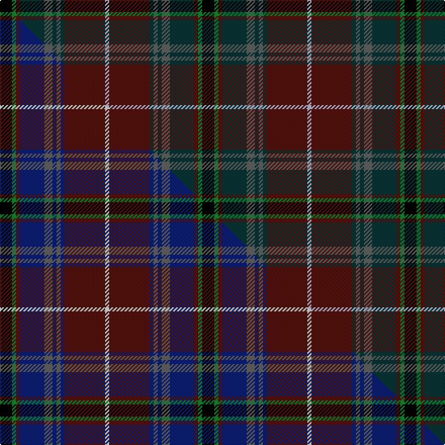

This is one **variant** — a specific cloth: this exact thread count and colourway, with its own
provenance below. It is one weaving of the [sett](/tartans/c/cr/crieff-primary-school/) (the scale-free proportion — the
same cloth at any scale or shade), whose colour order is pattern [KGBBBBBBBW](/stripes/kgbbbbbbbw/).

Part of the [Crieff Primary School](/tartans/c/cr/crieff-primary-school/) tartan — the named design grouping this sett with its other cloths.

Sourced from house-of-tartan.  It is a [10 stripe tartan](/stripes/stripes10/).

Original link [http://www.house-of-tartan.scotland.net/house/TartanViewjs.asp?colr=Def&tnam=11011](http://www.house-of-tartan.scotland.net/house/TartanViewjs.asp?colr=Def&tnam=11011)

## Provenance

Earliest known date: 2013 The Crieff Primary School Tartan was designed in 2014, inspired by ideas generated from pupils during a whole-school consultation, its staff, and guided in the final design by House of Tartan Ltd., Comrie, represented by Blair Urquhart. Creating its own tartan is a new era milestone and forms a key element of the school's new uniform; co-inciding with the School's move from the old building in Commissioner Street, Crieff (founded 1874) to its new home in Broich Road, Crieff, in the summer of 2015. The CPS tartan retains the school's claret red colour, with blue and white added to represent the sky and timeless River Earn which flows through the town. The grey/black represent the playgrounds and Victorian black railings being left in the past at Commissioner St ; while the green depicts future play spaces and greener settings at the new school. The Crieff Primary School community of 2013/14 embraced this special tartan in the expectation current and future generations of pupils would always wear it with pride.

Dataset <small>— provenance for this record, inherited from the source manifest</small>

<dl class="dataset-prov">
<dt>source</dt><dd><a href="/sources/house-of-tartan/">House of Tartan</a></dd>
<dt>data captured from</dt><dd><a href="https://github.com/thetartan/tartan-database/blob/master/data/house-of-tartan/data.csv">https://github.com/thetartan/tartan-database/blob/master/data/house-of-tartan/data.csv</a></dd>
<dt>data date</dt><dd>2013 <small>(this record)</small></dd>
<dt>licence</dt><dd><a href="https://creativecommons.org/licenses/by-nc-nd/4.0/">CC BY-NC-ND 4.0</a></dd>
</dl>

Capture chain <small>— the hands this data passed through, oldest first; each capture carries its own licence</small>

<ol class="capture-chain">
<li><a href="http://www.house-of-tartan.scotland.net/">House of Tartan</a> <small>the weaver/retailer's database — the site is now offline; the URL is kept as the ultimate source's identity</small></li>
<li><a href="https://github.com/thetartan/tartan-database">thetartan/tartan-database</a> <small>2016-2017</small> · <a href="https://creativecommons.org/licenses/by-nc-nd/4.0/">CC BY-NC-ND 4.0</a> <small>Levko Kravets's frozen compilation — the capture we vendored, and where its CC licence text came from</small></li>
<li>this dictionary <small>captured 2026-06-10 · commit 5bf86c7566</small> <small>each re-capture is a git commit to data/sources</small></li>
</ol>

## Thread count
K/12 G4 DR4 DT24 N8 DT4 N4 DT4 DR40 LB/4

One full sett is **200 threads**.

## Palette
<table><thead><tr><th>Colour</th><th>Shade</th><th>OKLCh</th></tr></thead><tbody><tr><td>DT</td><td><code style="background-color:#023535;">#023535</code> <small style="color:#888">#023535</small></td><td><small style="color:#888">oklch(29.8% 0.050 194.8)</small></td></tr><tr><td>DR</td><td><code style="background-color:#55120C;">#55120C</code> <small style="color:#888">#55120C</small></td><td><small style="color:#888">oklch(30.0% 0.099 29.3)</small></td></tr><tr><td>G</td><td><code style="background-color:#008B2A;">#008B2A</code> <small style="color:#888">#008B2A</small></td><td><small style="color:#888">oklch(55.4% 0.170 145.9)</small></td></tr><tr><td>K</td><td><code style="background-color:#000000;">#000000</code> <small style="color:#888">#000000</small></td><td><small style="color:#888">oklch(0.0% 0.000 0.0)</small></td></tr><tr><td>LB</td><td><code style="background-color:#B5BBDE;">#B5BBDE</code> <small style="color:#888">#B5BBDE</small></td><td><small style="color:#888">oklch(79.9% 0.050 277.6)</small></td></tr><tr><td>N</td><td><code style="background-color:#636363;">#636363</code> <small style="color:#888">#636363</small></td><td><small style="color:#888">oklch(50.0% 0.000 89.9)</small></td></tr></tbody></table>

# Sample pattern

[Sample sheet (PDF)](swatch.pdf) — the woven sample, thread count and palette on one printable A4, rendered on demand (the same sheet the TTD print page downloads).

## Compared to the master

This cloth is one sett of its design; the master sett (the exemplar the design is anchored on) is below for comparison.

Its **ΔTartan distance** from the master is **2.80** — the same measure the nearest-tartans table ranks by (0 is identical; a re-scale of the same cloth is near 0, a recolour or a different proportion further).

<figure class="master-compare" style="margin:0">

this sett
master sett ★

<figcaption style="color:#888;font-size:smaller">One weave of this sett against the <a href="/setts/k3g1dr1db6n2db1n1db1dr10w1/">master sett ★</a>, split on the diagonal: a shared proportion runs seamlessly across it with only the shades shifting; a different proportion breaks on it.</figcaption>
</figure>

## Nearest tartan variants

The nearest existing variants by ΔTartan distance, with this cloth at the top so the swatches line up against it.

ΔTartan

Threads

Variant

Sett

—

200

<a href="/variants/s10/k3g1dr1dt6n2dt1n1dt1dr10lb1~x4/">Crieff Primary School Corporate (Schools) Tartan</a>

<a href="/ttd/edit/#slug=dp24do2g3o2g3k11do29w2~x2&amp;base=k3g1dr1dt6n2dt1n1dt1dr10lb1~x4" title="compare in the TTD">2.32</a>

252

<a href="/variants/s8/dp24do2g3o2g3k11do29w2~x2/">Alba</a>

<a href="/ttd/edit/#slug=do6o4n22dr4k22do22k2dr5k2do6~x2~o62-n47&amp;base=k3g1dr1dt6n2dt1n1dt1dr10lb1~x4" title="compare in the TTD">2.67</a>

356

<a href="/variants/s10/do6o4n22dr4k22do22k2dr5k2do6~x2~o62-n47/">Lochaber (Ingles Buchan)</a>

<a href="/ttd/edit/#slug=dr12n4dr7do2dr2do28dy2do28k2do2k23dr3ly6dr3k5&amp;base=k3g1dr1dt6n2dt1n1dt1dr10lb1~x4" title="compare in the TTD">2.79</a>

241

<a href="/variants/s15/dr12n4dr7do2dr2do28dy2do28k2do2k23dr3ly6dr3k5/">Scottish Register of Tartans' Tartan</a>

<a href="/ttd/edit/#slug=k3g1dr1db6n2db1n1db1dr10w1~x4&amp;base=k3g1dr1dt6n2dt1n1dt1dr10lb1~x4" title="compare in the TTD">2.80</a>

200

<a href="/variants/s10/k3g1dr1db6n2db1n1db1dr10w1~x4/">Crieff Primary School</a>

<a href="/ttd/edit/#slug=db6k3r2k3dg31k6g2k6dy13k2g2~x2&amp;base=k3g1dr1dt6n2dt1n1dt1dr10lb1~x4" title="compare in the TTD">2.87</a>

288

<a href="/variants/s11/db6k3r2k3dg31k6g2k6dy13k2g2~x2/">Rourke-Frew Hunting</a>

<a href="/ttd/edit/#slug=dr2do1k1do10dr1do10k13n4k1n11dy9n2lr1~x2~n43-lr75&amp;base=k3g1dr1dt6n2dt1n1dt1dr10lb1~x4" title="compare in the TTD">3.07</a>

258

<a href="/variants/s13/dr2do1k1do10dr1do10k13n4k1n11dy9n2lr1~x2~n43-lr75/">Bruma</a>

<a href="/ttd/edit/#slug=dy6r3dy34k16y3dt22r4~x2&amp;base=k3g1dr1dt6n2dt1n1dt1dr10lb1~x4" title="compare in the TTD">3.08</a>

332

<a href="/variants/s7/dy6r3dy34k16y3dt22r4~x2/">Ballantrae (Macnaughtons)</a>

<a href="/ttd/edit/#slug=k23y2dr3db7dr3y2dg15dr21y5~x2&amp;base=k3g1dr1dt6n2dt1n1dt1dr10lb1~x4" title="compare in the TTD">3.12</a>

268

<a href="/variants/s9/k23y2dr3db7dr3y2dg15dr21y5~x2/">Land's End (Unnamed Maroon)</a>

<a href="/ttd/edit/#slug=dr16y2dy7y2t24k2g2~x2&amp;base=k3g1dr1dt6n2dt1n1dt1dr10lb1~x4" title="compare in the TTD">3.13</a>

184

<a href="/variants/s7/dr16y2dy7y2t24k2g2~x2/">Traill Clan/Family Weavers Tartan</a>

<a href="/ttd/edit/#slug=k8r2k6ly2k2lb2k2dy16dg24r2dg4k3~x2&amp;base=k3g1dr1dt6n2dt1n1dt1dr10lb1~x4" title="compare in the TTD">3.17</a>

270

<a href="/variants/s12/k8r2k6ly2k2lb2k2dy16dg24r2dg4k3~x2/">Tara (District)</a>

## Neighbour map

Every grey dot is one of 13662 variants placed by the first two principal components of the ΔTartan feature space (42% of its variance). Red is this tartan; blue dots are its nearest — click one to open its page. The map is a flat projection of a many-dimensional space — [how to read it](/posts/neighbourhood-maps/).

<svg viewBox="0 0 640 380" role="img" style="max-width:100%;height:auto;border:1px solid #e0e0e0;border-radius:4px;display:block" xmlns="http://www.w3.org/2000/svg"><image href="/nn/cloud.v1.png" width="640" height="380"/><a href="/variants/s8/dp24do2g3o2g3k11do29w2~x2/"><circle cx="212.2" cy="136.2" r="4" fill="#3465a4"><title>Alba</title></circle></a><a href="/variants/s10/do6o4n22dr4k22do22k2dr5k2do6~x2~o62-n47/"><circle cx="184.8" cy="172.6" r="4" fill="#3465a4"><title>Lochaber (Ingles Buchan)</title></circle></a><a href="/variants/s15/dr12n4dr7do2dr2do28dy2do28k2do2k23dr3ly6dr3k5/"><circle cx="240.4" cy="120.0" r="4" fill="#3465a4"><title>Scottish Register of Tartans' Tartan</title></circle></a><a href="/variants/s10/k3g1dr1db6n2db1n1db1dr10w1~x4/"><circle cx="177.8" cy="140.0" r="4" fill="#3465a4"><title>Crieff Primary School</title></circle></a><a href="/variants/s11/db6k3r2k3dg31k6g2k6dy13k2g2~x2/"><circle cx="215.5" cy="124.0" r="4" fill="#3465a4"><title>Rourke-Frew Hunting</title></circle></a><a href="/variants/s13/dr2do1k1do10dr1do10k13n4k1n11dy9n2lr1~x2~n43-lr75/"><circle cx="183.5" cy="157.2" r="4" fill="#3465a4"><title>Bruma</title></circle></a><a href="/variants/s7/dy6r3dy34k16y3dt22r4~x2/"><circle cx="262.7" cy="191.5" r="4" fill="#3465a4"><title>Ballantrae (Macnaughtons)</title></circle></a><a href="/variants/s9/k23y2dr3db7dr3y2dg15dr21y5~x2/"><circle cx="171.0" cy="172.9" r="4" fill="#3465a4"><title>Land's End (Unnamed Maroon)</title></circle></a><a href="/variants/s7/dr16y2dy7y2t24k2g2~x2/"><circle cx="221.4" cy="159.6" r="4" fill="#3465a4"><title>Traill Clan/Family Weavers Tartan</title></circle></a><a href="/variants/s12/k8r2k6ly2k2lb2k2dy16dg24r2dg4k3~x2/"><circle cx="161.3" cy="121.3" r="4" fill="#3465a4"><title>Tara (District)</title></circle></a><circle cx="210.7" cy="152.8" r="5" fill="#c00000"/><text x="320" y="376" text-anchor="middle" font-size="11" fill="#999">ground</text><text x="11" y="190" text-anchor="middle" font-size="11" fill="#999" transform="rotate(-90 11 190)">complexity</text></svg>

ID: /variants/s10/k3g1dr1dt6n2dt1n1dt1dr10lb1~x4/
