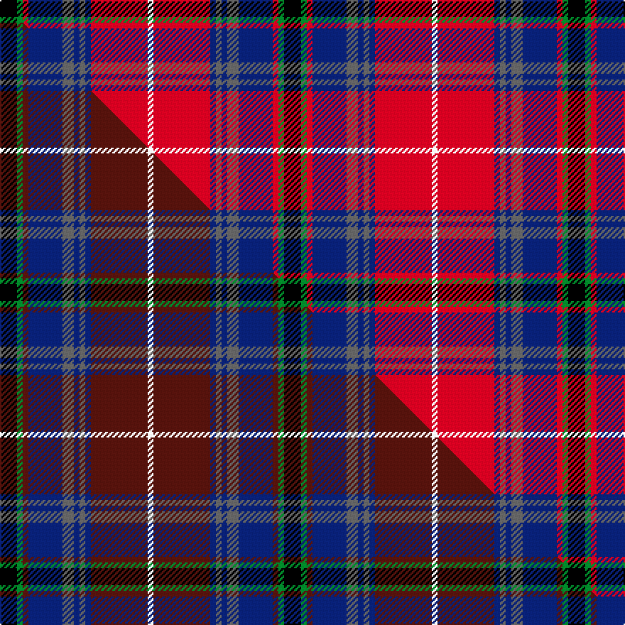

This is one **variant** — a specific cloth: this exact thread count and colourway, with its own
provenance below. It is one weaving of the [sett](/setts/k3g1r1db6n2db1n1db1r10w1/) (the scale-free proportion — the
same cloth at any scale or shade), whose colour order is pattern [KGRBBBBBRW](/stripes/kgrbbbbbrw/).

Part of the [Crieff Primary School](/tartans/crieff-primary-school/) tartan — the named design grouping this sett with its other cloths.

Sourced from tartans-authority.  It is a [10 stripe tartan](/stripes/stripes10/).

Original link [https://www.tartanregister.gov.uk/tartanDetails.aspx?ref=11011](https://www.tartanregister.gov.uk/tartanDetails.aspx?ref=11011)

Dataset <small>— provenance for this record, inherited from the source manifest</small>

<dl class="dataset-prov">
<dt>source</dt><dd><a href="/sources/tartans-authority/">Scottish Tartans Authority</a></dd>
<dt>data captured from</dt><dd><a href="https://github.com/thetartan/tartan-database/blob/master/data/tartans-authority/data.csv">https://github.com/thetartan/tartan-database/blob/master/data/tartans-authority/data.csv</a></dd>
<dt>data date</dt><dd>2014 <small>(this record)</small></dd>
<dt>licence</dt><dd><a href="https://creativecommons.org/licenses/by-nc-nd/4.0/">CC BY-NC-ND 4.0</a></dd>
</dl>

Capture chain <small>— the hands this data passed through, oldest first; each capture carries its own licence</small>

<ol class="capture-chain">
<li><a href="https://www.tartansauthority.com/">Scottish Tartans Authority</a> <small>the heritage body's archive — its tartan-ferret record browser is retired (links repaired to the SRT, above)</small></li>
<li><a href="https://github.com/thetartan/tartan-database">thetartan/tartan-database</a> <small>2016-2017</small> · <a href="https://creativecommons.org/licenses/by-nc-nd/4.0/">CC BY-NC-ND 4.0</a> <small>Levko Kravets's frozen compilation — the capture we vendored, and where its CC licence text came from</small></li>
<li>this dictionary <small>captured 2026-06-10 · commit 5bf86c7566</small> <small>each re-capture is a git commit to data/sources</small></li>
</ol>

## Register references

External register numbers recorded for this tartan.

- Scottish Register of Tartans: [11011](https://www.tartanregister.gov.uk/tartanDetails?ref=11011)
- Scottish Tartans Authority (ITI): 11011

## Thread count
K/12 G4 R4 DB24 N8 DB4 N4 DB4 R40 W/4

One full sett is **200 threads**.

## Palette
<table><thead><tr><th>Colour</th><th>Shade</th><th>OKLCh</th></tr></thead><tbody><tr><td>DB</td><td><code style="background-color:#082077;">#082077</code> <small style="color:#888">#082077</small></td><td><small style="color:#888">oklch(30.0% 0.149 265.1)</small></td></tr><tr><td>G</td><td><code style="background-color:#008B2A;">#008B2A</code> <small style="color:#888">#008B2A</small></td><td><small style="color:#888">oklch(55.4% 0.170 145.9)</small></td></tr><tr><td>K</td><td><code style="background-color:#000000;">#000000</code> <small style="color:#888">#000000</small></td><td><small style="color:#888">oklch(0.0% 0.000 0.0)</small></td></tr><tr><td>N</td><td><code style="background-color:#636363;">#636363</code> <small style="color:#888">#636363</small></td><td><small style="color:#888">oklch(50.0% 0.000 89.9)</small></td></tr><tr><td>R</td><td><code style="background-color:#D60020;">#D60020</code> <small style="color:#888">#D60020</small></td><td><small style="color:#888">oklch(55.2% 0.224 25.5)</small></td></tr><tr><td>W</td><td><code style="background-color:#F7F7F7;">#F7F7F7</code> <small style="color:#888">#F7F7F7</small></td><td><small style="color:#888">oklch(97.6% 0.000 89.9)</small></td></tr></tbody></table>

# Sample pattern

## Compared to the master

This cloth is one sett of its design; the master sett (the exemplar the design is anchored on) is below for comparison.

Its **ΔTartan distance** from the master is **0.17** — the same measure the nearest-tartans table ranks by (0 is identical; a re-scale of the same cloth is near 0, a recolour or a different proportion further).

<figure class="master-compare" style="margin:0">

this sett
master sett ★

<figcaption style="color:#888;font-size:smaller">One weave of this sett against the <a href="/setts/k3g1dr1db6n2db1n1db1dr10w1/">master sett ★</a>, split on the diagonal: a shared proportion runs seamlessly across it with only the shades shifting; a different proportion breaks on it.</figcaption>
</figure>

## Nearest tartan variants

The nearest existing variants by ΔTartan distance, with this cloth at the top so the swatches line up against it.

ΔTartan

Threads

Variant

Sett

—

200

<a href="/variants/s10/k3g1r1db6n2db1n1db1r10w1~x4/">Crieff Primary School</a>

<a href="/ttd/edit/#slug=k4db12lb3db4g8lo2r24db4r4~x2&amp;base=k3g1r1db6n2db1n1db1r10w1~x4" title="compare in the TTD">1.66</a>

244

<a href="/variants/s9/k4db12lb3db4g8lo2r24db4r4~x2/">MacCreary (Personal)</a>

<a href="/ttd/edit/#slug=db4dy3db22n6w2k6w2r26k3r4~x2&amp;base=k3g1r1db6n2db1n1db1r10w1~x4" title="compare in the TTD">1.85</a>

296

<a href="/variants/s10/db4dy3db22n6w2k6w2r26k3r4~x2/">Asman, Dress (Name)</a>

<a href="/ttd/edit/#slug=db4dy3db22n6w2k6w2r26k3r4~x2~db1406275&amp;base=k3g1r1db6n2db1n1db1r10w1~x4" title="compare in the TTD">1.86</a>

296

<a href="/variants/s10/db4dy3db22n6w2k6w2r26k3r4~x2~db1406275/">Asman Dress Family Tartan</a>

<a href="/ttd/edit/#slug=r4k4r32g4w3g4k13g3db18r2y3~x2&amp;base=k3g1r1db6n2db1n1db1r10w1~x4" title="compare in the TTD">2.17</a>

346

<a href="/variants/s11/r4k4r32g4w3g4k13g3db18r2y3~x2/">Norwell</a>

<a href="/ttd/edit/#slug=db8w3db25k3db4k8r31y2r5~x2&amp;base=k3g1r1db6n2db1n1db1r10w1~x4" title="compare in the TTD">2.20</a>

330

<a href="/variants/s9/db8w3db25k3db4k8r31y2r5~x2/">Caledon (Corporate)</a>

<a href="/ttd/edit/#slug=y1k1r8db1r1dg8r1db8r1dg1r8k1w1~x6&amp;base=k3g1r1db6n2db1n1db1r10w1~x4" title="compare in the TTD">2.21</a>

480

<a href="/variants/s13/y1k1r8db1r1dg8r1db8r1dg1r8k1w1~x6/">Robieson</a>

<a href="/ttd/edit/#slug=dg3g3r22k5db22y2~x2~dg1806142-g2408144&amp;base=k3g1r1db6n2db1n1db1r10w1~x4" title="compare in the TTD">2.30</a>

424

<a href="/variants/s10/dg3g3r22k5db22y2db22k5r22g3~x2~dg1806142-g2408144/">MacLeod Society of Scotland Clan Tartan</a>

<a href="/ttd/edit/#slug=k2db12r12db2r2lb2r2lb2r12db6r2dg12k2y1r1y1~x2&amp;base=k3g1r1db6n2db1n1db1r10w1~x4" title="compare in the TTD">2.33</a>

286

<a href="/variants/s16/k2db12r12db2r2lb2r2lb2r12db6r2dg12k2y1r1y1~x2/">Catalan Dance</a>

<a href="/ttd/edit/#slug=k3r30g10k3y2k3w2k6r2db12w2~x2&amp;base=k3g1r1db6n2db1n1db1r10w1~x4" title="compare in the TTD">2.37</a>

290

<a href="/variants/s11/k3r30g10k3y2k3w2k6r2db12w2~x2/">Kilmorie</a>

<a href="/ttd/edit/#slug=db12r30db2lb2k8lb2k4ly2k4dg15r8k2r4lb2~x2&amp;base=k3g1r1db6n2db1n1db1r10w1~x4" title="compare in the TTD">2.45</a>

360

<a href="/variants/s14/db12r30db2lb2k8lb2k4ly2k4dg15r8k2r4lb2~x2/">Brown of Castledean (Artefact)</a>

## Neighbour map

Every grey dot is one of 13621 variants placed by the first two principal components of the ΔTartan feature space (42% of its variance). Red is this tartan; blue dots are its nearest — click one to open its page.

<svg viewBox="0 0 640 380" role="img" style="max-width:100%;height:auto;border:1px solid #e0e0e0;border-radius:4px;display:block" xmlns="http://www.w3.org/2000/svg"><image href="/nn/cloud.v1.png" width="640" height="380"/><a href="/variants/s9/k4db12lb3db4g8lo2r24db4r4~x2/"><circle cx="161.5" cy="132.2" r="4" fill="#3465a4"><title>MacCreary (Personal)</title></circle></a><a href="/variants/s10/db4dy3db22n6w2k6w2r26k3r4~x2/"><circle cx="145.1" cy="113.3" r="4" fill="#3465a4"><title>Asman, Dress (Name)</title></circle></a><a href="/variants/s10/db4dy3db22n6w2k6w2r26k3r4~x2~db1406275/"><circle cx="151.0" cy="114.3" r="4" fill="#3465a4"><title>Asman Dress Family Tartan</title></circle></a><a href="/variants/s11/r4k4r32g4w3g4k13g3db18r2y3~x2/"><circle cx="148.5" cy="96.2" r="4" fill="#3465a4"><title>Norwell</title></circle></a><a href="/variants/s9/db8w3db25k3db4k8r31y2r5~x2/"><circle cx="199.7" cy="126.1" r="4" fill="#3465a4"><title>Caledon (Corporate)</title></circle></a><a href="/variants/s13/y1k1r8db1r1dg8r1db8r1dg1r8k1w1~x6/"><circle cx="170.2" cy="125.2" r="4" fill="#3465a4"><title>Robieson</title></circle></a><a href="/variants/s10/dg3g3r22k5db22y2db22k5r22g3~x2~dg1806142-g2408144/"><circle cx="158.3" cy="139.0" r="4" fill="#3465a4"><title>MacLeod Society of Scotland Clan Tartan</title></circle></a><a href="/variants/s16/k2db12r12db2r2lb2r2lb2r12db6r2dg12k2y1r1y1~x2/"><circle cx="155.9" cy="109.3" r="4" fill="#3465a4"><title>Catalan Dance</title></circle></a><a href="/variants/s11/k3r30g10k3y2k3w2k6r2db12w2~x2/"><circle cx="147.8" cy="91.6" r="4" fill="#3465a4"><title>Kilmorie</title></circle></a><a href="/variants/s14/db12r30db2lb2k8lb2k4ly2k4dg15r8k2r4lb2~x2/"><circle cx="148.0" cy="89.0" r="4" fill="#3465a4"><title>Brown of Castledean (Artefact)</title></circle></a><circle cx="148.4" cy="124.7" r="5" fill="#c00000"/><text x="320" y="376" text-anchor="middle" font-size="11" fill="#999">ground</text><text x="11" y="190" text-anchor="middle" font-size="11" fill="#999" transform="rotate(-90 11 190)">complexity</text></svg>

ID: /variants/s10/k3g1r1db6n2db1n1db1r10w1~x4/
