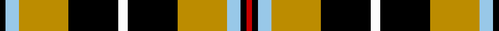

This page is one **sett** — a single exact thread-count. It belongs to the [tartan](/setts/k3lb7lo26k26w5k26lo26lb7k3r3/)
(the same proportion at any scale), whose colour order is pattern [KWYKWKYWKR](/stripes/kwykwkywkr/).

Part of the [Cornish National](/tartans/cornish-national/) tartan — the named design grouping this sett with its other cloths.

Sourced from register-of-tartans.  It is a [10 stripe tartan](/stripes/stripes10/).

Original link https://www.tartanregister.gov.uk/tartanDetails.aspx?ref=766

## Also known as

This cloth is also recorded under:

- Cornish National #2
- Cornish, National

## Register references

External register numbers recorded for this tartan.

- Scottish Register of Tartans: [766](https://www.tartanregister.gov.uk/tartanDetails.aspx?ref=766)
- Scottish Tartans Authority (ITI): 1567
- Scottish Tartans World Register: 1567

## Thread count
K/6 LB14 DY52 K52 W10 K52 DY52 LB14 K6 R/6

One full sett is **516 threads**.

## Palette

Palette: <strong>Tartan Register</strong>
<table><thead><tr><th>Colour</th><th>Threads</th><th>Shade</th><th>Base</th><th>OKLCh</th></tr></thead><tbody><tr><td>K/</td><td style="text-align:right;font-variant-numeric:tabular-nums">6</td><td><code style="background-color:#000000;">#000000</code> <small style="color:#888">#000000</small></td><td>K <code style="background-color:#000000;">#000000</code></td><td><small style="color:#888">oklch(0.0% 0.000 0.0)</small></td></tr><tr><td>LB</td><td style="text-align:right;font-variant-numeric:tabular-nums">14</td><td><code style="background-color:#98C8E8;">#98C8E8</code> <small style="color:#888">#98C8E8</small></td><td>W <code style="background-color:#F7F7F7;">#F7F7F7</code></td><td><small style="color:#888">oklch(81.0% 0.068 237.9)</small></td></tr><tr><td>DY</td><td style="text-align:right;font-variant-numeric:tabular-nums">52</td><td><code style="background-color:#BC8C00;">#BC8C00</code> <small style="color:#888">#BC8C00</small></td><td>Y <code style="background-color:#F2BF00;">#F2BF00</code></td><td><small style="color:#888">oklch(66.8% 0.137 84.1)</small></td></tr><tr><td>K</td><td style="text-align:right;font-variant-numeric:tabular-nums">52</td><td><code style="background-color:#000000;">#000000</code> <small style="color:#888">#000000</small></td><td>K <code style="background-color:#000000;">#000000</code></td><td><small style="color:#888">oklch(0.0% 0.000 0.0)</small></td></tr><tr><td>W</td><td style="text-align:right;font-variant-numeric:tabular-nums">10</td><td><code style="background-color:#FCFCFC;">#FCFCFC</code> <small style="color:#888">#FCFCFC</small></td><td>W <code style="background-color:#F7F7F7;">#F7F7F7</code></td><td><small style="color:#888">oklch(99.1% 0.000 89.9)</small></td></tr><tr><td>K</td><td style="text-align:right;font-variant-numeric:tabular-nums">52</td><td><code style="background-color:#000000;">#000000</code> <small style="color:#888">#000000</small></td><td>K <code style="background-color:#000000;">#000000</code></td><td><small style="color:#888">oklch(0.0% 0.000 0.0)</small></td></tr><tr><td>DY</td><td style="text-align:right;font-variant-numeric:tabular-nums">52</td><td><code style="background-color:#BC8C00;">#BC8C00</code> <small style="color:#888">#BC8C00</small></td><td>Y <code style="background-color:#F2BF00;">#F2BF00</code></td><td><small style="color:#888">oklch(66.8% 0.137 84.1)</small></td></tr><tr><td>LB</td><td style="text-align:right;font-variant-numeric:tabular-nums">14</td><td><code style="background-color:#98C8E8;">#98C8E8</code> <small style="color:#888">#98C8E8</small></td><td>W <code style="background-color:#F7F7F7;">#F7F7F7</code></td><td><small style="color:#888">oklch(81.0% 0.068 237.9)</small></td></tr><tr><td>K</td><td style="text-align:right;font-variant-numeric:tabular-nums">6</td><td><code style="background-color:#000000;">#000000</code> <small style="color:#888">#000000</small></td><td>K <code style="background-color:#000000;">#000000</code></td><td><small style="color:#888">oklch(0.0% 0.000 0.0)</small></td></tr><tr><td>R/</td><td style="text-align:right;font-variant-numeric:tabular-nums">6</td><td><code style="background-color:#C80000;">#C80000</code> <small style="color:#888">#C80000</small></td><td>R <code style="background-color:#CC0000;">#CC0000</code></td><td><small style="color:#888">oklch(52.3% 0.215 29.2)</small></td></tr></tbody></table>

## Nearest tartans

The nearest existing variants by ΔTartan distance, with this tartan at the top so the swatches line up against it.

ΔTartan

Tartan

Sett

—

<a href="/ttd/edit/#slug=k3lb7lo26k26w5k26lo26lb7k3r3~x2">Cornish National</a> <a class="nn-out" href="/variants/s10/k3lb7lo26k26w5k26lo26lb7k3r3~x2/" title="open its dictionary page">↗</a>

1.00

<a href="/ttd/edit/#slug=r4k2ly13lo3k22r2k2w13k7r3k7w4~x2&amp;base=k3lb7lo26k26w5k26lo26lb7k3r3~x2">Tyrone County Crest (Fashion)</a> <a class="nn-out" href="/variants/s12/r4k2ly13lo3k22r2k2w13k7r3k7w4~x2/" title="open its dictionary page">↗</a>

1.07

<a href="/ttd/edit/#slug=k10ly2g11r11w1r1w1k9~x2&amp;base=k3lb7lo26k26w5k26lo26lb7k3r3~x2">Unnamed No 5</a> <a class="nn-out" href="/variants/s8/k10ly2g11r11w1r1w1k9~x2/" title="open its dictionary page">↗</a>

1.08

<a href="/ttd/edit/#slug=k6y1k1y4ly1r1ly4r1ly2y4k1y1k8w1k2~x4&amp;base=k3lb7lo26k26w5k26lo26lb7k3r3~x2">Confessore (Personal)</a> <a class="nn-out" href="/variants/s15/k6y1k1y4ly1r1ly4r1ly2y4k1y1k8w1k2~x4/" title="open its dictionary page">↗</a>

1.14

<a href="/ttd/edit/#slug=w5k26lo26t7k3r3~x2&amp;base=k3lb7lo26k26w5k26lo26lb7k3r3~x2">Cornish National (District)</a> <a class="nn-out" href="/variants/s6/w5k26lo26t7k3r3~x2/" title="open its dictionary page">↗</a>

1.24

<a href="/ttd/edit/#slug=w5k26ly26t7k3r3~x2&amp;base=k3lb7lo26k26w5k26lo26lb7k3r3~x2">Cornish, National</a> <a class="nn-out" href="/variants/s6/w5k26ly26t7k3r3~x2/" title="open its dictionary page">↗</a>

1.29

<a href="/variants/s13/r3w2g8r8k16w2k3w2k16ki8w8ki2w3~x2/">Niagara Celtic Heritage Festival</a>

1.30

<a href="/ttd/edit/#slug=o6k3dg3k6ri2k2ri2k6dg3o14r2~x2&amp;base=k3lb7lo26k26w5k26lo26lb7k3r3~x2">Fountain of the Strong</a> <a class="nn-out" href="/variants/s11/o6k3dg3k6ri2k2ri2k6dg3o14r2~x2/" title="open its dictionary page">↗</a>

1.30

<a href="/ttd/edit/#slug=ly4k1r16k16w3r1k16g16k1ly4~x2&amp;base=k3lb7lo26k26w5k26lo26lb7k3r3~x2">MacLamroc</a> <a class="nn-out" href="/variants/s10/ly4k1r16k16w3r1k16g16k1ly4~x2/" title="open its dictionary page">↗</a>

1.30

<a href="/ttd/edit/#slug=g28t3g3k10r2k10r20ly4~x2&amp;base=k3lb7lo26k26w5k26lo26lb7k3r3~x2">Garvock (2015)</a> <a class="nn-out" href="/variants/s8/g28t3g3k10r2k10r20ly4~x2/" title="open its dictionary page">↗</a>

1.30

<a href="/ttd/edit/#slug=o1k1o10k1o4k1oi3k5w2oi1~x4&amp;base=k3lb7lo26k26w5k26lo26lb7k3r3~x2">Braemar, Camel</a> <a class="nn-out" href="/variants/s10/o1k1o10k1o4k1oi3k5w2oi1~x4/" title="open its dictionary page">↗</a>

## Neighbour map

Every grey dot is one of 14360 variants placed by the first two principal components of the ΔTartan feature space (44% of its variance). Red is this tartan; blue dots are its nearest — click one to open its page.

<svg viewBox="0 0 640 380" role="img" style="max-width:100%;height:auto;border:1px solid #e0e0e0;border-radius:4px;display:block" xmlns="http://www.w3.org/2000/svg"><image href="/nn/cloud.v1.png" width="640" height="380"/><a href="/variants/s12/r4k2ly13lo3k22r2k2w13k7r3k7w4~x2/"><circle cx="180.6" cy="139.5" r="4" fill="#3465a4"><title>Tyrone County Crest (Fashion)</title></circle></a><a href="/variants/s8/k10ly2g11r11w1r1w1k9~x2/"><circle cx="155.6" cy="166.7" r="4" fill="#3465a4"><title>Unnamed No 5</title></circle></a><a href="/variants/s15/k6y1k1y4ly1r1ly4r1ly2y4k1y1k8w1k2~x4/"><circle cx="168.3" cy="148.6" r="4" fill="#3465a4"><title>Confessore (Personal)</title></circle></a><a href="/variants/s6/w5k26lo26t7k3r3~x2/"><circle cx="161.8" cy="175.3" r="4" fill="#3465a4"><title>Cornish National (District)</title></circle></a><a href="/variants/s6/w5k26ly26t7k3r3~x2/"><circle cx="155.3" cy="170.3" r="4" fill="#3465a4"><title>Cornish, National</title></circle></a><a href="/variants/s13/r3w2g8r8k16w2k3w2k16ki8w8ki2w3~x2/"><circle cx="120.0" cy="154.9" r="4" fill="#3465a4"><title>Niagara Celtic Heritage Festival</title></circle></a><a href="/variants/s11/o6k3dg3k6ri2k2ri2k6dg3o14r2~x2/"><circle cx="146.1" cy="171.9" r="4" fill="#3465a4"><title>Fountain of the Strong</title></circle></a><a href="/variants/s10/ly4k1r16k16w3r1k16g16k1ly4~x2/"><circle cx="172.4" cy="136.1" r="4" fill="#3465a4"><title>MacLamroc</title></circle></a><a href="/variants/s8/g28t3g3k10r2k10r20ly4~x2/"><circle cx="163.5" cy="149.7" r="4" fill="#3465a4"><title>Garvock (2015)</title></circle></a><a href="/variants/s10/o1k1o10k1o4k1oi3k5w2oi1~x4/"><circle cx="234.8" cy="160.1" r="4" fill="#3465a4"><title>Braemar, Camel</title></circle></a><circle cx="164.8" cy="161.7" r="5" fill="#c00000"/></svg>

ID: /variants/s10/k3lb7lo26k26w5k26lo26lb7k3r3~x2/
