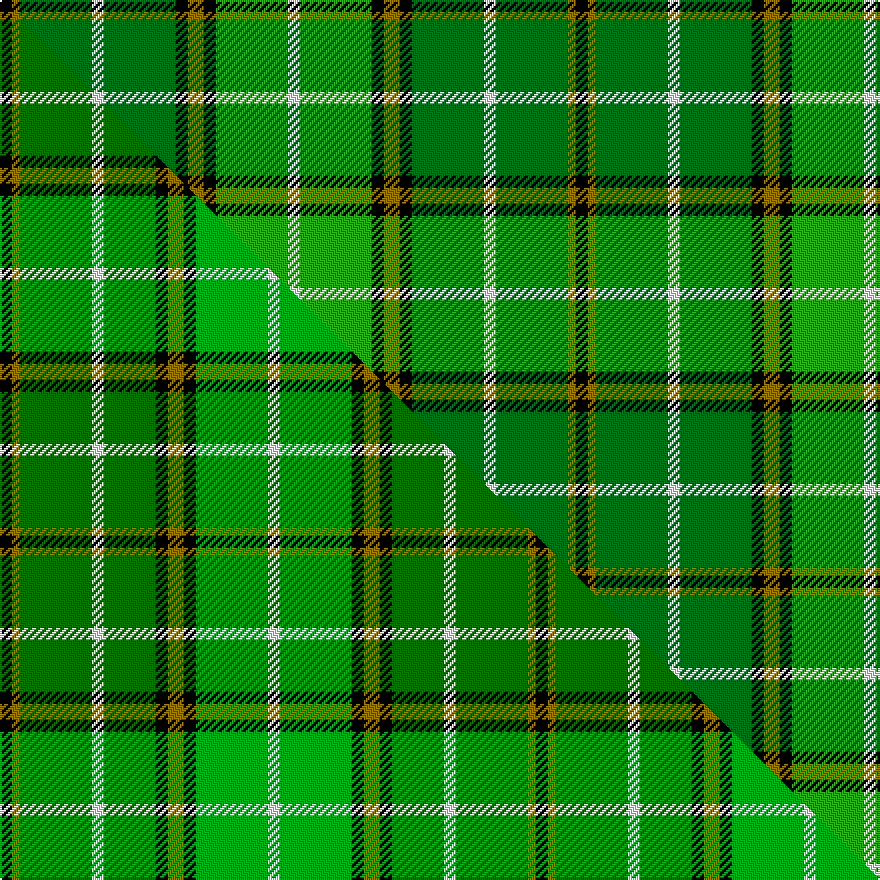

This page is one **sett** — a single exact thread-count. It belongs to the [tartan](/setts/k3y2dg18w3dg18k3y4k3g18w3/)
(the same proportion at any scale), whose colour order is pattern [KGGWGKGKGW](/stripes/kggwgkgkgw/).

Part of the [Forrester Hunting](/tartans/forrester-hunting/) tartan — the named design grouping this sett with its other cloths.

Sourced from house-of-tartan.  It is a [10 stripe tartan](/stripes/stripes10/).

Original link http://www.house-of-tartan.scotland.net/house/TartanViewjs.asp?colr=Def&tnam=2385

## Provenance

Earliest known date: 1997 A clan society that has been in existence since the 1980's. This hunting tartan was fully adopted in 1997. Can be worn with anyone with the name. Note from EBW "From the book "The Forresters" by Colin D.I.G.Forrester, 1988"

## Thread count
K/6 Y4 DG36 W6 DG36 K6 Y8 K6 G36 W/6

One full sett is **288 threads**.

## Palette
<table><thead><tr><th>Colour</th><th>Shade</th><th>OKLCh</th></tr></thead><tbody><tr><td>DG</td><td><code style="background-color:#006818;">#006818</code> <small style="color:#888">#006818</small></td><td><small style="color:#888">oklch(45.0% 0.142 145.0)</small></td></tr><tr><td>G</td><td><code style="background-color:#289C18;">#289C18</code> <small style="color:#888">#289C18</small></td><td><small style="color:#888">oklch(60.6% 0.191 141.6)</small></td></tr><tr><td>K</td><td><code style="background-color:#000000;">#000000</code> <small style="color:#888">#000000</small></td><td><small style="color:#888">oklch(0.0% 0.000 0.0)</small></td></tr><tr><td>W</td><td><code style="background-color:#F7F7F7;">#F7F7F7</code> <small style="color:#888">#F7F7F7</small></td><td><small style="color:#888">oklch(97.6% 0.000 89.9)</small></td></tr><tr><td>Y</td><td><code style="background-color:#8B6E00;">#8B6E00</code> <small style="color:#888">#8B6E00</small></td><td><small style="color:#888">oklch(55.1% 0.113 90.4)</small></td></tr></tbody></table>

# Sample pattern

## Compared to the master

This cloth is one sett of its design; the master sett (the exemplar the design is anchored on) is below for comparison.

Its **ΔTartan distance** from the master is **0.39** — the same measure the nearest-tartans table ranks by (0 is identical; a re-scale of the same cloth is near 0, a recolour or a different proportion further).

<figure class="master-compare" style="margin:0">

this sett
master sett ★

<figcaption style="color:#888;font-size:smaller">One weave of this sett against the <a href="/setts/k3y2dg18w3dg13k3y4k3g18w3/">master sett ★</a>, split on the diagonal: a shared proportion runs seamlessly across it with only the shades shifting; a different proportion breaks on it.</figcaption>
</figure>

## Nearest tartan variants

The nearest existing variants by ΔTartan distance, with this cloth at the top so the swatches line up against it.

ΔTartan

Threads

Variant

Sett

—

288

<a href="/variants/s10/k3y2dg18w3dg18k3y4k3g18w3~x2~dg1806142-g2408144/">Forrester Hunting Clan Tartan</a>

<a href="/ttd/edit/#slug=k3y2dg18w3dg13k3y4k3g18w3~x2~dg1806142-g2408144&amp;base=k3y2dg18w3dg18k3y4k3g18w3~x2~dg1806142-g2408144" title="compare in the TTD">0.18</a>

268

<a href="/variants/s10/k3y2dg18w3dg13k3y4k3g18w3~x2~dg1806142-g2408144/">Forrester/Foster Hunting</a>

<a href="/ttd/edit/#slug=k3y2g18w3g18k3y4k3b18w3~x2&amp;base=k3y2dg18w3dg18k3y4k3g18w3~x2~dg1806142-g2408144" title="compare in the TTD">1.40</a>

288

<a href="/variants/s10/k3y2g18w3g18k3y4k3b18w3~x2/">Forrester / Foster, hunting</a>

<a href="/ttd/edit/#slug=w9dg2g2w3g18k2dg33lo2~x2&amp;base=k3y2dg18w3dg18k3y4k3g18w3~x2~dg1806142-g2408144" title="compare in the TTD">2.80</a>

262

<a href="/variants/s8/w9dg2g2w3g18k2dg33lo2~x2/">New World Irish (Fashion)</a>

<a href="/ttd/edit/#slug=w6g5r5g45k4ly24k4g5~x2&amp;base=k3y2dg18w3dg18k3y4k3g18w3~x2~dg1806142-g2408144" title="compare in the TTD">2.84</a>

370

<a href="/variants/s8/w6g5r5g45k4ly24k4g5~x2/">O'Neill (Name)</a>

## Neighbour map

Every grey dot is one of 13620 variants placed by the first two principal components of the ΔTartan feature space (42% of its variance). Red is this tartan; blue dots are its nearest — click one to open its page.

<svg viewBox="0 0 640 380" role="img" style="max-width:100%;height:auto;border:1px solid #e0e0e0;border-radius:4px;display:block" xmlns="http://www.w3.org/2000/svg"><image href="/nn/cloud.v1.png" width="640" height="380"/><a href="/variants/s10/k3y2dg18w3dg13k3y4k3g18w3~x2~dg1806142-g2408144/"><circle cx="159.4" cy="171.3" r="4" fill="#3465a4"><title>Forrester/Foster Hunting</title></circle></a><a href="/variants/s10/k3y2g18w3g18k3y4k3b18w3~x2/"><circle cx="174.4" cy="164.7" r="4" fill="#3465a4"><title>Forrester / Foster, hunting</title></circle></a><a href="/variants/s8/w9dg2g2w3g18k2dg33lo2~x2/"><circle cx="225.1" cy="130.9" r="4" fill="#3465a4"><title>New World Irish (Fashion)</title></circle></a><a href="/variants/s8/w6g5r5g45k4ly24k4g5~x2/"><circle cx="251.1" cy="149.6" r="4" fill="#3465a4"><title>O'Neill (Name)</title></circle></a><circle cx="183.2" cy="169.9" r="5" fill="#c00000"/><text x="320" y="376" text-anchor="middle" font-size="11" fill="#999">ground</text><text x="11" y="190" text-anchor="middle" font-size="11" fill="#999" transform="rotate(-90 11 190)">complexity</text></svg>

ID: /variants/s10/k3y2dg18w3dg18k3y4k3g18w3~x2~dg1806142-g2408144/
