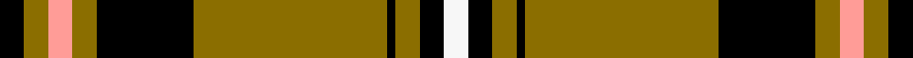

This is one **variant** — a specific cloth: this exact thread count and colourway, with its own
provenance below. It is one weaving of the [sett](/setts/k3y3lr3y3k12y24k1y3k3w3/) (the scale-free proportion — the
same cloth at any scale or shade), whose colour order is pattern [KGYGKGKGKW](/stripes/kgygkgkgkw/).

Sourced from tartans-authority.  It is a [10 stripe tartan](/stripes/stripes10/).

Original link [https://www.tartanregister.gov.uk/tartanDetails.aspx?ref=8460](https://www.tartanregister.gov.uk/tartanDetails.aspx?ref=8460)

Dataset <small>— provenance for this record, inherited from the source manifest</small>

<dl class="dataset-prov">
<dt>source</dt><dd><a href="/sources/tartans-authority/">Scottish Tartans Authority</a></dd>
<dt>data captured from</dt><dd><a href="https://github.com/thetartan/tartan-database/blob/master/data/tartans-authority/data.csv">https://github.com/thetartan/tartan-database/blob/master/data/tartans-authority/data.csv</a></dd>
<dt>data date</dt><dd>pre 2011 <small>(this record)</small></dd>
<dt>licence</dt><dd><a href="https://creativecommons.org/licenses/by-nc-nd/4.0/">CC BY-NC-ND 4.0</a></dd>
</dl>

Capture chain <small>— the hands this data passed through, oldest first; each capture carries its own licence</small>

<ol class="capture-chain">
<li><a href="https://www.tartansauthority.com/">Scottish Tartans Authority</a> <small>the heritage body's archive — its tartan-ferret record browser is retired (links repaired to the SRT, above)</small></li>
<li><a href="https://github.com/thetartan/tartan-database">thetartan/tartan-database</a> <small>2016-2017</small> · <a href="https://creativecommons.org/licenses/by-nc-nd/4.0/">CC BY-NC-ND 4.0</a> <small>Levko Kravets's frozen compilation — the capture we vendored, and where its CC licence text came from</small></li>
<li>this dictionary <small>captured 2026-06-10 · commit 5bf86c7566</small> <small>each re-capture is a git commit to data/sources</small></li>
</ol>

## Register references

External register numbers recorded for this tartan.

- Scottish Register of Tartans: [8460](https://www.tartanregister.gov.uk/tartanDetails?ref=8460)
- Scottish Tartans Authority (ITI): 8460

## Thread count
K/6 Y6 LR6 Y6 K24 Y48 K2 Y6 K6 W/6

One full sett is **220 threads**.

## Palette
<table><thead><tr><th>Colour</th><th>Shade</th><th>OKLCh</th></tr></thead><tbody><tr><td>K</td><td><code style="background-color:#000000;">#000000</code> <small style="color:#888">#000000</small></td><td><small style="color:#888">oklch(0.0% 0.000 0.0)</small></td></tr><tr><td>Y</td><td><code style="background-color:#8B6E00;">#8B6E00</code> <small style="color:#888">#8B6E00</small></td><td><small style="color:#888">oklch(55.1% 0.113 90.4)</small></td></tr><tr><td>LR</td><td><code style="background-color:#FF9C97;">#FF9C97</code> <small style="color:#888">#FF9C97</small></td><td><small style="color:#888">oklch(79.3% 0.119 23.2)</small></td></tr><tr><td>W</td><td><code style="background-color:#F7F7F7;">#F7F7F7</code> <small style="color:#888">#F7F7F7</small></td><td><small style="color:#888">oklch(97.6% 0.000 89.9)</small></td></tr></tbody></table>

# Sample pattern

## Nearest tartan variants

The nearest existing variants by ΔTartan distance, with this cloth at the top so the swatches line up against it.

ΔTartan

Threads

Variant

Sett

—

220

<a href="/variants/s10/k3y3lr3y3k12y24k1y3k3w3~x2/">Bruichladdich (Corporate)</a>

<a href="/ttd/edit/#slug=k1y12r1y2k4r1k4y2k1~x4&amp;base=k3y3lr3y3k12y24k1y3k3w3~x2" title="compare in the TTD">1.90</a>

216

<a href="/variants/s9/k1y12r1y2k4r1k4y2k1~x4/">MacLeod (Snuffbox)</a>

<a href="/ttd/edit/#slug=k1ly12r1ly2k4r1k4ly2k1~x4&amp;base=k3y3lr3y3k12y24k1y3k3w3~x2" title="compare in the TTD">1.90</a>

216

<a href="/variants/s9/k1ly12r1ly2k4r1k4ly2k1~x4/">MacLeod Snuffbox - 1829 (Artefact)</a>

<a href="/ttd/edit/#slug=r4ly24k13ly2k4ly3k1ly3lb2~x2&amp;base=k3y3lr3y3k12y24k1y3k3w3~x2" title="compare in the TTD">2.19</a>

212

<a href="/variants/s9/r4ly24k13ly2k4ly3k1ly3lb2~x2/">Cardiff City Football Club (Corp)</a>

<a href="/ttd/edit/#slug=do1lr2k5do3k1y4k1y10k1y1~x4&amp;base=k3y3lr3y3k12y24k1y3k3w3~x2" title="compare in the TTD">2.21</a>

224

<a href="/variants/s10/do1lr2k5do3k1y4k1y10k1y1~x4/">Braemar, Camel</a>

<a href="/ttd/edit/#slug=k4w1r4k2g2r3k2g20r2k2r2~x2&amp;base=k3y3lr3y3k12y24k1y3k3w3~x2" title="compare in the TTD">2.46</a>

164

<a href="/variants/s11/k4w1r4k2g2r3k2g20r2k2r2~x2/">Valdres, Kvam &amp; Vang #2</a>

<a href="/ttd/edit/#slug=k44w3lo16w2lo2w2lo2y10k3y8~x2&amp;base=k3y3lr3y3k12y24k1y3k3w3~x2" title="compare in the TTD">2.54</a>

264

<a href="/variants/s10/k44w3lo16w2lo2w2lo2y10k3y8~x2/">Wcwm 1399</a>

<a href="/ttd/edit/#slug=g17lb2ly2lb2k21lb2k3g30k2lb2k4~x2~g1903114-ly2706114&amp;base=k3y3lr3y3k12y24k1y3k3w3~x2" title="compare in the TTD">2.55</a>

306

<a href="/variants/s11/g17lb2ly2lb2k21lb2k3g30k2lb2k4~x2~g1903114-ly2706114/">Fort William</a>

<a href="/ttd/edit/#slug=ly5k9ly2k7o10r4o35k4~x2~ly3607098-o2505058&amp;base=k3y3lr3y3k12y24k1y3k3w3~x2" title="compare in the TTD">2.71</a>

286

<a href="/variants/s8/ly5k9ly2k7o10r4o35k4~x2~ly3607098-o2505058/">Wilbers #2 (Personal)</a>

<a href="/ttd/edit/#slug=w2g4k6r2k2r2k3r2g20w1~x2&amp;base=k3y3lr3y3k12y24k1y3k3w3~x2" title="compare in the TTD">2.80</a>

170

<a href="/variants/s10/w2g4k6r2k2r2k3r2g20w1~x2/">Keirnan Irish Family Tartan</a>

<a href="/ttd/edit/#slug=y4k4g12k37w4k4w16k2w4~x2&amp;base=k3y3lr3y3k12y24k1y3k3w3~x2" title="compare in the TTD">2.97</a>

332

<a href="/variants/s9/y4k4g12k37w4k4w16k2w4~x2/">Gordon Dress (Variation) Trade Tartan</a>

## Neighbour map

Every grey dot is one of 13621 variants placed by the first two principal components of the ΔTartan feature space (42% of its variance). Red is this tartan; blue dots are its nearest — click one to open its page.

<svg viewBox="0 0 640 380" role="img" style="max-width:100%;height:auto;border:1px solid #e0e0e0;border-radius:4px;display:block" xmlns="http://www.w3.org/2000/svg"><image href="/nn/cloud.v1.png" width="640" height="380"/><a href="/variants/s9/k1y12r1y2k4r1k4y2k1~x4/"><circle cx="295.4" cy="154.3" r="4" fill="#3465a4"><title>MacLeod (Snuffbox)</title></circle></a><a href="/variants/s9/k1ly12r1ly2k4r1k4ly2k1~x4/"><circle cx="275.0" cy="150.9" r="4" fill="#3465a4"><title>MacLeod Snuffbox - 1829 (Artefact)</title></circle></a><a href="/variants/s9/r4ly24k13ly2k4ly3k1ly3lb2~x2/"><circle cx="287.6" cy="115.7" r="4" fill="#3465a4"><title>Cardiff City Football Club (Corp)</title></circle></a><a href="/variants/s10/do1lr2k5do3k1y4k1y10k1y1~x4/"><circle cx="225.5" cy="160.2" r="4" fill="#3465a4"><title>Braemar, Camel</title></circle></a><a href="/variants/s11/k4w1r4k2g2r3k2g20r2k2r2~x2/"><circle cx="242.2" cy="107.8" r="4" fill="#3465a4"><title>Valdres, Kvam &amp; Vang #2</title></circle></a><a href="/variants/s10/k44w3lo16w2lo2w2lo2y10k3y8~x2/"><circle cx="239.0" cy="97.0" r="4" fill="#3465a4"><title>Wcwm 1399</title></circle></a><a href="/variants/s11/g17lb2ly2lb2k21lb2k3g30k2lb2k4~x2~g1903114-ly2706114/"><circle cx="268.0" cy="125.2" r="4" fill="#3465a4"><title>Fort William</title></circle></a><a href="/variants/s8/ly5k9ly2k7o10r4o35k4~x2~ly3607098-o2505058/"><circle cx="284.1" cy="130.8" r="4" fill="#3465a4"><title>Wilbers #2 (Personal)</title></circle></a><a href="/variants/s10/w2g4k6r2k2r2k3r2g20w1~x2/"><circle cx="253.6" cy="115.1" r="4" fill="#3465a4"><title>Keirnan Irish Family Tartan</title></circle></a><a href="/variants/s9/y4k4g12k37w4k4w16k2w4~x2/"><circle cx="238.9" cy="124.4" r="4" fill="#3465a4"><title>Gordon Dress (Variation) Trade Tartan</title></circle></a><circle cx="289.4" cy="108.9" r="5" fill="#c00000"/><text x="320" y="376" text-anchor="middle" font-size="11" fill="#999">ground</text><text x="11" y="190" text-anchor="middle" font-size="11" fill="#999" transform="rotate(-90 11 190)">complexity</text></svg>

ID: /variants/s10/k3y3lr3y3k12y24k1y3k3w3~x2/
