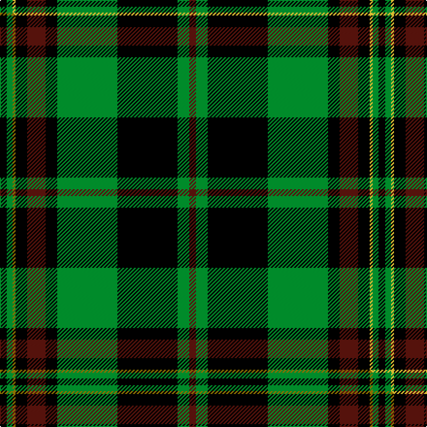

This page is one **sett** — a single exact thread-count. It belongs to the [tartan](/setts/k7g6ly3k12dr19k12g62k62g12dr7/)
(the same proportion at any scale), whose colour order is pattern [BGKGKBKYGK](/stripes/bgkgkbkygk/).

Part of the [Danareth](/tartans/danareth/) tartan — the named design grouping this sett with its other cloths.

Sourced from tartans-authority.  It is a [10 stripe tartan](/stripes/stripes10/).

Original link http://www.tartansauthority.com/tartan-ferret/display/10555/

## Register references

External register numbers recorded for this tartan.

- Scottish Register of Tartans: [10555](https://www.tartanregister.gov.uk/tartanDetails?ref=10555)
- Scottish Tartans Authority (ITI): 10555

## Thread count
K/7 G6 LY3 K12 DR19 K12 G62 K62 G12 DR/7

One full sett is **390 threads**.

## Palette
<table><thead><tr><th>Colour</th><th>Shade</th><th>OKLCh</th></tr></thead><tbody><tr><td>DR</td><td><code style="background-color:#55120C;">#55120C</code> <small style="color:#888">#55120C</small></td><td><small style="color:#888">oklch(30.0% 0.099 29.3)</small></td></tr><tr><td>G</td><td><code style="background-color:#008B2A;">#008B2A</code> <small style="color:#888">#008B2A</small></td><td><small style="color:#888">oklch(55.4% 0.170 145.9)</small></td></tr><tr><td>K</td><td><code style="background-color:#000000;">#000000</code> <small style="color:#888">#000000</small></td><td><small style="color:#888">oklch(0.0% 0.000 0.0)</small></td></tr><tr><td>LY</td><td><code style="background-color:#DCBC32;">#DCBC32</code> <small style="color:#888">#DCBC32</small></td><td><small style="color:#888">oklch(80.0% 0.150 95.2)</small></td></tr></tbody></table>

# Sample pattern

## Compared to the master

This cloth is one sett of its design; the master sett (the exemplar the design is anchored on) is below for comparison.

Its **ΔTartan distance** from the master is **0.06** — the same measure the nearest-tartans table ranks by (0 is identical; a re-scale of the same cloth is near 0, a recolour or a different proportion further).

<figure class="master-compare" style="margin:0">

this sett
master sett ★

<figcaption style="color:#888;font-size:smaller">One weave of this sett against the <a href="/setts/k7g6y3k12dr19k12g62k62g12dr7/">master sett ★</a>, split on the diagonal: a shared proportion runs seamlessly across it with only the shades shifting; a different proportion breaks on it.</figcaption>
</figure>

## Nearest tartan variants

The nearest existing variants by ΔTartan distance, with this cloth at the top so the swatches line up against it.

ΔTartan

Threads

Variant

Sett

—

390

<a href="/variants/s10/k7g6ly3k12dr19k12g62k62g12dr7/">Danareth (Corporate)</a>

<a href="/ttd/edit/#slug=k7g6y3k12dr19k12g62k62g12dr7&amp;base=k7g6ly3k12dr19k12g62k62g12dr7" title="compare in the TTD">0.00</a>

390

<a href="/variants/s10/k7g6y3k12dr19k12g62k62g12dr7/">Danareth</a>

<a href="/ttd/edit/#slug=k22g5k2g5k11g33k2r4~x2&amp;base=k7g6ly3k12dr19k12g62k62g12dr7" title="compare in the TTD">1.35</a>

284

<a href="/variants/s8/k22g5k2g5k11g33k2r4~x2/">MacArthur-Fox 1993 (Personal)</a>

<a href="/ttd/edit/#slug=k8g4r1k2g16dy1k8g2k2g4~x4&amp;base=k7g6ly3k12dr19k12g62k62g12dr7" title="compare in the TTD">1.77</a>

336

<a href="/variants/s10/k8g4r1k2g16dy1k8g2k2g4~x4/">Manitoba Cue Sports</a>

<a href="/ttd/edit/#slug=k8g4r1k2g16ly1k8g2k2g4~x4&amp;base=k7g6ly3k12dr19k12g62k62g12dr7" title="compare in the TTD">1.77</a>

336

<a href="/variants/s10/k8g4r1k2g16ly1k8g2k2g4~x4/">Manitoba Cue (Corporate)</a>

<a href="/ttd/edit/#slug=k19r1g3k7g2k2g20w2~x2&amp;base=k7g6ly3k12dr19k12g62k62g12dr7" title="compare in the TTD">2.20</a>

182

<a href="/variants/s8/k19r1g3k7g2k2g20w2~x2/">Scottish Chieftain</a>

<a href="/ttd/edit/#slug=k12r2k28g12k1w3k1g12r4~x2&amp;base=k7g6ly3k12dr19k12g62k62g12dr7" title="compare in the TTD">2.39</a>

268

<a href="/variants/s9/k12r2k28g12k1w3k1g12r4~x2/">MacDiarmid</a>

<a href="/ttd/edit/#slug=k37g27w2k4r6k4w2g27k37y2~x2&amp;base=k7g6ly3k12dr19k12g62k62g12dr7" title="compare in the TTD">2.46</a>

514

<a href="/variants/s10/k37g27w2k4r6k4w2g27k37y2~x2/">Highlands of Durham #2</a>

<a href="/ttd/edit/#slug=k6g4lb3g44k32g3k3lo3k2g3~x2&amp;base=k7g6ly3k12dr19k12g62k62g12dr7" title="compare in the TTD">2.68</a>

394

<a href="/variants/s10/k6g4lb3g44k32g3k3lo3k2g3~x2/">Smeaton Hunting (Name)</a>

<a href="/ttd/edit/#slug=db1k2db1k6db1k1g1k6g21y1~x2&amp;base=k7g6ly3k12dr19k12g62k62g12dr7" title="compare in the TTD">2.76</a>

160

<a href="/variants/s10/db1k2db1k6db1k1g1k6g21y1~x2/">Grand Lodge of Scotland (Corporate)</a>

<a href="/ttd/edit/#slug=dg14k1dg2k1dg2k10g14r2&amp;base=k7g6ly3k12dr19k12g62k62g12dr7" title="compare in the TTD">2.78</a>

76

<a href="/variants/s8/dg14k1dg2k1dg2k10g14r2/">Manor (Corporate)</a>

## Neighbour map

Every grey dot is one of 13620 variants placed by the first two principal components of the ΔTartan feature space (42% of its variance). Red is this tartan; blue dots are its nearest — click one to open its page.

<svg viewBox="0 0 640 380" role="img" style="max-width:100%;height:auto;border:1px solid #e0e0e0;border-radius:4px;display:block" xmlns="http://www.w3.org/2000/svg"><image href="/nn/cloud.v1.png" width="640" height="380"/><a href="/variants/s10/k7g6y3k12dr19k12g62k62g12dr7/"><circle cx="235.3" cy="129.5" r="4" fill="#3465a4"><title>Danareth</title></circle></a><a href="/variants/s8/k22g5k2g5k11g33k2r4~x2/"><circle cx="276.2" cy="160.1" r="4" fill="#3465a4"><title>MacArthur-Fox 1993 (Personal)</title></circle></a><a href="/variants/s10/k8g4r1k2g16dy1k8g2k2g4~x4/"><circle cx="263.3" cy="145.9" r="4" fill="#3465a4"><title>Manitoba Cue Sports</title></circle></a><a href="/variants/s10/k8g4r1k2g16ly1k8g2k2g4~x4/"><circle cx="261.0" cy="145.4" r="4" fill="#3465a4"><title>Manitoba Cue (Corporate)</title></circle></a><a href="/variants/s8/k19r1g3k7g2k2g20w2~x2/"><circle cx="259.4" cy="134.7" r="4" fill="#3465a4"><title>Scottish Chieftain</title></circle></a><a href="/variants/s9/k12r2k28g12k1w3k1g12r4~x2/"><circle cx="272.2" cy="116.4" r="4" fill="#3465a4"><title>MacDiarmid</title></circle></a><a href="/variants/s10/k37g27w2k4r6k4w2g27k37y2~x2/"><circle cx="245.4" cy="118.1" r="4" fill="#3465a4"><title>Highlands of Durham #2</title></circle></a><a href="/variants/s10/k6g4lb3g44k32g3k3lo3k2g3~x2/"><circle cx="282.5" cy="107.2" r="4" fill="#3465a4"><title>Smeaton Hunting (Name)</title></circle></a><a href="/variants/s10/db1k2db1k6db1k1g1k6g21y1~x2/"><circle cx="286.1" cy="107.1" r="4" fill="#3465a4"><title>Grand Lodge of Scotland (Corporate)</title></circle></a><a href="/variants/s8/dg14k1dg2k1dg2k10g14r2/"><circle cx="198.8" cy="170.4" r="4" fill="#3465a4"><title>Manor (Corporate)</title></circle></a><circle cx="233.5" cy="129.0" r="5" fill="#c00000"/><text x="320" y="376" text-anchor="middle" font-size="11" fill="#999">ground</text><text x="11" y="190" text-anchor="middle" font-size="11" fill="#999" transform="rotate(-90 11 190)">complexity</text></svg>

ID: /variants/s10/k7g6ly3k12dr19k12g62k62g12dr7/
