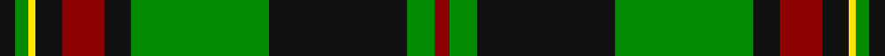

This page is one **sett** — a single exact thread-count. It belongs to the [tartan](/setts/k7g6ly3k12r19k12g62k62g12r7/)
(the same proportion at any scale), whose colour order is pattern [KGYKRKGKGR](/stripes/kgykrkgkgr/).

Sourced from register-of-tartans.  It is a [10 stripe tartan](/stripes/stripes10/).

Original link https://www.tartanregister.gov.uk/tartanDetails.aspx?ref=10555

2 attestations — the source records this cloth was collapsed from (oldest owns this page)

<ul>
<li>16/01/2012 — Danareth (register-of-tartans, <a href="https://www.tartanregister.gov.uk/tartanDetails.aspx?ref=10555">record</a>)</li>
<li>16th Jan. 2012 — Danareth (Corporate) (tartans-authority, <a href="http://www.tartansauthority.com/tartan-ferret/display/10555/">record</a>)</li>
</ul>

## Register references

External register numbers recorded for this tartan.

- Scottish Register of Tartans: [10555](https://www.tartanregister.gov.uk/tartanDetails?ref=10555)
- Scottish Tartans Authority (ITI): 10555

## Thread count
K/7 G6 Y3 K12 DR19 K12 G62 K62 G12 DR/7

One full sett is **390 threads**.

## Palette

Palette: <strong>Tartan Register</strong> <small style="color:#888">(3 of 4 colours)</small>
<table><thead><tr><th>Colour</th><th>Threads</th><th>Shade</th><th>Base</th><th>OKLCh</th></tr></thead><tbody><tr><td>K/</td><td style="text-align:right;font-variant-numeric:tabular-nums">7</td><td><code style="background-color:#101010;">#101010</code> <small style="color:#888">#101010</small></td><td>K <code style="background-color:#000000;">#000000</code></td><td><small style="color:#888">oklch(17.3% 0.000 89.9)</small></td></tr><tr><td>G</td><td style="text-align:right;font-variant-numeric:tabular-nums">6</td><td><code style="background-color:#008B00;">#008B00</code> <small style="color:#888">#008B00</small></td><td>G <code style="background-color:#006100;">#006100</code></td><td><small style="color:#888">oklch(55.2% 0.188 142.5)</small></td></tr><tr><td>Y</td><td style="text-align:right;font-variant-numeric:tabular-nums">3</td><td><code style="background-color:#FFE600;">#FFE600</code> <small style="color:#888">#FFE600</small></td><td>Y <code style="background-color:#F2BF00;">#F2BF00</code></td><td><small style="color:#888">oklch(91.7% 0.192 101.4)</small></td></tr><tr><td>K</td><td style="text-align:right;font-variant-numeric:tabular-nums">12</td><td><code style="background-color:#101010;">#101010</code> <small style="color:#888">#101010</small></td><td>K <code style="background-color:#000000;">#000000</code></td><td><small style="color:#888">oklch(17.3% 0.000 89.9)</small></td></tr><tr><td>DR</td><td style="text-align:right;font-variant-numeric:tabular-nums">19</td><td><code style="background-color:#8B0000;">#8B0000</code> <small style="color:#888">#8B0000</small></td><td>R <code style="background-color:#CC0000;">#CC0000</code></td><td><small style="color:#888">oklch(40.0% 0.164 29.2)</small></td></tr><tr><td>K</td><td style="text-align:right;font-variant-numeric:tabular-nums">12</td><td><code style="background-color:#101010;">#101010</code> <small style="color:#888">#101010</small></td><td>K <code style="background-color:#000000;">#000000</code></td><td><small style="color:#888">oklch(17.3% 0.000 89.9)</small></td></tr><tr><td>G</td><td style="text-align:right;font-variant-numeric:tabular-nums">62</td><td><code style="background-color:#008B00;">#008B00</code> <small style="color:#888">#008B00</small></td><td>G <code style="background-color:#006100;">#006100</code></td><td><small style="color:#888">oklch(55.2% 0.188 142.5)</small></td></tr><tr><td>K</td><td style="text-align:right;font-variant-numeric:tabular-nums">62</td><td><code style="background-color:#101010;">#101010</code> <small style="color:#888">#101010</small></td><td>K <code style="background-color:#000000;">#000000</code></td><td><small style="color:#888">oklch(17.3% 0.000 89.9)</small></td></tr><tr><td>G</td><td style="text-align:right;font-variant-numeric:tabular-nums">12</td><td><code style="background-color:#008B00;">#008B00</code> <small style="color:#888">#008B00</small></td><td>G <code style="background-color:#006100;">#006100</code></td><td><small style="color:#888">oklch(55.2% 0.188 142.5)</small></td></tr><tr><td>DR/</td><td style="text-align:right;font-variant-numeric:tabular-nums">7</td><td><code style="background-color:#8B0000;">#8B0000</code> <small style="color:#888">#8B0000</small></td><td>R <code style="background-color:#CC0000;">#CC0000</code></td><td><small style="color:#888">oklch(40.0% 0.164 29.2)</small></td></tr></tbody></table>

## Nearest tartans

The nearest existing variants by ΔTartan distance, with this tartan at the top so the swatches line up against it.

ΔTartan

Tartan

Sett

—

<a href="/ttd/edit/#slug=k7g6ly3k12r19k12g62k62g12r7">Danareth</a> <a class="nn-out" href="/variants/s10/k7g6ly3k12r19k12g62k62g12r7/" title="open its dictionary page">↗</a>

0.80

<a href="/ttd/edit/#slug=g4r4k12w2k12g32r4k3~x2&amp;base=k7g6ly3k12r19k12g62k62g12r7">MacHardy (Clans Originaux)</a> <a class="nn-out" href="/variants/s8/g4r4k12w2k12g32r4k3~x2/" title="open its dictionary page">↗</a>

0.89

<a href="/ttd/edit/#slug=dg2k1dg18k1dg2k1dr12dg4ly6k1ly6k1~x2&amp;base=k7g6ly3k12r19k12g62k62g12r7">MacMillan Ancient (a)</a> <a class="nn-out" href="/variants/s12/dg2k1dg18k1dg2k1dr12dg4ly6k1ly6k1~x2/" title="open its dictionary page">↗</a>

0.89

<a href="/ttd/edit/#slug=dg2k1dg18k1dg2k1dr12dg4ly6k1ly6k1&amp;base=k7g6ly3k12r19k12g62k62g12r7">MacMillan Ancient</a> <a class="nn-out" href="/variants/s12/dg2k1dg18k1dg2k1dr12dg4ly6k1ly6k1/" title="open its dictionary page">↗</a>

1.11

<a href="/ttd/edit/#slug=w2g4k6r2k2r2k3r2g20w1~x2&amp;base=k7g6ly3k12r19k12g62k62g12r7">Kiernan</a> <a class="nn-out" href="/variants/s10/w2g4k6r2k2r2k3r2g20w1~x2/" title="open its dictionary page">↗</a>

1.13

<a href="/ttd/edit/#slug=k60g64dg5g8dg5g64k60ly8k8ly8&amp;base=k7g6ly3k12r19k12g62k62g12r7">Sin-Cos (Corporate)</a> <a class="nn-out" href="/variants/s10/k60g64dg5g8dg5g64k60ly8k8ly8/" title="open its dictionary page">↗</a>

1.14

<a href="/ttd/edit/#slug=k4w1r4k2g2r3k2g20r2k2r2~x2&amp;base=k7g6ly3k12r19k12g62k62g12r7">Valdres, Kvam &amp; Vang #2</a> <a class="nn-out" href="/variants/s11/k4w1r4k2g2r3k2g20r2k2r2~x2/" title="open its dictionary page">↗</a>

1.19

<a href="/ttd/edit/#slug=k28r3ly2r3k13g28w1g3w1g16~x2&amp;base=k7g6ly3k12r19k12g62k62g12r7">Bomb Disposal</a> <a class="nn-out" href="/variants/s10/k28r3ly2r3k13g28w1g3w1g16~x2/" title="open its dictionary page">↗</a>

1.27

<a href="/ttd/edit/#slug=k12r2k28g12k1w3k1g12r4~x2&amp;base=k7g6ly3k12r19k12g62k62g12r7">MacDiarmid (Clan)</a> <a class="nn-out" href="/variants/s9/k12r2k28g12k1w3k1g12r4~x2/" title="open its dictionary page">↗</a>

1.32

<a href="/ttd/edit/#slug=g5k2g28k10o26db4g4~x2&amp;base=k7g6ly3k12r19k12g62k62g12r7">John Telfar, Dunbar hunting</a> <a class="nn-out" href="/variants/s7/g5k2g28k10o26db4g4~x2/" title="open its dictionary page">↗</a>

1.34

<a href="/ttd/edit/#slug=g36k2g2k2g3k12t10r20~x2&amp;base=k7g6ly3k12r19k12g62k62g12r7">Georgia, State of</a> <a class="nn-out" href="/variants/s8/g36k2g2k2g3k12t10r20~x2/" title="open its dictionary page">↗</a>

## Neighbour map

Every grey dot is one of 14360 variants placed by the first two principal components of the ΔTartan feature space (44% of its variance). Red is this tartan; blue dots are its nearest — click one to open its page.

<svg viewBox="0 0 640 380" role="img" style="max-width:100%;height:auto;border:1px solid #e0e0e0;border-radius:4px;display:block" xmlns="http://www.w3.org/2000/svg"><image href="/nn/cloud.v1.png" width="640" height="380"/><a href="/variants/s8/g4r4k12w2k12g32r4k3~x2/"><circle cx="296.3" cy="177.0" r="4" fill="#3465a4"><title>MacHardy (Clans Originaux)</title></circle></a><a href="/variants/s12/dg2k1dg18k1dg2k1dr12dg4ly6k1ly6k1~x2/"><circle cx="260.9" cy="142.0" r="4" fill="#3465a4"><title>MacMillan Ancient (a)</title></circle></a><a href="/variants/s12/dg2k1dg18k1dg2k1dr12dg4ly6k1ly6k1/"><circle cx="260.9" cy="142.0" r="4" fill="#3465a4"><title>MacMillan Ancient</title></circle></a><a href="/variants/s10/w2g4k6r2k2r2k3r2g20w1~x2/"><circle cx="312.4" cy="136.7" r="4" fill="#3465a4"><title>Kiernan</title></circle></a><a href="/variants/s10/k60g64dg5g8dg5g64k60ly8k8ly8/"><circle cx="282.1" cy="190.6" r="4" fill="#3465a4"><title>Sin-Cos (Corporate)</title></circle></a><a href="/variants/s11/k4w1r4k2g2r3k2g20r2k2r2~x2/"><circle cx="305.9" cy="132.4" r="4" fill="#3465a4"><title>Valdres, Kvam &amp; Vang #2</title></circle></a><a href="/variants/s10/k28r3ly2r3k13g28w1g3w1g16~x2/"><circle cx="303.1" cy="137.2" r="4" fill="#3465a4"><title>Bomb Disposal</title></circle></a><a href="/variants/s9/k12r2k28g12k1w3k1g12r4~x2/"><circle cx="343.0" cy="153.5" r="4" fill="#3465a4"><title>MacDiarmid (Clan)</title></circle></a><a href="/variants/s7/g5k2g28k10o26db4g4~x2/"><circle cx="253.1" cy="191.6" r="4" fill="#3465a4"><title>John Telfar, Dunbar hunting</title></circle></a><a href="/variants/s8/g36k2g2k2g3k12t10r20~x2/"><circle cx="273.2" cy="166.1" r="4" fill="#3465a4"><title>Georgia, State of</title></circle></a><circle cx="277.4" cy="151.3" r="5" fill="#c00000"/></svg>

ID: /variants/s10/k7g6ly3k12r19k12g62k62g12r7/
