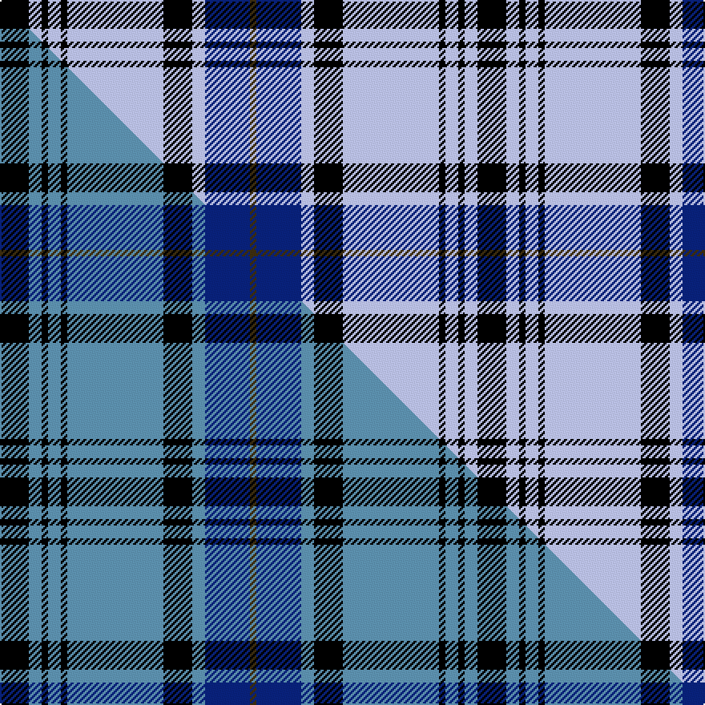

This page is one **sett** — a single exact thread-count. It belongs to the [tartan](/setts/k9lb4k2lb4k2lb30k9lb4db14dy2/)
(the same proportion at any scale), whose colour order is pattern [GBWKWKWKWK](/stripes/gbwkwkwkwk/).

Part of the [Hannay](/tartans/hannay/) tartan — the named design grouping this sett with its other cloths.

Sourced from tartans-authority.  It is a [10 stripe tartan](/stripes/stripes10/).

Original link https://www.tartanregister.gov.uk/tartanDetails.aspx?ref=6509

Dataset <small>— provenance for this record, inherited from the source manifest</small>

<dl class="dataset-prov">
<dt>source</dt><dd><a href="/sources/tartans-authority/">Scottish Tartans Authority</a></dd>
<dt>data captured from</dt><dd><a href="https://github.com/thetartan/tartan-database/blob/master/data/tartans-authority/data.csv">https://github.com/thetartan/tartan-database/blob/master/data/tartans-authority/data.csv</a></dd>
<dt>data date</dt><dd>2005 Jan <small>(this record)</small></dd>
<dt>licence</dt><dd><a href="https://creativecommons.org/licenses/by-nc-nd/4.0/">CC BY-NC-ND 4.0</a></dd>
</dl>

Capture chain <small>— the hands this data passed through, oldest first; each capture carries its own licence</small>

<ol class="capture-chain">
<li><a href="https://www.tartansauthority.com/">Scottish Tartans Authority</a> <small>the heritage body's archive — its tartan-ferret record browser is retired (links repaired to the SRT, above)</small></li>
<li><a href="https://github.com/thetartan/tartan-database">thetartan/tartan-database</a> <small>2016-2017</small> · <a href="https://creativecommons.org/licenses/by-nc-nd/4.0/">CC BY-NC-ND 4.0</a> <small>Levko Kravets's frozen compilation — the capture we vendored, and where its CC licence text came from</small></li>
<li>this dictionary <small>captured 2026-06-10 · commit 5bf86c7566</small> <small>each re-capture is a git commit to data/sources</small></li>
</ol>

## Register references

External register numbers recorded for this tartan.

- Scottish Tartans Authority (ITI): 6509

## Thread count
K/18 LB8 K4 LB8 K4 LB60 K18 LB8 DB28 DY/4

One full sett is **298 threads**.

## Palette
<table><thead><tr><th>Colour</th><th>Shade</th><th>OKLCh</th></tr></thead><tbody><tr><td>LB</td><td><code style="background-color:#B5BBDE;">#B5BBDE</code> <small style="color:#888">#B5BBDE</small></td><td><small style="color:#888">oklch(79.9% 0.050 277.6)</small></td></tr><tr><td>DB</td><td><code style="background-color:#082077;">#082077</code> <small style="color:#888">#082077</small></td><td><small style="color:#888">oklch(30.0% 0.149 265.1)</small></td></tr><tr><td>K</td><td><code style="background-color:#000000;">#000000</code> <small style="color:#888">#000000</small></td><td><small style="color:#888">oklch(0.0% 0.000 0.0)</small></td></tr><tr><td>DY</td><td><code style="background-color:#3A2B0D;">#3A2B0D</code> <small style="color:#888">#3A2B0D</small></td><td><small style="color:#888">oklch(30.0% 0.049 82.0)</small></td></tr></tbody></table>

# Sample pattern

## Compared to the master

This cloth is one sett of its design; the master sett (the exemplar the design is anchored on) is below for comparison.

Its **ΔTartan distance** from the master is **0.15** — the same measure the nearest-tartans table ranks by (0 is identical; a re-scale of the same cloth is near 0, a recolour or a different proportion further).

<figure class="master-compare" style="margin:0">

this sett
master sett ★

<figcaption style="color:#888;font-size:smaller">One weave of this sett against the <a href="/setts/k9t4k2t4k2t30k9t4db14dy2/">master sett ★</a>, split on the diagonal: a shared proportion runs seamlessly across it with only the shades shifting; a different proportion breaks on it.</figcaption>
</figure>

## Nearest tartan variants

The nearest existing variants by ΔTartan distance, with this cloth at the top so the swatches line up against it.

ΔTartan

Threads

Variant

Sett

—

298

<a href="/variants/s10/k9lb4k2lb4k2lb30k9lb4db14dy2~x2/">Hannay Blue (Fashion?)</a>

<a href="/ttd/edit/#slug=k9t4k2t4k2t30k9t4db14dy2~x2~t2503227&amp;base=k9lb4k2lb4k2lb30k9lb4db14dy2~x2" title="compare in the TTD">0.16</a>

298

<a href="/variants/s10/k9t4k2t4k2t30k9t4db14dy2~x2~t2503227/">Hannay Blue</a>

<a href="/ttd/edit/#slug=k9w4k2w4k2w29k9w4db14y2~x2&amp;base=k9lb4k2lb4k2lb30k9lb4db14dy2~x2" title="compare in the TTD">1.96</a>

294

<a href="/variants/s10/k9w4k2w4k2w29k9w4db14y2~x2/">Hannay</a>

<a href="/ttd/edit/#slug=k9w4k2w4k2w30k9w4db14y2~x2&amp;base=k9lb4k2lb4k2lb30k9lb4db14dy2~x2" title="compare in the TTD">2.02</a>

298

<a href="/variants/s10/k9w4k2w4k2w30k9w4db14y2~x2/">Hannay</a>

<a href="/ttd/edit/#slug=db32k2db4k2db8ly29w2k2&amp;base=k9lb4k2lb4k2lb30k9lb4db14dy2~x2" title="compare in the TTD">2.06</a>

128

<a href="/variants/s8/db32k2db4k2db8ly29w2k2/">Southern Lakes</a>

<a href="/ttd/edit/#slug=ki4lb20k3lb2k3lb20ki24k3ki2k3ki24r4~ki0705267&amp;base=k9lb4k2lb4k2lb30k9lb4db14dy2~x2" title="compare in the TTD">2.08</a>

216

<a href="/variants/s12/db4lb20k3lb2k3lb20db24k3db2k3db24r4~db0705267/">Roberts Welsh Name Tartan</a>

<a href="/ttd/edit/#slug=k2r9w2db2w4db2w2db20w2~x4&amp;base=k9lb4k2lb4k2lb30k9lb4db14dy2~x2" title="compare in the TTD">2.18</a>

344

<a href="/variants/s9/k2r9w2db2w4db2w2db20w2~x4/">Yudo (Corporate)</a>

<a href="/ttd/edit/#slug=db4lb20k3lb2k3lb20db24k3db2k3db24r4&amp;base=k9lb4k2lb4k2lb30k9lb4db14dy2~x2" title="compare in the TTD">2.23</a>

216

<a href="/variants/s12/db4lb20k3lb2k3lb20db24k3db2k3db24r4/">Roberts (Welsh Name)</a>

<a href="/ttd/edit/#slug=w4r1db20k6w5k4w3k2r1db2~x2&amp;base=k9lb4k2lb4k2lb30k9lb4db14dy2~x2" title="compare in the TTD">2.23</a>

180

<a href="/variants/s10/w4r1db20k6w5k4w3k2r1db2~x2/">Scottish Knights Templar, of M.T.S. St Andrew</a>

<a href="/ttd/edit/#slug=ly16k2ly2k2ly2db32r3db32ly16k2ly2~x2&amp;base=k9lb4k2lb4k2lb30k9lb4db14dy2~x2" title="compare in the TTD">2.25</a>

408

<a href="/variants/s11/ly16k2ly2k2ly2db32r3db32ly16k2ly2~x2/">MacLachlan, Gold Dress (Fashion)</a>

<a href="/ttd/edit/#slug=lb5k1w1k1lb5k7b10k1lb15b3k1w2~x4&amp;base=k9lb4k2lb4k2lb30k9lb4db14dy2~x2" title="compare in the TTD">2.28</a>

388

<a href="/variants/s12/lb5k1w1k1lb5k7b10k1lb15b3k1w2~x4/">Faulds</a>

## Neighbour map

Every grey dot is one of 13620 variants placed by the first two principal components of the ΔTartan feature space (42% of its variance). Red is this tartan; blue dots are its nearest — click one to open its page.

<svg viewBox="0 0 640 380" role="img" style="max-width:100%;height:auto;border:1px solid #e0e0e0;border-radius:4px;display:block" xmlns="http://www.w3.org/2000/svg"><image href="/nn/cloud.v1.png" width="640" height="380"/><a href="/variants/s10/k9t4k2t4k2t30k9t4db14dy2~x2~t2503227/"><circle cx="258.7" cy="121.4" r="4" fill="#3465a4"><title>Hannay Blue</title></circle></a><a href="/variants/s10/k9w4k2w4k2w29k9w4db14y2~x2/"><circle cx="217.0" cy="137.4" r="4" fill="#3465a4"><title>Hannay</title></circle></a><a href="/variants/s10/k9w4k2w4k2w30k9w4db14y2~x2/"><circle cx="222.2" cy="134.6" r="4" fill="#3465a4"><title>Hannay</title></circle></a><a href="/variants/s8/db32k2db4k2db8ly29w2k2/"><circle cx="274.9" cy="136.1" r="4" fill="#3465a4"><title>Southern Lakes</title></circle></a><a href="/variants/s12/db4lb20k3lb2k3lb20db24k3db2k3db24r4~db0705267/"><circle cx="211.7" cy="144.2" r="4" fill="#3465a4"><title>Roberts Welsh Name Tartan</title></circle></a><a href="/variants/s9/k2r9w2db2w4db2w2db20w2~x4/"><circle cx="233.9" cy="144.2" r="4" fill="#3465a4"><title>Yudo (Corporate)</title></circle></a><a href="/variants/s12/db4lb20k3lb2k3lb20db24k3db2k3db24r4/"><circle cx="219.3" cy="147.3" r="4" fill="#3465a4"><title>Roberts (Welsh Name)</title></circle></a><a href="/variants/s10/w4r1db20k6w5k4w3k2r1db2~x2/"><circle cx="203.3" cy="118.2" r="4" fill="#3465a4"><title>Scottish Knights Templar, of M.T.S. St Andrew</title></circle></a><a href="/variants/s11/ly16k2ly2k2ly2db32r3db32ly16k2ly2~x2/"><circle cx="291.5" cy="127.9" r="4" fill="#3465a4"><title>MacLachlan, Gold Dress (Fashion)</title></circle></a><a href="/variants/s12/lb5k1w1k1lb5k7b10k1lb15b3k1w2~x4/"><circle cx="203.1" cy="137.4" r="4" fill="#3465a4"><title>Faulds</title></circle></a><circle cx="230.5" cy="135.8" r="5" fill="#c00000"/><text x="320" y="376" text-anchor="middle" font-size="11" fill="#999">ground</text><text x="11" y="190" text-anchor="middle" font-size="11" fill="#999" transform="rotate(-90 11 190)">complexity</text></svg>

ID: /variants/s10/k9lb4k2lb4k2lb30k9lb4db14dy2~x2/
