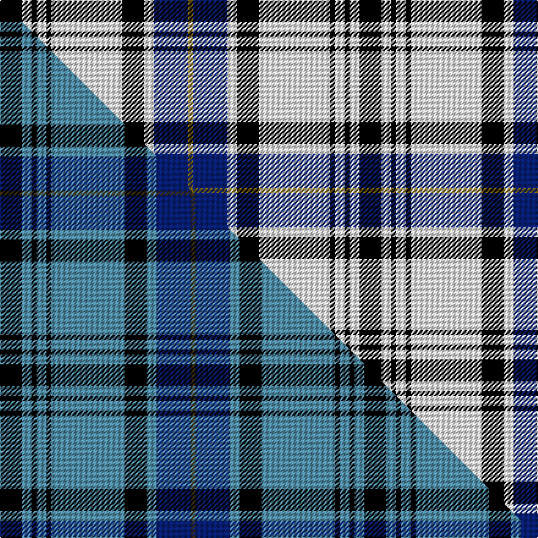

This page is one **sett** — a single exact thread-count. It belongs to the [tartan](/setts/k9w4k2w4k2w29k9w4db14y2/)
(the same proportion at any scale), whose colour order is pattern [GBWKWKWKWK](/stripes/gbwkwkwkwk/).

Part of the [Hannay](/tartans/hannay/) tartan — the named design grouping this sett with its other cloths.

Sourced from register-of-tartans.  It is a [10 stripe tartan](/stripes/stripes10/).

Original link https://www.tartanregister.gov.uk/tartanDetails.aspx?ref=1587

## Register references

External register numbers recorded for this tartan.

- Scottish Register of Tartans: [1587](https://www.tartanregister.gov.uk/tartanDetails.aspx?ref=1587)
- Scottish Tartans Authority (ITI): 1255
- Scottish Tartans World Register: 1255

## Thread count
K/18 W8 K4 W8 K4 W58 K18 W8 DB28 Y/4

One full sett is **294 threads**.

## Palette
<table><thead><tr><th>Colour</th><th>Shade</th><th>OKLCh</th></tr></thead><tbody><tr><td>DB</td><td><code style="background-color:#082077;">#082077</code> <small style="color:#888">#082077</small></td><td><small style="color:#888">oklch(30.0% 0.149 265.1)</small></td></tr><tr><td>Y</td><td><code style="background-color:#8B6E00;">#8B6E00</code> <small style="color:#888">#8B6E00</small></td><td><small style="color:#888">oklch(55.1% 0.113 90.4)</small></td></tr><tr><td>K</td><td><code style="background-color:#000000;">#000000</code> <small style="color:#888">#000000</small></td><td><small style="color:#888">oklch(0.0% 0.000 0.0)</small></td></tr><tr><td>W</td><td><code style="background-color:#F7F7F7;">#F7F7F7</code> <small style="color:#888">#F7F7F7</small></td><td><small style="color:#888">oklch(97.6% 0.000 89.9)</small></td></tr></tbody></table>

# Sample pattern

## Compared to the master

This cloth is one sett of its design; the master sett (the exemplar the design is anchored on) is below for comparison.

Its **ΔTartan distance** from the master is **1.75** — the same measure the nearest-tartans table ranks by (0 is identical; a re-scale of the same cloth is near 0, a recolour or a different proportion further).

<figure class="master-compare" style="margin:0">

this sett
master sett ★

<figcaption style="color:#888;font-size:smaller">One weave of this sett against the <a href="/setts/k9t4k2t4k2t30k9t4db14dy2/">master sett ★</a>, split on the diagonal: a shared proportion runs seamlessly across it with only the shades shifting; a different proportion breaks on it.</figcaption>
</figure>

## Nearest variants

The nearest existing variants by ΔTartan distance, with this cloth at the top so the swatches line up against it.

ΔTartan

Threads

Variant

Sett

—

294

<a href="/variants/s10/k9w4k2w4k2w29k9w4db14y2~x2/">Hannay</a>

<a href="/ttd/edit/#slug=k9w4k2w4k2w30k9w4db14y2~x2&amp;base=k9w4k2w4k2w29k9w4db14y2~x2" title="compare in the TTD">0.03</a>

298

<a href="/variants/s10/k9w4k2w4k2w30k9w4db14y2~x2/">Hannay</a>

<a href="/ttd/edit/#slug=k9w4k2w4k2w30k9w4b14lo2~x2&amp;base=k9w4k2w4k2w29k9w4db14y2~x2" title="compare in the TTD">0.33</a>

298

<a href="/variants/s10/k9w4k2w4k2w30k9w4b14lo2~x2/">Hannay (Clan)</a>

<a href="/ttd/edit/#slug=r4w4k4w4k4w4k2lb23w2~x2&amp;base=k9w4k2w4k2w29k9w4db14y2~x2" title="compare in the TTD">2.02</a>

192

<a href="/variants/s9/r4w4k4w4k4w4k2lb23w2~x2/">Virtuoso</a>

<a href="/ttd/edit/#slug=w5db3w25k2w2k16g8k1w4&amp;base=k9w4k2w4k2w29k9w4db14y2~x2" title="compare in the TTD">2.89</a>

123

<a href="/variants/s9/w5db3w25k2w2k16g8k1w4/">Unidentified (shirt fabric)</a>

## Neighbour map

Every grey dot is one of 13620 variants placed by the first two principal components of the ΔTartan feature space (42% of its variance). Red is this tartan; blue dots are its nearest — click one to open its page.

<svg viewBox="0 0 640 380" role="img" style="max-width:100%;height:auto;border:1px solid #e0e0e0;border-radius:4px;display:block" xmlns="http://www.w3.org/2000/svg"><image href="/nn/cloud.v1.png" width="640" height="380"/><a href="/variants/s10/k9w4k2w4k2w30k9w4db14y2~x2/"><circle cx="222.2" cy="134.6" r="4" fill="#3465a4"><title>Hannay</title></circle></a><a href="/variants/s10/k9w4k2w4k2w30k9w4b14lo2~x2/"><circle cx="230.1" cy="139.7" r="4" fill="#3465a4"><title>Hannay (Clan)</title></circle></a><a href="/variants/s9/r4w4k4w4k4w4k2lb23w2~x2/"><circle cx="196.0" cy="153.1" r="4" fill="#3465a4"><title>Virtuoso</title></circle></a><a href="/variants/s9/w5db3w25k2w2k16g8k1w4/"><circle cx="248.8" cy="119.5" r="4" fill="#3465a4"><title>Unidentified (shirt fabric)</title></circle></a><circle cx="217.0" cy="137.4" r="5" fill="#c00000"/><text x="320" y="376" text-anchor="middle" font-size="11" fill="#999">ground</text><text x="11" y="190" text-anchor="middle" font-size="11" fill="#999" transform="rotate(-90 11 190)">complexity</text></svg>

ID: /variants/s10/k9w4k2w4k2w29k9w4db14y2~x2/
