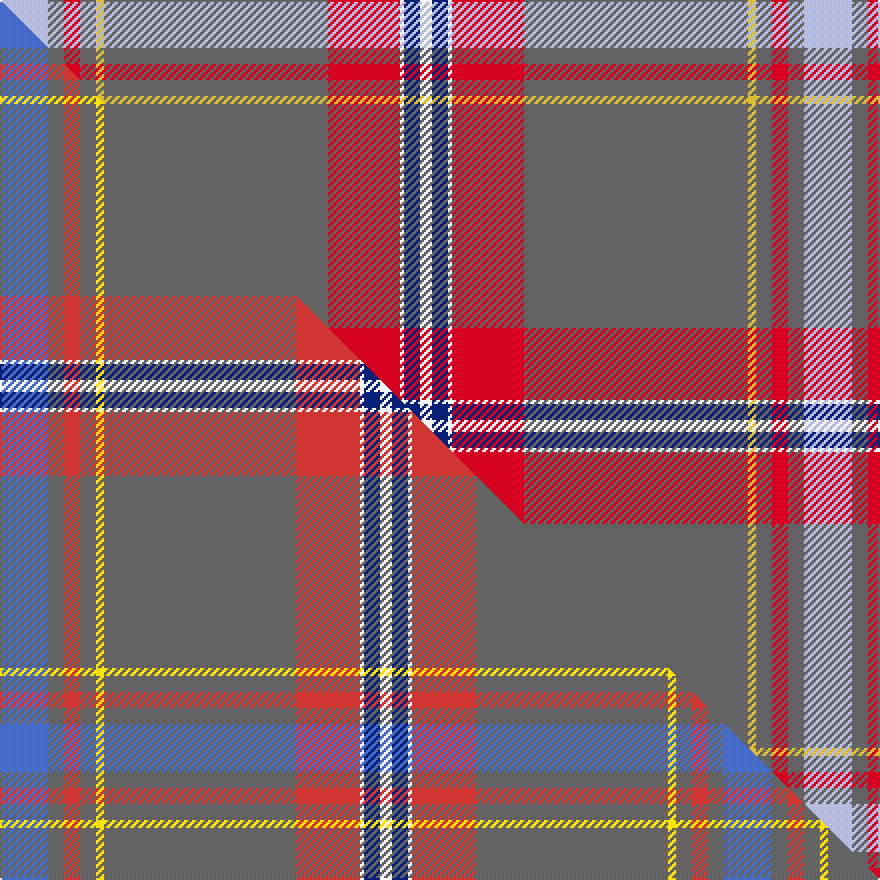

This page is one **sett** — a single exact thread-count. It belongs to the [tartan](/setts/lb12n4r4n4ly2n56r18w1db4w3/)
(the same proportion at any scale), whose colour order is pattern [WBRBYBRWBW](/stripes/wbrbybrwbw/).

Part of the [Confederate Memorial](/tartans/confederate-memorial/) tartan — the named design grouping this sett with its other cloths.

Sourced from tartans-authority.  It is a [10 stripe tartan](/stripes/stripes10/).

Original link [https://www.tartanregister.gov.uk/tartanDetails.aspx?ref=4195](https://www.tartanregister.gov.uk/tartanDetails.aspx?ref=4195)

Dataset <small>— provenance for this record, inherited from the source manifest</small>

<dl class="dataset-prov">
<dt>source</dt><dd><a href="/sources/tartans-authority/">Scottish Tartans Authority</a></dd>
<dt>data captured from</dt><dd><a href="https://github.com/thetartan/tartan-database/blob/master/data/tartans-authority/data.csv">https://github.com/thetartan/tartan-database/blob/master/data/tartans-authority/data.csv</a></dd>
<dt>data date</dt><dd>1995 <small>(this record)</small></dd>
<dt>licence</dt><dd><a href="https://creativecommons.org/licenses/by-nc-nd/4.0/">CC BY-NC-ND 4.0</a></dd>
</dl>

Capture chain <small>— the hands this data passed through, oldest first; each capture carries its own licence</small>

<ol class="capture-chain">
<li><a href="https://www.tartansauthority.com/">Scottish Tartans Authority</a> <small>the heritage body's archive — its tartan-ferret record browser is retired (links repaired to the SRT, above)</small></li>
<li><a href="https://github.com/thetartan/tartan-database">thetartan/tartan-database</a> <small>2016-2017</small> · <a href="https://creativecommons.org/licenses/by-nc-nd/4.0/">CC BY-NC-ND 4.0</a> <small>Levko Kravets's frozen compilation — the capture we vendored, and where its CC licence text came from</small></li>
<li>this dictionary <small>captured 2026-06-10 · commit 5bf86c7566</small> <small>each re-capture is a git commit to data/sources</small></li>
</ol>

## Register references

External register numbers recorded for this tartan.

- Scottish Tartans Authority (ITI): 4195

## Thread count
LB/24 N8 R8 N8 LY4 N112 R36 W2 DB8 W/6

One full sett is **402 threads**.

## Palette
<table><thead><tr><th>Colour</th><th>Shade</th><th>OKLCh</th></tr></thead><tbody><tr><td>LB</td><td><code style="background-color:#B5BBDE;">#B5BBDE</code> <small style="color:#888">#B5BBDE</small></td><td><small style="color:#888">oklch(79.9% 0.050 277.6)</small></td></tr><tr><td>DB</td><td><code style="background-color:#082077;">#082077</code> <small style="color:#888">#082077</small></td><td><small style="color:#888">oklch(30.0% 0.149 265.1)</small></td></tr><tr><td>N</td><td><code style="background-color:#636363;">#636363</code> <small style="color:#888">#636363</small></td><td><small style="color:#888">oklch(50.0% 0.000 89.9)</small></td></tr><tr><td>R</td><td><code style="background-color:#D60020;">#D60020</code> <small style="color:#888">#D60020</small></td><td><small style="color:#888">oklch(55.2% 0.224 25.5)</small></td></tr><tr><td>W</td><td><code style="background-color:#F7F7F7;">#F7F7F7</code> <small style="color:#888">#F7F7F7</small></td><td><small style="color:#888">oklch(97.6% 0.000 89.9)</small></td></tr><tr><td>LY</td><td><code style="background-color:#DCBC32;">#DCBC32</code> <small style="color:#888">#DCBC32</small></td><td><small style="color:#888">oklch(80.0% 0.150 95.2)</small></td></tr></tbody></table>

# Sample pattern

## Compared to the master

This cloth is one sett of its design; the master sett (the exemplar the design is anchored on) is below for comparison.

Its **ΔTartan distance** from the master is **0.22** — the same measure the nearest-tartans table ranks by (0 is identical; a re-scale of the same cloth is near 0, a recolour or a different proportion further).

<figure class="master-compare" style="margin:0">

this sett
master sett ★

<figcaption style="color:#888;font-size:smaller">One weave of this sett against the <a href="/setts/b12n4r4n4ly2n48r16w1db4w3/">master sett ★</a>, split on the diagonal: a shared proportion runs seamlessly across it with only the shades shifting; a different proportion breaks on it.</figcaption>
</figure>

## Nearest tartan variants

The nearest existing variants by ΔTartan distance, with this cloth at the top so the swatches line up against it.

ΔTartan

Threads

Variant

Sett

—

402

<a href="/variants/s10/lb12n4r4n4ly2n56r18w1db4w3~x2/">Confederate Memorial (Military)</a>

<a href="/ttd/edit/#slug=b12n4r4n4ly2n48r16w1db4w3~x2~r2308029-ly3608101&amp;base=lb12n4r4n4ly2n56r18w1db4w3~x2" title="compare in the TTD">0.22</a>

362

<a href="/variants/s10/b12n4r4n4ly2n48r16w1db4w3~x2~r2308029-ly3608101/">Confederate Memorial</a>

<a href="/ttd/edit/#slug=o60g2db4r1db4g2o3w1dp20w1o5db2~x2~o2500000&amp;base=lb12n4r4n4ly2n56r18w1db4w3~x2" title="compare in the TTD">3.04</a>

296

<a href="/variants/s12/o60g2db4r1db4g2o3w1dp20w1o5db2~x2~o2500000/">Scottish Parliament Official Corporate Tartan</a>

<a href="/ttd/edit/#slug=lp6w2lp1db6n30lb1r3~x2&amp;base=lb12n4r4n4ly2n56r18w1db4w3~x2" title="compare in the TTD">3.05</a>

178

<a href="/variants/s7/lp6w2lp1db6n30lb1r3~x2/">Kuehle (Personal)</a>

<a href="/ttd/edit/#slug=dy60db8o16db4lo8dy4r2db6w1~x2~o2007033-lo2905070&amp;base=lb12n4r4n4ly2n56r18w1db4w3~x2" title="compare in the TTD">3.15</a>

314

<a href="/variants/s9/dy60db8o16db4lo8dy4r2db6w1~x2~o2007033-lo2905070/">Wattenhofer (2016)</a>

<a href="/ttd/edit/#slug=t12n4r4n4k2n56r18w1db4w3db4w1~x2~t2405244-r2109032-db1406275&amp;base=lb12n4r4n4ly2n56r18w1db4w3~x2" title="compare in the TTD">3.21</a>

426

<a href="/variants/s12/t12n4r4n4k2n56r18w1db4w3db4w1~x2~t2405244-r2109032-db1406275/">Confederate Memorial</a>

<a href="/ttd/edit/#slug=r6ri1db2r2g40r6db13lb1r48g2r4ri1g4~x2~r1807008-ri2406019&amp;base=lb12n4r4n4ly2n56r18w1db4w3~x2" title="compare in the TTD">3.36</a>

500

<a href="/variants/s13/r6ri1db2r2g40r6db13lb1r48g2r4ri1g4~x2~r1807008-ri2406019/">MacDonald of Glencoe Artifact Tartan</a>

<a href="/ttd/edit/#slug=r36w1db3y1g16r8db3t2w1~x2&amp;base=lb12n4r4n4ly2n56r18w1db4w3~x2" title="compare in the TTD">3.37</a>

210

<a href="/variants/s9/r36w1db3y1g16r8db3t2w1~x2/">Drummond of Perth (Clan)</a>

<a href="/ttd/edit/#slug=r36w1db3y1g16r8db3lb2w1&amp;base=lb12n4r4n4ly2n56r18w1db4w3~x2" title="compare in the TTD">3.43</a>

105

<a href="/variants/s9/r36w1db3y1g16r8db3lb2w1/">Drummond of Perth</a>

<a href="/ttd/edit/#slug=r36w1db3y1g16r8db3lb2w1~x2&amp;base=lb12n4r4n4ly2n56r18w1db4w3~x2" title="compare in the TTD">3.43</a>

210

<a href="/variants/s9/r36w1db3y1g16r8db3lb2w1~x2/">Drummond of Perth</a>

<a href="/ttd/edit/#slug=o38lp4o8dy2o4w3o4dr14n7o2n4w2~x2~o2500000-n1900000&amp;base=lb12n4r4n4ly2n56r18w1db4w3~x2" title="compare in the TTD">3.57</a>

288

<a href="/variants/s12/o38lp4o8dy2o4w3o4dr14n7o2n4w2~x2~o2500000-n1900000/">Portree Check (District) Tartan</a>

## Neighbour map

Every grey dot is one of 13621 variants placed by the first two principal components of the ΔTartan feature space (42% of its variance). Red is this tartan; blue dots are its nearest — click one to open its page.

<svg viewBox="0 0 640 380" role="img" style="max-width:100%;height:auto;border:1px solid #e0e0e0;border-radius:4px;display:block" xmlns="http://www.w3.org/2000/svg"><image href="/nn/cloud.v1.png" width="640" height="380"/><a href="/variants/s10/b12n4r4n4ly2n48r16w1db4w3~x2~r2308029-ly3608101/"><circle cx="399.3" cy="93.9" r="4" fill="#3465a4"><title>Confederate Memorial</title></circle></a><a href="/variants/s12/o60g2db4r1db4g2o3w1dp20w1o5db2~x2~o2500000/"><circle cx="426.4" cy="50.7" r="4" fill="#3465a4"><title>Scottish Parliament Official Corporate Tartan</title></circle></a><a href="/variants/s7/lp6w2lp1db6n30lb1r3~x2/"><circle cx="387.0" cy="117.4" r="4" fill="#3465a4"><title>Kuehle (Personal)</title></circle></a><a href="/variants/s9/dy60db8o16db4lo8dy4r2db6w1~x2~o2007033-lo2905070/"><circle cx="391.6" cy="82.2" r="4" fill="#3465a4"><title>Wattenhofer (2016)</title></circle></a><a href="/variants/s12/t12n4r4n4k2n56r18w1db4w3db4w1~x2~t2405244-r2109032-db1406275/"><circle cx="365.9" cy="58.0" r="4" fill="#3465a4"><title>Confederate Memorial</title></circle></a><a href="/variants/s13/r6ri1db2r2g40r6db13lb1r48g2r4ri1g4~x2~r1807008-ri2406019/"><circle cx="352.0" cy="71.9" r="4" fill="#3465a4"><title>MacDonald of Glencoe Artifact Tartan</title></circle></a><a href="/variants/s9/r36w1db3y1g16r8db3t2w1~x2/"><circle cx="380.1" cy="81.1" r="4" fill="#3465a4"><title>Drummond of Perth (Clan)</title></circle></a><a href="/variants/s9/r36w1db3y1g16r8db3lb2w1/"><circle cx="377.9" cy="80.1" r="4" fill="#3465a4"><title>Drummond of Perth</title></circle></a><a href="/variants/s9/r36w1db3y1g16r8db3lb2w1~x2/"><circle cx="377.9" cy="80.1" r="4" fill="#3465a4"><title>Drummond of Perth</title></circle></a><a href="/variants/s12/o38lp4o8dy2o4w3o4dr14n7o2n4w2~x2~o2500000-n1900000/"><circle cx="359.0" cy="118.6" r="4" fill="#3465a4"><title>Portree Check (District) Tartan</title></circle></a><circle cx="399.3" cy="79.7" r="5" fill="#c00000"/><text x="320" y="376" text-anchor="middle" font-size="11" fill="#999">ground</text><text x="11" y="190" text-anchor="middle" font-size="11" fill="#999" transform="rotate(-90 11 190)">complexity</text></svg>

ID: /variants/s10/lb12n4r4n4ly2n56r18w1db4w3~x2/
