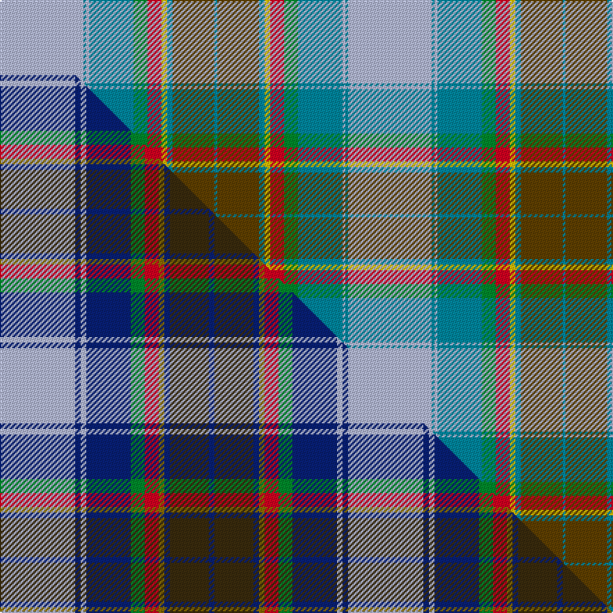

This is one **variant** — a specific cloth: this exact thread count and colourway, with its own
provenance below. It is one weaving of the [sett](/tartans/l/ly/lyon-jeffrey-m-2/) (the scale-free proportion — the
same cloth at any scale or shade), whose colour order is pattern [BGBYRGBWBW](/stripes/bgbyrgbwbw/).

Part of the [Lyon, Jeffrey M](/tartans/l/ly/lyon-jeffrey-m-2/) tartan — the named design grouping this sett with its other cloths.

Sourced from tartans-authority.  It is a [10 stripe tartan](/stripes/stripes10/).

Original link <code>http://www.tartansauthority.com/tartan-ferret/display/10952/</code> — retired · [Internet Archive copy](https://web.archive.org/web/*/http://www.tartansauthority.com/tartan-ferret/display/10952/*)

Dataset <small>— provenance for this record, inherited from the source manifest</small>

<dl class="dataset-prov">
<dt>source</dt><dd><a href="/sources/tartans-authority/">Scottish Tartans Authority</a></dd>
<dt>data captured from</dt><dd><a href="https://github.com/thetartan/tartan-database/blob/master/data/tartans-authority/data.csv">https://github.com/thetartan/tartan-database/blob/master/data/tartans-authority/data.csv</a></dd>
<dt>data date</dt><dd>2013 <small>(this record)</small></dd>
<dt>licence</dt><dd><a href="https://creativecommons.org/licenses/by-nc-nd/4.0/">CC BY-NC-ND 4.0</a></dd>
</dl>

Capture chain <small>— the hands this data passed through, oldest first; each capture carries its own licence</small>

<ol class="capture-chain">
<li><a href="https://www.tartansauthority.com/">Scottish Tartans Authority</a> <small>the heritage body’s archive — its tartan-ferret record browser is retired; dead record links are shown unlinked, with an Internet Archive copy (ITI numbers are not SRT references)</small></li>
<li><a href="https://github.com/thetartan/tartan-database">thetartan/tartan-database</a> <small>2016-2017</small> · <a href="https://creativecommons.org/licenses/by-nc-nd/4.0/">CC BY-NC-ND 4.0</a> <small>Levko Kravets's frozen compilation — the capture we vendored, and where its CC licence text came from</small></li>
<li>this dictionary <small>captured 2026-06-10 · commit 5bf86c7566</small> <small>each re-capture is a git commit to data/sources</small></li>
</ol>

## Register references

External register numbers recorded for this tartan.

- Scottish Register of Tartans: [10952](https://www.tartanregister.gov.uk/tartanDetails?ref=10952)
- Scottish Tartans Authority (ITI): 10952

## Thread count
LB/60 T2 LB2 T32 G10 R10 LY4 T4 DY30 T/2

One full sett is **250 threads**.

## Palette
<table><thead><tr><th>Colour</th><th>Shade</th><th>OKLCh</th></tr></thead><tbody><tr><td>LB</td><td><code style="background-color:#B5BBDE;">#B5BBDE</code> <small style="color:#888">#B5BBDE</small></td><td><small style="color:#888">oklch(79.9% 0.050 277.6)</small></td></tr><tr><td>T</td><td><code style="background-color:#00879F;">#00879F</code> <small style="color:#888">#00879F</small></td><td><small style="color:#888">oklch(57.4% 0.102 216.1)</small></td></tr><tr><td>G</td><td><code style="background-color:#008B2A;">#008B2A</code> <small style="color:#888">#008B2A</small></td><td><small style="color:#888">oklch(55.4% 0.170 145.9)</small></td></tr><tr><td>R</td><td><code style="background-color:#D60020;">#D60020</code> <small style="color:#888">#D60020</small></td><td><small style="color:#888">oklch(55.2% 0.224 25.5)</small></td></tr><tr><td>DY</td><td><code style="background-color:#604000;">#604000</code> <small style="color:#888">#604000</small></td><td><small style="color:#888">oklch(39.8% 0.083 76.8)</small></td></tr><tr><td>LY</td><td><code style="background-color:#E8C000;">#E8C000</code> <small style="color:#888">#E8C000</small></td><td><small style="color:#888">oklch(81.9% 0.168 93.7)</small></td></tr></tbody></table>

# Sample pattern

[Sample sheet (PDF)](swatch.pdf) — the woven sample, thread count and palette on one printable A4, rendered on demand (the same sheet the TTD print page downloads).

## Compared to the master

This cloth is one sett of its design; the master sett (the exemplar the design is anchored on) is below for comparison.

Its **ΔTartan distance** from the master is **1.87** — the same measure the nearest-tartans table ranks by (0 is identical; a re-scale of the same cloth is near 0, a recolour or a different proportion further).

<figure class="master-compare" style="margin:0">

this sett
master sett ★

<figcaption style="color:#888;font-size:smaller">One weave of this sett against the <a href="/setts/lb27db2lb2db16g5r5y2db2dy14db2/">master sett ★</a>, split on the diagonal: a shared proportion runs seamlessly across it with only the shades shifting; a different proportion breaks on it.</figcaption>
</figure>

## Nearest tartan variants

The nearest existing variants by ΔTartan distance, with this cloth at the top so the swatches line up against it.

ΔTartan

Threads

Variant

Sett

—

250

<a href="/variants/s10/lb30t1lb1t16g5r5ly2t2dy15t1~x2~ly8117093-dy3908078/">Lyon, Jeffrey M (Hunting) (Personal)</a>

<a href="/ttd/edit/#slug=lb27db2lb2db16g5r5y2db2dy14db2~x2&amp;base=lb30t1lb1t16g5r5ly2t2dy15t1~x2~ly8117093-dy3908078" title="compare in the TTD">1.87</a>

250

<a href="/variants/s10/lb27db2lb2db16g5r5y2db2dy14db2~x2/">Lyon, Jeffrey M (Hunting) (Personal)</a>

<a href="/ttd/edit/#slug=r4db2dp14db12y1t32db12t14db2g4~x2~db2508270-t6107234&amp;base=lb30t1lb1t16g5r5ly2t2dy15t1~x2~ly8117093-dy3908078" title="compare in the TTD">2.21</a>

372

<a href="/variants/s10/r4db2dp14db12y1t32db12t14db2g4~x2~db2508270-t6107234/">Timmins (2013)</a>

<a href="/ttd/edit/#slug=n2y2n1y2n1lb15n4r1y2b7y1~x4~n43-lb80&amp;base=lb30t1lb1t16g5r5ly2t2dy15t1~x2~ly8117093-dy3908078" title="compare in the TTD">3.03</a>

292

<a href="/variants/s11/n2y2n1y2n1lb15n4r1y2b7y1~x4~n43-lb80/">Hutt Tartan</a>

<a href="/ttd/edit/#slug=n30w4dt9lb2dt1y6dt8r8~x4&amp;base=lb30t1lb1t16g5r5ly2t2dy15t1~x2~ly8117093-dy3908078" title="compare in the TTD">3.03</a>

392

<a href="/variants/s8/n30w4dt9lb2dt1y6dt8r8~x4/">Norwegian Migration Period (Artefact</a>

<a href="/ttd/edit/#slug=n2y2n1y2n1lb15n4r1y2dg7y1~x4&amp;base=lb30t1lb1t16g5r5ly2t2dy15t1~x2~ly8117093-dy3908078" title="compare in the TTD">3.10</a>

292

<a href="/variants/s11/n2y2n1y2n1lb15n4r1y2dg7y1~x4/">Hutt #1 (Personal)</a>

<a href="/ttd/edit/#slug=t25k1dy6k1lr10w3lr10k1y3~x4~t6107234-lr70&amp;base=lb30t1lb1t16g5r5ly2t2dy15t1~x2~ly8117093-dy3908078" title="compare in the TTD">3.14</a>

368

<a href="/variants/s9/t25k1dy6k1lr10w3lr10k1y3~x4~t6107234-lr70/">O'Rourke (Name?)</a>

<a href="/ttd/edit/#slug=t25k1dy6k1lr10w3lr10k1y3~x4~t6107234-dy3808066-lr70&amp;base=lb30t1lb1t16g5r5ly2t2dy15t1~x2~ly8117093-dy3908078" title="compare in the TTD">3.20</a>

368

<a href="/variants/s9/t25k1dy6k1lr10w3lr10k1y3~x4~t6107234-dy3808066-lr70/">O'Rourke (Estimated threadcount)</a>

<a href="/ttd/edit/#slug=g2dg9dr16r2t30g3dg6w1~x2&amp;base=lb30t1lb1t16g5r5ly2t2dy15t1~x2~ly8117093-dy3908078" title="compare in the TTD">3.31</a>

270

<a href="/variants/s8/g2dg9dr16r2t30g3dg6w1~x2/">The Climb (Fashion)</a>

<a href="/ttd/edit/#slug=db16w3db1y4g24r1g3r4g3r1lb8~x2&amp;base=lb30t1lb1t16g5r5ly2t2dy15t1~x2~ly8117093-dy3908078" title="compare in the TTD">3.33</a>

224

<a href="/variants/s11/db16w3db1y4g24r1g3r4g3r1lb8~x2/">Currie</a>

<a href="/ttd/edit/#slug=lb38db18lb4lyi3g10ly3g4lb3ly17r4~x2~lyi8517093-ly6307084&amp;base=lb30t1lb1t16g5r5ly2t2dy15t1~x2~ly8117093-dy3908078" title="compare in the TTD">3.41</a>

332

<a href="/variants/s10/lb38db18lb4lyi3g10ly3g4lb3ly17r4~x2~lyi8517093-ly6307084/">State Seal of Delaware (Fashion)</a>

## Neighbour map

Every grey dot is one of 13662 variants placed by the first two principal components of the ΔTartan feature space (42% of its variance). Red is this tartan; blue dots are its nearest — click one to open its page. The map is a flat projection of a many-dimensional space — [how to read it](/posts/neighbourhood-maps/).

<svg viewBox="0 0 640 380" role="img" style="max-width:100%;height:auto;border:1px solid #e0e0e0;border-radius:4px;display:block" xmlns="http://www.w3.org/2000/svg"><image href="/nn/cloud.v1.png" width="640" height="380"/><a href="/variants/s10/lb27db2lb2db16g5r5y2db2dy14db2~x2/"><circle cx="159.7" cy="137.2" r="4" fill="#3465a4"><title>Lyon, Jeffrey M (Hunting) (Personal)</title></circle></a><a href="/variants/s10/r4db2dp14db12y1t32db12t14db2g4~x2~db2508270-t6107234/"><circle cx="272.8" cy="127.1" r="4" fill="#3465a4"><title>Timmins (2013)</title></circle></a><a href="/variants/s11/n2y2n1y2n1lb15n4r1y2b7y1~x4~n43-lb80/"><circle cx="247.0" cy="156.2" r="4" fill="#3465a4"><title>Hutt Tartan</title></circle></a><a href="/variants/s8/n30w4dt9lb2dt1y6dt8r8~x4/"><circle cx="270.1" cy="137.2" r="4" fill="#3465a4"><title>Norwegian Migration Period (Artefact</title></circle></a><a href="/variants/s11/n2y2n1y2n1lb15n4r1y2dg7y1~x4/"><circle cx="223.0" cy="148.2" r="4" fill="#3465a4"><title>Hutt #1 (Personal)</title></circle></a><a href="/variants/s9/t25k1dy6k1lr10w3lr10k1y3~x4~t6107234-lr70/"><circle cx="227.5" cy="118.8" r="4" fill="#3465a4"><title>O'Rourke (Name?)</title></circle></a><a href="/variants/s9/t25k1dy6k1lr10w3lr10k1y3~x4~t6107234-dy3808066-lr70/"><circle cx="238.0" cy="122.4" r="4" fill="#3465a4"><title>O'Rourke (Estimated threadcount)</title></circle></a><a href="/variants/s8/g2dg9dr16r2t30g3dg6w1~x2/"><circle cx="272.1" cy="136.5" r="4" fill="#3465a4"><title>The Climb (Fashion)</title></circle></a><a href="/variants/s11/db16w3db1y4g24r1g3r4g3r1lb8~x2/"><circle cx="211.1" cy="113.5" r="4" fill="#3465a4"><title>Currie</title></circle></a><a href="/variants/s10/lb38db18lb4lyi3g10ly3g4lb3ly17r4~x2~lyi8517093-ly6307084/"><circle cx="206.2" cy="155.3" r="4" fill="#3465a4"><title>State Seal of Delaware (Fashion)</title></circle></a><circle cx="243.1" cy="118.5" r="5" fill="#c00000"/><text x="320" y="376" text-anchor="middle" font-size="11" fill="#999">ground</text><text x="11" y="190" text-anchor="middle" font-size="11" fill="#999" transform="rotate(-90 11 190)">complexity</text></svg>

ID: /variants/s10/lb30t1lb1t16g5r5ly2t2dy15t1~x2~ly8117093-dy3908078/
