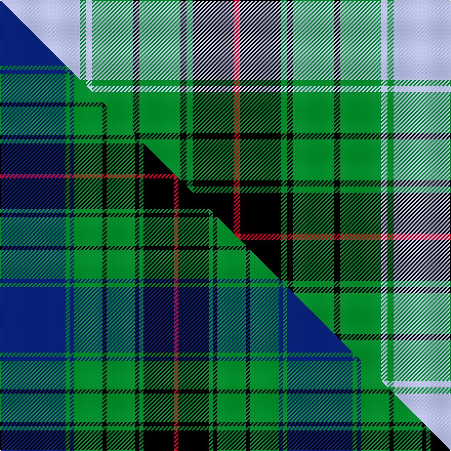

This is one **variant** — a specific cloth: this exact thread count and colourway, with its own
provenance below. It is one weaving of the [sett](/setts/lb39g3lb3g20k3g20k3g3k20r3/) (the scale-free proportion — the
same cloth at any scale or shade), whose colour order is pattern [RKGKGKGWGW](/stripes/rkgkgkgwgw/).

Part of the [Dunedin Chapter](/tartans/d/du/dunedin-chapter/) tartan — the named design grouping this sett with its other cloths.

Sourced from tartans-authority.  It is a [10 stripe tartan](/stripes/stripes10/).

Original link [https://www.tartanregister.gov.uk/tartanDetails.aspx?ref=3905](https://www.tartanregister.gov.uk/tartanDetails.aspx?ref=3905)

Dataset <small>— provenance for this record, inherited from the source manifest</small>

<dl class="dataset-prov">
<dt>source</dt><dd><a href="/sources/tartans-authority/">Scottish Tartans Authority</a></dd>
<dt>data captured from</dt><dd><a href="https://github.com/thetartan/tartan-database/blob/master/data/tartans-authority/data.csv">https://github.com/thetartan/tartan-database/blob/master/data/tartans-authority/data.csv</a></dd>
<dt>data date</dt><dd>2001 <small>(this record)</small></dd>
<dt>licence</dt><dd><a href="https://creativecommons.org/licenses/by-nc-nd/4.0/">CC BY-NC-ND 4.0</a></dd>
</dl>

Capture chain <small>— the hands this data passed through, oldest first; each capture carries its own licence</small>

<ol class="capture-chain">
<li><a href="https://www.tartansauthority.com/">Scottish Tartans Authority</a> <small>the heritage body's archive — its tartan-ferret record browser is retired (links repaired to the SRT, above)</small></li>
<li><a href="https://github.com/thetartan/tartan-database">thetartan/tartan-database</a> <small>2016-2017</small> · <a href="https://creativecommons.org/licenses/by-nc-nd/4.0/">CC BY-NC-ND 4.0</a> <small>Levko Kravets's frozen compilation — the capture we vendored, and where its CC licence text came from</small></li>
<li>this dictionary <small>captured 2026-06-10 · commit 5bf86c7566</small> <small>each re-capture is a git commit to data/sources</small></li>
</ol>

## Register references

External register numbers recorded for this tartan.

- Scottish Tartans Authority (ITI): 3905

## Thread count
LB/78 G6 LB6 G40 K6 G40 K6 G6 K40 R/6

One full sett is **384 threads**.

## Palette
<table><thead><tr><th>Colour</th><th>Shade</th><th>OKLCh</th></tr></thead><tbody><tr><td>LB</td><td><code style="background-color:#B5BBDE;">#B5BBDE</code> <small style="color:#888">#B5BBDE</small></td><td><small style="color:#888">oklch(79.9% 0.050 277.6)</small></td></tr><tr><td>G</td><td><code style="background-color:#008B2A;">#008B2A</code> <small style="color:#888">#008B2A</small></td><td><small style="color:#888">oklch(55.4% 0.170 145.9)</small></td></tr><tr><td>K</td><td><code style="background-color:#000000;">#000000</code> <small style="color:#888">#000000</small></td><td><small style="color:#888">oklch(0.0% 0.000 0.0)</small></td></tr><tr><td>R</td><td><code style="background-color:#D60020;">#D60020</code> <small style="color:#888">#D60020</small></td><td><small style="color:#888">oklch(55.2% 0.224 25.5)</small></td></tr></tbody></table>

# Sample pattern

## Compared to the master

This cloth is one sett of its design; the master sett (the exemplar the design is anchored on) is below for comparison.

Its **ΔTartan distance** from the master is **0.39** — the same measure the nearest-tartans table ranks by (0 is identical; a re-scale of the same cloth is near 0, a recolour or a different proportion further).

<figure class="master-compare" style="margin:0">

this sett
master sett ★

<figcaption style="color:#888;font-size:smaller">One weave of this sett against the <a href="/setts/db32g2db2g14k2g14k2g2k15r2/">master sett ★</a>, split on the diagonal: a shared proportion runs seamlessly across it with only the shades shifting; a different proportion breaks on it.</figcaption>
</figure>

## Nearest tartan variants

The nearest existing variants by ΔTartan distance, with this cloth at the top so the swatches line up against it.

ΔTartan

Threads

Variant

Sett

—

384

<a href="/variants/s10/lb39g3lb3g20k3g20k3g3k20r3~x2/">Dunedin Chapter (Corporate)</a>

<a href="/ttd/edit/#slug=w16k4o1k2w1k6dg6k1dg6w1~x4&amp;base=lb39g3lb3g20k3g20k3g3k20r3~x2" title="compare in the TTD">1.89</a>

284

<a href="/variants/s10/w16k4o1k2w1k6dg6k1dg6w1~x4/">Unidentified #49</a>

<a href="/ttd/edit/#slug=r3g2k1g20k9lb20k1lb2r3~x2&amp;base=lb39g3lb3g20k3g20k3g3k20r3~x2" title="compare in the TTD">2.12</a>

232

<a href="/variants/s9/r3g2k1g20k9lb20k1lb2r3~x2/">Ayrton</a>

<a href="/ttd/edit/#slug=dg27w2dg3ly4dg3w2dg5k13lg2w26lg3~x2&amp;base=lb39g3lb3g20k3g20k3g3k20r3~x2" title="compare in the TTD">2.24</a>

300

<a href="/variants/s11/dg27w2dg3ly4dg3w2dg5k13lg2w26lg3~x2/">MacKellar Dress, Green (Dance)</a>

<a href="/ttd/edit/#slug=g2r2g21k8lb8k2lb28k2lb8k8g21w2g2~x2&amp;base=lb39g3lb3g20k3g20k3g3k20r3~x2" title="compare in the TTD">2.27</a>

448

<a href="/variants/s13/g2r2g21k8lb8k2lb28k2lb8k8g21w2g2~x2/">Mack Original (Personal)</a>

<a href="/ttd/edit/#slug=b16y2b4y2b5k14g28y2g7~x2&amp;base=lb39g3lb3g20k3g20k3g3k20r3~x2" title="compare in the TTD">2.36</a>

274

<a href="/variants/s9/b16y2b4y2b5k14g28y2g7~x2/">Marie Curie Fields of Hope</a>

<a href="/ttd/edit/#slug=lb3k1g12k1g1k2g1k6lr12k1lo1~x4~lb3203246-lr3200000&amp;base=lb39g3lb3g20k3g20k3g3k20r3~x2" title="compare in the TTD">2.43</a>

312

<a href="/variants/s11/lbi3k1g12k1g1k2g1k6lb12k1lo1~x4~lbi3203246-lb3200000/">MacCandlish Arisaid Green</a>

<a href="/ttd/edit/#slug=k2lb2k2lb15g15k2g2w2~x4&amp;base=lb39g3lb3g20k3g20k3g3k20r3~x2" title="compare in the TTD">2.47</a>

320

<a href="/variants/s8/k2lb2k2lb15g15k2g2w2~x4/">Ben Lomond (Fashion)</a>

<a href="/ttd/edit/#slug=k5lo4g25k14lo5k5w5k2w3g3k2lo5~x2&amp;base=lb39g3lb3g20k3g20k3g3k20r3~x2" title="compare in the TTD">2.50</a>

292

<a href="/variants/s12/k5lo4g25k14lo5k5w5k2w3g3k2lo5~x2/">Heritage of Ireland (Fashion)</a>

<a href="/ttd/edit/#slug=w25t2w2t2w2t10k2t4k2t10dg23w2dg4~x2&amp;base=lb39g3lb3g20k3g20k3g3k20r3~x2" title="compare in the TTD">2.53</a>

302

<a href="/variants/s13/w25t2w2t2w2t10k2t4k2t10dg23w2dg4~x2/">Oliphant Dress Clan Tartan</a>

<a href="/ttd/edit/#slug=lb3k1g12k1g1k2g1k6w12k1lo1~x4&amp;base=lb39g3lb3g20k3g20k3g3k20r3~x2" title="compare in the TTD">2.56</a>

312

<a href="/variants/s11/lb3k1g12k1g1k2g1k6w12k1lo1~x4/">McCandlish Arisaid, Green (Name)</a>

## Neighbour map

Every grey dot is one of 13621 variants placed by the first two principal components of the ΔTartan feature space (42% of its variance). Red is this tartan; blue dots are its nearest — click one to open its page.

<svg viewBox="0 0 640 380" role="img" style="max-width:100%;height:auto;border:1px solid #e0e0e0;border-radius:4px;display:block" xmlns="http://www.w3.org/2000/svg"><image href="/nn/cloud.v1.png" width="640" height="380"/><a href="/variants/s10/w16k4o1k2w1k6dg6k1dg6w1~x4/"><circle cx="164.6" cy="134.4" r="4" fill="#3465a4"><title>Unidentified #49</title></circle></a><a href="/variants/s9/r3g2k1g20k9lb20k1lb2r3~x2/"><circle cx="174.5" cy="134.0" r="4" fill="#3465a4"><title>Ayrton</title></circle></a><a href="/variants/s11/dg27w2dg3ly4dg3w2dg5k13lg2w26lg3~x2/"><circle cx="154.4" cy="122.5" r="4" fill="#3465a4"><title>MacKellar Dress, Green (Dance)</title></circle></a><a href="/variants/s13/g2r2g21k8lb8k2lb28k2lb8k8g21w2g2~x2/"><circle cx="157.3" cy="129.7" r="4" fill="#3465a4"><title>Mack Original (Personal)</title></circle></a><a href="/variants/s9/b16y2b4y2b5k14g28y2g7~x2/"><circle cx="204.9" cy="166.9" r="4" fill="#3465a4"><title>Marie Curie Fields of Hope</title></circle></a><a href="/variants/s11/lbi3k1g12k1g1k2g1k6lb12k1lo1~x4~lbi3203246-lb3200000/"><circle cx="117.0" cy="129.9" r="4" fill="#3465a4"><title>MacCandlish Arisaid Green</title></circle></a><a href="/variants/s8/k2lb2k2lb15g15k2g2w2~x4/"><circle cx="179.4" cy="181.0" r="4" fill="#3465a4"><title>Ben Lomond (Fashion)</title></circle></a><a href="/variants/s12/k5lo4g25k14lo5k5w5k2w3g3k2lo5~x2/"><circle cx="134.7" cy="145.6" r="4" fill="#3465a4"><title>Heritage of Ireland (Fashion)</title></circle></a><a href="/variants/s13/w25t2w2t2w2t10k2t4k2t10dg23w2dg4~x2/"><circle cx="150.6" cy="139.7" r="4" fill="#3465a4"><title>Oliphant Dress Clan Tartan</title></circle></a><a href="/variants/s11/lb3k1g12k1g1k2g1k6w12k1lo1~x4/"><circle cx="109.6" cy="127.7" r="4" fill="#3465a4"><title>McCandlish Arisaid, Green (Name)</title></circle></a><circle cx="169.4" cy="150.8" r="5" fill="#c00000"/><text x="320" y="376" text-anchor="middle" font-size="11" fill="#999">ground</text><text x="11" y="190" text-anchor="middle" font-size="11" fill="#999" transform="rotate(-90 11 190)">complexity</text></svg>

ID: /variants/s10/lb39g3lb3g20k3g20k3g3k20r3~x2/
