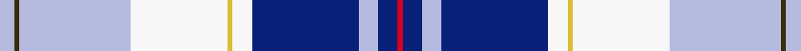

This is one **variant** — a specific cloth: this exact thread count and colourway, with its own
provenance below. It is one weaving of the [sett](/tartans/f/fo/forfar/) (the scale-free proportion — the
same cloth at any scale or shade), whose colour order is pattern [RBWBWYWWGW](/stripes/rbwbwywwgw/).

Part of the [Forfar](/tartans/f/fo/forfar/) tartan — the named design grouping this sett with its other cloths.

Sourced from register-of-tartans.  It is a [10 stripe tartan](/stripes/stripes10/).

Original link [https://www.tartanregister.gov.uk/tartanDetails.aspx?ref=1229](https://www.tartanregister.gov.uk/tartanDetails.aspx?ref=1229)

2 attestations — the source records this cloth was collapsed from (oldest owns this page)

<ul>
<li>01/03/2004 — Forfar (register-of-tartans, <a href="https://www.tartanregister.gov.uk/tartanDetails.aspx?ref=1229">record</a>)  <em>Designed by Arthur Mackie of The Strathmore Woollen Co. Ltd of Forfar which is the county town of Angus in Scotland. Historically Forfar has royal connections with King Malcolm II and III, Alexander II and III and King Robert the Bruce, all of whom favoured the town which resulted in Forfar being created as a Royal Burgh in the mid 12th century. The colours of the tartan are from the Coat of Arms displayed in the Council Chambers and the tartan has been approved by the town's Community Council.</em></li>
<li>March 2004 — Forfar (District) (tartans-authority, <a href="https://web.archive.org/web/*/http://www.tartansauthority.com/tartan-ferret/display/6238/*">record</a>)  <em>Designed by Arthur Mackie of The Strathmore Woollen Co. Ltd of Forfar which is the county town of Angus in Scotland. Historically Forfar has royal connections with King Malcolm II and III, Alexander II and III and King Robert the Bruce, all of whom favoured the town which resulted in Forfar being created as a Royal Burgh in the mid 12th century. The colours of the tartan are from the Coat of Arms displayed in the Council Chambers and the tartan has been approved by the town's Community Council.</em></li>
</ul>

Dataset <small>— provenance for this record, inherited from the source manifest</small>

<dl class="dataset-prov">
<dt>source</dt><dd><a href="/sources/register-of-tartans/">Scottish Register of Tartans</a></dd>
<dt>data captured from</dt><dd><a href="https://github.com/thetartan/tartan-database/blob/master/data/register-of-tartans/data.csv">https://github.com/thetartan/tartan-database/blob/master/data/register-of-tartans/data.csv</a></dd>
<dt>data date</dt><dd>01/03/2004 <small>(this record)</small></dd>
<dt>licence</dt><dd><a href="https://www.tartanregister.gov.uk/copyright">Crown copyright</a></dd>
</dl>

Capture chain <small>— the hands this data passed through, oldest first; each capture carries its own licence</small>

<ol class="capture-chain">
<li><a href="https://www.tartanregister.gov.uk/">Scottish Register of Tartans</a> · <a href="https://www.tartanregister.gov.uk/copyright">Crown copyright</a> <small>the living register — still published by National Records of Scotland</small></li>
<li><a href="https://github.com/thetartan/tartan-database">thetartan/tartan-database</a> <small>2016-2017</small> · <a href="https://creativecommons.org/licenses/by-nc-nd/4.0/">CC BY-NC-ND 4.0</a> <small>Levko Kravets's frozen compilation — the capture we vendored, and where its CC licence text came from</small></li>
<li>this dictionary <small>captured 2026-06-10 · commit 5bf86c7566</small> <small>each re-capture is a git commit to data/sources</small></li>
</ol>

## Register references

External register numbers recorded for this tartan.

- Scottish Register of Tartans: [1229](https://www.tartanregister.gov.uk/tartanDetails.aspx?ref=1229)
- Scottish Tartans Authority (ITI): 6238

## Thread count
LB/6 DY2 LB46 W40 LY2 W8 DB44 LB8 DB8 R/2

One full sett is **324 threads**.

## Palette
<table><thead><tr><th>Colour</th><th>Shade</th><th>OKLCh</th></tr></thead><tbody><tr><td>LB</td><td><code style="background-color:#B5BBDE;">#B5BBDE</code> <small style="color:#888">#B5BBDE</small></td><td><small style="color:#888">oklch(79.9% 0.050 277.6)</small></td></tr><tr><td>DB</td><td><code style="background-color:#082077;">#082077</code> <small style="color:#888">#082077</small></td><td><small style="color:#888">oklch(30.0% 0.149 265.1)</small></td></tr><tr><td>LY</td><td><code style="background-color:#DCBC32;">#DCBC32</code> <small style="color:#888">#DCBC32</small></td><td><small style="color:#888">oklch(80.0% 0.150 95.2)</small></td></tr><tr><td>R</td><td><code style="background-color:#D60020;">#D60020</code> <small style="color:#888">#D60020</small></td><td><small style="color:#888">oklch(55.2% 0.224 25.5)</small></td></tr><tr><td>W</td><td><code style="background-color:#F7F7F7;">#F7F7F7</code> <small style="color:#888">#F7F7F7</small></td><td><small style="color:#888">oklch(97.6% 0.000 89.9)</small></td></tr><tr><td>DY</td><td><code style="background-color:#3A2B0D;">#3A2B0D</code> <small style="color:#888">#3A2B0D</small></td><td><small style="color:#888">oklch(30.0% 0.049 82.0)</small></td></tr></tbody></table>

# Sample pattern

## Nearest tartan variants

The nearest existing variants by ΔTartan distance, with this cloth at the top so the swatches line up against it.

ΔTartan

Threads

Variant

Sett

—

324

<a href="/variants/s10/lb3dy1lb23w20ly1w4db22lb4db4r1~x2/">Forfar</a>

<a href="/ttd/edit/#slug=b36db5g5w2r4w2dr9w22~x2~g2004144-r2308029&amp;base=lb3dy1lb23w20ly1w4db22lb4db4r1~x2" title="compare in the TTD">2.01</a>

224

<a href="/variants/s8/b36db5g5w2r4w2dr9w22~x2~g2004144-r2308029/">South Canterbury Centre P. &amp; D. Assoc., Jubilee</a>

<a href="/ttd/edit/#slug=db16r4db2y4db8w8db2w24lb2w1lb8~x2&amp;base=lb3dy1lb23w20ly1w4db22lb4db4r1~x2" title="compare in the TTD">2.37</a>

268

<a href="/variants/s11/db16r4db2y4db8w8db2w24lb2w1lb8~x2/">Galego</a>

<a href="/ttd/edit/#slug=db2w20r1y2dg8b4dg2b2dg2db20w2~x2&amp;base=lb3dy1lb23w20ly1w4db22lb4db4r1~x2" title="compare in the TTD">2.50</a>

252

<a href="/variants/s11/db2w20r1y2dg8b4dg2b2dg2db20w2~x2/">Nova Scotia, dress</a>

<a href="/ttd/edit/#slug=r2db12dg2b11dg4db5b2w24g2~x2&amp;base=lb3dy1lb23w20ly1w4db22lb4db4r1~x2" title="compare in the TTD">2.70</a>

248

<a href="/variants/s9/r2db12dg2b11dg4db5b2w24g2~x2/">Fraser Gathering, dress</a>

<a href="/ttd/edit/#slug=w6r2w24db12dbi3db2dbi2db2dbi12ly1dbi1ly3~x2~db1404245-dbi1606275&amp;base=lb3dy1lb23w20ly1w4db22lb4db4r1~x2" title="compare in the TTD">2.72</a>

262

<a href="/variants/s12/w6r2w24db12dbi3db2dbi2db2dbi12ly1dbi1ly3~x2~db1404245-dbi1606275/">Payeur, Francois (Personal)</a>

<a href="/ttd/edit/#slug=dt4w2dt1lb24dt10w1db2w5db3r2~x2~dt1204274-db1106275&amp;base=lb3dy1lb23w20ly1w4db22lb4db4r1~x2" title="compare in the TTD">2.72</a>

204

<a href="/variants/s10/dbi4w2dbi1lb24dbi10w1db2w5db3r2~x2~dbi1204274-db1106275/">Rikaco Morning Dew 1 (Fashion)</a>

<a href="/ttd/edit/#slug=db2w20r1y2dg8g4dg2g2dg2db20w2~x2&amp;base=lb3dy1lb23w20ly1w4db22lb4db4r1~x2" title="compare in the TTD">2.98</a>

252

<a href="/variants/s11/db2w20r1y2dg8g4dg2g2dg2db20w2~x2/">Nova Scotia Dress Canadian Tartan</a>

<a href="/ttd/edit/#slug=lb40db12ly2db2lb2db2g6w21r2lb2~x2&amp;base=lb3dy1lb23w20ly1w4db22lb4db4r1~x2" title="compare in the TTD">3.01</a>

280

<a href="/variants/s10/lb40db12ly2db2lb2db2g6w21r2lb2~x2/">Corryvrechan Dress (Corporate)</a>

<a href="/ttd/edit/#slug=lb36db5g5w2r4w2dr9w22~x2&amp;base=lb3dy1lb23w20ly1w4db22lb4db4r1~x2" title="compare in the TTD">3.08</a>

224

<a href="/variants/s8/lb36db5g5w2r4w2dr9w22~x2/">Jubilee, South Canterbury Centre Piping &amp; Dancing Association</a>

<a href="/ttd/edit/#slug=db3w3r3w24y4dy6db3r2db16b12y2db3~x2&amp;base=lb3dy1lb23w20ly1w4db22lb4db4r1~x2" title="compare in the TTD">3.10</a>

312

<a href="/variants/s12/db3w3r3w24y4dy6db3r2db16b12y2db3~x2/">Lashbrooke of Barrowfield</a>

## Neighbour map

Every grey dot is one of 13656 variants placed by the first two principal components of the ΔTartan feature space (42% of its variance). Red is this tartan; blue dots are its nearest — click one to open its page. The map is a flat projection of a many-dimensional space — [how to read it](/posts/neighbourhood-maps/).

<svg viewBox="0 0 640 380" role="img" style="max-width:100%;height:auto;border:1px solid #e0e0e0;border-radius:4px;display:block" xmlns="http://www.w3.org/2000/svg"><image href="/nn/cloud.v1.png" width="640" height="380"/><a href="/variants/s8/b36db5g5w2r4w2dr9w22~x2~g2004144-r2308029/"><circle cx="203.4" cy="138.9" r="4" fill="#3465a4"><title>South Canterbury Centre P. &amp; D. Assoc., Jubilee</title></circle></a><a href="/variants/s11/db16r4db2y4db8w8db2w24lb2w1lb8~x2/"><circle cx="198.3" cy="129.4" r="4" fill="#3465a4"><title>Galego</title></circle></a><a href="/variants/s11/db2w20r1y2dg8b4dg2b2dg2db20w2~x2/"><circle cx="143.0" cy="107.8" r="4" fill="#3465a4"><title>Nova Scotia, dress</title></circle></a><a href="/variants/s9/r2db12dg2b11dg4db5b2w24g2~x2/"><circle cx="134.4" cy="147.4" r="4" fill="#3465a4"><title>Fraser Gathering, dress</title></circle></a><a href="/variants/s12/w6r2w24db12dbi3db2dbi2db2dbi12ly1dbi1ly3~x2~db1404245-dbi1606275/"><circle cx="214.6" cy="118.2" r="4" fill="#3465a4"><title>Payeur, Francois (Personal)</title></circle></a><a href="/variants/s10/dbi4w2dbi1lb24dbi10w1db2w5db3r2~x2~dbi1204274-db1106275/"><circle cx="231.8" cy="115.6" r="4" fill="#3465a4"><title>Rikaco Morning Dew 1 (Fashion)</title></circle></a><a href="/variants/s11/db2w20r1y2dg8g4dg2g2dg2db20w2~x2/"><circle cx="140.9" cy="108.4" r="4" fill="#3465a4"><title>Nova Scotia Dress Canadian Tartan</title></circle></a><a href="/variants/s10/lb40db12ly2db2lb2db2g6w21r2lb2~x2/"><circle cx="250.4" cy="116.1" r="4" fill="#3465a4"><title>Corryvrechan Dress (Corporate)</title></circle></a><a href="/variants/s8/lb36db5g5w2r4w2dr9w22~x2/"><circle cx="212.6" cy="142.5" r="4" fill="#3465a4"><title>Jubilee, South Canterbury Centre Piping &amp; Dancing Association</title></circle></a><a href="/variants/s12/db3w3r3w24y4dy6db3r2db16b12y2db3~x2/"><circle cx="112.4" cy="136.6" r="4" fill="#3465a4"><title>Lashbrooke of Barrowfield</title></circle></a><circle cx="180.3" cy="118.4" r="5" fill="#c00000"/><text x="320" y="376" text-anchor="middle" font-size="11" fill="#999">ground</text><text x="11" y="190" text-anchor="middle" font-size="11" fill="#999" transform="rotate(-90 11 190)">complexity</text></svg>

ID: /variants/s10/lb3dy1lb23w20ly1w4db22lb4db4r1~x2/
