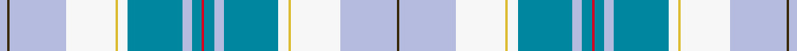

This page is one **sett** — a single exact thread-count. It belongs to the [tartan](/setts/lb3dy1lb23w20ly1w4t22lb4t4r1/)
(the same proportion at any scale), whose colour order is pattern [GWWYWBWBRBWBWYWWGW](/stripes/gwwywbwbrbwbwywwgw/).

Part of the [Forfar](/tartans/forfar/) tartan — the named design grouping this sett with its other cloths.

Sourced from house-of-tartan.  It is a [18 stripe tartan](/stripes/stripes18/).

Original link http://www.house-of-tartan.scotland.net/house/TartanViewjs.asp?colr=Def&tnam=6238

## Provenance

Earliest known date: 01/03/2004 Designed by Arthur Mackie of The Strathmore Woollen Co. Ltd of Forfar which is the county town of Angus in Scotland. Historically Forfar has royal connections with King Malcolm II and III, Alexander II and III and King Robert the Bruce, all of whom favoured the town which resulted in Forfar being created as a Royal Burgh in the mid 12th century. The colours of the tartan are from the Coat of Arms displayed in the Council Chambers and the tartan has been approved by the town's Community Council.

## Thread count
LB/6 DY2 LB46 W40 LY2 W8 T44 LB8 T8 R2 T8 LB8 T44 W8 LY2 W40 LB46 DY/2

One full sett is **640 threads**.

## Palette
<table><thead><tr><th>Colour</th><th>Shade</th><th>OKLCh</th></tr></thead><tbody><tr><td>B</td><td><code style="background-color:#00879F;">#00879F</code> <small style="color:#888">#00879F</small></td><td><small style="color:#888">oklch(57.4% 0.102 216.1)</small></td></tr><tr><td>Ba</td><td><code style="background-color:#B5BBDE;">#B5BBDE</code> <small style="color:#888">#B5BBDE</small></td><td><small style="color:#888">oklch(79.9% 0.050 277.6)</small></td></tr><tr><td>LT</td><td><code style="background-color:#DCBC32;">#DCBC32</code> <small style="color:#888">#DCBC32</small></td><td><small style="color:#888">oklch(80.0% 0.150 95.2)</small></td></tr><tr><td>R</td><td><code style="background-color:#D60020;">#D60020</code> <small style="color:#888">#D60020</small></td><td><small style="color:#888">oklch(55.2% 0.224 25.5)</small></td></tr><tr><td>W</td><td><code style="background-color:#F7F7F7;">#F7F7F7</code> <small style="color:#888">#F7F7F7</small></td><td><small style="color:#888">oklch(97.6% 0.000 89.9)</small></td></tr><tr><td>Y</td><td><code style="background-color:#8B6E00;">#8B6E00</code> <small style="color:#888">#8B6E00</small></td><td><small style="color:#888">oklch(55.1% 0.113 90.4)</small></td></tr><tr><td>Ya</td><td><code style="background-color:#3A2B0D;">#3A2B0D</code> <small style="color:#888">#3A2B0D</small></td><td><small style="color:#888">oklch(30.0% 0.049 82.0)</small></td></tr></tbody></table>

# Sample pattern

## Compared to the master

This cloth is one sett of its design; the master sett (the exemplar the design is anchored on) is below for comparison.

Its **ΔTartan distance** from the master is **2.56** — the same measure the nearest-tartans table ranks by (0 is identical; a re-scale of the same cloth is near 0, a recolour or a different proportion further).

<figure style="margin:0"><figcaption style="color:#888;font-size:smaller">this sett</figcaption></figure>
<figure style="margin:0"><figcaption style="color:#888;font-size:smaller"><a href="/setts/lb3dy1lb23w20ly1w4db22lb4db4r1/">master sett →</a></figcaption></figure>

ID: /variants/s10/lb3dy1lb23w20ly1w4t22lb4t4r1~x2/
