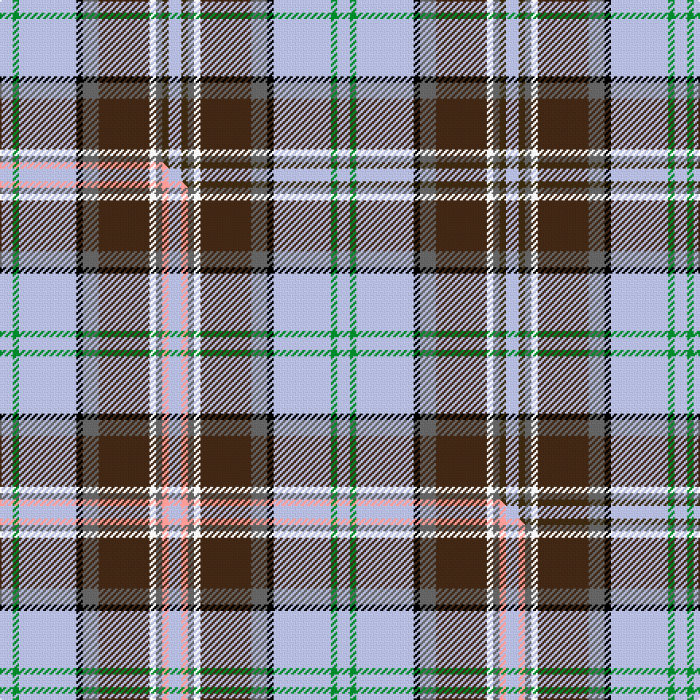

This page is one **sett** — a single exact thread-count. It belongs to the [tartan](/setts/lb4dy2n2w2do16n5k2lb18g2lb4/)
(the same proportion at any scale), whose colour order is pattern [WGBWBBKWGW](/stripes/wgbwbbkwgw/).

Part of the [Australian Heavy Horse](/tartans/australian-heavy-horse/) tartan — the named design grouping this sett with its other cloths.

Sourced from tartans-authority.  It is a [10 stripe tartan](/stripes/stripes10/).

Original link https://www.tartanregister.gov.uk/tartanDetails.aspx?ref=10136

Dataset <small>— provenance for this record, inherited from the source manifest</small>

<dl class="dataset-prov">
<dt>source</dt><dd><a href="/sources/tartans-authority/">Scottish Tartans Authority</a></dd>
<dt>data captured from</dt><dd><a href="https://github.com/thetartan/tartan-database/blob/master/data/tartans-authority/data.csv">https://github.com/thetartan/tartan-database/blob/master/data/tartans-authority/data.csv</a></dd>
<dt>data date</dt><dd>30th July 2009 <small>(this record)</small></dd>
<dt>licence</dt><dd><a href="https://creativecommons.org/licenses/by-nc-nd/4.0/">CC BY-NC-ND 4.0</a></dd>
</dl>

Capture chain <small>— the hands this data passed through, oldest first; each capture carries its own licence</small>

<ol class="capture-chain">
<li><a href="https://www.tartansauthority.com/">Scottish Tartans Authority</a> <small>the heritage body's archive — its tartan-ferret record browser is retired (links repaired to the SRT, above)</small></li>
<li><a href="https://github.com/thetartan/tartan-database">thetartan/tartan-database</a> <small>2016-2017</small> · <a href="https://creativecommons.org/licenses/by-nc-nd/4.0/">CC BY-NC-ND 4.0</a> <small>Levko Kravets's frozen compilation — the capture we vendored, and where its CC licence text came from</small></li>
<li>this dictionary <small>captured 2026-06-10 · commit 5bf86c7566</small> <small>each re-capture is a git commit to data/sources</small></li>
</ol>

## Register references

External register numbers recorded for this tartan.

- Scottish Register of Tartans: [10136](https://www.tartanregister.gov.uk/tartanDetails?ref=10136)
- Scottish Tartans Authority (ITI): 10136

## Thread count
LB/8 G4 LB36 K4 N10 DO32 W4 N4 DY4 LB/8

One full sett is **212 threads**.

## Palette
<table><thead><tr><th>Colour</th><th>Shade</th><th>OKLCh</th></tr></thead><tbody><tr><td>G</td><td><code style="background-color:#008B2A;">#008B2A</code> <small style="color:#888">#008B2A</small></td><td><small style="color:#888">oklch(55.4% 0.170 145.9)</small></td></tr><tr><td>K</td><td><code style="background-color:#000000;">#000000</code> <small style="color:#888">#000000</small></td><td><small style="color:#888">oklch(0.0% 0.000 0.0)</small></td></tr><tr><td>W</td><td><code style="background-color:#F7F7F7;">#F7F7F7</code> <small style="color:#888">#F7F7F7</small></td><td><small style="color:#888">oklch(97.6% 0.000 89.9)</small></td></tr><tr><td>DY</td><td><code style="background-color:#3A2B0D;">#3A2B0D</code> <small style="color:#888">#3A2B0D</small></td><td><small style="color:#888">oklch(30.0% 0.049 82.0)</small></td></tr><tr><td>N</td><td><code style="background-color:#636363;">#636363</code> <small style="color:#888">#636363</small></td><td><small style="color:#888">oklch(50.0% 0.000 89.9)</small></td></tr><tr><td>LB</td><td><code style="background-color:#B5BBDE;">#B5BBDE</code> <small style="color:#888">#B5BBDE</small></td><td><small style="color:#888">oklch(79.9% 0.050 277.6)</small></td></tr><tr><td>DO</td><td><code style="background-color:#412714;">#412714</code> <small style="color:#888">#412714</small></td><td><small style="color:#888">oklch(30.1% 0.050 55.7)</small></td></tr></tbody></table>

# Sample pattern

## Compared to the master

This cloth is one sett of its design; the master sett (the exemplar the design is anchored on) is below for comparison.

Its **ΔTartan distance** from the master is **0.30** — the same measure the nearest-tartans table ranks by (0 is identical; a re-scale of the same cloth is near 0, a recolour or a different proportion further).

<figure class="master-compare" style="margin:0">

this sett
master sett ★

<figcaption style="color:#888;font-size:smaller">One weave of this sett against the <a href="/setts/lb4g2lb18k2n5do16w2n2lr2lb4/">master sett ★</a>, split on the diagonal: a shared proportion runs seamlessly across it with only the shades shifting; a different proportion breaks on it.</figcaption>
</figure>

## Nearest tartan variants

The nearest existing variants by ΔTartan distance, with this cloth at the top so the swatches line up against it.

ΔTartan

Threads

Variant

Sett

—

212

<a href="/variants/s10/lb4dy2n2w2do16n5k2lb18g2lb4~x2/">Australian Heavy Horse (Corporate)</a>

<a href="/ttd/edit/#slug=lb4g2lb18k2n5do16w2n2lr2lb4~x2&amp;base=lb4dy2n2w2do16n5k2lb18g2lb4~x2" title="compare in the TTD">0.30</a>

212

<a href="/variants/s10/lb4g2lb18k2n5do16w2n2lr2lb4~x2/">Australian Heavy Horse</a>

<a href="/ttd/edit/#slug=lr2ly11r2ly11k2db6lb13k2lb3lyi2~x4~ly2602166-lyi3307090&amp;base=lb4dy2n2w2do16n5k2lb18g2lb4~x2" title="compare in the TTD">2.43</a>

416

<a href="/variants/s10/lr2y11r2y11k2db6lb13k2lb3ly2~x4~y2602166-ly3307090/">RAF Leuchars</a>

<a href="/ttd/edit/#slug=n3lb18dr2lb18g3db8k20g2k5lo3~x2&amp;base=lb4dy2n2w2do16n5k2lb18g2lb4~x2" title="compare in the TTD">2.75</a>

316

<a href="/variants/s10/n3lb18dr2lb18g3db8k20g2k5lo3~x2/">Royal Air Force Lossiemouth</a>

<a href="/ttd/edit/#slug=db3k2lb3r2lb3k2lb24dt24r3db3w2~x2&amp;base=lb4dy2n2w2do16n5k2lb18g2lb4~x2" title="compare in the TTD">2.96</a>

274

<a href="/variants/s11/db3k2lb3r2lb3k2lb24dt24r3db3w2~x2/">Hamburg #2 (Corporate)</a>

<a href="/ttd/edit/#slug=lb4ly2lb21k11w2n21r2~x2&amp;base=lb4dy2n2w2do16n5k2lb18g2lb4~x2" title="compare in the TTD">2.98</a>

240

<a href="/variants/s7/lb4ly2lb21k11w2n21r2~x2/">Barbour -Modern</a>

<a href="/ttd/edit/#slug=lb10w18lb4lo6lb45k30lb4k4y4r4y4r4y4&amp;base=lb4dy2n2w2do16n5k2lb18g2lb4~x2" title="compare in the TTD">2.98</a>

268

<a href="/variants/s13/lb10w18lb4lo6lb45k30lb4k4y4r4y4r4y4/">Les Coeurs de Lions en Bleu</a>

<a href="/ttd/edit/#slug=t14lb2ly2lb2t25k6w17r3w3r3w3r3w3r3~x2&amp;base=lb4dy2n2w2do16n5k2lb18g2lb4~x2" title="compare in the TTD">3.06</a>

322

<a href="/variants/s14/t14lb2ly2lb2t25k6w17r3w3r3w3r3w3r3~x2/">Letang (Personal)</a>

<a href="/ttd/edit/#slug=w1r1db8lb1k1w8k1lo8lb1lo1db8lb1lo1~x6&amp;base=lb4dy2n2w2do16n5k2lb18g2lb4~x2" title="compare in the TTD">3.07</a>

480

<a href="/variants/s13/w1r1db8lb1k1w8k1lo8lb1lo1db8lb1lo1~x6/">Robieson Kith &amp; Kin (Personal)</a>

<a href="/ttd/edit/#slug=o1t6g2lb1k8lb1g2lb9k1lb4ly1~x4~o2503076-ly3104101&amp;base=lb4dy2n2w2do16n5k2lb18g2lb4~x2" title="compare in the TTD">3.10</a>

280

<a href="/variants/s11/ly1t6g2lb1k8lb1g2lb9k1lb4lyi1~x4~ly2503076-lyi3104101/">Tiree</a>

<a href="/ttd/edit/#slug=r4t3lr2k2lr12k2db10ti25w2~x2~lr2800000-ti2503227&amp;base=lb4dy2n2w2do16n5k2lb18g2lb4~x2" title="compare in the TTD">3.12</a>

236

<a href="/variants/s9/r4t3lr2k2lr12k2db10ti25w2~x2~lr2800000-ti2503227/">O'Reilly (Estimated threadcount)</a>

## Neighbour map

Every grey dot is one of 13620 variants placed by the first two principal components of the ΔTartan feature space (42% of its variance). Red is this tartan; blue dots are its nearest — click one to open its page.

<svg viewBox="0 0 640 380" role="img" style="max-width:100%;height:auto;border:1px solid #e0e0e0;border-radius:4px;display:block" xmlns="http://www.w3.org/2000/svg"><image href="/nn/cloud.v1.png" width="640" height="380"/><a href="/variants/s10/lb4g2lb18k2n5do16w2n2lr2lb4~x2/"><circle cx="148.0" cy="128.0" r="4" fill="#3465a4"><title>Australian Heavy Horse</title></circle></a><a href="/variants/s10/lr2y11r2y11k2db6lb13k2lb3ly2~x4~y2602166-ly3307090/"><circle cx="104.1" cy="160.9" r="4" fill="#3465a4"><title>RAF Leuchars</title></circle></a><a href="/variants/s10/n3lb18dr2lb18g3db8k20g2k5lo3~x2/"><circle cx="103.0" cy="123.9" r="4" fill="#3465a4"><title>Royal Air Force Lossiemouth</title></circle></a><a href="/variants/s11/db3k2lb3r2lb3k2lb24dt24r3db3w2~x2/"><circle cx="165.0" cy="108.3" r="4" fill="#3465a4"><title>Hamburg #2 (Corporate)</title></circle></a><a href="/variants/s7/lb4ly2lb21k11w2n21r2~x2/"><circle cx="144.7" cy="158.7" r="4" fill="#3465a4"><title>Barbour -Modern</title></circle></a><a href="/variants/s13/lb10w18lb4lo6lb45k30lb4k4y4r4y4r4y4/"><circle cx="131.3" cy="102.1" r="4" fill="#3465a4"><title>Les Coeurs de Lions en Bleu</title></circle></a><a href="/variants/s14/t14lb2ly2lb2t25k6w17r3w3r3w3r3w3r3~x2/"><circle cx="154.9" cy="112.9" r="4" fill="#3465a4"><title>Letang (Personal)</title></circle></a><a href="/variants/s13/w1r1db8lb1k1w8k1lo8lb1lo1db8lb1lo1~x6/"><circle cx="105.8" cy="131.2" r="4" fill="#3465a4"><title>Robieson Kith &amp; Kin (Personal)</title></circle></a><a href="/variants/s11/ly1t6g2lb1k8lb1g2lb9k1lb4lyi1~x4~ly2503076-lyi3104101/"><circle cx="114.7" cy="148.3" r="4" fill="#3465a4"><title>Tiree</title></circle></a><a href="/variants/s9/r4t3lr2k2lr12k2db10ti25w2~x2~lr2800000-ti2503227/"><circle cx="152.5" cy="128.5" r="4" fill="#3465a4"><title>O'Reilly (Estimated threadcount)</title></circle></a><circle cx="147.0" cy="127.9" r="5" fill="#c00000"/><text x="320" y="376" text-anchor="middle" font-size="11" fill="#999">ground</text><text x="11" y="190" text-anchor="middle" font-size="11" fill="#999" transform="rotate(-90 11 190)">complexity</text></svg>

ID: /variants/s10/lb4dy2n2w2do16n5k2lb18g2lb4~x2/
