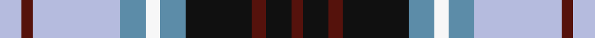

This page is one **sett** — a single exact thread-count. It belongs to the [tartan](/setts/lb6dr3lb24t7w4t7k18dr4k7dr3/)
(the same proportion at any scale), whose colour order is pattern [BKBKBWBWBW](/stripes/bkbkbwbwbw/).

Sourced from tartans-authority.  It is a [10 stripe tartan](/stripes/stripes10/).

Original link http://www.tartansauthority.com/tartan-ferret/display/2413/

## Register references

External register numbers recorded for this tartan.

- Scottish Tartans Authority (ITI): 2413

## Thread count
LB/6 DR3 LB24 T7 W4 T7 K18 DR4 K7 DR/3

One full sett is **157 threads**.

## Palette
<table><thead><tr><th>Colour</th><th>Shade</th><th>OKLCh</th></tr></thead><tbody><tr><td>B</td><td><code style="background-color:#5C8CA8;">#5C8CA8</code> <small style="color:#888">#5C8CA8</small></td><td><small style="color:#888">oklch(61.7% 0.067 235.0)</small></td></tr><tr><td>DR</td><td><code style="background-color:#B5BBDE;">#B5BBDE</code> <small style="color:#888">#B5BBDE</small></td><td><small style="color:#888">oklch(79.9% 0.050 277.6)</small></td></tr><tr><td>DRa</td><td><code style="background-color:#F7F7F7;">#F7F7F7</code> <small style="color:#888">#F7F7F7</small></td><td><small style="color:#888">oklch(97.6% 0.000 89.9)</small></td></tr><tr><td>G</td><td><code style="background-color:#55120C;">#55120C</code> <small style="color:#888">#55120C</small></td><td><small style="color:#888">oklch(30.0% 0.099 29.3)</small></td></tr><tr><td>K</td><td><code style="background-color:#101010;">#101010</code> <small style="color:#888">#101010</small></td><td><small style="color:#888">oklch(17.3% 0.000 89.9)</small></td></tr></tbody></table>

# Sample pattern

## Nearest variants

The nearest existing variants by ΔTartan distance, with this cloth at the top so the swatches line up against it.

ΔTartan

Threads

Variant

Sett

—

157

<a href="/variants/s10/lb6dr3lb24t7w4t7k18dr4k7dr3~t2503227-k0700000/">Law Society of Scotland (Corporate)</a>

<a href="/ttd/edit/#slug=w3lb26db13k13w2g8k5r3lb3~x2&amp;base=lb6dr3lb24t7w4t7k18dr4k7dr3~t2503227-k0700000" title="compare in the TTD">2.71</a>

292

<a href="/variants/s9/w3lb26db13k13w2g8k5r3lb3~x2/">Moran (Virgin Islands) (Personal)</a>

## Neighbour map

Every grey dot is one of 13620 variants placed by the first two principal components of the ΔTartan feature space (42% of its variance). Red is this tartan; blue dots are its nearest — click one to open its page.

<svg viewBox="0 0 640 380" role="img" style="max-width:100%;height:auto;border:1px solid #e0e0e0;border-radius:4px;display:block" xmlns="http://www.w3.org/2000/svg"><image href="/nn/cloud.v1.png" width="640" height="380"/><a href="/variants/s9/w3lb26db13k13w2g8k5r3lb3~x2/"><circle cx="95.1" cy="132.8" r="4" fill="#3465a4"><title>Moran (Virgin Islands) (Personal)</title></circle></a><circle cx="109.2" cy="173.1" r="5" fill="#c00000"/><text x="320" y="376" text-anchor="middle" font-size="11" fill="#999">ground</text><text x="11" y="190" text-anchor="middle" font-size="11" fill="#999" transform="rotate(-90 11 190)">complexity</text></svg>

ID: /variants/s10/lb6dr3lb24t7w4t7k18dr4k7dr3~t2503227-k0700000/
