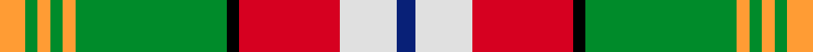

This page is one **sett** — a single exact thread-count. It belongs to the [tartan](/setts/lo4g2lo2g2lo2g24k2r16w9db3/)
(the same proportion at any scale), whose colour order is pattern [BWRKGYGYGY](/stripes/bwrkgygygy/).

Part of the [North West Territories](/tartans/north-west-territories/) tartan — the named design grouping this sett with its other cloths.

Sourced from register-of-tartans.  It is a [10 stripe tartan](/stripes/stripes10/).

Original link https://www.tartanregister.gov.uk/tartanDetails.aspx?ref=3158

## Register references

External register numbers recorded for this tartan.

- Scottish Register of Tartans: [3158](https://www.tartanregister.gov.uk/tartanDetails.aspx?ref=3158)
- Scottish Tartans Authority (ITI): 662
- Scottish Tartans World Register: 662

## Thread count
LO/8 G4 LO4 G4 LO4 G48 K4 R32 W18 DB/6

One full sett is **250 threads**.

## Palette
<table><thead><tr><th>Colour</th><th>Shade</th><th>OKLCh</th></tr></thead><tbody><tr><td>DB</td><td><code style="background-color:#082077;">#082077</code> <small style="color:#888">#082077</small></td><td><small style="color:#888">oklch(30.0% 0.149 265.1)</small></td></tr><tr><td>LO</td><td><code style="background-color:#FF9C34;">#FF9C34</code> <small style="color:#888">#FF9C34</small></td><td><small style="color:#888">oklch(77.9% 0.161 61.8)</small></td></tr><tr><td>G</td><td><code style="background-color:#008B2A;">#008B2A</code> <small style="color:#888">#008B2A</small></td><td><small style="color:#888">oklch(55.4% 0.170 145.9)</small></td></tr><tr><td>K</td><td><code style="background-color:#000000;">#000000</code> <small style="color:#888">#000000</small></td><td><small style="color:#888">oklch(0.0% 0.000 0.0)</small></td></tr><tr><td>W</td><td><code style="background-color:#E0E0E0;">#E0E0E0</code> <small style="color:#888">#E0E0E0</small></td><td><small style="color:#888">oklch(90.7% 0.000 89.9)</small></td></tr><tr><td>LB</td><td><code style="background-color:#B5BBDE;">#B5BBDE</code> <small style="color:#888">#B5BBDE</small></td><td><small style="color:#888">oklch(79.9% 0.050 277.6)</small></td></tr><tr><td>LR</td><td><code style="background-color:#FF9C97;">#FF9C97</code> <small style="color:#888">#FF9C97</small></td><td><small style="color:#888">oklch(79.3% 0.119 23.2)</small></td></tr><tr><td>R</td><td><code style="background-color:#D60020;">#D60020</code> <small style="color:#888">#D60020</small></td><td><small style="color:#888">oklch(55.2% 0.224 25.5)</small></td></tr><tr><td>W</td><td><code style="background-color:#FCFCFC;">#FCFCFC</code> <small style="color:#888">#FCFCFC</small></td><td><small style="color:#888">oklch(99.1% 0.000 89.9)</small></td></tr></tbody></table>

# Sample pattern

## Nearest tartan variants

The nearest existing variants by ΔTartan distance, with this cloth at the top so the swatches line up against it.

ΔTartan

Threads

Variant

Sett

—

250

<a href="/variants/s10/lo4g2lo2g2lo2g24k2r16w9db3~x2~w3600000/">North West Territories</a>

<a href="/ttd/edit/#slug=lo4g2lo2g2lo2g24k2r16w9db3~x2&amp;base=lo4g2lo2g2lo2g24k2r16w9db3~x2~w3600000" title="compare in the TTD">0.00</a>

250

<a href="/variants/s10/lo4g2lo2g2lo2g24k2r16w9db3~x2/">North West Territories (District)</a>

<a href="/ttd/edit/#slug=y4g2y2g2y2g24k2r16w9db3~x2&amp;base=lo4g2lo2g2lo2g24k2r16w9db3~x2~w3600000" title="compare in the TTD">0.90</a>

250

<a href="/variants/s10/y4g2y2g2y2g24k2r16w9db3~x2/">North West Territories</a>

<a href="/ttd/edit/#slug=g3lb3g5r4g28db8w3db3w24r2k2~x2&amp;base=lo4g2lo2g2lo2g24k2r16w9db3~x2~w3600000" title="compare in the TTD">2.89</a>

330

<a href="/variants/s11/g3lb3g5r4g28db8w3db3w24r2k2~x2/">Downie Dress</a>

## Neighbour map

Every grey dot is one of 13620 variants placed by the first two principal components of the ΔTartan feature space (42% of its variance). Red is this tartan; blue dots are its nearest — click one to open its page.

<svg viewBox="0 0 640 380" role="img" style="max-width:100%;height:auto;border:1px solid #e0e0e0;border-radius:4px;display:block" xmlns="http://www.w3.org/2000/svg"><image href="/nn/cloud.v1.png" width="640" height="380"/><a href="/variants/s10/lo4g2lo2g2lo2g24k2r16w9db3~x2/"><circle cx="152.7" cy="123.5" r="4" fill="#3465a4"><title>North West Territories (District)</title></circle></a><a href="/variants/s10/y4g2y2g2y2g24k2r16w9db3~x2/"><circle cx="158.5" cy="126.4" r="4" fill="#3465a4"><title>North West Territories</title></circle></a><a href="/variants/s11/g3lb3g5r4g28db8w3db3w24r2k2~x2/"><circle cx="149.5" cy="111.6" r="4" fill="#3465a4"><title>Downie Dress</title></circle></a><circle cx="159.5" cy="125.6" r="5" fill="#c00000"/><text x="320" y="376" text-anchor="middle" font-size="11" fill="#999">ground</text><text x="11" y="190" text-anchor="middle" font-size="11" fill="#999" transform="rotate(-90 11 190)">complexity</text></svg>

ID: /variants/s10/lo4g2lo2g2lo2g24k2r16w9db3~x2~w3600000/
