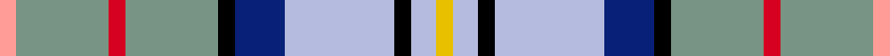

This page is one **sett** — a single exact thread-count. It belongs to the [tartan](/setts/lr2y11r2y11k2db6lb13k2lb3ly2/)
(the same proportion at any scale), whose colour order is pattern [YGRGKBWKWY](/stripes/ygrgkbwkwy/).

Sourced from register-of-tartans.  It is a [10 stripe tartan](/stripes/stripes10/).

Original link https://www.tartanregister.gov.uk/tartanDetails.aspx?ref=3438

2 attestations — the source records this cloth was collapsed from (oldest owns this page)

<ul>
<li>01/01/1989 — RAF Leuchars (register-of-tartans, <a href="https://www.tartanregister.gov.uk/tartanDetails.aspx?ref=3438">record</a>)  <em>Designed by Arthur Mackie of Strathmore Woollen Company, Forfar, Scotland. Sample in Scottish Tartans Authority's Johnston Collection.</em></li>
<li>pre 1989 — RAF Leuchars (Military) (tartans-authority, <a href="http://www.tartansauthority.com/tartan-ferret/display/5443/">record</a>)  <em>Designed by Arthur Mackie of Strathmore Woollen Company, Forfar, Scotland. Sample in STA Johnston Collection.</em></li>
</ul>

## Register references

External register numbers recorded for this tartan.

- Scottish Register of Tartans: [3438](https://www.tartanregister.gov.uk/tartanDetails.aspx?ref=3438)
- Scottish Tartans Authority (ITI): 5443

## Thread count
LR/8 Y44 R8 Y44 K8 DB24 LB52 K8 LB12 LY/8

One full sett is **416 threads**.

## Palette
<table><thead><tr><th>Colour</th><th>Shade</th><th>OKLCh</th></tr></thead><tbody><tr><td>B</td><td><code style="background-color:#B5BBDE;">#B5BBDE</code> <small style="color:#888">#B5BBDE</small></td><td><small style="color:#888">oklch(79.9% 0.050 277.6)</small></td></tr><tr><td>Ba</td><td><code style="background-color:#082077;">#082077</code> <small style="color:#888">#082077</small></td><td><small style="color:#888">oklch(30.0% 0.149 265.1)</small></td></tr><tr><td>K</td><td><code style="background-color:#000000;">#000000</code> <small style="color:#888">#000000</small></td><td><small style="color:#888">oklch(0.0% 0.000 0.0)</small></td></tr><tr><td>LG</td><td><code style="background-color:#789484;">#789484</code> <small style="color:#888">#789484</small></td><td><small style="color:#888">oklch(64.0% 0.040 160.0)</small></td></tr><tr><td>N</td><td><code style="background-color:#FF9C97;">#FF9C97</code> <small style="color:#888">#FF9C97</small></td><td><small style="color:#888">oklch(79.3% 0.119 23.2)</small></td></tr><tr><td>R</td><td><code style="background-color:#D60020;">#D60020</code> <small style="color:#888">#D60020</small></td><td><small style="color:#888">oklch(55.2% 0.224 25.5)</small></td></tr><tr><td>Y</td><td><code style="background-color:#E8C000;">#E8C000</code> <small style="color:#888">#E8C000</small></td><td><small style="color:#888">oklch(81.9% 0.168 93.7)</small></td></tr></tbody></table>

# Sample pattern

## Nearest variants

The nearest existing variants by ΔTartan distance, with this cloth at the top so the swatches line up against it.

ΔTartan

Threads

Variant

Sett

—

416

<a href="/variants/s10/lr2y11r2y11k2db6lb13k2lb3ly2~x4~y2602166-ly3307090/">RAF Leuchars</a>

<a href="/ttd/edit/#slug=g4r1db8w1r1w1lb8w1lb8w1y1~x4&amp;base=lr2y11r2y11k2db6lb13k2lb3ly2~x4~y2602166-ly3307090" title="compare in the TTD">2.93</a>

260

<a href="/variants/s11/g4r1db8w1r1w1lb8w1lb8w1y1~x4/">Texas Bluebonnet District Tartan</a>

## Neighbour map

Every grey dot is one of 13620 variants placed by the first two principal components of the ΔTartan feature space (42% of its variance). Red is this tartan; blue dots are its nearest — click one to open its page.

<svg viewBox="0 0 640 380" role="img" style="max-width:100%;height:auto;border:1px solid #e0e0e0;border-radius:4px;display:block" xmlns="http://www.w3.org/2000/svg"><image href="/nn/cloud.v1.png" width="640" height="380"/><a href="/variants/s11/g4r1db8w1r1w1lb8w1lb8w1y1~x4/"><circle cx="168.0" cy="159.0" r="4" fill="#3465a4"><title>Texas Bluebonnet District Tartan</title></circle></a><circle cx="104.1" cy="160.9" r="5" fill="#c00000"/><text x="320" y="376" text-anchor="middle" font-size="11" fill="#999">ground</text><text x="11" y="190" text-anchor="middle" font-size="11" fill="#999" transform="rotate(-90 11 190)">complexity</text></svg>

ID: /variants/s10/lr2y11r2y11k2db6lb13k2lb3ly2~x4~y2602166-ly3307090/
