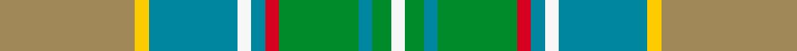

This page is one **sett** — a single exact thread-count. It belongs to the [tartan](/setts/ly29lyi3t19w3t3r3g17t3g4w3/)
(the same proportion at any scale), whose colour order is pattern [WGBGRBWBYY](/stripes/wgbgrbwbyy/).

Sourced from tartans-authority.  It is a [10 stripe tartan](/stripes/stripes10/).

Original link http://www.tartansauthority.com/tartan-ferret/display/8911/

## Register references

External register numbers recorded for this tartan.

- Scottish Register of Tartans: [8911](https://www.tartanregister.gov.uk/tartanDetails?ref=8911)
- Scottish Tartans Authority (ITI): 8911

## Thread count
LY/58 LYi6 T38 W6 T6 R6 G34 T6 G8 W/6

One full sett is **284 threads**.

## Palette
<table><thead><tr><th>Colour</th><th>Shade</th><th>OKLCh</th></tr></thead><tbody><tr><td>B</td><td><code style="background-color:#00879F;">#00879F</code> <small style="color:#888">#00879F</small></td><td><small style="color:#888">oklch(57.4% 0.102 216.1)</small></td></tr><tr><td>G</td><td><code style="background-color:#008B2A;">#008B2A</code> <small style="color:#888">#008B2A</small></td><td><small style="color:#888">oklch(55.4% 0.170 145.9)</small></td></tr><tr><td>LR</td><td><code style="background-color:#F7F7F7;">#F7F7F7</code> <small style="color:#888">#F7F7F7</small></td><td><small style="color:#888">oklch(97.6% 0.000 89.9)</small></td></tr><tr><td>LT</td><td><code style="background-color:#A08858;">#A08858</code> <small style="color:#888">#A08858</small></td><td><small style="color:#888">oklch(63.7% 0.071 84.0)</small></td></tr><tr><td>R</td><td><code style="background-color:#D60020;">#D60020</code> <small style="color:#888">#D60020</small></td><td><small style="color:#888">oklch(55.2% 0.224 25.5)</small></td></tr><tr><td>Y</td><td><code style="background-color:#FCCC00;">#FCCC00</code> <small style="color:#888">#FCCC00</small></td><td><small style="color:#888">oklch(86.2% 0.176 91.5)</small></td></tr></tbody></table>

# Sample pattern

ID: /variants/s10/ly29lyi3t19w3t3r3g17t3g4w3~x2~ly2503076-lyi3407090/
