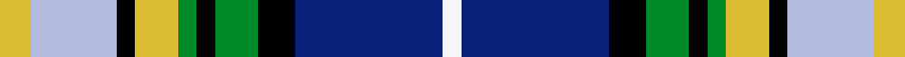

This is one **variant** — a specific cloth: this exact thread count and colourway, with its own
provenance below. It is one weaving of the [sett](/tartans/k/ka/kagame/) (the scale-free proportion — the
same cloth at any scale or shade), whose colour order is pattern [WBKGKGYKWY](/stripes/wbkgkgykwy/).

Part of the [Kagame](/tartans/k/ka/kagame/) tartan — the named design grouping this sett with its other cloths.

Sourced from tartans-authority.  It is a [10 stripe tartan](/stripes/stripes10/).

Original link <code>http://www.tartansauthority.com/tartan-ferret/display/7077/</code> — retired · [Internet Archive copy](https://web.archive.org/web/*/http://www.tartansauthority.com/tartan-ferret/display/7077/*)

Dataset <small>— provenance for this record, inherited from the source manifest</small>

<dl class="dataset-prov">
<dt>source</dt><dd><a href="/sources/tartans-authority/">Scottish Tartans Authority</a></dd>
<dt>data captured from</dt><dd><a href="https://github.com/thetartan/tartan-database/blob/master/data/tartans-authority/data.csv">https://github.com/thetartan/tartan-database/blob/master/data/tartans-authority/data.csv</a></dd>
<dt>data date</dt><dd>2006 <small>(this record)</small></dd>
<dt>licence</dt><dd><a href="https://creativecommons.org/licenses/by-nc-nd/4.0/">CC BY-NC-ND 4.0</a></dd>
</dl>

Capture chain <small>— the hands this data passed through, oldest first; each capture carries its own licence</small>

<ol class="capture-chain">
<li><a href="https://www.tartansauthority.com/">Scottish Tartans Authority</a> <small>the heritage body’s archive — its tartan-ferret record browser is retired; dead record links are shown unlinked, with an Internet Archive copy (ITI numbers are not SRT references)</small></li>
<li><a href="https://github.com/thetartan/tartan-database">thetartan/tartan-database</a> <small>2016-2017</small> · <a href="https://creativecommons.org/licenses/by-nc-nd/4.0/">CC BY-NC-ND 4.0</a> <small>Levko Kravets's frozen compilation — the capture we vendored, and where its CC licence text came from</small></li>
<li>this dictionary <small>captured 2026-06-10 · commit 5bf86c7566</small> <small>each re-capture is a git commit to data/sources</small></li>
</ol>

## Register references

External register numbers recorded for this tartan.

- Scottish Tartans Authority (ITI): 7077

## Thread count
LY/10 LB28 K6 LY14 G6 K6 G14 K12 DB48 W/6

One full sett is **284 threads**.

## Palette
<table><thead><tr><th>Colour</th><th>Shade</th><th>OKLCh</th></tr></thead><tbody><tr><td>DB</td><td><code style="background-color:#082077;">#082077</code> <small style="color:#888">#082077</small></td><td><small style="color:#888">oklch(30.0% 0.149 265.1)</small></td></tr><tr><td>G</td><td><code style="background-color:#008B2A;">#008B2A</code> <small style="color:#888">#008B2A</small></td><td><small style="color:#888">oklch(55.4% 0.170 145.9)</small></td></tr><tr><td>K</td><td><code style="background-color:#000000;">#000000</code> <small style="color:#888">#000000</small></td><td><small style="color:#888">oklch(0.0% 0.000 0.0)</small></td></tr><tr><td>LB</td><td><code style="background-color:#B5BBDE;">#B5BBDE</code> <small style="color:#888">#B5BBDE</small></td><td><small style="color:#888">oklch(79.9% 0.050 277.6)</small></td></tr><tr><td>W</td><td><code style="background-color:#F7F7F7;">#F7F7F7</code> <small style="color:#888">#F7F7F7</small></td><td><small style="color:#888">oklch(97.6% 0.000 89.9)</small></td></tr><tr><td>LY</td><td><code style="background-color:#DCBC32;">#DCBC32</code> <small style="color:#888">#DCBC32</small></td><td><small style="color:#888">oklch(80.0% 0.150 95.2)</small></td></tr></tbody></table>

# Sample pattern

## Nearest tartan variants

The nearest existing variants by ΔTartan distance, with this cloth at the top so the swatches line up against it.

ΔTartan

Threads

Variant

Sett

—

284

<a href="/variants/s10/ly5lb14k3ly7g3k3g7k6db24w3~x2/">Kagame (Personal)</a>

<a href="/ttd/edit/#slug=k4lb14k10g3k3g7k6db24w3~x2~lb8007237-db4215273&amp;base=ly5lb14k3ly7g3k3g7k6db24w3~x2" title="compare in the TTD">1.85</a>

282

<a href="/variants/s9/k4lb14k10g3k3g7k6db24w3~x2~lb8007237-db4215273/">Kagame Personal Tartan</a>

<a href="/ttd/edit/#slug=y4db22g3k3g3k3g12w22k2r3~x2&amp;base=ly5lb14k3ly7g3k3g7k6db24w3~x2" title="compare in the TTD">1.91</a>

294

<a href="/variants/s10/y4db22g3k3g3k3g12w22k2r3~x2/">Californian MacLeod</a>

<a href="/ttd/edit/#slug=b2w2b1w9k5dg3dr2dg5k1ly2~x4&amp;base=ly5lb14k3ly7g3k3g7k6db24w3~x2" title="compare in the TTD">1.93</a>

240

<a href="/variants/s10/b2w2b1w9k5dg3dr2dg5k1ly2~x4/">Firth of Tay</a>

<a href="/ttd/edit/#slug=b4o2dg15y2k14w14k2w4~x2&amp;base=ly5lb14k3ly7g3k3g7k6db24w3~x2" title="compare in the TTD">2.01</a>

212

<a href="/variants/s8/b4o2dg15y2k14w14k2w4~x2/">Culloden, Stirling</a>

<a href="/ttd/edit/#slug=k2w1db7k4r1w8r2w8k1dg7w1dg7y2~x4&amp;base=ly5lb14k3ly7g3k3g7k6db24w3~x2" title="compare in the TTD">2.14</a>

392

<a href="/variants/s13/k2w1db7k4r1w8r2w8k1dg7w1dg7y2~x4/">MacLellan/McLellan Dress (Personal)</a>

<a href="/ttd/edit/#slug=w3db20y4k9w3k3w3k3g14o9k3o4w3~x2&amp;base=ly5lb14k3ly7g3k3g7k6db24w3~x2" title="compare in the TTD">2.26</a>

312

<a href="/variants/s13/w3db20y4k9w3k3w3k3g14o9k3o4w3~x2/">Clodagh, Cork</a>

<a href="/ttd/edit/#slug=r3k1lb10k1g2k1db8g12k1y3~x2&amp;base=ly5lb14k3ly7g3k3g7k6db24w3~x2" title="compare in the TTD">2.27</a>

156

<a href="/variants/s10/r3k1lb10k1g2k1db8g12k1y3~x2/">Sullivan (Estimated threadcount)</a>

<a href="/ttd/edit/#slug=y4db25g3k3g3k3g13w24k2r3~x2&amp;base=ly5lb14k3ly7g3k3g7k6db24w3~x2" title="compare in the TTD">2.27</a>

318

<a href="/variants/s10/y4db25g3k3g3k3g13w24k2r3~x2/">MacLeod, Californian</a>

<a href="/ttd/edit/#slug=dy2lb10k2w2k2dy2k2db3g3k2g2w2~x4&amp;base=ly5lb14k3ly7g3k3g7k6db24w3~x2" title="compare in the TTD">2.28</a>

256

<a href="/variants/s12/dy2lb10k2w2k2dy2k2db3g3k2g2w2~x4/">MacSheehy</a>

<a href="/ttd/edit/#slug=w3lb26db13k13w2g8k5r3lb3~x2&amp;base=ly5lb14k3ly7g3k3g7k6db24w3~x2" title="compare in the TTD">2.29</a>

292

<a href="/variants/s9/w3lb26db13k13w2g8k5r3lb3~x2/">Moran (Virgin Islands) (Personal)</a>

## Neighbour map

Every grey dot is one of 13662 variants placed by the first two principal components of the ΔTartan feature space (42% of its variance). Red is this tartan; blue dots are its nearest — click one to open its page. The map is a flat projection of a many-dimensional space — [how to read it](/posts/neighbourhood-maps/).

<svg viewBox="0 0 640 380" role="img" style="max-width:100%;height:auto;border:1px solid #e0e0e0;border-radius:4px;display:block" xmlns="http://www.w3.org/2000/svg"><image href="/nn/cloud.v1.png" width="640" height="380"/><a href="/variants/s9/k4lb14k10g3k3g7k6db24w3~x2~lb8007237-db4215273/"><circle cx="44.9" cy="147.2" r="4" fill="#3465a4"><title>Kagame Personal Tartan</title></circle></a><a href="/variants/s10/y4db22g3k3g3k3g12w22k2r3~x2/"><circle cx="59.0" cy="129.8" r="4" fill="#3465a4"><title>Californian MacLeod</title></circle></a><a href="/variants/s10/b2w2b1w9k5dg3dr2dg5k1ly2~x4/"><circle cx="51.8" cy="155.9" r="4" fill="#3465a4"><title>Firth of Tay</title></circle></a><a href="/variants/s8/b4o2dg15y2k14w14k2w4~x2/"><circle cx="53.6" cy="165.7" r="4" fill="#3465a4"><title>Culloden, Stirling</title></circle></a><a href="/variants/s13/k2w1db7k4r1w8r2w8k1dg7w1dg7y2~x4/"><circle cx="47.4" cy="148.9" r="4" fill="#3465a4"><title>MacLellan/McLellan Dress (Personal)</title></circle></a><a href="/variants/s13/w3db20y4k9w3k3w3k3g14o9k3o4w3~x2/"><circle cx="14.0" cy="150.2" r="4" fill="#3465a4"><title>Clodagh, Cork</title></circle></a><a href="/variants/s10/r3k1lb10k1g2k1db8g12k1y3~x2/"><circle cx="89.0" cy="135.4" r="4" fill="#3465a4"><title>Sullivan (Estimated threadcount)</title></circle></a><a href="/variants/s10/y4db25g3k3g3k3g13w24k2r3~x2/"><circle cx="72.6" cy="121.4" r="4" fill="#3465a4"><title>MacLeod, Californian</title></circle></a><a href="/variants/s12/dy2lb10k2w2k2dy2k2db3g3k2g2w2~x4/"><circle cx="14.0" cy="168.6" r="4" fill="#3465a4"><title>MacSheehy</title></circle></a><a href="/variants/s9/w3lb26db13k13w2g8k5r3lb3~x2/"><circle cx="95.0" cy="132.7" r="4" fill="#3465a4"><title>Moran (Virgin Islands) (Personal)</title></circle></a><circle cx="47.1" cy="153.3" r="5" fill="#c00000"/><text x="320" y="376" text-anchor="middle" font-size="11" fill="#999">ground</text><text x="11" y="190" text-anchor="middle" font-size="11" fill="#999" transform="rotate(-90 11 190)">complexity</text></svg>

ID: /variants/s10/ly5lb14k3ly7g3k3g7k6db24w3~x2/
