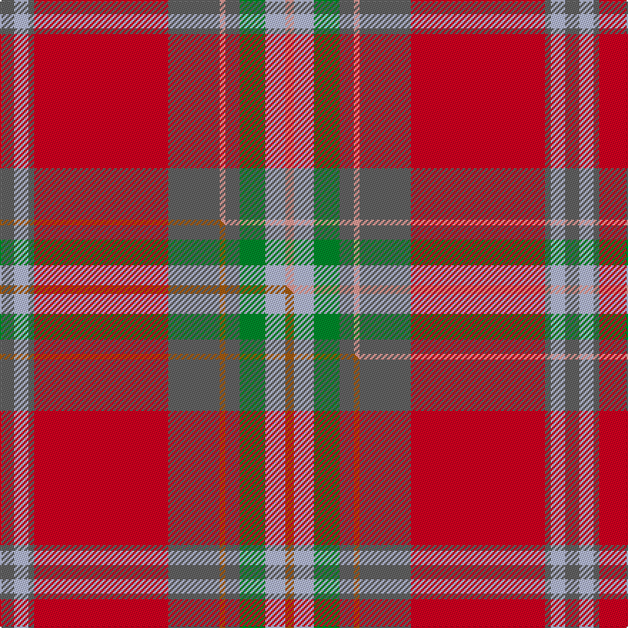

This is one **variant** — a specific cloth: this exact thread count and colourway, with its own
provenance below. It is one weaving of the [sett](/setts/n5lb5n2r47n18lr2n5g9lb7lr3/) (the scale-free proportion — the
same cloth at any scale or shade), whose colour order is pattern [BWBRBYBGWY](/stripes/bwbrbybgwy/).

Part of the [Rikaco](/tartans/rikaco/) tartan — the named design grouping this sett with its other cloths.

Sourced from tartans-authority.  It is a [10 stripe tartan](/stripes/stripes10/).

Original link [https://www.tartanregister.gov.uk/tartanDetails.aspx?ref=10224](https://www.tartanregister.gov.uk/tartanDetails.aspx?ref=10224)

Dataset <small>— provenance for this record, inherited from the source manifest</small>

<dl class="dataset-prov">
<dt>source</dt><dd><a href="/sources/tartans-authority/">Scottish Tartans Authority</a></dd>
<dt>data captured from</dt><dd><a href="https://github.com/thetartan/tartan-database/blob/master/data/tartans-authority/data.csv">https://github.com/thetartan/tartan-database/blob/master/data/tartans-authority/data.csv</a></dd>
<dt>data date</dt><dd>pre 2010 <small>(this record)</small></dd>
<dt>licence</dt><dd><a href="https://creativecommons.org/licenses/by-nc-nd/4.0/">CC BY-NC-ND 4.0</a></dd>
</dl>

Capture chain <small>— the hands this data passed through, oldest first; each capture carries its own licence</small>

<ol class="capture-chain">
<li><a href="https://www.tartansauthority.com/">Scottish Tartans Authority</a> <small>the heritage body's archive — its tartan-ferret record browser is retired (links repaired to the SRT, above)</small></li>
<li><a href="https://github.com/thetartan/tartan-database">thetartan/tartan-database</a> <small>2016-2017</small> · <a href="https://creativecommons.org/licenses/by-nc-nd/4.0/">CC BY-NC-ND 4.0</a> <small>Levko Kravets's frozen compilation — the capture we vendored, and where its CC licence text came from</small></li>
<li>this dictionary <small>captured 2026-06-10 · commit 5bf86c7566</small> <small>each re-capture is a git commit to data/sources</small></li>
</ol>

## Register references

External register numbers recorded for this tartan.

- Scottish Register of Tartans: [10224](https://www.tartanregister.gov.uk/tartanDetails?ref=10224)
- Scottish Tartans Authority (ITI): 10224

## Thread count
N/10 LB10 N4 R94 N36 LR4 N10 G18 LB14 LR/6

One full sett is **396 threads**.

## Palette
<table><thead><tr><th>Colour</th><th>Shade</th><th>OKLCh</th></tr></thead><tbody><tr><td>LB</td><td><code style="background-color:#B5BBDE;">#B5BBDE</code> <small style="color:#888">#B5BBDE</small></td><td><small style="color:#888">oklch(79.9% 0.050 277.6)</small></td></tr><tr><td>LR</td><td><code style="background-color:#FF9C97;">#FF9C97</code> <small style="color:#888">#FF9C97</small></td><td><small style="color:#888">oklch(79.3% 0.119 23.2)</small></td></tr><tr><td>G</td><td><code style="background-color:#008B2A;">#008B2A</code> <small style="color:#888">#008B2A</small></td><td><small style="color:#888">oklch(55.4% 0.170 145.9)</small></td></tr><tr><td>N</td><td><code style="background-color:#636363;">#636363</code> <small style="color:#888">#636363</small></td><td><small style="color:#888">oklch(50.0% 0.000 89.9)</small></td></tr><tr><td>R</td><td><code style="background-color:#D60020;">#D60020</code> <small style="color:#888">#D60020</small></td><td><small style="color:#888">oklch(55.2% 0.224 25.5)</small></td></tr></tbody></table>

# Sample pattern

## Compared to the master

This cloth is one sett of its design; the master sett (the exemplar the design is anchored on) is below for comparison.

Its **ΔTartan distance** from the master is **0.60** — the same measure the nearest-tartans table ranks by (0 is identical; a re-scale of the same cloth is near 0, a recolour or a different proportion further).

<figure class="master-compare" style="margin:0">

this sett
master sett ★

<figcaption style="color:#888;font-size:smaller">One weave of this sett against the <a href="/setts/n5lb5n2r47n18o2n5g9lb7o3/">master sett ★</a>, split on the diagonal: a shared proportion runs seamlessly across it with only the shades shifting; a different proportion breaks on it.</figcaption>
</figure>

## Nearest tartan variants

The nearest existing variants by ΔTartan distance, with this cloth at the top so the swatches line up against it.

ΔTartan

Threads

Variant

Sett

—

396

<a href="/variants/s10/n5lb5n2r47n18lr2n5g9lb7lr3~x2/">Rikaco Red (Fashion)</a>

<a href="/ttd/edit/#slug=n5lb5n2r47n18o2n5g9lb7o3~x2&amp;base=n5lb5n2r47n18lr2n5g9lb7lr3~x2" title="compare in the TTD">0.60</a>

396

<a href="/variants/s10/n5lb5n2r47n18o2n5g9lb7o3~x2/">Rikaco Red</a>

<a href="/ttd/edit/#slug=n22r2w1lo3r1n6r22lo3r1lr10~x4&amp;base=n5lb5n2r47n18lr2n5g9lb7lr3~x2" title="compare in the TTD">1.48</a>

440

<a href="/variants/s10/n22r2w1lo3r1n6r22lo3r1lr10~x4/">Glenburnie School</a>

<a href="/ttd/edit/#slug=r26n4r1dp2g1n4g14lb2~x2&amp;base=n5lb5n2r47n18lr2n5g9lb7lr3~x2" title="compare in the TTD">2.17</a>

160

<a href="/variants/s8/r26n4r1dp2g1n4g14lb2~x2/">Redpath, Robert A (Personal)</a>

<a href="/ttd/edit/#slug=lr3lb3lr1y25lr15r5lb4dy2~x2&amp;base=n5lb5n2r47n18lr2n5g9lb7lr3~x2" title="compare in the TTD">2.48</a>

222

<a href="/variants/s8/lr3lb3lr1y25lr15r5lb4dy2~x2/">Rikaco Morning Dew #2</a>

<a href="/ttd/edit/#slug=g3t4g3t4g3r28dy2t2ri28t6ri9dy2t2~x2~r1807033-ri2109013&amp;base=n5lb5n2r47n18lr2n5g9lb7lr3~x2" title="compare in the TTD">3.11</a>

374

<a href="/variants/s13/g3t4g3t4g3r28dy2t2ri28t6ri9dy2t2~x2~r1807033-ri2109013/">Pitcairn Heritage (Name)</a>

<a href="/ttd/edit/#slug=r2lo14o14dr1r2dr2t2dr2r20t2~x4&amp;base=n5lb5n2r47n18lr2n5g9lb7lr3~x2" title="compare in the TTD">3.14</a>

472

<a href="/variants/s10/r2lo14o14dr1r2dr2t2dr2r20t2~x4/">Star Is Born, A</a>

<a href="/ttd/edit/#slug=r6t22r6g20y2r45t2w5~x2&amp;base=n5lb5n2r47n18lr2n5g9lb7lr3~x2" title="compare in the TTD">3.15</a>

410

<a href="/variants/s8/r6t22r6g20y2r45t2w5~x2/">Elbrick Dress (Personal)</a>

<a href="/ttd/edit/#slug=r3ly2r18db8w1o18r2~x2&amp;base=n5lb5n2r47n18lr2n5g9lb7lr3~x2" title="compare in the TTD">3.16</a>

198

<a href="/variants/s7/r3ly2r18db8w1o18r2~x2/">Barbour - Cardinal Red</a>

<a href="/ttd/edit/#slug=o3n20r1n4r2n2r4n2r5g2dr20w3~x2~o2500000-n1900000&amp;base=n5lb5n2r47n18lr2n5g9lb7lr3~x2" title="compare in the TTD">3.28</a>

260

<a href="/variants/s12/o3n20r1n4r2n2r4n2r5g2dr20w3~x2~o2500000-n1900000/">Ryutokukan High School (Corporate)</a>

<a href="/ttd/edit/#slug=ri3y1dp1ri20r2dp9r2g20dp1y1g3~x2~ri2108022-r1807033&amp;base=n5lb5n2r47n18lr2n5g9lb7lr3~x2" title="compare in the TTD">3.28</a>

240

<a href="/variants/s11/ri3y1dp1ri20r2dp9r2g20dp1y1g3~x2~ri2108022-r1807033/">Scotland (Personal)</a>

## Neighbour map

Every grey dot is one of 13621 variants placed by the first two principal components of the ΔTartan feature space (42% of its variance). Red is this tartan; blue dots are its nearest — click one to open its page.

<svg viewBox="0 0 640 380" role="img" style="max-width:100%;height:auto;border:1px solid #e0e0e0;border-radius:4px;display:block" xmlns="http://www.w3.org/2000/svg"><image href="/nn/cloud.v1.png" width="640" height="380"/><a href="/variants/s10/n5lb5n2r47n18o2n5g9lb7o3~x2/"><circle cx="335.8" cy="137.5" r="4" fill="#3465a4"><title>Rikaco Red</title></circle></a><a href="/variants/s10/n22r2w1lo3r1n6r22lo3r1lr10~x4/"><circle cx="305.6" cy="148.4" r="4" fill="#3465a4"><title>Glenburnie School</title></circle></a><a href="/variants/s8/r26n4r1dp2g1n4g14lb2~x2/"><circle cx="342.8" cy="136.3" r="4" fill="#3465a4"><title>Redpath, Robert A (Personal)</title></circle></a><a href="/variants/s8/lr3lb3lr1y25lr15r5lb4dy2~x2/"><circle cx="321.0" cy="159.5" r="4" fill="#3465a4"><title>Rikaco Morning Dew #2</title></circle></a><a href="/variants/s13/g3t4g3t4g3r28dy2t2ri28t6ri9dy2t2~x2~r1807033-ri2109013/"><circle cx="281.5" cy="149.5" r="4" fill="#3465a4"><title>Pitcairn Heritage (Name)</title></circle></a><a href="/variants/s10/r2lo14o14dr1r2dr2t2dr2r20t2~x4/"><circle cx="294.1" cy="154.2" r="4" fill="#3465a4"><title>Star Is Born, A</title></circle></a><a href="/variants/s8/r6t22r6g20y2r45t2w5~x2/"><circle cx="320.7" cy="146.4" r="4" fill="#3465a4"><title>Elbrick Dress (Personal)</title></circle></a><a href="/variants/s7/r3ly2r18db8w1o18r2~x2/"><circle cx="298.7" cy="168.9" r="4" fill="#3465a4"><title>Barbour - Cardinal Red</title></circle></a><a href="/variants/s12/o3n20r1n4r2n2r4n2r5g2dr20w3~x2~o2500000-n1900000/"><circle cx="260.4" cy="125.3" r="4" fill="#3465a4"><title>Ryutokukan High School (Corporate)</title></circle></a><a href="/variants/s11/ri3y1dp1ri20r2dp9r2g20dp1y1g3~x2~ri2108022-r1807033/"><circle cx="250.5" cy="129.7" r="4" fill="#3465a4"><title>Scotland (Personal)</title></circle></a><circle cx="326.7" cy="134.6" r="5" fill="#c00000"/><text x="320" y="376" text-anchor="middle" font-size="11" fill="#999">ground</text><text x="11" y="190" text-anchor="middle" font-size="11" fill="#999" transform="rotate(-90 11 190)">complexity</text></svg>

ID: /variants/s10/n5lb5n2r47n18lr2n5g9lb7lr3~x2/
