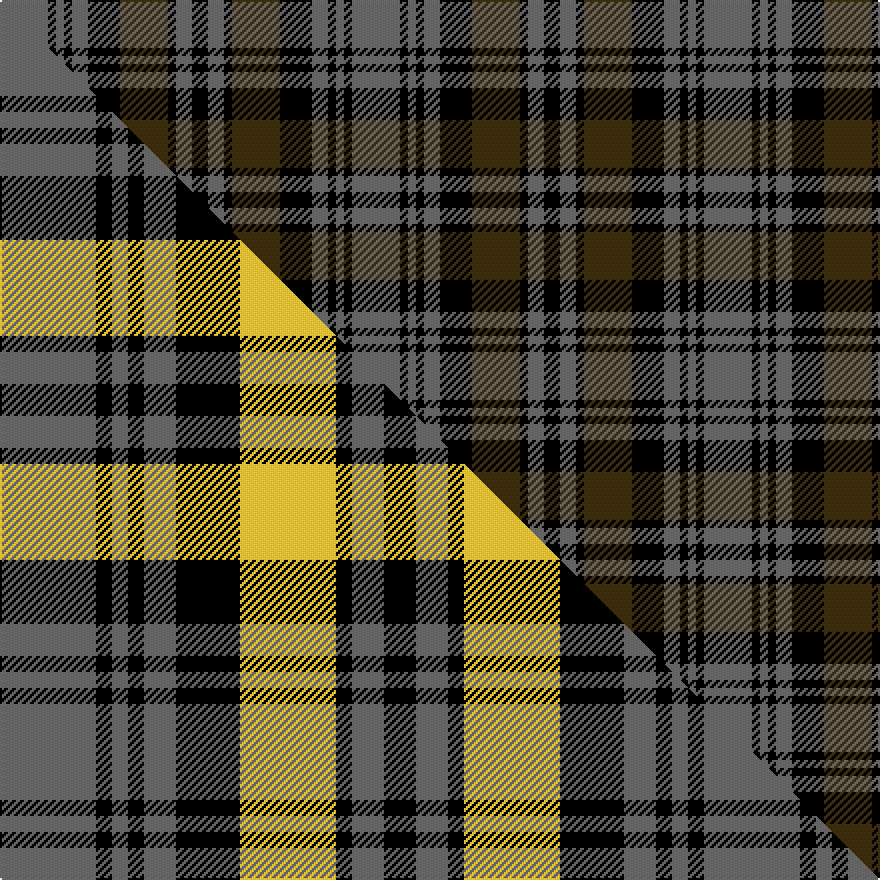

This is one **variant** — a specific cloth: this exact thread count and colourway, with its own
provenance below. It is one weaving of the [sett](/setts/n6k1n1k1n2k4dy6k1n2k2/) (the scale-free proportion — the
same cloth at any scale or shade), whose colour order is pattern [BKBKBKGKBK](/stripes/bkbkbkgkbk/).

Part of the [Tyndrum](/tartans/t/ty/tyndrum/) tartan — the named design grouping this sett with its other cloths.

Sourced from house-of-tartan.  It is a [10 stripe tartan](/stripes/stripes10/).

Original link [http://www.house-of-tartan.scotland.net/house/TartanViewjs.asp?colr=Def&tnam=1128](http://www.house-of-tartan.scotland.net/house/TartanViewjs.asp?colr=Def&tnam=1128)

## Provenance

Earliest known date: 1983 Tyndrum is a village in northwest Perthshire on the rail line between Glasgow and Fort William. Specimen seen in Mairi MacIntyre's shop, Fort William 1983.

Dataset <small>— provenance for this record, inherited from the source manifest</small>

<dl class="dataset-prov">
<dt>source</dt><dd><a href="/sources/house-of-tartan/">House of Tartan</a></dd>
<dt>data captured from</dt><dd><a href="https://github.com/thetartan/tartan-database/blob/master/data/house-of-tartan/data.csv">https://github.com/thetartan/tartan-database/blob/master/data/house-of-tartan/data.csv</a></dd>
<dt>data date</dt><dd>1983 <small>(this record)</small></dd>
<dt>licence</dt><dd><a href="https://creativecommons.org/licenses/by-nc-nd/4.0/">CC BY-NC-ND 4.0</a></dd>
</dl>

Capture chain <small>— the hands this data passed through, oldest first; each capture carries its own licence</small>

<ol class="capture-chain">
<li><a href="http://www.house-of-tartan.scotland.net/">House of Tartan</a> <small>the weaver/retailer's database — the site is now offline; the URL is kept as the ultimate source's identity</small></li>
<li><a href="https://github.com/thetartan/tartan-database">thetartan/tartan-database</a> <small>2016-2017</small> · <a href="https://creativecommons.org/licenses/by-nc-nd/4.0/">CC BY-NC-ND 4.0</a> <small>Levko Kravets's frozen compilation — the capture we vendored, and where its CC licence text came from</small></li>
<li>this dictionary <small>captured 2026-06-10 · commit 5bf86c7566</small> <small>each re-capture is a git commit to data/sources</small></li>
</ol>

## Thread count
N/24 K4 N4 K4 N8 K16 DY24 K4 N8 K/8

One full sett is **176 threads**.

## Palette
<table><thead><tr><th>Colour</th><th>Shade</th><th>OKLCh</th></tr></thead><tbody><tr><td>K</td><td><code style="background-color:#000000;">#000000</code> <small style="color:#888">#000000</small></td><td><small style="color:#888">oklch(0.0% 0.000 0.0)</small></td></tr><tr><td>N</td><td><code style="background-color:#636363;">#636363</code> <small style="color:#888">#636363</small></td><td><small style="color:#888">oklch(50.0% 0.000 89.9)</small></td></tr><tr><td>DY</td><td><code style="background-color:#3A2B0D;">#3A2B0D</code> <small style="color:#888">#3A2B0D</small></td><td><small style="color:#888">oklch(30.0% 0.049 82.0)</small></td></tr></tbody></table>

# Sample pattern

## Compared to the master

This cloth is one sett of its design; the master sett (the exemplar the design is anchored on) is below for comparison.

Its **ΔTartan distance** from the master is **0.17** — the same measure the nearest-tartans table ranks by (0 is identical; a re-scale of the same cloth is near 0, a recolour or a different proportion further).

<figure class="master-compare" style="margin:0">

this sett
master sett ★

<figcaption style="color:#888;font-size:smaller">One weave of this sett against the <a href="/setts/n6k1n1k1n2k4ly6k1n2k2/">master sett ★</a>, split on the diagonal: a shared proportion runs seamlessly across it with only the shades shifting; a different proportion breaks on it.</figcaption>
</figure>

## Nearest tartan variants

The nearest existing variants by ΔTartan distance, with this cloth at the top so the swatches line up against it.

ΔTartan

Threads

Variant

Sett

—

176

<a href="/variants/s10/n6k1n1k1n2k4dy6k1n2k2~x4/">Tyndrum District Tartan</a>

<a href="/ttd/edit/#slug=n6k1n1k1n2k4ly6k1n2k2~x8&amp;base=n6k1n1k1n2k4dy6k1n2k2~x4" title="compare in the TTD">0.17</a>

352

<a href="/variants/s10/n6k1n1k1n2k4ly6k1n2k2~x8/">Tyndrum</a>

<a href="/ttd/edit/#slug=n6k1n1k1n2k4o6k1n2k2~x4&amp;base=n6k1n1k1n2k4dy6k1n2k2~x4" title="compare in the TTD">1.00</a>

176

<a href="/variants/s10/n6k1n1k1n2k4o6k1n2k2~x4/">Tyndrum</a>

<a href="/ttd/edit/#slug=n23k6n6k6o38k40o6k40o38n38o6n6~n1900000-o2500000&amp;base=n6k1n1k1n2k4dy6k1n2k2~x4" title="compare in the TTD">2.48</a>

477

<a href="/variants/s12/n23k6n6k6o38k40o6k40o38n38o6n6~n1900000-o2500000/">Monarch of Argyll (Fashion)</a>

<a href="/ttd/edit/#slug=y18k3y3k3y3k13dg16k4dg16k13y16k3y3~x2&amp;base=n6k1n1k1n2k4dy6k1n2k2~x4" title="compare in the TTD">2.57</a>

414

<a href="/variants/s13/y18k3y3k3y3k13dg16k4dg16k13y16k3y3~x2/">Campbell Collegiate</a>

<a href="/ttd/edit/#slug=do12k2do2k2do2k10g12k3g12k10do12k2do2~x2&amp;base=n6k1n1k1n2k4dy6k1n2k2~x4" title="compare in the TTD">2.57</a>

304

<a href="/variants/s13/do12k2do2k2do2k10g12k3g12k10do12k2do2~x2/">Brown Watch (Fashion)</a>

<a href="/ttd/edit/#slug=o23k3o3k3n19k20n3k20n19o19n3o3~x2~o2500000-n1900000&amp;base=n6k1n1k1n2k4dy6k1n2k2~x4" title="compare in the TTD">2.71</a>

500

<a href="/variants/s12/o23k3o3k3n19k20n3k20n19o19n3o3~x2~o2500000-n1900000/">Monarch of Argyll (Corporate)</a>

<a href="/ttd/edit/#slug=lb2dr12k4dr2k2dr2k6g5lb2~x2&amp;base=n6k1n1k1n2k4dy6k1n2k2~x4" title="compare in the TTD">2.71</a>

140

<a href="/variants/s9/lb2dr12k4dr2k2dr2k6g5lb2~x2/">O'Neill (District)</a>

<a href="/ttd/edit/#slug=n1lb1n6k6lb1k6lb1n2lb1n3lb1~x2&amp;base=n6k1n1k1n2k4dy6k1n2k2~x4" title="compare in the TTD">2.88</a>

112

<a href="/variants/s11/n1lb1n6k6lb1k6lb1n2lb1n3lb1~x2/">Clergy (Grey)</a>

<a href="/ttd/edit/#slug=dt16k3dt3k3dt3k16g15k3g15k16dt15k3dt3~x2&amp;base=n6k1n1k1n2k4dy6k1n2k2~x4" title="compare in the TTD">2.89</a>

418

<a href="/variants/s13/dt16k3dt3k3dt3k16g15k3g15k16dt15k3dt3~x2/">42nd Regiment (Military)</a>

<a href="/ttd/edit/#slug=k2g2db10k10g2k10g2db3g2db5g2~x2&amp;base=n6k1n1k1n2k4dy6k1n2k2~x4" title="compare in the TTD">2.92</a>

192

<a href="/variants/s11/k2g2db10k10g2k10g2db3g2db5g2~x2/">Clergy (Clark) (Clan)</a>

## Neighbour map

Every grey dot is one of 13621 variants placed by the first two principal components of the ΔTartan feature space (42% of its variance). Red is this tartan; blue dots are its nearest — click one to open its page.

<svg viewBox="0 0 640 380" role="img" style="max-width:100%;height:auto;border:1px solid #e0e0e0;border-radius:4px;display:block" xmlns="http://www.w3.org/2000/svg"><image href="/nn/cloud.v1.png" width="640" height="380"/><a href="/variants/s10/n6k1n1k1n2k4ly6k1n2k2~x8/"><circle cx="166.5" cy="212.2" r="4" fill="#3465a4"><title>Tyndrum</title></circle></a><a href="/variants/s10/n6k1n1k1n2k4o6k1n2k2~x4/"><circle cx="183.4" cy="212.7" r="4" fill="#3465a4"><title>Tyndrum</title></circle></a><a href="/variants/s12/n23k6n6k6o38k40o6k40o38n38o6n6~n1900000-o2500000/"><circle cx="149.7" cy="201.1" r="4" fill="#3465a4"><title>Monarch of Argyll (Fashion)</title></circle></a><a href="/variants/s13/y18k3y3k3y3k13dg16k4dg16k13y16k3y3~x2/"><circle cx="162.0" cy="212.4" r="4" fill="#3465a4"><title>Campbell Collegiate</title></circle></a><a href="/variants/s13/do12k2do2k2do2k10g12k3g12k10do12k2do2~x2/"><circle cx="159.5" cy="212.7" r="4" fill="#3465a4"><title>Brown Watch (Fashion)</title></circle></a><a href="/variants/s12/o23k3o3k3n19k20n3k20n19o19n3o3~x2~o2500000-n1900000/"><circle cx="151.4" cy="197.4" r="4" fill="#3465a4"><title>Monarch of Argyll (Corporate)</title></circle></a><a href="/variants/s9/lb2dr12k4dr2k2dr2k6g5lb2~x2/"><circle cx="163.9" cy="201.0" r="4" fill="#3465a4"><title>O'Neill (District)</title></circle></a><a href="/variants/s11/n1lb1n6k6lb1k6lb1n2lb1n3lb1~x2/"><circle cx="180.0" cy="203.4" r="4" fill="#3465a4"><title>Clergy (Grey)</title></circle></a><a href="/variants/s13/dt16k3dt3k3dt3k16g15k3g15k16dt15k3dt3~x2/"><circle cx="163.4" cy="220.4" r="4" fill="#3465a4"><title>42nd Regiment (Military)</title></circle></a><a href="/variants/s11/k2g2db10k10g2k10g2db3g2db5g2~x2/"><circle cx="190.0" cy="219.8" r="4" fill="#3465a4"><title>Clergy (Clark) (Clan)</title></circle></a><circle cx="203.4" cy="221.4" r="5" fill="#c00000"/><text x="320" y="376" text-anchor="middle" font-size="11" fill="#999">ground</text><text x="11" y="190" text-anchor="middle" font-size="11" fill="#999" transform="rotate(-90 11 190)">complexity</text></svg>

ID: /variants/s10/n6k1n1k1n2k4dy6k1n2k2~x4/
