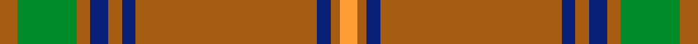

This page is one **sett** — a single exact thread-count. It belongs to the [tartan](/setts/o4g13o3db4o3db3o40db3o2lo4/)
(the same proportion at any scale), whose colour order is pattern [RGRBRBRBRY](/stripes/rgrbrbrbry/).

Sourced from house-of-tartan.  It is a [10 stripe tartan](/stripes/stripes10/).

Original link http://www.house-of-tartan.scotland.net/house/TartanViewjs.asp?colr=Def&tnam=2254

## Provenance

Earliest known date: 1995 One of a series of Irish District tartans designed by Polly Wittering of the House of Edgar, with colours reminiscent of the Country with soft warm colours dominating.

## Thread count
O/8 G26 O6 DB8 O6 DB6 O80 DB6 O4 LO/8

One full sett is **300 threads**.

## Palette
<table><thead><tr><th>Colour</th><th>Shade</th><th>OKLCh</th></tr></thead><tbody><tr><td>DB</td><td><code style="background-color:#082077;">#082077</code> <small style="color:#888">#082077</small></td><td><small style="color:#888">oklch(30.0% 0.149 265.1)</small></td></tr><tr><td>DO</td><td><code style="background-color:#A65C11;">#A65C11</code> <small style="color:#888">#A65C11</small></td><td><small style="color:#888">oklch(55.0% 0.125 58.3)</small></td></tr><tr><td>DY</td><td><code style="background-color:#FF9C34;">#FF9C34</code> <small style="color:#888">#FF9C34</small></td><td><small style="color:#888">oklch(77.9% 0.161 61.8)</small></td></tr><tr><td>N</td><td><code style="background-color:#008B2A;">#008B2A</code> <small style="color:#888">#008B2A</small></td><td><small style="color:#888">oklch(55.4% 0.170 145.9)</small></td></tr></tbody></table>

# Sample pattern

ID: /variants/s10/o4g13o3db4o3db3o40db3o2lo4~x2/
