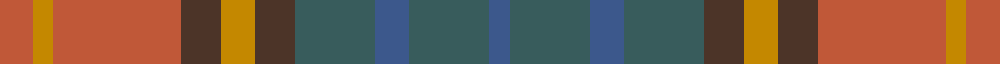

This page is one **sett** — a single exact thread-count. It belongs to the [tartan](/setts/o5lo3o19do6lo5do6dg12n5dg12n3/)
(the same proportion at any scale), whose colour order is pattern [BGBGBYBRYR](/stripes/bgbgbybryr/).

Sourced from house-of-tartan.  It is a [10 stripe tartan](/stripes/stripes10/).

Original link [http://www.house-of-tartan.scotland.net/house/TartanViewjs.asp?colr=Def&tnam=2246](http://www.house-of-tartan.scotland.net/house/TartanViewjs.asp?colr=Def&tnam=2246)

## Provenance

Earliest known date: 1996 One of a series of Irish District tartans designed by Polly Wittering of the House of Edgar, with colours reminiscent of the Country with soft warm colours dominating.

Dataset <small>— provenance for this record, inherited from the source manifest</small>

<dl class="dataset-prov">
<dt>source</dt><dd><a href="/sources/house-of-tartan/">House of Tartan</a></dd>
<dt>data captured from</dt><dd><a href="https://github.com/thetartan/tartan-database/blob/master/data/house-of-tartan/data.csv">https://github.com/thetartan/tartan-database/blob/master/data/house-of-tartan/data.csv</a></dd>
<dt>data date</dt><dd>2017-01-10 <small>(dataset default)</small></dd>
<dt>licence</dt><dd><a href="https://creativecommons.org/licenses/by-nc-nd/4.0/">CC BY-NC-ND 4.0</a></dd>
</dl>

Capture chain <small>— the hands this data passed through, oldest first; each capture carries its own licence</small>

<ol class="capture-chain">
<li><a href="http://www.house-of-tartan.scotland.net/">House of Tartan</a> <small>the weaver/retailer's database — the site is now offline; the URL is kept as the ultimate source's identity</small></li>
<li><a href="https://github.com/thetartan/tartan-database">thetartan/tartan-database</a> <small>2016-2017</small> · <a href="https://creativecommons.org/licenses/by-nc-nd/4.0/">CC BY-NC-ND 4.0</a> <small>Levko Kravets's frozen compilation — the capture we vendored, and where its CC licence text came from</small></li>
<li>this dictionary <small>captured 2026-06-10 · commit 5bf86c7566</small> <small>each re-capture is a git commit to data/sources</small></li>
</ol>

## Thread count
O/10 LO6 O38 DO12 LO10 DO12 DG24 N10 DG24 N/6

One full sett is **288 threads**.

## Palette
<table><thead><tr><th>Colour</th><th>Shade</th><th>OKLCh</th></tr></thead><tbody><tr><td>N</td><td><code style="background-color:#636363;">#636363</code> <small style="color:#888">#636363</small></td><td><small style="color:#888">oklch(50.0% 0.000 89.9)</small></td></tr><tr><td>O</td><td><code style="background-color:#A65C11;">#A65C11</code> <small style="color:#888">#A65C11</small></td><td><small style="color:#888">oklch(55.0% 0.125 58.3)</small></td></tr><tr><td>LO</td><td><code style="background-color:#FF9C34;">#FF9C34</code> <small style="color:#888">#FF9C34</small></td><td><small style="color:#888">oklch(77.9% 0.161 61.8)</small></td></tr><tr><td>DG</td><td><code style="background-color:#053819;">#053819</code> <small style="color:#888">#053819</small></td><td><small style="color:#888">oklch(30.0% 0.075 151.3)</small></td></tr><tr><td>DO</td><td><code style="background-color:#412714;">#412714</code> <small style="color:#888">#412714</small></td><td><small style="color:#888">oklch(30.1% 0.050 55.7)</small></td></tr></tbody></table>

# Sample pattern

## Nearest tartan variants

The nearest existing variants by ΔTartan distance, with this cloth at the top so the swatches line up against it.

ΔTartan

Threads

Variant

Sett

—

288

<a href="/variants/s10/o5lo3o19do6lo5do6dg12n5dg12n3~x2/">Roscommon Irish County Tartan</a>

<a href="/ttd/edit/#slug=o5ly3o19do6ly5do6dg12db5dg12db3~x2&amp;base=o5lo3o19do6lo5do6dg12n5dg12n3~x2" title="compare in the TTD">1.20</a>

288

<a href="/variants/s10/o5ly3o19do6ly5do6dg12db5dg12db3~x2/">Roscommon, County</a>

<a href="/ttd/edit/#slug=y3r10g4y8do2y8dp11do16y4g4r10y3~x2&amp;base=o5lo3o19do6lo5do6dg12n5dg12n3~x2" title="compare in the TTD">2.30</a>

320

<a href="/variants/s12/y3r10g4y8do2y8dp11do16y4g4r10y3~x2/">Hallowfield Wood</a>

<a href="/ttd/edit/#slug=dg6r1dg1r4g4r4dg1r1dg6o2g2gi4~x8~dg1104144-gi2104115&amp;base=o5lo3o19do6lo5do6dg12n5dg12n3~x2" title="compare in the TTD">2.44</a>

496

<a href="/variants/s12/dg6r1dg1r4g4r4dg1r1dg6o2g2gi4~x8~dg1104144-gi2104115/">Maple Leaf</a>

<a href="/ttd/edit/#slug=dg6r1dg1r4g4r4dg1r1dg6dy2g2y2~x8&amp;base=o5lo3o19do6lo5do6dg12n5dg12n3~x2" title="compare in the TTD">2.57</a>

480

<a href="/variants/s12/dg6r1dg1r4g4r4dg1r1dg6dy2g2y2~x8/">Maple Leaf Canadian District Tartan</a>

<a href="/ttd/edit/#slug=dg6r1dg1r4g4r4dg1r1dg6dy2g2y2~x4&amp;base=o5lo3o19do6lo5do6dg12n5dg12n3~x2" title="compare in the TTD">2.57</a>

240

<a href="/variants/s12/dg6r1dg1r4g4r4dg1r1dg6dy2g2y2~x4/">Maple Leaf MINI Canadian District Tartan</a>

<a href="/ttd/edit/#slug=b3do2o14g17do14b8o14do2b3~x2&amp;base=o5lo3o19do6lo5do6dg12n5dg12n3~x2" title="compare in the TTD">2.82</a>

296

<a href="/variants/s9/b3do2o14g17do14b8o14do2b3~x2/">Monaghan</a>

<a href="/ttd/edit/#slug=dg3lb12dg10lb6dg8g6dg8o23oi3~x2~dg1806142-g2408144-o2005046-oi2007033&amp;base=o5lo3o19do6lo5do6dg12n5dg12n3~x2" title="compare in the TTD">2.88</a>

304

<a href="/variants/s9/dg3lb12dg10lb6dg8g6dg8o23oi3~x2~dg1806142-g2408144-o2005046-oi2007033/">Lawrence's Seven Pillars of Khaki</a>

<a href="/ttd/edit/#slug=g18r6dr4ri6g20ri6dr4ri6dr4r6db22ri8r6dr4ri5~r1506028-ri2008029&amp;base=o5lo3o19do6lo5do6dg12n5dg12n3~x2" title="compare in the TTD">2.91</a>

227

<a href="/variants/s15/g18r6dr4ri6g20ri6dr4ri6dr4r6db22ri8r6dr4ri5~r1506028-ri2008029/">MacDougall 6</a>

<a href="/ttd/edit/#slug=dt2y10dg4o5dg2o3dg2o5dg4dt15lr2~x2~y2302166-dg1806142&amp;base=o5lo3o19do6lo5do6dg12n5dg12n3~x2" title="compare in the TTD">3.02</a>

208

<a href="/variants/s11/dt2y10dg4o5dg2o3dg2o5dg4dt15lr2~x2~y2302166-dg1806142/">Elwyn Glen (Scottish Borders)</a>

<a href="/ttd/edit/#slug=r3dy23y8g6y8db6y10db12y3~x2~y2303114-g2208144&amp;base=o5lo3o19do6lo5do6dg12n5dg12n3~x2" title="compare in the TTD">3.03</a>

304

<a href="/variants/s9/r3dy23y8g6y8db6y10db12y3~x2~y2303114-g2208144/">Lawrence's Seven Pillars of Khaki</a>

## Neighbour map

Every grey dot is one of 13621 variants placed by the first two principal components of the ΔTartan feature space (42% of its variance). Red is this tartan; blue dots are its nearest — click one to open its page.

<svg viewBox="0 0 640 380" role="img" style="max-width:100%;height:auto;border:1px solid #e0e0e0;border-radius:4px;display:block" xmlns="http://www.w3.org/2000/svg"><image href="/nn/cloud.v1.png" width="640" height="380"/><a href="/variants/s10/o5ly3o19do6ly5do6dg12db5dg12db3~x2/"><circle cx="146.7" cy="232.1" r="4" fill="#3465a4"><title>Roscommon, County</title></circle></a><a href="/variants/s12/y3r10g4y8do2y8dp11do16y4g4r10y3~x2/"><circle cx="167.0" cy="224.0" r="4" fill="#3465a4"><title>Hallowfield Wood</title></circle></a><a href="/variants/s12/dg6r1dg1r4g4r4dg1r1dg6o2g2gi4~x8~dg1104144-gi2104115/"><circle cx="164.0" cy="225.1" r="4" fill="#3465a4"><title>Maple Leaf</title></circle></a><a href="/variants/s12/dg6r1dg1r4g4r4dg1r1dg6dy2g2y2~x8/"><circle cx="186.3" cy="221.9" r="4" fill="#3465a4"><title>Maple Leaf Canadian District Tartan</title></circle></a><a href="/variants/s12/dg6r1dg1r4g4r4dg1r1dg6dy2g2y2~x4/"><circle cx="186.3" cy="221.9" r="4" fill="#3465a4"><title>Maple Leaf MINI Canadian District Tartan</title></circle></a><a href="/variants/s9/b3do2o14g17do14b8o14do2b3~x2/"><circle cx="227.9" cy="242.4" r="4" fill="#3465a4"><title>Monaghan</title></circle></a><a href="/variants/s9/dg3lb12dg10lb6dg8g6dg8o23oi3~x2~dg1806142-g2408144-o2005046-oi2007033/"><circle cx="187.8" cy="229.8" r="4" fill="#3465a4"><title>Lawrence's Seven Pillars of Khaki</title></circle></a><a href="/variants/s15/g18r6dr4ri6g20ri6dr4ri6dr4r6db22ri8r6dr4ri5~r1506028-ri2008029/"><circle cx="123.4" cy="206.7" r="4" fill="#3465a4"><title>MacDougall 6</title></circle></a><a href="/variants/s11/dt2y10dg4o5dg2o3dg2o5dg4dt15lr2~x2~y2302166-dg1806142/"><circle cx="201.8" cy="224.4" r="4" fill="#3465a4"><title>Elwyn Glen (Scottish Borders)</title></circle></a><a href="/variants/s9/r3dy23y8g6y8db6y10db12y3~x2~y2303114-g2208144/"><circle cx="196.5" cy="231.6" r="4" fill="#3465a4"><title>Lawrence's Seven Pillars of Khaki</title></circle></a><circle cx="169.9" cy="239.1" r="5" fill="#c00000"/><text x="320" y="376" text-anchor="middle" font-size="11" fill="#999">ground</text><text x="11" y="190" text-anchor="middle" font-size="11" fill="#999" transform="rotate(-90 11 190)">complexity</text></svg>

ID: /variants/s10/o5lo3o19do6lo5do6dg12n5dg12n3~x2/
