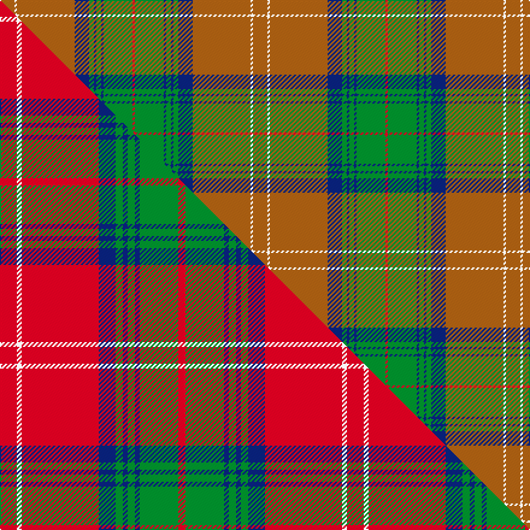

This is one **variant** — a specific cloth: this exact thread count and colourway, with its own
provenance below. It is one weaving of the [sett](/setts/o6w1o24db6g2db1g2db1g12r1/) (the scale-free proportion — the
same cloth at any scale or shade), whose colour order is pattern [RGBGBGBRWR](/stripes/rgbgbgbrwr/).

Part of the [Chisholm Hunting](/tartans/c/ch/chisholm-hunting-2/) tartan — the named design grouping this sett with its other cloths.

Sourced from weddslist.  It is a [10 stripe tartan](/stripes/stripes10/).

Original link [http://www.weddslist.com/cgi-bin/tartans/pg.pl?source=sts](http://www.weddslist.com/cgi-bin/tartans/pg.pl?source=sts)

Dataset <small>— provenance for this record, inherited from the source manifest</small>

<dl class="dataset-prov">
<dt>source</dt><dd><a href="/sources/weddslist/">Weddslist</a></dd>
<dt>data captured from</dt><dd><a href="https://github.com/thetartan/tartan-database/blob/master/data/weddslist/data.csv">https://github.com/thetartan/tartan-database/blob/master/data/weddslist/data.csv</a></dd>
<dt>data date</dt><dd>2016-11-17 <small>(dataset default)</small></dd>
<dt>licence</dt><dd><a href="https://creativecommons.org/licenses/by-nc-nd/4.0/">CC BY-NC-ND 4.0</a></dd>
</dl>

Capture chain <small>— the hands this data passed through, oldest first; each capture carries its own licence</small>

<ol class="capture-chain">
<li><a href="https://www.weddslist.com/tartans/">Weddslist</a> <small>the living privately compiled reference</small></li>
<li><a href="https://github.com/thetartan/tartan-database">thetartan/tartan-database</a> <small>2016-2017</small> · <a href="https://creativecommons.org/licenses/by-nc-nd/4.0/">CC BY-NC-ND 4.0</a> <small>Levko Kravets's frozen compilation — the capture we vendored, and where its CC licence text came from</small></li>
<li>this dictionary <small>captured 2026-06-10 · commit 5bf86c7566</small> <small>each re-capture is a git commit to data/sources</small></li>
</ol>

## Thread count
O/12 W2 O48 DB12 G4 DB2 G4 DB2 G24 R/2

One full sett is **210 threads**.

## Palette
<table><thead><tr><th>Colour</th><th>Shade</th><th>OKLCh</th></tr></thead><tbody><tr><td>DB</td><td><code style="background-color:#082077;">#082077</code> <small style="color:#888">#082077</small></td><td><small style="color:#888">oklch(30.0% 0.149 265.1)</small></td></tr><tr><td>G</td><td><code style="background-color:#008B2A;">#008B2A</code> <small style="color:#888">#008B2A</small></td><td><small style="color:#888">oklch(55.4% 0.170 145.9)</small></td></tr><tr><td>W</td><td><code style="background-color:#F7F7F7;">#F7F7F7</code> <small style="color:#888">#F7F7F7</small></td><td><small style="color:#888">oklch(97.6% 0.000 89.9)</small></td></tr><tr><td>O</td><td><code style="background-color:#A65C11;">#A65C11</code> <small style="color:#888">#A65C11</small></td><td><small style="color:#888">oklch(55.0% 0.125 58.3)</small></td></tr><tr><td>R</td><td><code style="background-color:#D60020;">#D60020</code> <small style="color:#888">#D60020</small></td><td><small style="color:#888">oklch(55.2% 0.224 25.5)</small></td></tr></tbody></table>

# Sample pattern

## Compared to the master

This cloth is one sett of its design; the master sett (the exemplar the design is anchored on) is below for comparison.

Its **ΔTartan distance** from the master is **3.39** — the same measure the nearest-tartans table ranks by (0 is identical; a re-scale of the same cloth is near 0, a recolour or a different proportion further).

<figure class="master-compare" style="margin:0">

this sett
master sett ★

<figcaption style="color:#888;font-size:smaller">One weave of this sett against the <a href="/setts/r7w2r32db7g3db2g3db2g16r3/">master sett ★</a>, split on the diagonal: a shared proportion runs seamlessly across it with only the shades shifting; a different proportion breaks on it.</figcaption>
</figure>

## Nearest tartan variants

The nearest existing variants by ΔTartan distance, with this cloth at the top so the swatches line up against it.

ΔTartan

Threads

Variant

Sett

—

210

<a href="/variants/s10/o6w1o24db6g2db1g2db1g12r1~x2/">Chisholm hunting</a>

<a href="/ttd/edit/#slug=g15y3g27r2g2r33t2w1t4~x2&amp;base=o6w1o24db6g2db1g2db1g12r1~x2" title="compare in the TTD">1.94</a>

318

<a href="/variants/s9/g15y3g27r2g2r33t2w1t4~x2/">Longmore (Name)</a>

<a href="/ttd/edit/#slug=dr4g20db2g2db2g3db6o26w3o2w2o4~x2&amp;base=o6w1o24db6g2db1g2db1g12r1~x2" title="compare in the TTD">1.94</a>

288

<a href="/variants/s12/dr4g20db2g2db2g3db6o26w3o2w2o4~x2/">Dorcas (Fashion)</a>

<a href="/ttd/edit/#slug=g21r2w1y3r2g5r21y1ly1y1r1g8~x2~y2405105-ly3307090&amp;base=o6w1o24db6g2db1g2db1g12r1~x2" title="compare in the TTD">2.13</a>

210

<a href="/variants/s12/g21r2w1y3r2g5r21y1ly1y1r1g8~x2~y2405105-ly3307090/">Glendronach</a>

<a href="/ttd/edit/#slug=y6r21g2dg6g41lb2g2lb6&amp;base=o6w1o24db6g2db1g2db1g12r1~x2" title="compare in the TTD">2.14</a>

160

<a href="/variants/s8/y6r21g2dg6g41lb2g2lb6/">Manitoba</a>

<a href="/ttd/edit/#slug=o40dt10y2dt2w2dt3g8o6dt2o4w2~x2&amp;base=o6w1o24db6g2db1g2db1g12r1~x2" title="compare in the TTD">2.32</a>

240

<a href="/variants/s11/o40dt10y2dt2w2dt3g8o6dt2o4w2~x2/">Cavalier, Brown</a>

<a href="/ttd/edit/#slug=y40dt10o2dt2w2dt3g8y6dt2y4w2~x2&amp;base=o6w1o24db6g2db1g2db1g12r1~x2" title="compare in the TTD">2.46</a>

240

<a href="/variants/s11/y40dt10o2dt2w2dt3g8y6dt2y4w2~x2/">Cavalier, Blue</a>

<a href="/ttd/edit/#slug=dy6w1dy24db6g2db1g2db1g12r1~x2&amp;base=o6w1o24db6g2db1g2db1g12r1~x2" title="compare in the TTD">2.46</a>

210

<a href="/variants/s10/dy6w1dy24db6g2db1g2db1g12r1~x2/">Chisholm Hunting Clan Tartan</a>

<a href="/ttd/edit/#slug=g8ly2dy4dp4g3dp4dy42g4r3g4dy4dp5r3~ly3307090-dy1603076&amp;base=o6w1o24db6g2db1g2db1g12r1~x2" title="compare in the TTD">2.70</a>

169

<a href="/variants/s13/g8ly2dy4dp4g3dp4dy42g4r3g4dy4dp5r3~ly3307090-dy1603076/">Sarna (District)</a>

<a href="/ttd/edit/#slug=r3g3y1r18w1g21y1g1y3~x2&amp;base=o6w1o24db6g2db1g2db1g12r1~x2" title="compare in the TTD">2.77</a>

196

<a href="/variants/s9/r3g3y1r18w1g21y1g1y3~x2/">MacDonald of Kingsburgh Clan Tartan</a>

<a href="/ttd/edit/#slug=r4db10g2db2g24o2g2o16g2w1~x2&amp;base=o6w1o24db6g2db1g2db1g12r1~x2" title="compare in the TTD">2.82</a>

250

<a href="/variants/s10/r4db10g2db2g24o2g2o16g2w1~x2/">Kinfauns Castle</a>

## Neighbour map

Every grey dot is one of 13621 variants placed by the first two principal components of the ΔTartan feature space (42% of its variance). Red is this tartan; blue dots are its nearest — click one to open its page.

<svg viewBox="0 0 640 380" role="img" style="max-width:100%;height:auto;border:1px solid #e0e0e0;border-radius:4px;display:block" xmlns="http://www.w3.org/2000/svg"><image href="/nn/cloud.v1.png" width="640" height="380"/><a href="/variants/s9/g15y3g27r2g2r33t2w1t4~x2/"><circle cx="348.0" cy="128.6" r="4" fill="#3465a4"><title>Longmore (Name)</title></circle></a><a href="/variants/s12/dr4g20db2g2db2g3db6o26w3o2w2o4~x2/"><circle cx="244.2" cy="149.8" r="4" fill="#3465a4"><title>Dorcas (Fashion)</title></circle></a><a href="/variants/s12/g21r2w1y3r2g5r21y1ly1y1r1g8~x2~y2405105-ly3307090/"><circle cx="339.6" cy="126.6" r="4" fill="#3465a4"><title>Glendronach</title></circle></a><a href="/variants/s8/y6r21g2dg6g41lb2g2lb6/"><circle cx="321.4" cy="150.6" r="4" fill="#3465a4"><title>Manitoba</title></circle></a><a href="/variants/s11/o40dt10y2dt2w2dt3g8o6dt2o4w2~x2/"><circle cx="395.3" cy="122.2" r="4" fill="#3465a4"><title>Cavalier, Brown</title></circle></a><a href="/variants/s11/y40dt10o2dt2w2dt3g8y6dt2y4w2~x2/"><circle cx="406.4" cy="131.9" r="4" fill="#3465a4"><title>Cavalier, Blue</title></circle></a><a href="/variants/s10/dy6w1dy24db6g2db1g2db1g12r1~x2/"><circle cx="343.2" cy="132.8" r="4" fill="#3465a4"><title>Chisholm Hunting Clan Tartan</title></circle></a><a href="/variants/s13/g8ly2dy4dp4g3dp4dy42g4r3g4dy4dp5r3~ly3307090-dy1603076/"><circle cx="383.1" cy="123.6" r="4" fill="#3465a4"><title>Sarna (District)</title></circle></a><a href="/variants/s9/r3g3y1r18w1g21y1g1y3~x2/"><circle cx="355.5" cy="152.6" r="4" fill="#3465a4"><title>MacDonald of Kingsburgh Clan Tartan</title></circle></a><a href="/variants/s10/r4db10g2db2g24o2g2o16g2w1~x2/"><circle cx="287.9" cy="140.6" r="4" fill="#3465a4"><title>Kinfauns Castle</title></circle></a><circle cx="352.9" cy="132.5" r="5" fill="#c00000"/><text x="320" y="376" text-anchor="middle" font-size="11" fill="#999">ground</text><text x="11" y="190" text-anchor="middle" font-size="11" fill="#999" transform="rotate(-90 11 190)">complexity</text></svg>

ID: /variants/s10/o6w1o24db6g2db1g2db1g12r1~x2/
