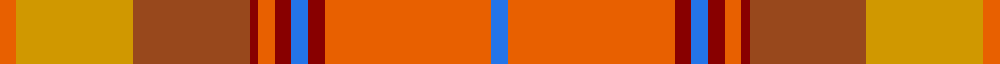

This page is one **sett** — a single exact thread-count. It belongs to the [tartan](/setts/oi2lo14o14r1oi2r2b2r2oi20b2/)
(the same proportion at any scale), whose colour order is pattern [BRRBRRRRYR](/stripes/brrbrrrryr/).

Sourced from register-of-tartans.  It is a [10 stripe tartan](/stripes/stripes10/).

Original link https://www.tartanregister.gov.uk/tartanDetails.aspx?ref=3908

2 attestations — the source records this cloth was collapsed from (oldest owns this page)

<ul>
<li>01/01/1972 — Star Is Born, A (register-of-tartans, <a href="https://www.tartanregister.gov.uk/tartanDetails.aspx?ref=3908">record</a>)</li>
<li>pre 1972 — Star Is Born, A (Fashion) (tartans-authority, <a href="http://www.tartansauthority.com/tartan-ferret/display/5304/">record</a>)</li>
</ul>

## Register references

External register numbers recorded for this tartan.

- Scottish Register of Tartans: [3908](https://www.tartanregister.gov.uk/tartanDetails.aspx?ref=3908)
- Scottish Tartans Authority (ITI): 5304

## Thread count
O/8 DY56 T56 DR4 O8 DR8 B8 DR8 O80 B/8

One full sett is **472 threads**.

## Palette

Palette: <strong>Tartan Register</strong> <small style="color:#888">(4 of 5 colours)</small>
<table><thead><tr><th>Colour</th><th>Threads</th><th>Shade</th><th>Base</th><th>OKLCh</th></tr></thead><tbody><tr><td>O/</td><td style="text-align:right;font-variant-numeric:tabular-nums">8</td><td><code style="background-color:#E86000;">#E86000</code> <small style="color:#888">#E86000</small></td><td>R <code style="background-color:#CC0000;">#CC0000</code></td><td><small style="color:#888">oklch(65.3% 0.187 44.9)</small></td></tr><tr><td>DY</td><td style="text-align:right;font-variant-numeric:tabular-nums">56</td><td><code style="background-color:#D09800;">#D09800</code> <small style="color:#888">#D09800</small></td><td>Y <code style="background-color:#F2BF00;">#F2BF00</code></td><td><small style="color:#888">oklch(71.4% 0.147 82.1)</small></td></tr><tr><td>T</td><td style="text-align:right;font-variant-numeric:tabular-nums">56</td><td><code style="background-color:#98481C;">#98481C</code> <small style="color:#888">#98481C</small></td><td>R <code style="background-color:#CC0000;">#CC0000</code></td><td><small style="color:#888">oklch(49.6% 0.121 46.1)</small></td></tr><tr><td>DR</td><td style="text-align:right;font-variant-numeric:tabular-nums">4</td><td><code style="background-color:#880000;">#880000</code> <small style="color:#888">#880000</small></td><td>R <code style="background-color:#CC0000;">#CC0000</code></td><td><small style="color:#888">oklch(39.4% 0.162 29.2)</small></td></tr><tr><td>O</td><td style="text-align:right;font-variant-numeric:tabular-nums">8</td><td><code style="background-color:#E86000;">#E86000</code> <small style="color:#888">#E86000</small></td><td>R <code style="background-color:#CC0000;">#CC0000</code></td><td><small style="color:#888">oklch(65.3% 0.187 44.9)</small></td></tr><tr><td>DR</td><td style="text-align:right;font-variant-numeric:tabular-nums">8</td><td><code style="background-color:#880000;">#880000</code> <small style="color:#888">#880000</small></td><td>R <code style="background-color:#CC0000;">#CC0000</code></td><td><small style="color:#888">oklch(39.4% 0.162 29.2)</small></td></tr><tr><td>B</td><td style="text-align:right;font-variant-numeric:tabular-nums">8</td><td><code style="background-color:#2474E8;">#2474E8</code> <small style="color:#888">#2474E8</small></td><td>B <code style="background-color:#2A418A;">#2A418A</code></td><td><small style="color:#888">oklch(57.8% 0.192 258.7)</small></td></tr><tr><td>DR</td><td style="text-align:right;font-variant-numeric:tabular-nums">8</td><td><code style="background-color:#880000;">#880000</code> <small style="color:#888">#880000</small></td><td>R <code style="background-color:#CC0000;">#CC0000</code></td><td><small style="color:#888">oklch(39.4% 0.162 29.2)</small></td></tr><tr><td>O</td><td style="text-align:right;font-variant-numeric:tabular-nums">80</td><td><code style="background-color:#E86000;">#E86000</code> <small style="color:#888">#E86000</small></td><td>R <code style="background-color:#CC0000;">#CC0000</code></td><td><small style="color:#888">oklch(65.3% 0.187 44.9)</small></td></tr><tr><td>B/</td><td style="text-align:right;font-variant-numeric:tabular-nums">8</td><td><code style="background-color:#2474E8;">#2474E8</code> <small style="color:#888">#2474E8</small></td><td>B <code style="background-color:#2A418A;">#2A418A</code></td><td><small style="color:#888">oklch(57.8% 0.192 258.7)</small></td></tr></tbody></table>

## Nearest tartans

The nearest existing variants by ΔTartan distance, with this tartan at the top so the swatches line up against it.

ΔTartan

Tartan

Sett

—

<a href="/ttd/edit/#slug=oi2lo14o14r1oi2r2b2r2oi20b2~x4">Star Is Born, A</a> <a class="nn-out" href="/variants/s10/oi2lo14o14r1oi2r2b2r2oi20b2~x4/" title="open its dictionary page">↗</a>

1.40

<a href="/ttd/edit/#slug=k3o29lo2o2lo4o2lo20ly1lo2ly10w3~x2&amp;base=oi2lo14o14r1oi2r2b2r2oi20b2~x4">Shenzhen (Sports)</a> <a class="nn-out" href="/variants/s11/k3o29lo2o2lo4o2lo20ly1lo2ly10w3~x2/" title="open its dictionary page">↗</a>

1.49

<a href="/ttd/edit/#slug=oi24lo8dr2lo8dr2lo8o15g2~x2&amp;base=oi2lo14o14r1oi2r2b2r2oi20b2~x4">Unidentified from Winnipeg</a> <a class="nn-out" href="/variants/s8/oi24lo8dr2lo8dr2lo8o15g2~x2/" title="open its dictionary page">↗</a>

1.59

<a href="/ttd/edit/#slug=w2lo1r3y20r1lo1r3lo2o14ly2r2ly2~x2&amp;base=oi2lo14o14r1oi2r2b2r2oi20b2~x4">Flodden</a> <a class="nn-out" href="/variants/s12/w2lo1r3y20r1lo1r3lo2o14ly2r2ly2~x2/" title="open its dictionary page">↗</a>

1.68

<a href="/ttd/edit/#slug=o24r24w3g21ly2r1ly2o6r2~x2&amp;base=oi2lo14o14r1oi2r2b2r2oi20b2~x4">Henry, W.A.</a> <a class="nn-out" href="/variants/s9/o24r24w3g21ly2r1ly2o6r2~x2/" title="open its dictionary page">↗</a>

1.75

<a href="/ttd/edit/#slug=r2ly20o2ly2r3lo3r3loii6loi24ly2~x2&amp;base=oi2lo14o14r1oi2r2b2r2oi20b2~x4">Golden Heather, The</a> <a class="nn-out" href="/variants/s10/r2ly20o2ly2r3lo3r3loii6loi24ly2~x2/" title="open its dictionary page">↗</a>

1.75

<a href="/ttd/edit/#slug=lr6y2lr2y5r20o2r2o25ri2o2ri4ly10r2~x2&amp;base=oi2lo14o14r1oi2r2b2r2oi20b2~x4">Strathtay (District?)</a> <a class="nn-out" href="/variants/s13/lr6y2lr2y5r20o2r2o25ri2o2ri4ly10r2~x2/" title="open its dictionary page">↗</a>

1.77

<a href="/ttd/edit/#slug=g28lo18db4lo18r3ri2r3ri2r3ri2r3~x2&amp;base=oi2lo14o14r1oi2r2b2r2oi20b2~x4">Commonwealth Games - 2014</a> <a class="nn-out" href="/variants/s11/g28lo18db4lo18r3ri2r3ri2r3ri2r3~x2/" title="open its dictionary page">↗</a>

1.78

<a href="/ttd/edit/#slug=dg24r7dg7r7dg7r22r7r4b4r4r40b14&amp;base=oi2lo14o14r1oi2r2b2r2oi20b2~x4">Powys (District)</a> <a class="nn-out" href="/variants/s12/dg24r7dg7r7dg7r22r7r4b4r4r40b14/" title="open its dictionary page">↗</a>

1.90

<a href="/ttd/edit/#slug=n5lb5n2r47n18w2n5o9lb7w3~x2&amp;base=oi2lo14o14r1oi2r2b2r2oi20b2~x4">Rikaco Red (Fashion)</a> <a class="nn-out" href="/variants/s10/n5lb5n2r47n18w2n5o9lb7w3~x2/" title="open its dictionary page">↗</a>

1.90

<a href="/ttd/edit/#slug=ly25o2w2db2w2o13dy28db2o3~x2&amp;base=oi2lo14o14r1oi2r2b2r2oi20b2~x4">Brousseau (Personal)</a> <a class="nn-out" href="/variants/s9/ly25o2w2db2w2o13dy28db2o3~x2/" title="open its dictionary page">↗</a>

## Neighbour map

Every grey dot is one of 14360 variants placed by the first two principal components of the ΔTartan feature space (44% of its variance). Red is this tartan; blue dots are its nearest — click one to open its page.

<svg viewBox="0 0 640 380" role="img" style="max-width:100%;height:auto;border:1px solid #e0e0e0;border-radius:4px;display:block" xmlns="http://www.w3.org/2000/svg"><image href="/nn/cloud.v1.png" width="640" height="380"/><a href="/variants/s11/k3o29lo2o2lo4o2lo20ly1lo2ly10w3~x2/"><circle cx="302.1" cy="101.7" r="4" fill="#3465a4"><title>Shenzhen (Sports)</title></circle></a><a href="/variants/s8/oi24lo8dr2lo8dr2lo8o15g2~x2/"><circle cx="229.9" cy="188.1" r="4" fill="#3465a4"><title>Unidentified from Winnipeg</title></circle></a><a href="/variants/s12/w2lo1r3y20r1lo1r3lo2o14ly2r2ly2~x2/"><circle cx="253.9" cy="112.6" r="4" fill="#3465a4"><title>Flodden</title></circle></a><a href="/variants/s9/o24r24w3g21ly2r1ly2o6r2~x2/"><circle cx="246.2" cy="137.8" r="4" fill="#3465a4"><title>Henry, W.A.</title></circle></a><a href="/variants/s10/r2ly20o2ly2r3lo3r3loii6loi24ly2~x2/"><circle cx="252.0" cy="147.0" r="4" fill="#3465a4"><title>Golden Heather, The</title></circle></a><a href="/variants/s13/lr6y2lr2y5r20o2r2o25ri2o2ri4ly10r2~x2/"><circle cx="185.3" cy="112.0" r="4" fill="#3465a4"><title>Strathtay (District?)</title></circle></a><a href="/variants/s11/g28lo18db4lo18r3ri2r3ri2r3ri2r3~x2/"><circle cx="252.4" cy="139.2" r="4" fill="#3465a4"><title>Commonwealth Games - 2014</title></circle></a><a href="/variants/s12/dg24r7dg7r7dg7r22r7r4b4r4r40b14/"><circle cx="234.4" cy="171.8" r="4" fill="#3465a4"><title>Powys (District)</title></circle></a><a href="/variants/s10/n5lb5n2r47n18w2n5o9lb7w3~x2/"><circle cx="294.5" cy="107.8" r="4" fill="#3465a4"><title>Rikaco Red (Fashion)</title></circle></a><a href="/variants/s9/ly25o2w2db2w2o13dy28db2o3~x2/"><circle cx="224.9" cy="144.9" r="4" fill="#3465a4"><title>Brousseau (Personal)</title></circle></a><circle cx="276.1" cy="137.3" r="5" fill="#c00000"/></svg>

ID: /variants/s10/oi2lo14o14r1oi2r2b2r2oi20b2~x4/
