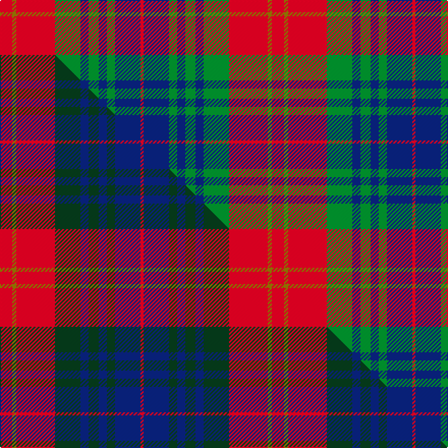

This is one **variant** — a specific cloth: this exact thread count and colourway, with its own
provenance below. It is one weaving of the [sett](/setts/r12y4r38g25db8g10db8g8db25r3/) (the scale-free proportion — the
same cloth at any scale or shade), whose colour order is pattern [RBGBGBGRGR](/stripes/rbgbgbgrgr/).

Part of the [MacEdward](/tartans/macedward-2/) tartan — the named design grouping this sett with its other cloths.

Sourced from house-of-tartan.  It is a [10 stripe tartan](/stripes/stripes10/).

Original link [http://www.house-of-tartan.scotland.net/house/TartanViewjs.asp?colr=Def&tnam=1335](http://www.house-of-tartan.scotland.net/house/TartanViewjs.asp?colr=Def&tnam=1335)

## Provenance

Earliest known date: pre 2003 This sample comes from the MacGregor-Hastie collection which forms the basis of the cloth archive of the Scottish Tartans Society. Some of the samples, including this one, were unmarked. One can assume that the sample dates between 1930 and 1950.

2 attestations — the source records this cloth was collapsed from (oldest owns this page)

<ul>
<li>pre 2003 — MacEdward Tartan (house-of-tartan, <a href="http://www.house-of-tartan.scotland.net/house/TartanViewjs.asp?colr=Def&tnam=1335">record</a>) </li>
<li>undated — MacEdward (weddslist, <a href="http://www.weddslist.com/cgi-bin/tartans/pg.pl?source=sts">record</a>) </li>
</ul>

Dataset <small>— provenance for this record, inherited from the source manifest</small>

<dl class="dataset-prov">
<dt>source</dt><dd><a href="/sources/house-of-tartan/">House of Tartan</a></dd>
<dt>data captured from</dt><dd><a href="https://github.com/thetartan/tartan-database/blob/master/data/house-of-tartan/data.csv">https://github.com/thetartan/tartan-database/blob/master/data/house-of-tartan/data.csv</a></dd>
<dt>data date</dt><dd>pre 2003 <small>(this record)</small></dd>
<dt>licence</dt><dd><a href="https://creativecommons.org/licenses/by-nc-nd/4.0/">CC BY-NC-ND 4.0</a></dd>
</dl>

Capture chain <small>— the hands this data passed through, oldest first; each capture carries its own licence</small>

<ol class="capture-chain">
<li><a href="http://www.house-of-tartan.scotland.net/">House of Tartan</a> <small>the weaver/retailer's database — the site is now offline; the URL is kept as the ultimate source's identity</small></li>
<li><a href="https://github.com/thetartan/tartan-database">thetartan/tartan-database</a> <small>2016-2017</small> · <a href="https://creativecommons.org/licenses/by-nc-nd/4.0/">CC BY-NC-ND 4.0</a> <small>Levko Kravets's frozen compilation — the capture we vendored, and where its CC licence text came from</small></li>
<li>this dictionary <small>captured 2026-06-10 · commit 5bf86c7566</small> <small>each re-capture is a git commit to data/sources</small></li>
</ol>

## Thread count
R/12 Y4 R38 G25 DB8 G10 DB8 G8 DB25 R/3

One full sett is **267 threads**.

## Palette
<table><thead><tr><th>Colour</th><th>Shade</th><th>OKLCh</th></tr></thead><tbody><tr><td>DB</td><td><code style="background-color:#082077;">#082077</code> <small style="color:#888">#082077</small></td><td><small style="color:#888">oklch(30.0% 0.149 265.1)</small></td></tr><tr><td>G</td><td><code style="background-color:#008B2A;">#008B2A</code> <small style="color:#888">#008B2A</small></td><td><small style="color:#888">oklch(55.4% 0.170 145.9)</small></td></tr><tr><td>R</td><td><code style="background-color:#D60020;">#D60020</code> <small style="color:#888">#D60020</small></td><td><small style="color:#888">oklch(55.2% 0.224 25.5)</small></td></tr><tr><td>Y</td><td><code style="background-color:#8B6E00;">#8B6E00</code> <small style="color:#888">#8B6E00</small></td><td><small style="color:#888">oklch(55.1% 0.113 90.4)</small></td></tr></tbody></table>

# Sample pattern

## Compared to the master

This cloth is one sett of its design; the master sett (the exemplar the design is anchored on) is below for comparison.

Its **ΔTartan distance** from the master is **0.14** — the same measure the nearest-tartans table ranks by (0 is identical; a re-scale of the same cloth is near 0, a recolour or a different proportion further).

<figure class="master-compare" style="margin:0">

this sett
master sett ★

<figcaption style="color:#888;font-size:smaller">One weave of this sett against the <a href="/setts/r12y4r38dg25db8dg10db8dg8db25r3/">master sett ★</a>, split on the diagonal: a shared proportion runs seamlessly across it with only the shades shifting; a different proportion breaks on it.</figcaption>
</figure>

## Nearest tartan variants

The nearest existing variants by ΔTartan distance, with this cloth at the top so the swatches line up against it.

ΔTartan

Threads

Variant

Sett

—

267

<a href="/variants/s10/r12y4r38g25db8g10db8g8db25r3/">MacEdward Tartan</a>

<a href="/ttd/edit/#slug=r12y4r38dg25db8dg10db8dg8db25r3&amp;base=r12y4r38g25db8g10db8g8db25r3" title="compare in the TTD">0.14</a>

267

<a href="/variants/s10/r12y4r38dg25db8dg10db8dg8db25r3/">MacEdward (Personal)</a>

<a href="/ttd/edit/#slug=db16r1db1r1g12r16w2r16g12db12r1db1~x2&amp;base=r12y4r38g25db8g10db8g8db25r3" title="compare in the TTD">1.61</a>

330

<a href="/variants/s12/db16r1db1r1g12r16w2r16g12db12r1db1~x2/">Fraser of Lovat Clan Tartan</a>

<a href="/ttd/edit/#slug=g2db1r16db12g16w1g16db12r16db1g2db1~x2&amp;base=r12y4r38g25db8g10db8g8db25r3" title="compare in the TTD">1.75</a>

378

<a href="/variants/s12/g2db1r16db12g16w1g16db12r16db1g2db1~x2/">Unidentified (1996)</a>

<a href="/ttd/edit/#slug=r15db2r1db2r3db7g13dg3~x2~g2408144-dg1806142&amp;base=r12y4r38g25db8g10db8g8db25r3" title="compare in the TTD">1.82</a>

148

<a href="/variants/s8/r15db2r1db2r3db7g13dg3~x2~g2408144-dg1806142/">Cranston Dress</a>

<a href="/ttd/edit/#slug=g20db2g2db2g2db8r24db2r3&amp;base=r12y4r38g25db8g10db8g8db25r3" title="compare in the TTD">1.92</a>

107

<a href="/variants/s9/g20db2g2db2g2db8r24db2r3/">Lindsay</a>

<a href="/ttd/edit/#slug=g20db2g2db2g2db8r24db2r3~x2&amp;base=r12y4r38g25db8g10db8g8db25r3" title="compare in the TTD">1.92</a>

214

<a href="/variants/s9/g20db2g2db2g2db8r24db2r3~x2/">Lindsay</a>

<a href="/ttd/edit/#slug=db16r2db2r2g14r13w2r13g14db14r2db2~x2&amp;base=r12y4r38g25db8g10db8g8db25r3" title="compare in the TTD">2.02</a>

348

<a href="/variants/s12/db16r2db2r2g14r13w2r13g14db14r2db2~x2/">Fraser of Lovat</a>

<a href="/ttd/edit/#slug=r30db3r2db3r6db14g26dg6~g2408144-dg1806142&amp;base=r12y4r38g25db8g10db8g8db25r3" title="compare in the TTD">2.08</a>

144

<a href="/variants/s8/r30db3r2db3r6db14g26dg6~g2408144-dg1806142/">Cranston Dress Family Tartan</a>

<a href="/ttd/edit/#slug=g3r9lb1g9r1g1r8db9r1~x4&amp;base=r12y4r38g25db8g10db8g8db25r3" title="compare in the TTD">2.13</a>

320

<a href="/variants/s9/g3r9lb1g9r1g1r8db9r1~x4/">Baronage</a>

<a href="/ttd/edit/#slug=dp9lr4dp1lr4g15r4dp1~x4~lr2805035-r2108022&amp;base=r12y4r38g25db8g10db8g8db25r3" title="compare in the TTD">2.19</a>

264

<a href="/variants/s7/dp9lr4dp1lr4g15r4dp1~x4~lr2805035-r2108022/">Logan #3</a>

## Neighbour map

Every grey dot is one of 13621 variants placed by the first two principal components of the ΔTartan feature space (42% of its variance). Red is this tartan; blue dots are its nearest — click one to open its page.

<svg viewBox="0 0 640 380" role="img" style="max-width:100%;height:auto;border:1px solid #e0e0e0;border-radius:4px;display:block" xmlns="http://www.w3.org/2000/svg"><image href="/nn/cloud.v1.png" width="640" height="380"/><a href="/variants/s10/r12y4r38dg25db8dg10db8dg8db25r3/"><circle cx="224.1" cy="192.1" r="4" fill="#3465a4"><title>MacEdward (Personal)</title></circle></a><a href="/variants/s12/db16r1db1r1g12r16w2r16g12db12r1db1~x2/"><circle cx="218.1" cy="163.8" r="4" fill="#3465a4"><title>Fraser of Lovat Clan Tartan</title></circle></a><a href="/variants/s12/g2db1r16db12g16w1g16db12r16db1g2db1~x2/"><circle cx="222.3" cy="172.0" r="4" fill="#3465a4"><title>Unidentified (1996)</title></circle></a><a href="/variants/s8/r15db2r1db2r3db7g13dg3~x2~g2408144-dg1806142/"><circle cx="234.7" cy="182.5" r="4" fill="#3465a4"><title>Cranston Dress</title></circle></a><a href="/variants/s9/g20db2g2db2g2db8r24db2r3/"><circle cx="277.4" cy="183.7" r="4" fill="#3465a4"><title>Lindsay</title></circle></a><a href="/variants/s9/g20db2g2db2g2db8r24db2r3~x2/"><circle cx="277.4" cy="183.7" r="4" fill="#3465a4"><title>Lindsay</title></circle></a><a href="/variants/s12/db16r2db2r2g14r13w2r13g14db14r2db2~x2/"><circle cx="177.2" cy="201.3" r="4" fill="#3465a4"><title>Fraser of Lovat</title></circle></a><a href="/variants/s8/r30db3r2db3r6db14g26dg6~g2408144-dg1806142/"><circle cx="242.0" cy="179.6" r="4" fill="#3465a4"><title>Cranston Dress Family Tartan</title></circle></a><a href="/variants/s9/g3r9lb1g9r1g1r8db9r1~x4/"><circle cx="238.7" cy="202.7" r="4" fill="#3465a4"><title>Baronage</title></circle></a><a href="/variants/s7/dp9lr4dp1lr4g15r4dp1~x4~lr2805035-r2108022/"><circle cx="235.0" cy="196.3" r="4" fill="#3465a4"><title>Logan #3</title></circle></a><circle cx="208.6" cy="190.2" r="5" fill="#c00000"/><text x="320" y="376" text-anchor="middle" font-size="11" fill="#999">ground</text><text x="11" y="190" text-anchor="middle" font-size="11" fill="#999" transform="rotate(-90 11 190)">complexity</text></svg>

ID: /variants/s10/r12y4r38g25db8g10db8g8db25r3/
