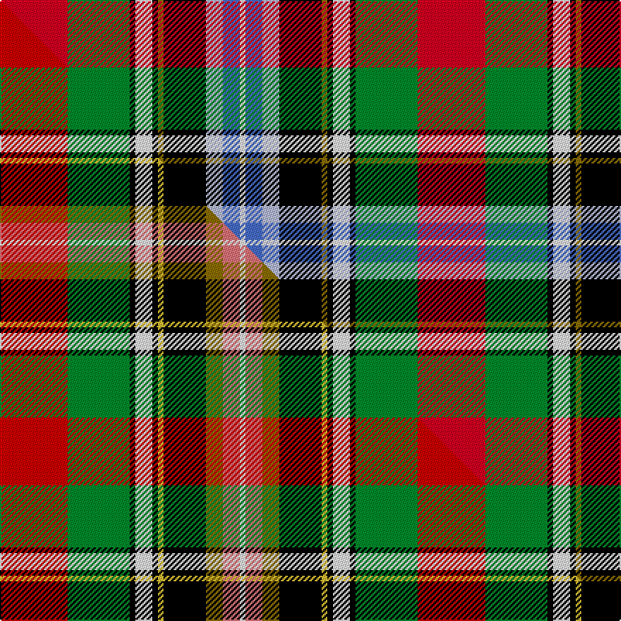

This page is one **sett** — a single exact thread-count. It belongs to the [tartan](/setts/r24g22k2w6k2y2k15lb6b6w2/)
(the same proportion at any scale), whose colour order is pattern [RGKWKGKWBW](/stripes/rgkwkgkwbw/).

Part of the [Bruce of Kinnaird](/tartans/bruce-of-kinnaird/) tartan — the named design grouping this sett with its other cloths.

Sourced from weddslist.  It is a [10 stripe tartan](/stripes/stripes10/).

Original link http://www.weddslist.com/cgi-bin/tartans/pg.pl?source=sts

## Thread count
R/48 G44 K4 W12 K4 Y4 K30 LB12 B12 W/4

One full sett is **296 threads**.

## Palette
<table><thead><tr><th>Colour</th><th>Shade</th><th>OKLCh</th></tr></thead><tbody><tr><td>LB</td><td><code style="background-color:#B5BBDE;">#B5BBDE</code> <small style="color:#888">#B5BBDE</small></td><td><small style="color:#888">oklch(79.9% 0.050 277.6)</small></td></tr><tr><td>G</td><td><code style="background-color:#008B2A;">#008B2A</code> <small style="color:#888">#008B2A</small></td><td><small style="color:#888">oklch(55.4% 0.170 145.9)</small></td></tr><tr><td>K</td><td><code style="background-color:#000000;">#000000</code> <small style="color:#888">#000000</small></td><td><small style="color:#888">oklch(0.0% 0.000 0.0)</small></td></tr><tr><td>W</td><td><code style="background-color:#F7F7F7;">#F7F7F7</code> <small style="color:#888">#F7F7F7</small></td><td><small style="color:#888">oklch(97.6% 0.000 89.9)</small></td></tr><tr><td>B</td><td><code style="background-color:#466CC8;">#466CC8</code> <small style="color:#888">#466CC8</small></td><td><small style="color:#888">oklch(55.1% 0.149 265.0)</small></td></tr><tr><td>R</td><td><code style="background-color:#D60020;">#D60020</code> <small style="color:#888">#D60020</small></td><td><small style="color:#888">oklch(55.2% 0.224 25.5)</small></td></tr><tr><td>Y</td><td><code style="background-color:#8B6E00;">#8B6E00</code> <small style="color:#888">#8B6E00</small></td><td><small style="color:#888">oklch(55.1% 0.113 90.4)</small></td></tr></tbody></table>

# Sample pattern

## Compared to the master

This cloth is one sett of its design; the master sett (the exemplar the design is anchored on) is below for comparison.

Its **ΔTartan distance** from the master is **0.60** — the same measure the nearest-tartans table ranks by (0 is identical; a re-scale of the same cloth is near 0, a recolour or a different proportion further).

<figure class="master-compare" style="margin:0">

this sett
master sett ★

<figcaption style="color:#888;font-size:smaller">One weave of this sett against the <a href="/setts/r24g22k2w6k2ly2k15y6ri6w2/">master sett ★</a>, split on the diagonal: a shared proportion runs seamlessly across it with only the shades shifting; a different proportion breaks on it.</figcaption>
</figure>

## Nearest tartan variants

The nearest existing variants by ΔTartan distance, with this cloth at the top so the swatches line up against it.

ΔTartan

Threads

Variant

Sett

—

296

<a href="/variants/s10/r24g22k2w6k2y2k15lb6b6w2~x2/">Bruce of Kinnaird</a>

<a href="/ttd/edit/#slug=r24g22k2w6k2y2k15lb6ri6w2~x2~r2109032-ri2406019&amp;base=r24g22k2w6k2y2k15lb6b6w2~x2" title="compare in the TTD">0.60</a>

296

<a href="/variants/s10/r24g22k2w6k2y2k15lb6ri6w2~x2~r2109032-ri2406019/">Bruce of Kinnaird Clan Tartan</a>

<a href="/ttd/edit/#slug=r24g22k2w6k2ly2k15y6ri6w2~x2~r2109032-ri2806019&amp;base=r24g22k2w6k2y2k15lb6b6w2~x2" title="compare in the TTD">0.90</a>

296

<a href="/variants/s10/r24g22k2w6k2ly2k15y6ri6w2~x2~r2109032-ri2806019/">Bruce of Kinnaird</a>

<a href="/ttd/edit/#slug=w2r12k1lb2k1y3k1y3k1lb2k1g12lb2~x2&amp;base=r24g22k2w6k2y2k15lb6b6w2~x2" title="compare in the TTD">2.27</a>

164

<a href="/variants/s13/w2r12k1lb2k1y3k1y3k1lb2k1g12lb2~x2/">Buchanan #3</a>

<a href="/ttd/edit/#slug=r24dr24k2w6k2y2k16lb5db6w2~x2&amp;base=r24g22k2w6k2y2k15lb6b6w2~x2" title="compare in the TTD">2.47</a>

304

<a href="/variants/s10/r24dr24k2w6k2y2k16lb5db6w2~x2/">Scotland's International - Away (Fas</a>

<a href="/ttd/edit/#slug=y3k2lb3r14g19k3w3dp10lb3~x2&amp;base=r24g22k2w6k2y2k15lb6b6w2~x2" title="compare in the TTD">2.60</a>

228

<a href="/variants/s9/y3k2lb3r14g19k3w3dp10lb3~x2/">Wilson's, No 110</a>

<a href="/ttd/edit/#slug=db4lb1k3y1k1w1k1g8r12lb1r2k1~x4&amp;base=r24g22k2w6k2y2k15lb6b6w2~x2" title="compare in the TTD">2.93</a>

268

<a href="/variants/s12/db4lb1k3y1k1w1k1g8r12lb1r2k1~x4/">MacLean of Duart #6</a>

<a href="/ttd/edit/#slug=db4lb1k3y1k1w1k1g8r12lb1r2k1~x2&amp;base=r24g22k2w6k2y2k15lb6b6w2~x2" title="compare in the TTD">2.93</a>

134

<a href="/variants/s12/db4lb1k3y1k1w1k1g8r12lb1r2k1~x2/">MacLean of Duart 5</a>

<a href="/ttd/edit/#slug=w4r25k2lb4k2y8k3y8k2lb4k2g25lb4~x2&amp;base=r24g22k2w6k2y2k15lb6b6w2~x2" title="compare in the TTD">2.95</a>

356

<a href="/variants/s13/w4r25k2lb4k2y8k3y8k2lb4k2g25lb4~x2/">Buchanan #4</a>

## Neighbour map

Every grey dot is one of 13620 variants placed by the first two principal components of the ΔTartan feature space (42% of its variance). Red is this tartan; blue dots are its nearest — click one to open its page.

<svg viewBox="0 0 640 380" role="img" style="max-width:100%;height:auto;border:1px solid #e0e0e0;border-radius:4px;display:block" xmlns="http://www.w3.org/2000/svg"><image href="/nn/cloud.v1.png" width="640" height="380"/><a href="/variants/s10/r24g22k2w6k2y2k15lb6ri6w2~x2~r2109032-ri2406019/"><circle cx="41.6" cy="115.5" r="4" fill="#3465a4"><title>Bruce of Kinnaird Clan Tartan</title></circle></a><a href="/variants/s10/r24g22k2w6k2ly2k15y6ri6w2~x2~r2109032-ri2806019/"><circle cx="43.1" cy="116.3" r="4" fill="#3465a4"><title>Bruce of Kinnaird</title></circle></a><a href="/variants/s13/w2r12k1lb2k1y3k1y3k1lb2k1g12lb2~x2/"><circle cx="80.8" cy="110.4" r="4" fill="#3465a4"><title>Buchanan #3</title></circle></a><a href="/variants/s10/r24dr24k2w6k2y2k16lb5db6w2~x2/"><circle cx="51.1" cy="108.8" r="4" fill="#3465a4"><title>Scotland's International - Away (Fas</title></circle></a><a href="/variants/s9/y3k2lb3r14g19k3w3dp10lb3~x2/"><circle cx="60.6" cy="137.8" r="4" fill="#3465a4"><title>Wilson's, No 110</title></circle></a><a href="/variants/s12/db4lb1k3y1k1w1k1g8r12lb1r2k1~x4/"><circle cx="103.6" cy="91.7" r="4" fill="#3465a4"><title>MacLean of Duart #6</title></circle></a><a href="/variants/s12/db4lb1k3y1k1w1k1g8r12lb1r2k1~x2/"><circle cx="103.6" cy="91.7" r="4" fill="#3465a4"><title>MacLean of Duart 5</title></circle></a><a href="/variants/s13/w4r25k2lb4k2y8k3y8k2lb4k2g25lb4~x2/"><circle cx="77.0" cy="112.4" r="4" fill="#3465a4"><title>Buchanan #4</title></circle></a><circle cx="39.7" cy="115.8" r="5" fill="#c00000"/><text x="320" y="376" text-anchor="middle" font-size="11" fill="#999">ground</text><text x="11" y="190" text-anchor="middle" font-size="11" fill="#999" transform="rotate(-90 11 190)">complexity</text></svg>

ID: /variants/s10/r24g22k2w6k2y2k15lb6b6w2~x2/
